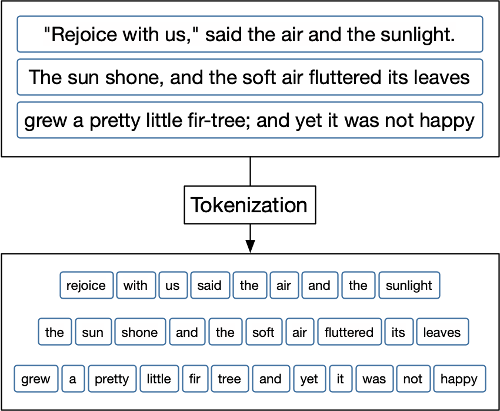

# Tokenization {#tokenization}

```{r setup, include = FALSE}
library(knitr)
opts_chunk$set(message = FALSE, warning = FALSE, cache = TRUE, eval = TRUE,
               tidy = "styler", fig.width = 8, fig.height = 5)
suppressPackageStartupMessages(library(tidyverse))
theme_set(theme_light())
``` 

To build features for supervised machine learning from natural language, we need some way of representing raw text as numbers so we can perform computation on them. Typically, one of the first steps in this transformation from natural language to feature, or any of kind of text analysis, is *tokenization*. Knowing what tokenization and tokens are, along with the related concept of an n-gram, is important for almost any natural language processing task.

## What is a token?

In R, text is typically represented with the **character** data type, similar to strings in other languages. Let's explore text from fairy tales written by Hans Christian Andersen, available in the [**hcandersenr**](https://cran.r-project.org/package=hcandersenr) package [@R-hcandersenr]. This package stores text as lines such as those you would read in a book; this is just one way that you may find text data in the wild and does allow us to more easily read the text when doing analysis.
If we look at the first paragraph of one story titled "The Fir Tree", we find the text of the story is in a character vector: a series of letters, spaces, and punctuation stored as a vector.

```{r}
library(tokenizers)
library(tidyverse)
library(tidytext)
library(hcandersenr)

the_fir_tree <- hcandersen_en %>%
  filter(book == "The fir tree") %>%
  pull(text)

head(the_fir_tree, 9)
```

The first nine lines stores the first paragraph of the story, each line consisting of a series of character symbols. 
These elements don't contain any metadata or information to tell us which characters are words and which aren't. Identifying these kinds of boundaries between words is where the process of tokenization comes in.

In tokenization, we take an input (a string) and a token type (a meaningful unit of text, such as a word) and split the input into pieces (tokens) that correspond to the type [@Manning:2008:IIR:1394399]. Figure \@ref(fig:tokenizationdiag) outlines this process.

```{r tokenizationdiag, echo= FALSE, fig.cap="TODO update diagram to use fir tree examples"}

```

Most commonly, the meaningful unit or type of token that we want to split text into units of is a **word**. However, it is difficult to clearly define what a word is, for many or even most languages. Many languages, such as Chinese, do not use white space between words at all. Even languages that do use white space, including English, often have particular examples that are ambiguous [@Bender13]. Romance languages like Italian and French use pronouns and negation words that may better be considered prefixes with a space, and English contractions like "didn't" may more accurately be considered two words with no space.

To understand the process of tokenization, let's start with a overly simple definition for a word: any selection of alphanumeric (letters and numbers) symbols. Let's use some regular expressions (or regex for short, see Appendix \@ref(regexp)) with `strsplit()` to split the first two lines of "The Fir Tree" by any characters that are not alphanumeric.

```{r}
strsplit(the_fir_tree[1:2], "[^a-zA-Z0-9]+")
```

At first sight, this result looks pretty decent. However, we have lost all punctuation, which may or may not be helpful for our modeling goal, and the hero of this story (`"fir-tree"`) was split in half. Already it is clear that tokenization is going to be quite complicated. Luckily for us, a lot of work has been invested in this process, and typically it is best to use these existing tools. For example, **tokenizers** [@Mullen18] and **spacy** [@spacy2] implement fast, consistent tokenizers we can use. Let's demonstrate with the **tokenizers** package.

```{r}
library(tokenizers)
tokenize_words(the_fir_tree[1:2])
```

We see sensible single-word results here; the `tokenize_words()` function uses the **stringi** package [@Gagolewski19] and C++ under the hood, making it very fast. Word-level tokenization is done by finding word boundaries according to the specification from the International Components for Unicode (ICU). How does this word boundary algorithm [@ICUWordBoundary] work? It can be outlined as follows:

- Break at the start and end of text, unless the text is empty.
- Do not break within CRLF (new line characters).
- Otherwise, break before and after new lines (including CR and LF).
- Do not break within emoji zwj sequences.
- Keep horizontal whitespace together.
- Ignore Format and Extend characters, except after sot, CR, LF, and new line.
- Do not break between most letters.
- Do not break letters across certain punctuation.
- Do not break within sequences of digits, or digits adjacent to letters ("3a", or "A3").
- Do not break within sequences, such as "3.2" or "3,456.789".
- Do not break between Katakana.
- Do not break from extenders.
- Do not break within emoji flag sequences. 
- Otherwise, break everywhere (including around ideographs).

While we might not understand what each and every step in this algorithm is doing, we can appreciate that it is many times more sophisticated than our initial approach of splitting on non-alphanumeric characters. In most of this book, we will use the **tokenizers** package as a baseline tokenizer for reference. Your choice of tokenizer will influence your results, so don't be afraid to experiment with different tokenizers or, if necessary, to write your own to fit your problem.

## Types of tokens

Thinking of a token as a word is a useful way to start understanding tokenization, even if it is hard to implement concretely in software. We can generalize the idea of a token beyond only a single word to other units of text. We can tokenize text at a variety of units including:

- characters,
- words,
- sentences,
- lines,
- paragraphs, and
- n-grams.

In the following sections, we will explore how to tokenize text using the **tokenizers** package. These functions take a character vector as the input and return lists of character vectors as output. This same tokenization can also be done using the **tidytext** [@Silge16] package, for workflows using tidy data principles where the input and output are both in a dataframe.

```{r}
sample_vector <- c("Far down in the forest",
                   "grew a pretty little fir-tree")
sample_tibble <- tibble(text = sample_vector)
```

The tokenization achieved by using `tokenize_words()` on `sample_vector`:

```{r}
tokenize_words(sample_vector)
```

will yield the same results as using `unnest_tokens()` on `sample_tibble`; the only difference is the data structure, and thus how we might use the result moving forward in our analysis.

```{r}
sample_tibble %>%
  unnest_tokens(word, text, token = "words")
```

Arguments used in `tokenize_words()` can be passed through `unnest_tokens()` using the ["the dots"](https://adv-r.hadley.nz/functions.html#fun-dot-dot-dot), `...`.

```{r}
sample_tibble %>%
  unnest_tokens(word, text, token = "words", strip_punct = FALSE)
```

### Character tokens

Perhaps the simplest tokenization is character tokenization, which splits texts into characters. Let's use `tokenize_characters()` with its default parameters; this function has arguments to convert to lowercase and to strip all non-alphanumeric characters. These defaults will reduce the number of different tokens that are returned. The `tokenize_*()` functions by default return a list of character vectors, one character vector for each string in the input.

```{r}
tft_token_characters <- tokenize_characters(x = the_fir_tree,
                                            lowercase = TRUE,
                                            strip_non_alphanum = TRUE,
                                            simplify = FALSE)
```

What do we see if we take a look?

```{r}
head(tft_token_characters) %>%
  glimpse()
```

We don't have to stick with the defaults. We can keep the punctuation and spaces by setting `strip_non_alphanum = FALSE` and now we see that spaces and punctuation are included in the results too.

```{r}
tokenize_characters(x = the_fir_tree,
                    strip_non_alphanum = FALSE) %>%
  head() %>%
  glimpse()
```

The results have more elements because the spaces and punctuation have not been removed.

Sometimes you run into problems where what a "character" is can be ambiguous. Depending on the format you have the data in, it might contain ligatures. Ligatures are when multiple graphemes or letters are combined as a single glyph, which is what we have called a character
so far. The graphemes "f" and "l" are combined into "fl", or "s" and "t" into "st". When we apply normal tokenization rules the ligatures will not be split up.

```{r}
tokenize_characters("flowers")
```

We might want to have these ligatures separated back into separate characters, but first, we need to consider a couple of things. First, we need to consider if the presence of ligatures is a meaningful feature to the question we are trying to answer. Second, there are two main types of ligatures, stylistic and functional. Stylistic ligatures are when two characters are combined because the spacing between the characters has been deemed unpleasant. Functional ligatures like the German Eszett (also called the scharfes S, meaning sharp s) ß, is an official letter of the German alphabet. It is described as a long S and Z and historically has never gotten an uppercase glyph. This has led the typesetters to use SZ or SS as a replacement when writing a word in uppercase. Additionally, ß is omitted entirely in German writing in Switzerland and is replaced with ss. Other examples include the "W" in the Latin alphabet (two "v" or two "u" joined together), and æ, ø, and å in the Nordic languages. Some place names for historical reasons use the old spelling "aa" instead of å.

Newcomers in terms of characters are emojis. While they do look whimsical, various tricks have been used to more effectively store them in Unicode. Let's first consider the flag emoji. As of the time of writing, 261 different flags have emoji representation. However, they do not have individual Unicode characters. Let's take a look:

```{r,}
## TODO, probably run offline and paste finished results
flags <- ""

tokenize_characters(flags)
```

When tokenizing here we get to see the bare Unicode characters. Notice how each flag has two characters. If you were to look up the characters for the Canadian flag you will find that they are "REGIONAL INDICATOR SYMBOLS", "C" and "A" respectively. With this approach, all the flags can be represented using only 26 Unicode symbols. The same approach is used with the job emojis and gender modifiers, and general emojis with hairstyle modifiers, hair color modifiers, and skin tone modifiers. There is a lot of information packed into emojis, and it is useful to remember to check that your tokenizer is treating them the way you would expect.

### Word tokens

Tokenizing at the word level is perhaps the most common and widely used tokenization. We started our discussion in this chapter with this kind of tokenization, and as we described before, this is the procedure of splitting text into words. To do this, let's use the `tokenize_words()` function.

```{r}
tft_token_words <- tokenize_words(x = the_fir_tree,
                                  lowercase = TRUE,
                                  stopwords = NULL,
                                  strip_punct = TRUE,
                                  strip_numeric = FALSE)
```

The results show us the input text split into individual words.

```{r}
head(tft_token_words) %>%
  glimpse()
```

We have already seen `lowercase = TRUE`, and `strip_punct = TRUE` and `strip_numeric = FALSE` control whether we remove punctuation and numeric characters respectively. We also have `stopwords = NULL`, which we will talk about in more depth in Chapter \@ref(stopwords).

Let's create a tibble with two fairy tales, "The Fir Tree" and "The Little Mermaid". Then we can use `unnest_tokens()` together with some **dplyr** verbs to find the most commonly used words in each.

```{r}
hcandersen_en %>%
  filter(book %in% c("The fir tree", "The little mermaid")) %>%
  unnest_tokens(word, text) %>%
  count(book, word) %>%
  group_by(book) %>%
  arrange(desc(n)) %>%
  slice(1:5)
```

The five most common words in each fairy tale are fairly uninformative, with the exception being `"tree"` in the "The Fir Tree". 

```{block2, type = "rmdwarning"}
These uninformative words are called **stop words** and will be explored in-depth in Chapter \@ref(stopwords).

```

### Tokenizing by n-grams {#tokenizingngrams}

An n-gram (sometimes written "ngram") is a term in linguistics for a contiguous sequence of $n$ items from a given sequence of text or speech. The item can be phonemes, syllables, letters, or words depending on the application, but when most people talk about n-grams, they mean a group of $n$ words. In this book, we will use n-gram to denote word n-grams unless otherwise stated. 

```{block, type = "rmdnote"}
We use Latin prefixes so that a 1-gram is called a unigram, a 2-gram is called a bigram, a 3-gram called a trigram, and so on. 
```

Some example n-grams are:

- **unigram:** "Hello", "day", "my", "little"
- **bigram:** "fir tree", "fresh air", "to be", "Robin Hood"
- **trigram:** "You and I", "please let go", "no time like", "the little mermaid"

The benefit of using n-grams compared to words is that n-grams capture word order which would otherwise be lost. Similarly, when we use character n-grams, we can model the beginning and end of words, because a space will be located at the end of an n-gram for the end of a word and at the beginning of an n-gram of the beginning of a word.

To split text into word n-grams, we can use the function `tokenize_ngrams()`. It has a few more arguments, so let's go over them one by one.

```{r}
tft_token_ngram <- tokenize_ngrams(x = the_fir_tree,
                                   lowercase = TRUE,
                                   n = 3L,
                                   n_min = 3L,
                                   stopwords = character(),
                                   ngram_delim = " ",
                                   simplify = FALSE)
```

We have seen the arguments `lowercase`, `stopwords`, and `simplify` before; they work the same as for the other tokenizers. We also have `n`, the argument to determine which degree of n-gram to return. Using `n = 1` returns unigrams, `n = 2` bigrams, `n = 3` gives trigrams, and so on. Related to `n` is the `n_min` argument, which specifies the minimum number of n-grams to include. By default both `n` and `n_min` are set to 3 making `tokenize_ngrams()` return only trigrams. By setting `n = 3` and `n_min = 1`, we will get all unigrams, bigrams, and trigrams of a text. Lastly, we have the `ngram_delim` argument, which specifies the separator between words in the n-grams; notice that this defaults to a space. 

Let's look at the result of n-gram tokenization for the first line of "The Fir Tree".

```{r}
tft_token_ngram[[1]]
```

Notice how the words in the trigrams overlap so that the word "down" appears in the middle of the first trigram and beginning of the second trigram. N-gram tokenization slides along the text to create overlapping sets of tokens.

It is important to choose the right value for `n` when using n-grams for the question we want to answer. Using unigrams is faster and more efficient, but we don't capture information about word order. Using a higher value for `n` keeps more information, but the vector space of tokens increases dramatically, corresponding to a reduction in token counts. A sensible starting point in most cases is three. However, if you don't have a large vocabulary in your dataset, consider starting at two instead of three and experimenting from there. Figure \@ref(fig:ngramtokens) demonstrates how token frequency starts to decrease dramatically for trigrams and higher-order n-grams. 

```{r ngramtokens, echo=FALSE, fig.width=10, fig.height=8, fig.cap="Using longer n-grams results in a higher number of unique tokens with fewer counts"}
length_and_max <- function(x) {
  tab <- table(x)
  paste(length(tab), max(tab), sep = "-")
}

count_ngrams <- function(data, n, n_min) {
  ngrams <- tokenize_ngrams(data, n, n_min)
  map_chr(ngrams, length_and_max)
}

ngram_types <- c("quadrugram", "trigram", "bigram", "unigram")

plotting_data <- hcandersen_en %>%
  nest(data = c(text)) %>%
  mutate(data = map_chr(data, ~ paste(.x$text, collapse = " "))) %>%
  mutate(unigram = count_ngrams(data, n = 1, n_min = 1),
         bigram = count_ngrams(data, n = 2, n_min = 2),
         trigram = count_ngrams(data, n = 3, n_min = 3),
         quadrugram = count_ngrams(data, n = 4, n_min = 4)) %>%
  select(unigram, bigram, trigram, quadrugram) %>%
  pivot_longer(cols = unigram:quadrugram, names_to = "ngrams") %>%
  separate(value, c("length", "max"), convert = TRUE) %>%
  mutate(ngrams = factor(ngrams, levels = ngram_types))

plotting_data  %>%
  ggplot(aes(length, ngrams, color = max)) +
  geom_jitter(width = 0, alpha = 0.8, height = 0.35) +
  scale_color_viridis_c(trans = "log", labels = scales::comma) +
  labs(x = "Number of unique n-grams",
       y = NULL,
       color = "Count of\nmost frequent\nngram",
       title = "Unique n-grams by n-gram order",
       subtitle = "Each point represents a H.C. Andersen Fairy tale")
```

We are not limited to use only one degree of n-grams. We can, for example, combine unigrams and bigrams in an analysis or model. Getting multiple degrees of n-grams is a little different depending on what package you are using; using `tokenize_ngrams()` you can specify `n` and `n_min`.

```{r}
tft_token_ngram <- tokenize_ngrams(x = the_fir_tree,
                                   n = 2L,
                                   n_min = 1L)
tft_token_ngram[[1]]
```

Combining different degrees of n-grams can allow you to extract different levels of detail from text data. Unigrams tell you which individual words have been used a lot of times; some of these words could be overlooked in bigram or trigram counts if they don't co-appear with other words often. Consider a scenario where every time the word "dog" was used it came after an adjective: "happy dog", "sad dog", "brown dog", "white dog", "playful dog", etc. If this is fairly consistent and the adjectives varied enough, then bigrams would not be able to detect that this story is about dogs. Similarly "very happy" and "not happy" will be recognized as different from bigrams and not with unigrams alone.

### Lines, sentence, and paragraph tokens

Tokenizers to split text into larger units of text like lines, sentences, and paragraphs are rarely used directly for modeling purposes, as the tokens produced tend to be fairly unique. It is very uncommon for multiple sentences in a text to be identical! However, these tokenizers are useful for preprocessing and labeling.

For example, Jane Austen's novel *Northanger Abbey* (as available in the **janeaustenr** package) is already preprocessed with each line being at most 80 characters long. However, it might be useful to split the data into chapters and paragraphs instead.

Let's create a function that takes a dataframe containing a variable called `text` and turns it into a dataframe where the text is transformed into paragraphs. First, we can collapse the text into one long string using `collapse = "\n"` to denote line breaks, and then next we can use `tokenize_paragraphs()` to identify the paragraphs and put them back into a dataframe. We can add a paragraph count with `row_number()`.

```{r}
add_paragraphs <- function(data) {
  pull(data, text) %>%
    paste(collapse = "\n") %>%
    tokenize_paragraphs() %>%
    unlist() %>%
    tibble(text = .) %>%
    mutate(paragraph = row_number())
}
```

Now we take the raw text data and add the chapter count by detecting when the characters `"CHAPTER"` appears at the beginning of a line. Then we `nest()` the text column, apply our `add_paragraphs()` function, and then `unnest()` again.

```{r}
library(janeaustenr)

northangerabbey_paragraphed <- tibble(text = northangerabbey) %>%
  mutate(chapter = cumsum(str_detect(text, "^CHAPTER "))) %>%
  filter(chapter > 0,
         !str_detect(text, "^CHAPTER ")) %>%
  nest(data = text) %>%
  mutate(data = map(data, add_paragraphs)) %>%
  unnest(cols = c(data))

glimpse(northangerabbey_paragraphed)
```

Now we have `r nrow(northangerabbey_paragraphed)` separate paragraphs we can analyze. Similarly, we could go a step further to split these chapters into sentences, lines, or words.

It can be useful to be able to reshape text data to get a different observational unit. As an example, if you wanted to build a sentiment classifier that would classify sentences as hostile or not, then you need to work with and train your model on sentences of text. Turning pages or paragraphs into sentences is a necessary step in your workflow.

Let us look at how we can turn `the_fir_tree` from a "one line per element" vector to a "one sentence per element". `the_fir_tree` comes as a vector so we start by using `paste()` to combine the lines back together. We use a space as the separator and then we pass it to the `tokenize_sentences()` function from the tokenizers package which will perform sentence splitting. 

```{r}
the_fir_tree_sentences <- the_fir_tree %>%
  paste(collapse = " ") %>%
  tokenize_sentences()


head(the_fir_tree_sentences[[1]])
```

If you have lines from different categories as we have in the `hcandersen_en` dataframe, which contains all the lines of the fairy tales in English, then we would like to be able to turn these lines into sentences while preserving the `book` column in the dataset.
To do this we use `nest()` and `map_chr()` to create a dataframe where each fairy tale is its own element and then we use the `unnest_sentences()` function from the tidytext package to split the text into sentences.

```{r}
hcandersen_sentences <- hcandersen_en %>%
  nest(data = c(text)) %>%
  mutate(data = map_chr(data, ~ paste(.x$text, collapse = " "))) %>%
  unnest_sentences(sentences, data)
```

Now that we have turned the text into "one sentence per element", we can analyze on the sentence level.

## Where does tokenization break down?

Tokenization will generally be one of the first steps when building a model or any kind of text analysis, so it is important to consider carefully what happens in this step of data preprocessing. As with most software, there is a trade-off between speed and customizability, as demonstrated in Section \@ref(tokenization-benchmark). The fastest tokenization methods give us less control over how it is done.

While the defaults work well in many cases, we encounter situations where we want to impose stricter rules to get better or different tokenized results. Consider the following sentence.

> "Don't forget you owe the bank $1 million for the house." 

This sentence has several interesting aspects which we need to decide whether to keep or to ignore when tokenizing. The first issue is the contraction in `"Don't"` which presents us with several possible options. The fastest option is to keep this as one word, but it could also be split up into `"do"` and `"n't"`. 

The next issue at hand is how to deal with `"$1"`; the dollar sign is an important part of this sentence as it denotes a kind of currency. We could either remove or keep this punctuation symbol, and if we keep the dollar sign, we can choose between keeping one or two tokens, `"$1"` or `"$"` and `"1"`. If we look at the default for `tokenize_words()`, we notice that it defaults to removing most punctuation including \$.

```{r}
tokenize_words("$1")
```

We can keep the dollar sign if we don't strip punctuation.

```{r}
tokenize_words("$1", strip_punct = FALSE)
```

When dealing with this sentence, we also need to decide whether to keep the final period as a token or not. If we remove it, we will not be able to locate the last word in a sentence using n-grams.

Information lost to tokenization (especially default tokenization) occurs more frequently in online and more casual text. Multiple spaces, extreme use of exclamation characters, and deliberate use of capitalization can be completely lost depending on our choice of tokenizer and tokenization parameters. At the same time, it is not always worth keeping that kind of information about how text is being used. If we are studying trends in disease epidemics using Twitter data, the style the tweets are written with is likely not nearly as important as what words are used. However, if we are trying to model social groupings, language style and how individuals use language toward each other becomes much more important.

Another thing to consider is the degree of compression each type of tokenization provides. The choice of tokenization results in a different pool of possible tokens, and can influence performance. By choosing a method that gives fewer possible tokens you allow later computational tasks to be performed faster. However, that comes with the risk of collapsing together categories of a different meaning. It is also worth noting that the spread of the number of different tokens varies with your choice of tokenizer. 

Figure \@ref(fig:tokendists) illustrates these points. Each of the fairy tales from **hcandersenr** has been tokenized in five different ways and the number of distinct tokens has been plotted along the x-axis (note that the x-axis is logarithmic). We see that the number of distinct tokens decreases if we convert words to lowercase or extract word stems (see Chapter \@ref(stemming) for more on stemming). Second, notice that the distributions of distinct tokens for character tokenizers are quite narrow; these texts use all or most of the letters in the English alphabet.

```{r tokendists, echo=FALSE, fig.cap="The number of distinct tokens can vary enormously for different tokenizers"}
tokendist_chars_no_alpnum <- function(data) {
  tokenize_characters(data) %>% map_int(~table(.x) %>% length())
}

tokendist_chars <- function(data) {
  tokenize_characters(data, strip_non_alphanum = FALSE) %>%
    map_int(~ table(.x) %>% length())
}

tokendist_words <- function(data) {
  tokenize_words(data) %>% map_int(~table(.x) %>% length())
}

tokendist_words_no_lowercase <- function(data) {
  tokenize_words(data, lowercase = FALSE) %>% map_int(~table(.x) %>% length())
}

tokendist_word_stems <- function(data) {
  tokenize_word_stems(data) %>% map_int(~table(.x) %>% length())
}

hcandersen_en %>%
  nest(data = c(text)) %>%
  mutate(data = map_chr(data, ~ paste(.x$text, collapse = " "))) %>%
  mutate(`Characters w/o alphanumerics` = tokendist_chars_no_alpnum(data),
         `Characters` = tokendist_chars(data),
         `Words` = tokendist_words(data),
         `Words no lowercase` = tokendist_words_no_lowercase(data),
         `word stems` = tokendist_word_stems(data)) %>%
  select(-data) %>%
  pivot_longer(-book) %>%
  ggplot(aes(name, value)) +
  geom_boxplot() +
  geom_jitter(alpha = 0.1) +
  scale_y_log10() +
  theme_minimal() +
  coord_flip() +
  labs(title = paste("Distributions of distinct tokens",
                     "for different tokenizing strategies"),
       x = NULL,
       y = "Number of distinct tokens")
```

## Building your own tokenizer

Sometimes the out-of-the-box tokenizers won't be able to do what you need them to do. In this case, we will have to wield **stringi**/**stringr** and regular expressions (see Appendix \@ref(regexp)). 

There are two main approaches to tokenization.

1. *Split* the string up according to some rule.
2. *Extract* tokens based on some rule.

The number and complexity of our rules are determined by our desired outcome. We can reach complex outcomes by chaining together many smaller rules. In this section, we will implement a couple of specialty tokenizers to showcase these techniques.  

### Tokenize to characters, only keeping letters

Here we want to modify what `tokenize_characters()` does such that we only keep letters. There are two main options. We can use `tokenize_characters()` and remove anything that is not a letter, or we can extract the letters one by one. Let's try the latter option. This is an **extract** task and we will use `str_extract_all()` as each string has the possibility of including more than 1 token. Since we want to extract letters we can use the letters character class `[:alpha:]` to match letters and the quantifier `{1}` to only extract the first one. 

```{block, type = "rmdnote"}
In this example, leaving out the quantifier yields the same result as including it. However, for more complex regular expressions, specifying the quantifier allows the string handling to run faster.
```

```{r}
letter_tokens <- str_extract_all(
  string = "This sentence include 2 numbers and 1 period.",
  pattern = "[:alpha:]{1}"
)
letter_tokens
```

We may be tempted to specify the character class as something like `[a-zA-Z]{1}`. This option would run faster, but we would lose non-English letter characters. This is a design choice we have to make depending on the goals of our specific problem. 

```{r}
danish_sentence <- "Så mødte han en gammel heks på landevejen"

str_extract_all(danish_sentence, "[:alpha:]")
str_extract_all(danish_sentence, "[a-zA-Z]")
```

```{block, type = "rmdwarning"}
Choosing between `[:alpha:]` and `[a-zA-Z]` may seem quite similar, but the resulting differences can have a big impact on your analysis.
```

### Allow for hyphenated words

In our examples so far, we have noticed that the string "fir-tree" is typically split into two tokens. Let's explore two different approaches for how to handle this hyphenated word as one token. First, let's split on white space; this is a decent way to identify words in English and some other languages, and it does not split hyphenated words as the hyphen character isn't considered a white-space. Second, let's find a regex to match words with a hyphen and extract those.

Splitting by white-space is not too difficult because we can use character classes, as shown in Table \@ref(tab:characterclasses). We will use the white space character class `[:space:]` to split our sentence.

```{r}
str_split("This isn't a sentence with hyphenated-words.", "[:space:]")
```

This worked pretty well. This version doesn't drop punctuation, but we can achieve this by removing punctuation characters at the beginning and end of words.

```{r}
str_split("This isn't a sentence with hyphenated-words.", "[:space:]") %>%
  map(~ str_remove_all(.x, "^[:punct:]+|[:punct:]+$"))
```

This regex used to remove the punctuation is a little complicated so let's discuss it, piece by piece. The regex `^[:punct:]+` will look at the beginning of the string (`^`) to match any punctuation characters (`[:punct:]`) where it will select one or more (`+`). The other regex `[:punct:]+$` will look for punctuation characters (`[:punct:]`) that appear one or more times (`+`) at the end of the string (`$`). These will alternate (`|`) so that we get matches from both sides of the words. The reason we use the quantifier `+` is that there are cases where a word is followed by multiple characters we don't want, such as `"okay..."` and `"Really?!!!"`. We are using `map()` since `str_split()` returns a list, and we want `str_remove_all()` to be applied to each element in the list. (The example here only has one element.) 

```{block, type = "rmdnote"}
If you are in a situation where you want to avoid using the **purrr** package, you can use `lapply()` instead. 

`lapply(str_remove_all, pattern = "\^[:punct:]+|[:punct:]+$")`
```

Now let's see if we can get the same result using extraction. We will start by constructing a regular expression that will capture hyphenated words; our definition here is a word with one hyphen located inside it. Since we want the hyphen to be inside the word, we will need to have a non-zero number of characters on either side of the hyphen. 

```{r}
str_extract_all(
  string = "This isn't a sentence with hyphenated-words.",
  pattern = "[:alpha:]+-[:alpha:]+"
)
```

Wait, this only matched the hyphenated word! This happened because we are only matching words with hyphens. If we add the quantifier `?` then we can match 0 or 1 occurrences.

```{r}
str_extract_all(
  string = "This isn't a sentence with hyphenated-words.",
  pattern = "[:alpha:]+-?[:alpha:]+"
)
```

Now we are getting more words, but the ending of `"isn't"` isn't there anymore and we lost the word `"a"`. We can get matches for the whole contraction by expanding the character class `[:alpha:]` to include the character `'`. We do that by using `[[:alpha:]']`.

```{r}
str_extract_all(
  string = "This isn't a sentence with hyphenated-words.",
  pattern = "[[:alpha:]']+-?[[:alpha:]']+"
)
```

Next, we need to find out why `"a"` wasn't matched. If we look at the regular expression, we remember that we imposed the restriction that a non-zero number of characters needed to surround the hyphen to avoid matching words that start or end with a hyphen. This means that the smallest possible pattern matched is 2 characters long. We can fix this by using an alternation with `|`. We will keep our previous match on the left-hand side, and include `[:alpha:]{1}` on the right-hand side to match the single length words that won't be picked up by the left-hand side. Notice how we aren't using `[[:alpha:]']` since we are not interested in matching single `'` characters.

```{r}
str_extract_all(
  string = "This isn't a sentence with hyphenated-words.",
  pattern = "[[:alpha:]']+-?[[:alpha:]']+|[:alpha:]{1}"
)
```

That is getting to be quite a complex regex, but we are now getting the same answer as before. 

### Wrapping it into a function

We have shown how we can use regular expressions to extract the tokens we want, perhaps to use in modeling. So far, the code has been rather unstructured. We would ideally wrap these tasks into functions that can be used the same way `tokenize_words()` is used.

Let's start with the example with hyphenated words. To make the function a little more flexible, let's add an option to transform all the output to lowercase.

```{r}
tokenize_hyphenated_words <- function(x, lowercase = TRUE) {
  if (lowercase)
    x <- str_to_lower(x)

  str_split(x, "[:space:]") %>%
    map(~ str_remove_all(.x, "^[:punct:]+|[:punct:]+$"))
}

tokenize_hyphenated_words(the_fir_tree[1:3])
```

Notice how we transformed to lowercase first because the rest of the operations are case insensitive.

Next let's turn our character n-gram tokenizer into a function, with a variable `n` argument.

```{r}
tokenize_character_ngram <- function(x, n) {
  ngram_loc <- str_locate_all(x, paste0("(?=(\\w{", n, "}))"))

  map2(ngram_loc, x, ~str_sub(.y, .x[, 1], .x[, 1] + n - 1))
}

tokenize_character_ngram(the_fir_tree[1:3], n = 3)
```

We can use `paste0()` in this function to construct an actual regex. 

## Tokenization for non-Latin alphabets

Our discussion of tokenization so far has focused on text where words are separated by white space and punctuation. For such text, even a quite basic tokenizer can give decent results. However, many written languages don't separate words in this way.

One of these languages is Chinese where each "word" can be represented by one or more consecutive glyphs.
Splitting Chinese text into words is called "word segmentation" and is still an active area of research [@ma-etal-2018-state; @Huang2019].

We are not going to go into depth in this area, but we want to showcase that word segmentation is indeed possible with R as well. We use the **jiebaR** package. It is conceptually similar to the tokenizers package, but we need to create a worker that is passed into `segment()` along with the string we want to segment.

```{r}
library(jiebaR)
words <- c("下面是不分行输出的结果", "下面是不输出的结果")

engine1 <- worker(bylines = TRUE)

segment(words, engine1)
```

## Tokenization benchmark

Not all tokenization packages are the same. Most open source tokenizers in R are well-designed but they are designed to serve different purposes. Some have a multitude of arguments to allow you to customize your tokenizer for greater flexibility, but this flexibility comes at a price; they tend to have slower performance. 

While we can't easily quantify flexibility, it is straightforward to benchmark some of the tokenizers available in R so you can pick the one that best suits your needs.

```{r}
bench::mark(check = FALSE, iterations = 10,
  `corpus` = corpus::text_tokens(hcandersen_en$text),
  `tokenizers` = tokenizers::tokenize_words(hcandersen_en$text),
  `text2vec` = text2vec::word_tokenizer(hcandersen_en$text),
  `quanteda` = quanteda::tokenize_word(hcandersen_en$text),
  `base R` = strsplit(hcandersen_en$text, "\\s")
)
```

The corpus package [@Perry2020] offers excellent performance for tokenization, and other options are not much worse. One exception is using a base R function as a tokenizer; you will see significant performance gains by instead using a package built specifically for text tokenization.

## Summary {#tokensummary}

To build a predictive model, text data needs to be split into meaningful units, called tokens. These tokens range from individual characters to words to n-grams and even more complex structures, and the particular procedure used to identify tokens from text can be important to your results. Fast and consistent tokenizers are available, but understanding how they behave and in what circumstances they work best will set you up for success. It's also possible to build custom tokenizers when necessary. Once text data is tokenized, a common next preprocessing step is to consider how to handle very common words that are not very informative, stop words. Chapter \@ref(stopwords) examines this in detail.

### In this chapter, you learned:

- that tokens are meaningful units of text, such as words or n-grams
- to implement different kinds of tokenization, the process of splitting text into tokens
- how different kinds of tokenization affect the distribution of tokens
- how to build your own tokenizer when the fast, consistent tokenizers that are available are not flexible enough
