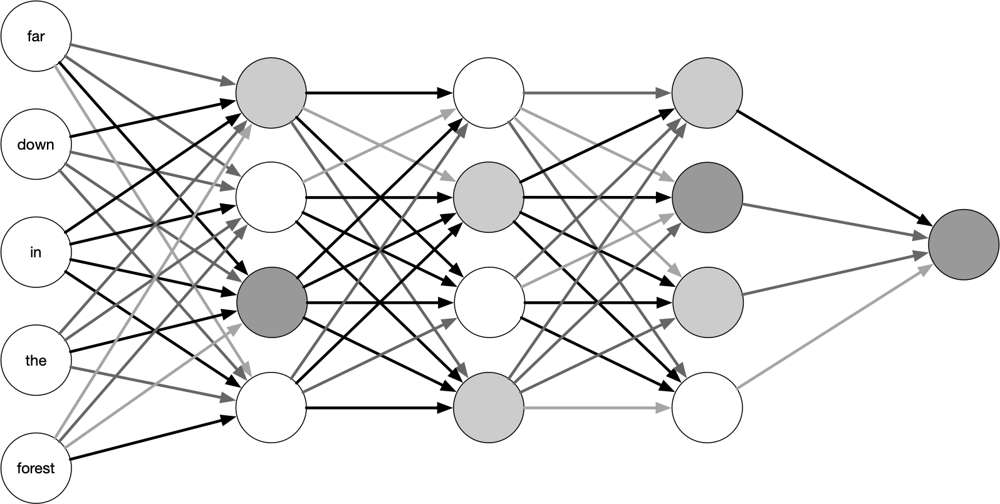

# Dense neural networks {#dldnn}

```{r include = FALSE}
library(keras)
tensorflow::tf$random$set_seed(1234)
```

These chapters on deep learning are broken up by network architecture instead of by outcome as we did in Chapters \@ref(mlclassification) and \@ref(mlregression).
We'll use Keras [@R-keras] with its Tensorflow backend for these deep learning models; Keras is a well-established framework for deep learning with bindings in Python and, via reticulate [@R-reticulate], R.
Keras provides extensive support for creating and training many kinds of deep learning models, but less support for resampling and preprocessing. Throughout this and the next chapters, we will demonstrate how to use tidymodels packages together with Keras to address these tasks. 

```{block, type = "rmdnote"}
The tidymodels framework is modular, so we can use it for certain tasks without committing to it entirely, when appropriate.
```

This chapter explores one of the most straightforward configurations for a deep learning model, a **densely connected neural network**. This is typically not a model that will achieve the highest performance on text data, but it is a good place to start to understand the process of building and evaluating deep learning models for text.

Figure \@ref(fig:dnndiag) depicts the neural network architecture *feed-forward*. The input comes in at once and is deeply connected with the first hidden layer. The neurons in any given layer are only connected to the next layer. The number of layers and nodes within each layer should be selected by the practitioner.

```{r rnndiag, echo= FALSE, fig.cap="A high-level diagram of a feed-forward neural network. The lines connecting the nodes have been shaded differently to illustrate how the network has different weights.", out.width="90%"}

```

Figure \@ref(fig:dnndiag) shows the input as words, this is not an accurate representation of a neural network. These words will in practice be represented by embedding vectors since these networks can only work with numeric variables.

## Kickstarter data {#kickstarter}

For all our chapters on deep learning, we will build binary classification models, much like we did in Chapter \@ref(mlclassification), but we will use neural networks instead of shallow learning models. As we discussed in the [preface to these deep learning chapters](https://smltar.com/dlforeword.html), much of the overall model process will look the same, but we will use a different kind of algorithm. We will use a dataset of descriptions or "blurbs" for campaigns from the crowdfunding platform [Kickstarter](https://www.kickstarter.com/).

```{r kickstarter}
library(tidyverse)

kickstarter <- read_csv("data/kickstarter.csv.gz")
kickstarter
```

The `state` of each observation records whether the campaign was successful in its crowdfunding goal; a value of 1 means it was successful and a value of 0 means it was not successful. The text for these models, contained in `blurb`, are short, less than a few hundred characters. What is the distribution of characters?

```{r kickstartercharhist, dependson="kickstarter", fig.cap="Distribution of character count for Kickstarter campaign blurbs"}
kickstarter %>%
  ggplot(aes(nchar(blurb))) +
  geom_histogram(binwidth = 1, alpha = 0.8) +
  labs(x = "Number of characters per campaign blurb",
       y = "Number of campaign blurbs")
```

Figure \@ref(fig:kickstartercharhist) shows that the distribution of characters per blurb is right-skewed, with thresholds. Individuals creating campaigns don't have much space to make an impression, so most people choose to use most of it! There is an oddity in this chart, a steep drop somewhere between 130 and 140 with another threshold around 150 characters. Let's investigate to see if we can find the reason.

We can use `count()` to find the most common blurb length.

```{r}
kickstarter %>%
  count(nchar(blurb), sort = TRUE)
```

Let's use our own eyes to see what happens around this cutoff point. We can use `slice_sample()` to draw a few random blurbs.

Were the blurbs truncated at 135 characters? Let's look at some blurbs with exactly 135 characters.

```{r, linewidth=80}
set.seed(1)
kickstarter %>%
  filter(nchar(blurb) == 135) %>%
  slice_sample(n = 5) %>%
  pull(blurb)
```

All of these blurbs appear coherent and some of them even end with a period to end the sentence. Let's now look at blurbs with more than 135 characters to see if they are different.

```{r, linewidth=80}
set.seed(1)
kickstarter %>%
  filter(nchar(blurb) > 135) %>%
  slice_sample(n = 5) %>%
  pull(blurb)
```

All of these blurbs also look fine so the strange distribution doesn't seem like a data collection issue. 

The `kickstarter` dataset also includes a `created_at` variable; let's explore that next. Figure \@ref(fig:kickstarterheatmap) is a heatmap of the lengths of blurbs and the time the campaign was posted.

```{r kickstarterheatmap, dependson="kickstarter", fig.cap="Distribution of character count for Kickstarter campaign blurbs over time"}
kickstarter %>%
  ggplot(aes(created_at, nchar(blurb))) +
  geom_bin2d() +
  labs(x = NULL,
       y = "Number of characters per campaign blurb")
```

That looks like the explanation! It appears that at the end of 2010 there was a policy change in the blurb length, shortening from 150 characters to 135 characters.

```{r}
kickstarter %>%
  filter(nchar(blurb) > 135) %>%
  summarise(max(created_at))
```

We can't say for sure if the change happened on 2010-10-20, but that is the last day a campaign was launched with more than 135 characters.

## A first deep learning model {#firstdlclassification}

Like all our previous modeling, our first step is to split our data into training and testing sets. We will still use our training set to build models and save the testing set for a final estimate of how our model will perform on new data.  

```{block, type = "rmdwarning"}
It is very easy to overfit deep learning models, so an unbiased estimate of future performance from a test set is more important than ever.
```

We use `initial_split()` to define the training and testing splits. We will focus on modeling the blurb alone in these deep learning chapters. Also, we will restrict our modeling analysis to only include blurbs with more than 15 characters, because the shortest blurbs tend to consist of uninformative single words.

```{r}
library(tidymodels)
set.seed(1234)
kickstarter_split <- kickstarter %>%
  filter(nchar(blurb) >= 15) %>%
  initial_split()

kickstarter_train <- training(kickstarter_split)
kickstarter_test <- testing(kickstarter_split)
```

There are `r scales::comma(nrow(kickstarter_train))` blurbs in the training set and `r scales::comma(nrow(kickstarter_test))` in the testing set.

### Preprocessing for deep learning {#dnnrecipe}

Preprocessing for deep learning models is different than preprocessing for most other text models. These neural networks model _sequences_, so we have to choose the length of sequences we would like to include. Documents that are longer than this length are truncated (information is thrown away) and documents that are shorter than this length are padded with zeroes (an empty, non-informative value) to get to the chosen sequence length. This sequence length is a hyperparameter of the model and we need to select this value such that we don't: 

- overshoot and introduce a lot of padded zeroes which would make the model hard to train, or 
- undershoot and cut off too much informative text from our documents.

We can use the `count_words()` function from the tokenizers package to calculate the number of words and generate a histogram in Figure \@ref(fig:kickstarterwordlength). Notice how we are only using the training dataset to avoid data leakage when selecting this value.

```{r kickstarterwordlength, fig.cap="Distribution of word count for Kickstarter campaign blurbs"}
kickstarter_train %>%
  mutate(n_words = tokenizers::count_words(blurb)) %>%
  ggplot(aes(n_words)) +
  geom_bar() +
  labs(x = "Number of words per campaign blurb",
       y = "Number of campaign blurbs")
```

Given that we don't have many words for this particular dataset to begin with, let's err on the side of longer sequences so we don't lose valuable data. Let's try 30 words for our threshold `max_length`, and let's include 20,000 words in our vocabulary.

```{r prepped_recipe}
library(textrecipes)

max_words <- 2e4
max_length <- 30

kick_rec <- recipe(~blurb, data = kickstarter_train) %>%
  step_tokenize(blurb) %>%
  step_tokenfilter(blurb, max_tokens = max_words) %>%
  step_sequence_onehot(blurb, sequence_length = max_length)

kick_rec
```

This preprocessing recipe tokenizes our text (Chapter \@ref(tokenization)) and filters to keep only the top 20,000 words, but then it transforms the tokenized text in a new way to prepare for deep learning that we have not used in this book before, using `step_sequence_onehot()`.

### One-hot sequence embedding of text {#onehotsequence}

The function `step_sequence_onehot()` transforms tokens into a numeric format appropriate for modeling, like `step_tf()` and `step_tfidf()`. However, it is different in that it takes into account the order of the tokens, unlike `step_tf()` and `step_tfidf()` which do not take order into account. 

```{block, type = "rmdnote"}
Steps like `step_tf()` and `step_tfidf()` are used for approaches called "bag of words", meaning the words are treated like they are just thrown in a bag without attention paid to their order. 
```

Let's take a closer look at how `step_sequence_onehot()` works and how its parameters will change the output.

When we use `step_sequence_onehot()`, two things happen. First, each word is assigned an _integer index_. You can think of this as a key-value pair of the vocabulary. Next, the sequence of tokens is replaced with the corresponding indices; this sequence of integers makes up the final numeric representation. Let's illustrate with a small example:

```{r sequence_onhot_rec}
small_data <- tibble(
  text = c("Adventure Dice Game",
           "Spooky Dice Game",
           "Illustrated Book of Monsters",
           "Monsters, Ghosts, Goblins, Me, Myself and I")
)

small_spec <- recipe(~ text, data = small_data) %>%
  step_tokenize(text) %>%
  step_sequence_onehot(text, sequence_length = 6, prefix = "")

prep(small_spec)
```

```{block, type = "rmdwarning"}
What does the function `prep()` do? Before when we have used recipes, we put them in a `workflow()` which handles low-level processing. The `prep()` will compute or estimate statistics from the training set; the output of `prep()` is a prepped recipe. 
```

Once we have the prepped recipe then we can `tidy()` it to extract the vocabulary, represented in the `vocabulary` and `token` columns^[The `terms` columns refer to the column we have applied `step_sequence_onehot()` to and `id` is its unique identifier. Note that textrecipes allows `step_sequence_onehot()` to be applied to multiple text variables independently and they will have their own vocabularies.].

```{r sequence_onhot_rec_vocab, dependson="sequence_onhot_rec"}
prep(small_spec) %>%
  tidy(2)
```

If we take a look at the resulting matrix, we have one row per observation. The first row starts with some padded zeroes but then contains 1, 4, and 5, which we can use together with the vocabulary to construct the original sentence.

```{r sequence_onhot_rec_matrix1, dependson="sequence_onhot_rec"}
prep(small_spec) %>%
  bake(new_data = NULL, composition = "matrix")
```

```{block, type = "rmdwarning"}
When we `bake()` a prepped recipe, we apply the preprocessing to a dataset. We can get out the training set that we started with by specifying `new_data = NULL` or apply it to another set via `new_data = my_other_data_set`. The output of `bake()` is a dataset like a tibble or a matrix, depending on the `composition` argument.
```

But wait, the 4th line should have started with an 11 since the sentence starts with "monsters"! The entry in `_text_1` is 6 instead. This is happening because the sentence is too long to fit inside the specified sequence length. We must answer three questions before using `step_sequence_onehot()`:

1.  How long should the output sequence be?
2.  What happens to sequences that are too long?
3.  What happens to sequences that are too short?

Choosing the right sequence length is a balancing act. You want the length to be long enough such that you don't truncate too much of your text data, but still short enough to keep the size of the data manageable and to avoid excessive padding. Truncating, having large training data, and excessive padding all lead to worse model performance. This parameter is controlled by the `sequence_length` argument in `step_sequence_onehot()`. 

If the sequence is too long, then it must be truncated. This can be done by removing values from the beginning (`"pre"`) or the end (`"post"`) of the sequence. This choice is mostly influenced by the data, and you need to evaluate where most of the useful information of the text is located. News articles typically start with the main points and then go into detail. If your goal is to detect the broad category, then you may want to keep the beginning of the texts, whereas if you are working with speeches or conversational text, then you might find that the last thing to be said carries more information. 

Lastly, we need to decide how to pad a document that is too short. Pre-padding tends to be more popular, especially when working with RNN and LSTM models (Chapter \@ref(dllstm)) since having post-padding could result in the hidden states getting flushed out by the zeroes before getting to the text itself (Section \@ref(lstmpadding)).

The defaults for `step_sequence_onehot()` are `sequence_length = 100`, `padding = "pre"`, and `truncating = "pre"`. If we change the truncation to happen at the end with:

```{r sequence_onhot_rec_matrix2, dependson="sequence_onhot_rec"}
recipe(~ text, data = small_data) %>%
  step_tokenize(text) %>%
  step_sequence_onehot(text, sequence_length = 6, prefix = "",
                       padding = "pre", truncating = "post") %>%
  prep() %>%
  bake(new_data = NULL, composition = "matrix")
```

then we see the 11 at the beginning of the last row representing the "monsters". The starting points are not aligned since we are still padding on the left side. We can left-align all the sequences by setting `padding = "post"`.

```{r sequence_onhot_rec_matrix3, dependson="sequence_onhot_rec"}
recipe(~ text, data = small_data) %>%
  step_tokenize(text) %>%
  step_sequence_onehot(text, sequence_length = 6, prefix = "",
                       padding = "post", truncating = "post") %>%
  prep() %>%
  bake(new_data = NULL, composition = "matrix")
```

Now we have that all digits representing the first characters neatly aligned in the first column.

Let's now prepare and apply our feature engineering recipe `kick_rec` so we can use it in for our deep learning model.

```{r}
kick_prep <-  prep(kick_rec)
kick_train <- bake(kick_prep, new_data = NULL, composition = "matrix")
dim(kick_train)
```

The matrix `kick_train` has `r comma(dim(kick_train)[1])` rows, corresponding to the rows of the training data, and `r dim(kick_train)[2]` columns, corresponding to our chosen sequence length.


### Simple flattened dense network

Our first deep learning model embeds these Kickstarter blurbs in sequences of vectors, flattens them, and then trains a dense network layer to predict whether the campaign was successful or not.

```{r dense_model}
library(keras)

dense_model <- keras_model_sequential() %>%
  layer_embedding(input_dim = max_words + 1,
                  output_dim = 12,
                  input_length = max_length) %>%
  layer_flatten() %>%
  layer_dense(units = 32, activation = "relu") %>%
  layer_dense(units = 1, activation = "sigmoid")

dense_model
```

Let us step through this model specification one layer at a time.

- We initiate the Keras model by using `keras_model_sequential()` to indicate that we want to compose a linear stack of layers.
- Our first `layer_embedding()` is equipped to handle the preprocessed data we have in `kick_train`. It will take each observation/row in `kick_train` and make dense vectors from our word sequences. This turns each observation into an `embedding_dim` $\times$ `sequence_length` matrix, 12 $\times$ 30 matrix in our case. In total, we will create a `number_of_observations` $\times$ `embedding_dim` $\times$ `sequence_length` data cube.
- The next `layer_flatten()` layer takes the matrix for each observation and flattens them down into one dimension. This will create a `30 * 12 = 360` long vector for each observation. 
- Lastly, we have 2 densely connected layers. The last layer has a sigmoid activation function to give us an output between 0 and 1, since we want to model a probability for a binary classification problem.

We still have a few things left to add to this model before we can fit it to the data. A Keras model requires an **optimizer** and a **loss function** to be able to compile. 

When the neural network finishes passing a batch of data through the network, it needs a way to use the difference between the predicted values and true values to update the network's weights. The algorithm that determines those weights is known as the optimization algorithm. Many optimizers are available within Keras itself^[https://keras.io/api/optimizers/]; you can even create custom optimizers if what you need isn't on the list. We will start by using the Adam optimizer, a good default optimizer for many problems.

```{block, type = "rmdnote"}
An optimizer can either be set with the name of the optimizer as a character or by supplying the function `optimizer_*()` where `*` is the name of the optimizer. If you use the function then you can specify parameters for the optimizer.
```

During training a neural network, there must be some quantity that we want to have minimized; this is called the loss function. Again, many loss functions are available within Keras^[https://keras.io/api/losses/]. These loss function typically has two arguments, the true value and the predicted value, and returns a measure of how close they are. 
Since we are working on a binary classification task and the final layer of the network returns a probability, then binary cross-entropy is an appropriate loss function. Binary cross-entropy does well at dealing with probabilities because it measures the “distance” between probability distributions. In our case, this would be the ground-truth distribution and the predictions.

We can also add any number of metrics^[https://keras.io/api/metrics/] to be calculated and reported during training. These metrics will not affect the training loop, which is controlled by the optimizer and loss function. The metrics job is to report back a single number that will inform you how well the model is performing. We will select accuracy as our metric for now. 

Let's set these 3 options (`optimizer`, `loss`, and `metrics`) using the `compile()` function:

```{r dense_model_compiled}
dense_model %>% compile(
  optimizer = "adam",
  loss = "binary_crossentropy",
  metrics = c("accuracy")
)
```

```{block, type = "rmdnote"}
Notice how the `compile()` function modifies the model in place. This is different than how objects are conventionally handled in R so be vigilant about model definition and modification in your code.
```

Finally, we can fit this model! We need to supply the data for training as a matrix of predictors `x` and a numeric vector of labels `y`.
This is sufficient information to get started training the model, but we are going to specify a few more arguments to get better control of the training loop. First, we set the number of observations to pass through at a time with `batch_size`, and we set `epochs = 20` to tell the model to pass all the training data through the training loop 20 times. Lastly, we set `validation_split = 0.25` to specify an internal validation split; this will keep 25% of the data for validation.

```{r dense_model_history}
dense_history <- dense_model %>%
  fit(
    x = kick_train,
    y = kickstarter_train$state,
    batch_size = 512,
    epochs = 20,
    validation_split = 0.25,
    verbose = FALSE
  )
```


We can visualize the results of the training loop by plotting the `dense_history` in Figure \@ref(fig:densemodelhistoryplot).

```{r densemodelhistoryplot, fig.cap="Training and validation metrics for dense network"}
plot(dense_history)
```

```{block, type = "rmdnote"}
We have dealt with accuracy in other chapters; remember that a higher value (a value near one) is better. Loss is new in these deep learning chapters, and a lower value is better.
```

The loss and accuracy both improve with more training epochs on the training data; this dense network more and more closely learns the characteristics of the training data as its trains longer. The same is not true of the validation data, the held-out 25% specified by `validation_split = 0.25`. The performance is worse on the validation data than the testing data, and _degrades_ somewhat as training continues. If we wanted to use this model, we would want to only train it about 7 or 8 epochs.

### Evaluation {#evaluate-dnn}

For our first deep learning model, we used the Keras defaults for creating a validation split and tracking metrics, but we can use tidymodels functions to be more specific about these model characteristics. Instead of using the `validation_split` argument to `fit()`, we can create our own validation set using tidymodels and use `validation_data` argument for `fit()`. We create our validation split from the _training_ set.

```{r dnnval}
set.seed(234)
kick_val <- validation_split(kickstarter_train, strata = state)
kick_val
```

The `split` object contains the information necessary to extract the data we will use for training/analysis and the data we will use for validation/assessment. We can extract these datasets in their raw, unprocessed form from the split using the helper functions `analysis()` and `assessment()`. Then, we can apply our prepped preprocessing recipe `kick_prep` to both to transform this data to the appropriate format for our neural network architecture.

```{r}
kick_analysis <- bake(kick_prep, new_data = analysis(kick_val$splits[[1]]),
                      composition = "matrix")
dim(kick_analysis)

kick_assess <- bake(kick_prep, new_data = assessment(kick_val$splits[[1]]),
                    composition = "matrix")
dim(kick_assess)
```

These are each matrices now appropriate for a deep learning model like the one we trained in the previous section. We will also need the outcome variables for both sets.

```{r}
state_analysis <- analysis(kick_val$splits[[1]]) %>% pull(state)
state_assess <- assessment(kick_val$splits[[1]]) %>% pull(state)
```

Let's set up our same dense neural network architecture. 

```{r dense_model2}
dense_model <- keras_model_sequential() %>%
  layer_embedding(input_dim = max_words + 1,
                  output_dim = 12,
                  input_length = max_length) %>%
  layer_flatten() %>%
  layer_dense(units = 32, activation = "relu") %>%
  layer_dense(units = 1, activation = "sigmoid")

dense_model %>% compile(
  optimizer = "adam",
  loss = "binary_crossentropy",
  metrics = c("accuracy")
)
```

Now we can fit this model with dropout to `kick_analysis` and validate on `kick_assess`. Let's only fit for 10 epochs this time.

```{r val_history}
val_history <- dense_model %>%
  fit(
    x = kick_analysis,
    y = state_analysis,
    batch_size = 512,
    epochs = 10,
    validation_data = list(kick_assess, state_assess),
    verbose = FALSE
  )

val_history
```

Figure \@ref(fig:valhistoryplot) still shows that significant overfitting at 10 epochs.

```{r valhistoryplot, fig.cap="Training and validation metrics for dense network with validation set"}
plot(val_history)
```

Using our own validation set also allows us to flexibly measure performance using tidymodels function from the yardstick package. We do need to set up a few transformations between Keras and tidymodels.
The following function `keras_predict()` creates a little bridge between the two frameworks, combining a Keras model with baked (i.e. preprocessed) data and returns the predictions in a tibble format.

```{r}
library(dplyr)

keras_predict <- function(model, baked_data, response) {
  predictions <- predict(model, baked_data)[, 1]
  tibble(
    .pred_1 = predictions,
    .pred_class = if_else(.pred_1 < 0.5, 0, 1),
    state = response
  ) %>%
    mutate(across(c(state, .pred_class),            ## create factors
                  ~ factor(.x, levels = c(1, 0))))  ## with matching levels
}
```

```{block, type = "rmdwarning"}
This function only works with binary classification models that take a preprocessed matrix as input and return a single probability for each observation. It returns both the predicted probability as well as the predicted class, using a 50% probability threshold.
```

This function creates prediction results that seamlessly connect with tidymodels and yardstick functions.

```{r}
val_res <- keras_predict(dense_model, kick_assess, state_assess)
val_res
```

We can calculate the standard metrics with `metrics()`.

```{r}
metrics(val_res, state, .pred_class)
```

This matches what we saw when we looked at the output of `val_history`. 

Since we have access to tidymodels' full capacity for model evaluation, we can also compute confusion matrices and ROC curves.
The heatmap in Figure \@ref(fig:dnnheatmap) shows that there isn't any dramatic bias in how the model performs for the two classes, success and failure for the crowdfunding campaigns. The model certainly isn't perfect; its accuracy is a little over `r scales::percent((floor(100 * accuracy(val_res, state, .pred_class)$.estimate) / 100))`, but at least it is more or less evenly good at predicting both classes.

```{r dnnheatmap, dependson="nbrs", fig.cap="Confusion matrix for first DNN model predictions of Kickstarter campaign success"}
val_res %>%
  conf_mat(state, .pred_class) %>%
  autoplot(type = "heatmap")
```

The ROC curve in Figure \@ref(fig:dnnroccurve) shows how the model performs at different thresholds.

```{r dnnroccurve, opts.label = "fig.square", fig.cap="ROC curve for first DNN model predictions of Kickstarter campaign success"}
val_res %>%
  roc_curve(truth = state, .pred_1) %>%
  autoplot() +
  labs(
    title = "Receiver operator curve for Kickstarter blurbs"
  )
```

## Using pre-trained word embeddings

All the models in Section \@ref(firstdlclassification) included an embedding layer to make dense vectors from our word sequences that we let the model train, along with the model as a whole. This is not the only way to handle this task. In Chapter \@ref(embeddings), we examined how word embeddings are created and how they are used. Instead of having the embedding layer start randomly and be trained alongside the other parameters, let's try to _provide_ the embeddings. 

We start by obtaining pre-trained embeddings. The GloVe embeddings that we used in Section \@ref(glove) are a good place to start. Setting `dimensions = 50` and only selecting the first 12 dimensions will make it easier for us to compare models directly.

```{r eval=FALSE}
library(textdata)

glove6b <- embedding_glove6b(dimensions = 50) %>% select(1:13)
```

```{r glove6b12d, echo=FALSE, R.options = list(tibble.max_extra_cols=9, tibble.print_min=10, tibble.width=80)}
load("data/glove6b.rda")
glove6b <- glove6b[, 1:13]
glove6b
```

The `embedding_glove6b()` function returns a tibble which isn't the right format for what Keras expects. Also, notice how many rows are present in this embedding, far more than what the trained recipe is expecting. The vocabulary can be extracted from the trained recipe using `tidy()`. First, we apply `tidy()` to `kick_prep` to get the list of steps that the recipe contains.

```{r, dependson="prepped_recipe"}
tidy(kick_prep)
```

We see that the third step is the `sequence_onehot` step, so by setting `number = 3` we can extract the embedding vocabulary.

```{r, dependson="prepped_recipe"}
tidy(kick_prep, number = 3)
```

We can then use `left_join()` to combine these tokens to the `glove6b` embedding tibble and only keep the tokens of interest. Any tokens from the vocabulary not found in `glove6b` is replaced with 0 using `mutate_all()` and `replace_na()`. We can transform the results into a matrix, and add a row of zeroes at the top of the matrix to account for the out-of-vocabulary words.

```{r glove6b_matrix, dependson=c("glove6b12d", "prepped_recipe")}
glove6b_matrix <- tidy(kick_prep, 3) %>%
  select(token) %>%
  left_join(glove6b, by = "token") %>%
  mutate_all(replace_na, 0) %>%
  select(-token) %>%
  as.matrix() %>%
  rbind(0, .)
```

We'll keep the model architecture itself as unchanged as possible. The `output_dim` argument is set equal to`ncol(glove6b_matrix)` to make sure that all the dimensions line up correctly, but everything else stays the same.

```{r dense_model_pte, dependson="glove6b_matrix"}
dense_model_pte <- keras_model_sequential() %>%
  layer_embedding(input_dim = max_words + 1,
                  output_dim = ncol(glove6b_matrix),
                  input_length = max_length) %>%
  layer_flatten() %>%
  layer_dense(units = 32, activation = "relu") %>%
  layer_dense(units = 1, activation = "sigmoid")
```

Now we use `get_layer()` to access the first layer (which is the embedding layer), set the weights with `set_weights()`, and then freeze the weights with `freeze_weights()`. 

```{block, type = "rmdnote"}
Freezing the weights stops them from being updated during the training loop.
```

```{r dense_model_pte_weights, dependson="dense_model_pte"}
dense_model_pte %>%
  get_layer(index = 1) %>%
  set_weights(list(glove6b_matrix)) %>%
  freeze_weights()
```

Now we compile and fit the model just like the last one we looked at.

```{r dense_pte_history, dependson="dense_model_pte_weights"}
dense_model_pte %>% compile(
  optimizer = "adam",
  loss = "binary_crossentropy",
  metrics = c("accuracy")
)

dense_pte_history <- dense_model_pte %>%
  fit(
    x = kick_analysis,
    y = state_analysis,
    batch_size = 512,
    epochs = 20,
    validation_data = list(kick_assess, state_assess),
    verbose = FALSE
  )

dense_pte_history
```


This model is not performing well! We can confirm by computing metrics on our validation set.

```{r dense_pte_evaluate, dependson="dense_pte_history"}
pte_res <- keras_predict(dense_model_pte, kick_assess, state_assess)
metrics(pte_res, state, .pred_class)
```

Why is this happening? Part of the training loop for a model like this one typically _adjusts_ the weights in the network. 
When we froze the weights in this network, we froze them at values that did not perform very well. 
These pre-trained glove embeddings [@Pennington2014] are trained on a Wikipedia dump and [Gigaword 5](https://catalog.ldc.upenn.edu/LDC2011T07), a comprehensive archive of newswire text. 
The text contained on Wikipedia and in news articles both follow certain styles and semantics.
Both will tend to be written formally and in the past tense, with longer and complete sentences. 
There are many more distinct features of both Wikipedia text and news articles, but the important part is how similar they are to the data we are trying to model.
These Kickstarter blurbs are very short, lack punctuation, stop words, narrative, and tense. Many of them simply try to pack as many buzz words as possible into the allowed character count while keeping the sentence readable.
Perhaps it should not surprise us that these word embeddings don't perform well in this model, since the text used to train the embeddings is so far removed from the text is it being applied on (Section \@ref(glove)).

Although this approach with our dataset didn't work that well, that doesn't mean that using pre-trained word embeddings is always a bad idea. 
The important point is how well the embeddings fit the data you are modeling.
Also, there is another way we can use these particulat embeddings in our network architecture; we can load them in as a starting as before but _not_ freeze the weights.
This allows the model to adjust the weights to better fit the data. The intention here is that these pre-trained embeddings deliver a better starting point than the randomly generated embedding we get if we don't set the weights.

We specify a new model to get started on this approach.

```{r dense_model_pte2, dependson="glove6b_matrix"}
dense_model_pte2 <- keras_model_sequential() %>%
  layer_embedding(input_dim = max_words + 1,
                  output_dim = ncol(glove6b_matrix),
                  input_length = max_length) %>%
  layer_flatten() %>%
  layer_dense(units = 32, activation = "relu") %>%
  layer_dense(units = 1, activation = "sigmoid")
```

Now, we set the weights with `set_weights()` but we _don't_ freeze them.

```{r dense_model_pte_noweights, dependson="dense_model_pte"}
dense_model_pte2 %>%
  get_layer(index = 1) %>%
  set_weights(list(glove6b_matrix))
```

We compile and fit the model as before.

```{r dense_pte_noweights_history, dependson="dense_model_pte_noweights"}
dense_model_pte2 %>% compile(
  optimizer = "adam",
  loss = "binary_crossentropy",
  metrics = c("accuracy")
)

dense_pte2_history <- dense_model_pte2 %>% fit(
  x = kick_analysis,
  y = state_analysis,
  batch_size = 512,
  epochs = 20,
  validation_data = list(kick_assess, state_assess),
  verbose = FALSE
)
```

How did this version of using pre-trained embeddings do?

```{r dense_pte_noweights_evaluate, dependson="dense_pte_noweights_history"}
pte2_res <- keras_predict(dense_model_pte2, kick_assess, state_assess)
metrics(pte2_res, state, .pred_class)
```

This performs quite a bit better than when we froze the weights, although not as well as when we did not use pre-trained embeddings at all.

```{block, type = "rmdnote"}
If you have enough text data in the field you are working in, then it is worth considering training a word embedding yourself that better captures the structure of the domain you are trying to work with, both for the reasons laid out there and for the issues highlighted in Section \@ref(fairnessembeddings).
```

## Cross-validation for deep learning models {#dnncross}

The Kickstarter dataset we are using is big enough that we have enough data to use a single training set, validation set, and testing set that all contain enough observations in them to give reliable performance metrics. In some situations, you may not have that much data or you may want to compute more precise performance metrics. In those cases, it is time to turn to resampling. For example, we can create cross-validation folds.

```{r}
set.seed(345)
kick_folds <- vfold_cv(kickstarter_train, v = 5)
kick_folds
```

Each of these folds has an analysis/training set and an assessment/validation set. Instead of training our model one time and getting one measure of performance, we can train our model `v` times and get `v` measures, for more reliability.

In our previous chapters, we used models with full tidymodels support and functions like `add_recipe()` and `workflow()`. Deep learning models are more modular and unique, so we will need to create our own function to handle preprocessing, fitting, and evaluation.

```{r}
fit_split <- function(split, prepped_rec) {
  ## preprocessing
  x_train <- bake(prepped_rec, new_data = analysis(split),
                  composition = "matrix")
  x_val   <- bake(prepped_rec, new_data = assessment(split),
                  composition = "matrix")

  ## create model
  y_train <- analysis(split) %>% pull(state)
  y_val   <- assessment(split) %>% pull(state)

  mod <- keras_model_sequential() %>%
    layer_embedding(input_dim = max_words + 1,
                    output_dim = 12,
                    input_length = max_length) %>%
    layer_flatten() %>%
    layer_dense(units = 32, activation = "relu") %>%
    layer_dense(units = 1, activation = "sigmoid") %>% compile(
      optimizer = "adam",
      loss = "binary_crossentropy",
      metrics = c("accuracy")
    )

  ## fit model
  mod %>%
    fit(
      x_train,
      y_train,
      epochs = 10,
      validation_data = list(x_val, y_val),
      batch_size = 512,
      verbose = FALSE
    )

  ## evaluate model
  keras_predict(mod, x_val, y_val) %>%
    metrics(state, .pred_class, .pred_1)
}
```

We can `map()` this function across all our cross-validation folds. This takes longer than our previous models to train, since we are training for 10 epochs each on five folds.

```{r}
cv_fitted <- kick_folds %>%
  mutate(validation = map(splits, fit_split, kick_prep))

cv_fitted
```

Now we can use `unnest()` to find the metrics we computed.

```{r}
cv_fitted %>%
  unnest(validation)
```

We can summarize the unnested results to match what we normally would get from `collect_metrics()`

```{r}
cv_fitted %>%
  unnest(validation) %>%
  group_by(.metric) %>%
  summarize(
    mean = mean(.estimate),
    n = n(),
    std_err = sd(.estimate) / sqrt(n)
  )
```

This dataset is large enough that we probably wouldn't need to take this approach, and the fold-to-fold metrics have little variance. However resampling can, at times, be an important piece of the modeling toolkit even for deep learning models.

## Compare and evaluate DNN models

Let's return to the results we evaluated on a single validation set. We can combine all the predictions on these last three models to more easily compare the results between them.

```{r}
all_dense_model_res <- bind_rows(
  val_res %>% mutate(model = "dense"),
  pte_res %>% mutate(model = "pte (locked weights)"),
  pte2_res %>% mutate(model = "pte (not locked weights)")
)
```

Now that the results are combined in `all_dense_model_res`, we can calculate group-wise evaluation statistics by grouping by the `model` variable.

```{r}
all_dense_model_res %>%
  group_by(model) %>%
  metrics(state, .pred_class)
```

We can also do this for ROC curves. Figure \@ref(fig:alldnnroccurve) shows the three different ROC curves together in one chart. As we know, the model using pre-trained word embeddings with locked weights didn't perform very well at all and its ROC curve is the lowest of the three. The other two models perform more similarly but the model using an embedding learned from scratch ends up being the best.

```{r alldnnroccurve, opts.label = "fig.square", fig.cap="ROC curve for all DNN models' predictions of Kickstarter campaign success"}
all_dense_model_res %>%
  group_by(model) %>%
  roc_curve(truth = state, .pred_1) %>%
  autoplot() +
  labs(
    title = "Receiver operator curve for Kickstarter blurbs"
  )
```

```{block, type = "rmdnote"}
Using pre-trained embeddings is not the only way to take advantage of ready-to-use, state-of-the-art deep learning models. You can also use whole pre-trained models in your analyses, such as the `transformers` models available from Hugging Face. Check out [this blog post for a tutorial](https://blogs.rstudio.com/ai/posts/2020-07-30-state-of-the-art-nlp-models-from-r/) on how to use Hugging Face `transfomers` in R with Keras. Large language models like these are subject to many of the same concerns as embeddings discussed in Section \@ref(fairnessembeddings).
```

We compared these three model options using the validation set we created. Let's return to the testing set now that we know which model we expect to perform best and obtain a final estimate for how we expect it to perform on new data. For this final evaluation, we will:

- preprocess the test data using the feature engineering recipe `kick_prep` so it is in the correct format for our deep learning model,
- find the predictions for the processed testing data, and
- compute metrics for these results.

```{r}
kick_test <- bake(kick_prep, new_data = kickstarter_test,
                  composition = "matrix")
final_res <- keras_predict(dense_model, kick_test, kickstarter_test$state)
final_res %>% metrics(state, .pred_class, .pred_1)
```

The metrics we see here are about the same as what we achieved in Section \@ref(evaluate-dnn) on the validation data, so we can be confident that we have not overfit during our training or model choosing process.

## Limitations of deep learning {#dllimitations}

Deep learning models achieve excellent performance on many tasks; the flexibility and potential complexity of their architecture is part of the reason why. One of the main downsides of deep learning models is that the interpretability of the models themselves is poor. 
Notice that we have not talked about which words are more associated with success or failure for the Kickstarter campaigns in this whole chapter!
This means that practitioners who work in fields where interpretability is vital, such as some parts of health care, shy away from deep learning models since they are hard to understand and interpret.
Another limitation of deep learning models is that they do not facilitate a comprehensive theoretical understanding or learning of their inner organization [@shwartzziv2017opening].
These two points together lead to deep learning models often being called "black box" models [@shrikumar2019learning], models where is it hard to peek into the inner workings to understand what they are doing.
Not being able to reason about the inner workings of a model means that we will have a hard time explaining why a model is working well. It also means it will be hard to remedy a biased model that performs well in some settings but badly in other settings.
This is a problem since it can hide biases from the training set which may lead to unfair, wrong, or even illegal decisions based on protected classes [@guidotti2018survey].
Practitioners have built approaches to understand local feature importance for deep learning models which we demonstrate in Section \@ref(lime), but these are limited tools compared to the interpretability of other kinds of models.
Lastly, deep learning models tend to require more training data than traditional statistical machine learning methods. This means that that it can be hard to train a deep learning model if you have a very small data set [@lampinen2018oneshot].

## Summary {#dldnnsummary}

You can use deep learning to build classification models to predict labels or categorical variables from a dataset, including datasets that include text.
Dense neural networks are the most straightforward network architecture that can be used to fit classification models for text features.
These models have many parameters compared to the models we trained in earlier chapters, and require different preprocessing than those models.
We can tokenize and create features for modeling that capture the order of the tokens in the original text. Doing this can allow a model to learn from patterns in sequences and order, something not possible in the models we saw in Chapters \@ref(mlclassification) and \@ref(mlregression).
We gave up some of the fine control over feature engineering, such as hand-crafting features using domain knowledge, in the hope that the network could learn important features on its own.
However, feature engineering is not completely out of our hands as practitioners, since we still make decisions about tokenization and normalization before the tokens are passed into the network.

### In this chapter, you learned:

- that you can tokenize and preprocess text to retain the order of the tokens
- how to build and train a dense neural network with Keras
- that you can evaluate deep learning models with the same approaches used for other types of models
- how to train word embeddings alongside your model
- how to use pre-trained word embeddings in a neural network
- about resampling strategies for deep learning models
- about the low interpretability of deep learning models
