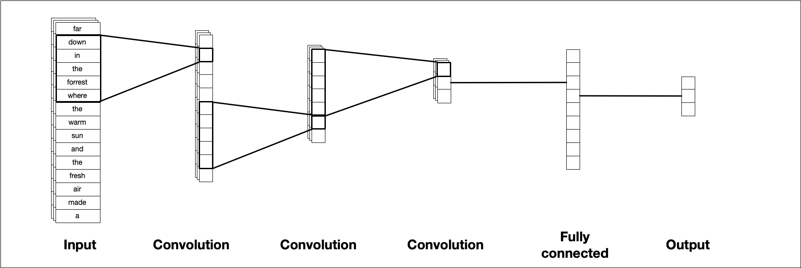
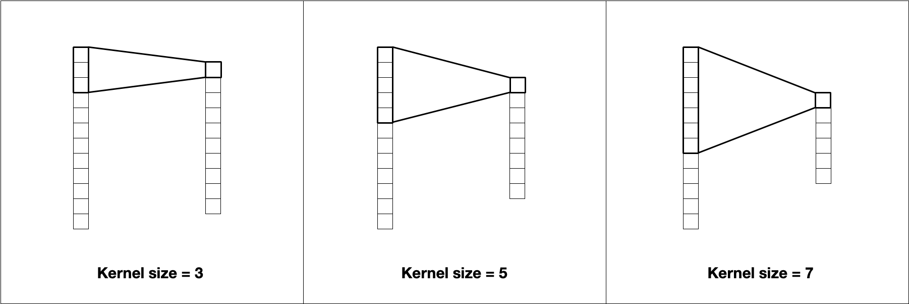

# Convolutional Neural Network {#dlcnn}

```{r setup, include = FALSE}
library(knitr)
opts_chunk$set(message = FALSE, warning = FALSE, cache = FALSE, eval = TRUE,
               tidy = "styler", fig.width = 8, fig.height = 5)
suppressPackageStartupMessages(library(tidyverse))
theme_set(theme_light())
options(crayon.enabled = FALSE)
doParallel::registerDoParallel()

library(keras)
use_session_with_seed(1234)

## for Julia's local environment
#spacyr::spacy_initialize(condaenv = "r-spacyr", entity = FALSE)
#online <- FALSE

## for GH actions
online <- TRUE

keras_predict <- function(model, recipe, data, response) {
  baked_data <- bake(recipe, data, composition = "matrix")
  prediction <- predict(model, baked_data)[, 1]
  
  data %>%
    mutate(
      .pred_prop = prediction,
      .pred_class = if_else(.pred_prop < 0.5, 0, 1)
    ) %>%
    mutate(across(c({{ response }}, .pred_class), 
                  ~ factor(.x, levels = c(1, 0))))
}
```

The first networks\@ref(dldnn) we have shown in this section don't take advantage of the sequential patterns.
Text can have patterns of varying length, and this can be hard for a simple densely connected network to pick up on and learn.
Patterns can be encoded as n-grams\@ref(tokenizingngrams), but this presents problems if you want to encode these n-grams directly since the dimensionality of the vocabulary shoots up even we just try to capture `n = 2` and `n = 3`.

The convolutional neural network (CNN) architecture is the most complicated network architecture we have seen so far, so we will take some time to review the construction, the different features, and the hyperparameters you can tune. The goal of this section is to give you an intuition on how each aspect of the CNN affects the behavior. CNNs are well suited to pick up on spatial structures within the data, this is a powerful feature for working with text since text typically contains a good amount of local structure within the text, especially when characters are used as the token. CNNs become efficient layers by having a small number of weights which is used to scan the input tensor, the output tensor that is produced then hopefully can represent specific structures in the data.

It is worth noting that a CNN isn't trying to learn long term structure, but rather detect local patterns along the sequence.

CNNs can work with 1, 2, 3-dimensional data, but it will mostly involve only 1 dimension when we are using it on text, the following illustrations and explanations will be done in 1 dimension to closely match the use-case we are looking at for this book. 
Figure \@ref(fig:cnn-architecture) illustrates a stereotypical CNN architecture.
You start with your input sequence, this example uses characters as the token, but it could just as well be words.
Then a filter slides along the sequence to produce a new and smaller sequence. This is done multiple times, typically with varying parameters for each layer until we are left with a small tensor which we then transform into our required output shape, 1 value between 0 and 1 in the case of classification.

```{r cnn-architecture, echo= FALSE, fig.cap="A template CNN architecture for 1 dimensional input data. A sequence of consequtive CNN layers will incremently reduce the tensor size, ending up with single value."}

```

This figure lies a little bit since we technically don't feed characters into it, but instead uses sequence one-hot encoding with a possible word embedding.
We will now go through some of the most important concepts about CNNs.

### Filters

The kernel is a small tensor of the same dimensionality as the input tensor that slides along the input tensor. When it is sliding it performs element-wise multiplication of the values in the input tensor and its weights and then summing up the values to get a single value. 
Sometimes an activation function will be applied as well.
It is these weights that are trained with gradient descent to find the best fit.
In keres, the `filters` represent how many different kernels are trained in each layer. You typically start with fewer filters at the beginning of your network and then increase them as you go along. 

### Kernel size

The most prominent hyperparameter is the kernel size. 
The kernel size is the size of the tensor, 1 dimensional is this case, that contains the weights. A kernel with size 5 will have 5 weights. These kernels will similarly capture local information to how n-grams capture location patterns. Increasing the size of the kernel will decrease the size of the output tensor, as we see in figure \@ref(fig:cnn-kernel-size)

```{r cnn-kernel-size, echo= FALSE, fig.cap="The kernel size affects the size of the resulting tensor. A kernel size of 3 uses the information from 3 values to calculate 1 value."}

```

Larger kernels will detect larger and less frequent patterns where smaller kernels will find fine-grained features. 
Notice how the choice of the token will affect how we think about kernel size. 
For character level tokens a kernel size of 5 will in early layers find patterns in parts of words more often than patterns across words since 5 characters aren't enough the adequately span multiple words. 
Where on the other hand a kernel size of 5 for word-level tokens will find patterns in parts of sentences instead. Kernels must have an odd length.

### Simple CNN {#simplecnn}

We will be using the same data and recipe which we looked at and created in section \@ref(kickstarter). This data contains short text blurbs for prospective crowdfunding campaigns and if they were successful or not. Our goal of this modeling is to be able to predict successful campaigns by the text contained in the blurb.

```{r include=FALSE}
library(tidyverse)

kickstarter <- read_csv("data/kickstarter.csv.gz")
kickstarter

library(tidymodels)
set.seed(1234)
kickstarter_split <- kickstarter %>%
  filter(nchar(blurb) >= 15) %>%
  initial_split()

kickstarter_train <- training(kickstarter_split)
kickstarter_test <- testing(kickstarter_split)

library(textrecipes)

max_words <- 20000
max_length <- 30

prepped_recipe <- recipe(~blurb, data = kickstarter_train) %>%
  step_tokenize(blurb) %>%
  step_tokenfilter(blurb, max_tokens = max_words) %>%
  step_sequence_onehot(blurb, sequence_length = max_length) %>%
  prep()

prepped_training <- prepped_recipe %>%
  bake(new_data = NULL, composition = "matrix")
```

We will start with a simple CNN specification that follows what we saw in figure \@ref(fig:cnn-architecture).
We start with an embedding layer followed by one 1 dimensional convolution layers `layer_conv_1d()`, followed by a global max pooling layer `layer_global_max_pooling_1d()` and a densely connected layer and ending with a dense layer with a sigmoid activation function to give us 1 value between 0 and 1 to use in our classification.

```{r simple_cnn_model}
library(keras)
simple_cnn_model <- keras_model_sequential() %>%
  layer_embedding(input_dim = max_words + 1, output_dim = 16,
                  input_length = max_length) %>%
  layer_conv_1d(filter = 32, kernel_size = 5, activation = "relu") %>%
  layer_global_max_pooling_1d() %>%
  layer_dense(units = 64, activation = "relu") %>%
  layer_dense(units = 1, activation = "sigmoid")

simple_cnn_model
```

We are using the same embedding layer as we did in the previous networks so there is nothing new there.
We use a `layer_global_max_pooling_1d()` layer to transform to collapse the remaining CNN output into 1 dimension and we finish it off with a densely connected layer and a sigmoid activation function.

This might not end up being the best CNN configuration, but it is a good starting point.
One of the challenges when working with CNNS is to make sure that you manage the dimensionality correctly. The length of the sequence decrease by `(kernel_size - 1)` for each layer. For this input where we have a sequence of length 30, which is decreased by `(5 - 1) = 4` resulting in a sequence of 30. We could in theory have 7 layers with `kernel_size = 5` since we would end with `30 - 4 - 4 - 4 - 4 - 4 - 4 - 4 = 2` elements in the resulting sequence. However, we would not be able to do a network with 3 layers of 
`kernel_size = 7` followed by 3 layers of `kernel_size = 5` since the resulting sequence would be `30 - 6 - 6 - 6 - 4 - 4 - 4 = 0` and we need a positive length in our sequence.
Remember that `kernel_size` is not the only argument that will change the length of the resulting sequence. Constructing a sequence layer by layer while having keras print the configurations is a great idea of how you can make sure your architecture is valid.

The compilation and fitting are the same as we have seen before. 

```{r simple_cnn_model_fit, dependson="simple_cnn_model"}
simple_cnn_model %>% compile(
  optimizer = "adam",
  loss = "binary_crossentropy",
  metrics = c("accuracy")
)

history <- simple_cnn_model %>% fit(
  x = prepped_training, 
  y = kickstarter_train$state,
  batch_size = 512,
  epochs = 10,
  validation_split = 0.2
)
```

We are using the `"adam"` optimizer since it performs well for this model. 

```{block, type = "rmdnote"}
You will have to experiment to find the optimizer that works best for your specific model. Different optimizers work differently in different situations and it is up to you to find which works the best for your model and data.
```

Now that the model is done fitting we can evaluate it on the testing data set.

```{r simple_cnn_model_evaluation, dependson="simple_cnn_model_fit"}
simple_cnn_model %>%
  evaluate(
    bake(prepped_recipe, kickstarter_test, composition = "matrix"),
    kickstarter_test$state
  )
```

We are seeing some improvement over the densely connected network. This is a good development, what we hoped to see was an improvement in our model.

### Case study: Adding more layers

Now that we have the basic structure of a CNN down we can see what happens when we apply some common modifications to it.
This case study will look at how we can add additional convolutional layers to our base model and how additional dense layers can be added.

We will start by adding another fully connected layer. We take the architecture we used in `simple_cnn_model` and added another `layer_dense()` after the first `layer_dense()` in the model. And we are not going to do more than this.
Increasing the depth of the model over the fully connected layers allows the model to be able to find move complex patterns. There is however a trade-off. Adding more layers will add more weights to the model making it more complex and harder to train. If you don't have enough data or the patterns you are trying to classify aren't that complex then the model performance will suffer since the model will start overfitting since it starts picking up on patterns in the data that aren't there.

When working with CNNs the different layers perform different tasks. The convolutional layers extract local patterns in the data as it slides along the sequences, whereas the fully connected layers find global patterns. We can think of the convolutional layers as doing preprocessing on the text which is then fed into the deep neural network that tries to fit the best curve. Adding more fully connected layers allows the network to create more intricate curves, and adding more convolutional layers gives richer features that are used when fitting the curves. Your job when constructing a CNN is to make the architecture just complex enough to match the data without overfitting. Yoshua Bengio has a simple rule for this: "Just keep adding layers until the test error does not improve anymore"[@bengio2012practical].

```{r}
cnn_double_dense <- keras_model_sequential() %>%
  layer_embedding(input_dim = max_words + 1, output_dim = 16,
                  input_length = max_length) %>%
  layer_conv_1d(filter = 32, kernel_size = 5, activation = "relu") %>%
  layer_global_max_pooling_1d() %>%
  layer_dense(units = 64, activation = "relu") %>%
  layer_dense(units = 64, activation = "relu") %>%
  layer_dense(units = 1, activation = "sigmoid")

cnn_double_dense
```

we can compile and fit the new model. We will try to keep as many things as we can constant so we can try to compare the different models.

```{r}
cnn_double_dense %>% compile(
  optimizer = "adam",
  loss = "binary_crossentropy",
  metrics = c("accuracy")
)

history <- cnn_double_dense %>% fit(
  x = prepped_training, 
  y = kickstarter_train$state,
  batch_size = 512,
  epochs = 10,
  validation_split = 0.2
)

cnn_double_dense %>%
  evaluate(
    bake(prepped_recipe, kickstarter_test, composition = "matrix"),
    kickstarter_test$state
  )
```

This model performs well, but it is not entirely clear that it is working better than the first CNN model we tried. This could be an indication that the original model had enough fully connected layers for the amount of training data we had available.
If this is the case and we have two models with identical performance then we should go with the less complex of the two, since they would have faster performance.

We can also try to vary the number of convolutional layers by adding more layers.

```{r}
library(keras)
cnn_double_conv <- keras_model_sequential() %>%
  layer_embedding(input_dim = max_words + 1, output_dim = 16,
                  input_length = max_length) %>%
  layer_conv_1d(filter = 32, kernel_size = 5, activation = "relu") %>%
  layer_max_pooling_1d(pool_size = 2) %>%
  layer_conv_1d(filter = 64, kernel_size = 3, activation = "relu") %>%
  layer_global_max_pooling_1d() %>%
  layer_dense(units = 64, activation = "relu") %>%
  layer_dense(units = 1, activation = "sigmoid")

cnn_double_conv
```

There are a lot of different ways we can extend the network by adding convolutional layers with `layer_conv_1d()`. We have to consider the individual characteristics of each layer, concerning kernel size, stride, padding, and dilation rate. We also have to consider the progression of these layers within the network itself. 
The model is using an increasing number of filters in each layer, doubling the number of filters for each layer. This is to make sure that there are more filters later on to capture enough of the global information.
This model is using kernel size 5 twice and there aren't any hard rules about how you structure these kernel sizes, but the sizes you choose will change what features the model can detect. The early layers extract general or low-level features whereas the later layers define finer detail or high-level features in the data. The choice of kernel size determines the size of these features. Having a small kernel size in the first layer will let the model detect low-level features locally.

We are also including a max-pooling layer with `layer_max_pooling_1d()` between the convolutional layers. This layer performs a pooling operation that calculates the maximum values in its pooling window which in this model is set to 2.
This is done in the hope that the pooled features will be able to perform better by weeding out the small weights.
This is another thing you can tinker with when you are designing the network concerning the frequency of pooling layers and their parameters.

We compile this model like the other two, again trying to keep as many things as we can constant. The only thing that changed in this model compared to the first is the addition of a `layer_max_pooling_1d()` and a `layer_conv_1d()`.

```{r}
cnn_double_conv %>% compile(
  optimizer = "adam",
  loss = "binary_crossentropy",
  metrics = c("accuracy")
)

history <- cnn_double_conv %>% fit(
  x = prepped_training, 
  y = kickstarter_train$state,
  batch_size = 512,
  epochs = 10,
  validation_split = 0.2
)

cnn_double_conv %>%
  evaluate(
    bake(prepped_recipe, kickstarter_test, composition = "matrix"),
    kickstarter_test$state
  )
```

This model also performs admirably compared to the other models. Let us extract the the prediction using `keras_predict()` we defined in \@ref(evaluate-keras-predictions).

```{r}
all_cnn_model_predictions <- bind_rows(
  keras_predict(
    simple_cnn_model, 
    prepped_recipe, 
    kickstarter_test, 
    state
  ) %>% mutate(model = "Basic CNN"),
  keras_predict(
    cnn_double_dense, 
    prepped_recipe, 
    kickstarter_test, 
    state
  ) %>% mutate(model = "Double Dense"),
  keras_predict(
    cnn_double_conv, 
    prepped_recipe, 
    kickstarter_test, 
    state
  ) %>% mutate(model = "Double Conv")
)

all_cnn_model_predictions
```

Now that the results are combined in `all_cnn_model_predictions` we can calculate group-wise evaluation statistics by grouping them by the `model` variable.

```{r}
all_cnn_model_predictions %>%
  group_by(model) %>%
  metrics(state, .pred_class)
```

We can also do this for ROC-curves. Figure \@ref(fig:allcnnroccurve) shows the 3 different ROC-curves together in 1 chart.

```{r allcnnroccurve, fig.width=7, fig.height=6, fig.cap="ROC curve for 3 varients of CNN models' predictions of Kickstarter state"}
all_cnn_model_predictions %>%
  group_by(model) %>%
  roc_curve(truth = state, .pred_prop) %>%
  autoplot() +
  labs(
    title = "Receiver operator curve for Kickstarter blurbs"
  )
```

The curves are very close in this chart. This seems to indicate that we don't have much to gain by adding more layers since they don't add anything to the performance.
This doesn't mean that we are done with this model. There are still some things we can look at such as different tokenization and hyperparameters that can be trained. We will take a look at this in the following sections.

## Case study: Byte Pair Encoding

In our models in this chapter so far we have used "words" as the token of interest. We saw in chapter \@ref(mlclassification) and \@ref(mlregression) how n-grams could be used as well.
One of the reasons why the Kickstarter dataset is hard to work with is because the text is quite short so we don't get that many individual tokens to work with.
Another choice of token is "subwords", which is where we split the text into smaller units and some longer words will be constructed of multiple of these subword units. One of the ways to tokenize text into subword units is [Byte Pair Encoding](https://en.wikipedia.org/wiki/Byte_pair_encoding) proposed by @Gage1994ANA.
This algorithm has been repurposed to work on text by iteratively merging frequently occurring subword pairs.
Using subwords in text is used in methods such as [BERT](https://github.com/google-research/bert) and [GPT-2](https://openai.com/blog/better-language-models/) with great success.
The Byte Pair encoding algorithm has a hyperparameter controlling the size of the vocabulary. Setting it to higher values allows up to find more rarely used character sequences in the text.
One of the great benefits of using byte pair encoding is that it offers a good trade-off between character level and word level information. It is additionally helpful since it can encode unknown words. For example, suppose that the model is aware of the word "priest", a simple tokenizer we used before would have to put a word such as "priesthood" into an unknown bucket or ignore it completely, whereas the byte pair encoding should be able to pick up on the subwords "priest" and "hood" (or "priest", "h", and "ood", depending on if the model found "hood" as a common enough subword).
Using a subword tokenizer such as byte pair encoding should let us see the text with more granularity since we will have more and smaller tokens for each observation.

```{block, type = "rmdnote"}
Character level CNN has also seen success in the literature. They have been explored by @Zhang2015 and work quite well on small shorter texts such as headlines and tweets[@Vosoughi2016]
```

We need to remind ourselves that these models don't contain any linguistic knowledge at all, they only "know" the patterns of sequences of characters in the training set. This is not to say the models are useless, but to set our expectations of what the model is capable of, namely pattern detection.

Since we are using a completely different preprocessing setup we need to specify a new recipe. textrecipes has a tokenization engine to perform byte pair encoding, but we need to determine the vocabulary size and the appropriate sequence length. This function here takes a character vector and a vocabulary size and returns a data.frame with the number of tokens in each observation.

```{r}
library(textrecipes)
get_bpe_token_dist <- function(vocab_size, x) {
  recipe(~text, data = tibble(text = x)) %>%
    step_mutate(text = tolower(text)) %>%
    step_tokenize(text, 
                  engine = "tokenizers.bpe",
                  training_options = list(vocab_size = vocab_size)) %>%
    prep() %>%
    bake(new_data = NULL) %>%
    transmute(n_tokens = lengths(textrecipes:::get_tokens(text)),
              vocab_size = vocab_size)
}
```

We can use `map()` to try a handful of different vocabulary sizes

```{r}
bpe_token_dist <- map_dfr(
  c(2500, 5000, 10000, 20000), 
  get_bpe_token_dist,
  kickstarter_train$blurb
)
bpe_token_dist
```

If we compare with the word count distribution we saw in \@ref(fig:kickstarterwordlength) then we see in \@ref(fig:kickstartersubwordlength) that any of these choices of vocabulary sizes will result in more tokens.

```{r kickstartersubwordlength, fig.cap="Distribution of subword count for Kickstarter campaign blurbs for different vocabulary sizes"}
bpe_token_dist %>%
  ggplot(aes(n_tokens)) +
  geom_bar() +
  facet_wrap(~vocab_size) +
  labs(x = "Number of subwords per campaign blurb",
       y = "Number of campaign blurbs")
```
Let us pick a vocabulary size to be 10,000 and a corresponding sequence length to be 40. To use byte pair encoding as a tokenizer in textrecipes set `engine = "tokenizers.bpe"` and the vocabulary size can be denoted using the `training_options` argument. Everything else in the recipe stays the same.

```{r}
max_subwords <- 10000
bpe_max_length <- 40

bpe_recipe <- recipe(~blurb, data = kickstarter_train) %>%
  step_mutate(blurb = tolower(blurb)) %>%
  step_tokenize(blurb, 
                engine = "tokenizers.bpe",
                training_options = list(vocab_size = max_subwords)) %>%
  step_sequence_onehot(blurb, sequence_length = bpe_max_length) %>%
  prep()

prepped_bpe <- bpe_recipe %>%
  bake(new_data = NULL, composition = "matrix")
```

The model we will be using will be very similar to the baseline CNN model we explore earlier, this time we have used a larger kernel size of 7 to account for the finer detail in the tokens.

```{r}
cnn_bpe <- keras_model_sequential() %>%
  layer_embedding(input_dim = max_words + 1, output_dim = 16,
                  input_length = bpe_max_length) %>%
  layer_conv_1d(filter = 32, kernel_size = 7, activation = "relu") %>%
  layer_global_max_pooling_1d() %>%
  layer_dense(units = 64, activation = "relu") %>%
  layer_dense(units = 1, activation = "sigmoid")

cnn_bpe
```

And we can compile and train like we have done so many times now.

```{r}
cnn_bpe %>% compile(
  optimizer = "adam",
  loss = "binary_crossentropy",
  metrics = c("accuracy")
)

history <- cnn_bpe %>% fit(
  x = prepped_bpe, 
  y = kickstarter_train$state,
  batch_size = 512,
  epochs = 10,
  validation_split = 0.2
)

cnn_bpe %>%
  evaluate(
    bake(bpe_recipe, kickstarter_test, composition = "matrix"),
    kickstarter_test$state
  )
```

The performance is doing quite well, which is a pleasant surprise and in line with what we hoped would happen if we switched to a higher detail tokenizer.

Looking at the confusion matrix in \@ref(bpeheatmap) also gives us the clear thatt there isn't much bias going on.

```{r bpeheatmap, dependson="nbrs", fig.cap="Confusion matrix CNN model using byte pair encoding tokenization"}
bpe_assess <- bake(bpe_recipe, kickstarter_test, composition = "matrix")

val_res <- keras_predict(cnn_bpe, bpe_assess, kickstarter_test$state)

val_res %>%
  conf_mat( state, .pred_class) %>%
  autoplot(type = "heatmap")
```
to understand what the subword the models used are, we can extract them from `step_sequence_onehot()` using `tidy()` on the prepped recipe. All the tokens that start with an `"h"` are seen here

```{r}
tidy(bpe_recipe, 3) %>%
  filter(str_detect(token, "^h")) %>%
  pull(token)
```

Notice how some of these subword tokens are full words and some are part of words. This is what allows the model to be able to "read" long unknown words by combining many smaller sub words.
We can also look at common long words

```{r}
tidy(bpe_recipe, 3) %>%
  arrange(desc(nchar(token))) %>%
  slice_head(n = 25) %>%
  pull(token)
```

These 25 words were common enough to get their own subword token. looking at the longest subword tokens gives you a good look into the data you are looking at.

## Explainability with lime {#lime}

We noted in section \@ref(dllimitations) that one of the limitations of deep learning models is that they are hard to reason about. One of the ways to expect a predictive model, like we have been working with in this book is using the *Local Interpretable Model-Agnostic Explanations*[@ribeiro2016why] algorithm or *lime* for short. The lime package can take a model and its prediction and determine a small set of features in the original data that has driven the outcome of the prediction. 

To use this package we need to write a helper function to get the data in the format we want. The `lime()` function takes two mandatory arguments, `x` and `model`. `model` is the trained model we are trying to explain. `lime()` works out of the box with keras models so we should be good to go. `x` is the training data used for training the model. This is where we need to to create a helper function, it would be good for some of the functions in the lime package if we can make `x` be a character vector. If we create a function that takes a character vector as input and returns the matrix the keras model is expecting so we are good, which is what the following function is doing

```{r}
text_to_matrix <- function(x) {
  bake(
    prepped_recipe,
    new_data = tibble(blurb = x), 
    composition = "matrix"
  )
}
```

```{block, type = "rmdnote"}
Since the function needs to be able to work with just the `x` parameter, we need to put `prepped_recipe` inside the function rather than passing it in as an argument. This will work with R's scoping rules but will make it so you have to create a new function for each recipe.
```

We also need to select a couple of training observations to explain

```{r}
sentence_to_explain <- kickstarter_train %>%
  slice(c(1, 2)) %>%
  pull(blurb)

sentence_to_explain
```

We now load the lime package and passes observations into `lime()` along with the model we are trying to explain and the preprocess function.

```{block, type = "rmdwarning"}
Make sure that the preprocess function matches the preprocessing that was used to train the model.
```

```{r}
library(lime)

explainer <- lime(
  x = sentence_to_explain, 
  model = simple_cnn_model, 
  preprocess = text_to_matrix
  )
```

this `explainer` object can now be used with `explain()` to generate explanations from the sentences. We set `n_labels = 1` to only get explanations for the first label since we are working with a binary classification model. The explanations of the second label would just be the inverse of the first label. If you have more than 2 labels then it makes sense to explore some or all of them. We set `n_features = 12` so we can look at the 12 most prominent features. If we were dealing with longer text you would take to adjust `n_features` to capture the effect of as many features you want.

```{r}
explanation <- explain(
  x = sentence_to_explain, 
  explainer = explainer, 
  n_labels = 1, 
  n_features = 12
  )

explanation
```

The output comes in a tibble format where `feature` and `feature_weight` are included, but luckily lime contains some functions to visualize these weights. \@ref(fig:limeplotfeatures) shows the result of using `plot_features()`, each facet contains an observation-label pair and the bars show the weight of the different tokens. Blue bars indicate that the weights support the prediction in the direction and red bars indicate contradictions. This chart is great for finding the most prominent features in an observation.

```{r limeplotfeatures, fig.cap="Plot of most important features in a CNN model for a couple of observations."}
plot_features(explanation)
```

Figure \@ref(fig:limeplottextexplanations) shows the weights by highlighting the words directly in the text. This gives us a way to see if any local patterns contain a lot of weight.

```{r limeplottextexplanations, fig.cap="Feature highlighting of words in two examples explained by a CNN model."}
plot_text_explanations(explanation)
```

```{block, type = "rmdnote"}
`interactive_text_explanations()` can be used on launch an shiny app where you can interactively explore the weights the model.
```

One of the ways a deep learning model is hard to explain is that changes to a part of the input can affect how the input is being used as a whole. Remember in bag-of-words models how adding another token when prediction would just another unit in the weight, this is not always the case when using deep learning models.
The following example shows this effect. We have created two very similar sentences in `fake_sentences`. 

```{r}
fake_sentences <- c(
  "Fun and exciting dice game for the whole family",
  "Fun and exciting dice game for the family"
)

explainer <- lime(
  x = fake_sentences, 
  model = simple_cnn_model, 
  preprocess = text_to_matrix
  )

explanation <- explain(
  x = fake_sentences, 
  explainer = explainer, 
  n_labels = 1, 
  n_features = 12
  )
```

Explanations based on these two sentences are fairly similar as we can see in \@ref(fig:robustlimeplottextexplanations). However, notice how the removal of the word "whole" affects the weights of the other words in the examples.

```{r robustlimeplottextexplanations, fig.cap="Feature highlighting of words in two examples explained by a CNN model."}
plot_text_explanations(explanation)
```

It is these kinds of correlated patterns that can make deep learning models hard to reason about and can deliver surprising results.

## Hyper Parameter search

So far have we only used one configuration of hyperparameters. But sometimes we want to try different hyperparameters out and find what works best for our model like we did in \@ref(mlclassificationfull) and \@ref(mlregressionfull) using the tune package. We will use the [tfruns](https://tensorflow.rstudio.com/tools/tfruns/overview/) package to run multiple keras models and compare the results.

This workflow will be a little different than what we have seen in the book so far since we will have to create a .R file that contain the necessary modeling steps and then we use that file to run multiple files. A file named "cnn-spec.R" is created and you can see the raw file [here](https://raw.githubusercontent.com/EmilHvitfeldt/smltar/master/cnn-spec.R). The first thing we need to do is specify what hyperparameters we want to change. By convention, we name this object `FLAGS` and is created using the `flags()` function. For each parameter we we want to change you add a corresponding `flag_*()` function, which can be `flag_integer()`, `flag_boolean()`, `flag_numeric()`, or `flag_string()` depending on what you need to tune.

```{block, type "rmdwarning"}
Make sure you are using the right type for each of these flags as keras is quite picky. If keras is expecting an integer and gets a numeric then you will get an error.
```

```{r, eval=FALSE}
FLAGS <- flags(
  flag_integer('kernel_size1', 5),
  flag_integer('strides1', 1)
)
```

Notice how we are giving each flag a name and a possible value. The value doesn't actually do anything as it is not being used once we start running multiple models, but needs to be the right type for the model we are using.

Next, we specify the keras model we want to run.

```{r, eval=FALSE}
model <- keras_model_sequential() %>%
  layer_embedding(input_dim = max_words + 1, output_dim = 16,
                  input_length = max_length) %>%
  layer_conv_1d(filter = 32, 
                kernel_size = FLAGS$kernel_size1,
                strides = FLAGS$strides1,
                activation = "relu") %>%
  layer_global_max_pooling_1d() %>%
  layer_dense(units = 64, activation = "relu") %>%
  layer_dense(units = 1, activation = "sigmoid")

model %>% compile(
  optimizer = "adam",
  loss = "binary_crossentropy",
  metrics = c("accuracy")
)
```

We specify the hyperparameters we want to change by marking them as `FLAGS$name`. So in this model, we are trying different values of `kernel_size` and `strides` which are denoted by the `kernel_size1` and `strides1` flag respectively.

Lastly, we have to specify how is trained and evaluated.

```{r, eval=FALSE}
history <- model %>% fit(
  x = prepped_training, 
  y = kickstarter_train$state,
  batch_size = 512,
  epochs = 10,
  validation_split = 0.2
)

plot(history)

score <- model %>% evaluate(
  bake(prepped_recipe, kickstarter_test, composition = "matrix"),
  kickstarter_test$state
)

cat('Test accuracy:', score$acc, '\n')
```

This is mostly the same as what we have seen before. When we are running these different models the scripts will be run in the environment they are initialed from, so the models will have access to objects like `prepped_training` and `kickstarter_train` so we don't have to create them inside the file.

Now that we have the file set up we need to specify the different hyperparameters we want to look at. 3 different values for the kernel size and 2 different values for the stride length giving us `3 * 2 = 6` different runs.

```{r}
hyperparams <- list(
  kernel_size1 = c(3, 5, 7),
  strides1 = c(1, 2)
)
```

```{block, type = "rmdnote"}
This is a small selection of hyperparameters and ranges. There is much more room for experimentation.
```

Now we have everything we need to do some hyperparameter searching. Load up tfruns and pass the name of the file we just created along with `hyperparams` to the `tuning_run()` function.

```{r, results='hide'}
library(tfruns)
runs <- tuning_run(
  file = 'cnn-spec.R',
  runs_dir = '_tuning',
  flags = hyperparams
)
```

You don't have to, but we have manually specified the `runs_dir` argument which is where the results of the tuning will be saved.

A summary of all the runs in the folder can be retrieved with `ls_runs()` and here we use `as_tibble()` to get the results as a tibble.

```{r}
as_tibble(ls_runs())
```

We can condense the results down a little bit by only pulling out the flags we are looking at and arranging them according to their performance.

```{r}
best_runs <- as_tibble(ls_runs()) %>%
  select(eval_acc, flag_kernel_size1, flag_strides1) %>%
  arrange(desc(eval_acc))
best_runs
```

There isn't a lot of performance difference between the different choices but using kernel size of `r best_runs$flag_kernel_size1[1]` and stride length of `r best_runs$flag_strides1[1]` narrowly came on top.

## Cross-validation for evaluation

In section \@ref(dnncross) we saw how we can use resampling to create cross-validation folds for evaluation. The Kickstarter dataset we are using is big enough that we have enough data to use a single training set, validation set, and testing set that all contain enough observations in them to give reliable performance metrics.

```{r}
set.seed(345)
kick_folds <- vfold_cv(kickstarter_train, v = 5)
kick_folds
```

Each of these folds has an analysis/training set and an assessment/validation set. Instead of training our model one time and getting one measure of performance, we can train our model `v` times and get `v` measures, for more reliability.

Last time we saw how to create a custom function to handle preprocessing, fitting, and evaluation. We will use the same aproch of creating the function, but this time use the model specification from section \@ref(simplecnn).

```{r}
fit_split <- function(split, prepped_rec) {
  
  ## preprocessing
  x_train <- bake(prepped_rec, new_data = analysis(split), 
                  composition = "matrix")
  x_val   <- bake(prepped_rec, new_data = assessment(split), 
                  composition = "matrix")
  
  ## create model
  y_train <- analysis(split) %>% pull(state)
  y_val   <- assessment(split) %>% pull(state)
  
  
  mod <- keras_model_sequential() %>%
  layer_embedding(input_dim = max_words + 1, output_dim = 16,
                  input_length = max_length) %>%
  layer_conv_1d(filter = 32, kernel_size = 5, activation = "relu") %>%
  layer_global_max_pooling_1d() %>%
  layer_dense(units = 64, activation = "relu") %>%
  layer_dense(units = 1, activation = "sigmoid") %>% 
    compile(
      optimizer = "adam",
      loss = "binary_crossentropy",
      metrics = c("accuracy")
    )
  
  ## fit model
  mod %>%
    fit(
      x_train, 
      y_train,
      epochs = 10,
      validation_data = list(x_val, y_val),
      batch_size = 512,
      verbose = FALSE
    )
  
  ## evaluate model
  keras_predict(mod, x_val, y_val) %>%
    metrics(state, .pred_class, .pred_1)
}
```

We can `map()` this function across all our cross-validation folds. This takes longer than our previous models to train, since we are training for 10 epochs each on five folds.

```{r}
cv_fitted <- kick_folds %>%
  mutate(validation = map(splits, fit_split, prepped_recipe))

cv_fitted
```

Now we can use `unnest()` to find the metrics we computed.

```{r}
cv_fitted %>%
  unnest(validation)
```

We can even create a visualization in Figure \@ref(fig:cnncvmetrics) to see the distribution of these metrics for these five folds.

```{r cnncvmetrics, fig.cap="CNN performance metrics for cross-validation folds"}
cv_fitted %>%
  unnest(validation) %>%
  mutate(.metric = fct_reorder(.metric, .estimate)) %>%
  ggplot(aes(.metric, .estimate, color = .metric)) +
  geom_boxplot() +
  geom_point(alpha = 0.5) +
  theme(legend.position = "none")
```

The metrics have little variance just like they did last time, which is reassuring that our model is somehow robust with respect to the evaluation metrics. 

## Limitations of Covolution Neural Networks

## Summary {#dlcnnsummary}

### In this chapter, you learned:

```{r, include=FALSE}
knitr::knit_exit()
```

### Stride

The stride is the second big hyperparameter that controls the kernels in a CNN. The stride length determines how much the kernel moves along the sequence between each calculation. A stride length of 1 means that the kernel moves over one place at a time, this way we get maximal overlap.

```{r cnn-stride, echo= FALSE, fig.cap="The stride length affects the size of the resulting tensor. When stride = 1 then the window slides along one by one. Increasing the slide length decreases the resulting tensor by skipping windows."}

```

In figure \@ref(fig:cnn-stride) we see that if the kernel size and stride length are equal then there is no overlap. We can decrease the size of the output tensor by increasing the stride length. Be careful not to set the stride length to be larger than the kernel size, otherwise, then you will skip over some of the information.

### Dilation

The dilation controls how the kernel is applied to the input tensor.
So far we have shown examples where the dilation is equal to 1. This means that each value from the input tensor will be spaced 1 distance apart from each other.

```{r cnn-dilation, echo= FALSE, fig.cap="The dilation affects the size of the resulting tensor. When dilation = 1 then consecutive values are taking from the input. Increasing the dilation leaves gaps between input values and decreases the resulting tensor."}
knitr::include_graphics("diagram-files/cnn-dilation.png")
```

If we increase the dilation then can see in figure \@ref(fig:cnn-dilation) that there will be spaces or gaps between the input values. This allows the kernel to find large spatial patterns that span many tokens.
This is a useful trick to be able to extract features and structure from long sequences. Dilated convolutional layers when put in succession will be able to find patterns in very large sequences.

### Padding

The last hyperparameter we will talk about is padding.
One of the downsides to how the kernels are being used in the previous figures is how it handles the edge of the sequence.
Padding is the act of putting something before and after the sequence when the convolution is taking place to be able to extract more information from the first and last tokens in the sequence. Padding will lead to larger output tensors since they we let the kernel move more.
