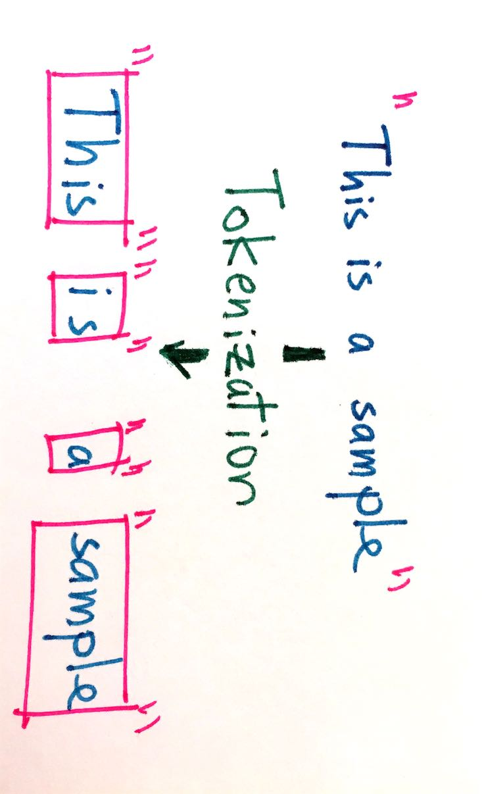

# Tokenization

```{r, message=FALSE}
library(tokenizers)
library(tidyverse)
library(tidytext)
library(hcandersenr)
the_fir_tree <- hcandersen_en %>%
  filter(book == "The fir tree") %>%
  pull(text)
```

In this chapter we will become familiar with the concepts of *tokens*, *ngrams*, *tokenization* and how to perform tokenization in R.

## What is a token?

In R you will generally have text saved as a character vector of strings. If we look at the first paragraph of The Fir Tree, then the text is split into strings, which themselves are a series of letters, spaces and punctuation.

```{r}
head(the_fir_tree, 9)
```

These strings don't contain any information regarding what are words and what isn't. This is where tokenization comes in.

In tokenization you take an input (a string) and a type (a word) and proceed to split the input in to pieces (tokens) that correspond the type. [@Manning:2008:IIR:1394399]

 TODO

Typically will we want to allow tokenization to happen on the word level. However it is quite difficult to define what we mean by a "word". As an exercise lets start by defining a word as being any selection of alphanumeric (letter and numbers) symbols. Lets start by using some regex with `strsplit` to split the first 2 lines of The Fir Tree by anything non alphanumeric.

```{r}
strsplit(the_fir_tree[1:2], "[^a-zA-Z0-9]+")
```

At first sight it looks pretty decent. We are losing all punctuation which may or may not be favorable, and the hero of the story "fir-tree" got split in half. Already it is clear that tokenization is going to be quite complicated. Luckily a lot of work have gone into this process, and we will use what they got. Introducing the **tokenizers** package. This package contains a wealth of fast tokenizers we can use.  

TODO find example that shows a difference between strsplit and tokenize_words

```{r}
library(tokenizers)
tokenize_words(the_fir_tree[1:2])
```

And we get a sensible result. `tokenize_words` is using the **stringi** using the hood making it very fast. Tokenization according to words is done by finding word boundaries according to the specification from International Components for Unicode (ICU). The word boundary algorithm goes as follows

- Break at the start and end of text, unless the text is empty.
- Do not break within CRLF.
- Otherwise break before and after Newlines (including CR and LF)
- Do not break within emoji zwj sequences.
- Keep horizontal whitespace together.
- Ignore Format and Extend characters, except after sot, CR, LF, and Newline.
- Do not break between most letters.
- Do not break letters across certain punctuation.
- Do not break within sequences of digits, or digits adjacent to letters (“3a”, or “A3”).
- Do not break within sequences, such as “3.2” or “3,456.789”.
- Do not break between Katakana.
- Do not break from extenders.
- Do not break within emoji flag sequences. 
- Otherwise, break everywhere (including around ideographs).

TODO add reference to https://www.unicode.org/reports/tr29/tr29-35.html#Default_Word_Boundaries

While you might not understand what each and every step is doing you can appreciate it is many times more sophisticated then our initial approach. In the remaining of the book we will let the **tokenizers** package determine a baseline tokenizer for reference. We want to stress that the choice of tokenizer will have an influence on your results. Don't be afraid to experiment with different tokenizers or to write your own to fit your problem.

## Types of tokens

Taking a token to mean "word" was a useful idea however hard to implement concretely in software, however we can generalize the notion of a token to mean "document unit". Under this new definition we can let a token be a variety of things including

- characters
- words
- sentences
- lines
- paragraphs and
- ngrams.

We will in the following sections showcase how to do tokenization using the **tokenizers** package. These functions will take a character vector as the input and returns lists of character vectors. However these same operations can also be done using the **tidytext** package. 

```{r}
sample_vector <- c("This is the first of two strings",
                   "And here is the second string.")
sample_tibble <- tibble(text = sample_vector)
```

therefore the tokenization done by using `tokenize_words` on `sample_vector`

```{r}
tokenize_words(sample_vector)
```

will yield the same tokenization as `unnest_tokens` done on `sample_tibble`, only difference being the format. Difference.

```{r}
sample_tibble %>%
  unnest_tokens(word, text, token = "words")
```

Furthermore arguments used in `tokenize_words` can be passed through `unnest_tokens` using the `...` like so

```{r}
sample_tibble %>%
  unnest_tokens(word, text, token = "words", strip_punct = FALSE)
```

### character tokens

The first and simplest tokenization is the character tokenization. This simply splits the texts into characters. Here we run `tokenize_characters` with default starting parameters. Notice how it have arguments to convert everything to lowercase and to strip all non alpha numeric characters. These are both done to reduce the number of different tokens we are returned. The `tokenize_*()` functions will by default return a list of character vectors, one character vector for each string in the input.

```{r}
tft_token_characters <- tokenize_characters(x = the_fir_tree,
                                            lowercase = TRUE,
                                            strip_non_alphanum = TRUE,
                                            simplify = FALSE)
```

And if we take a look this is what we get.

```{r}
# TODO find better way to print this
head(tft_token_characters)
```

However we don't have to stay with the defaults and we can include the punctuation and spaces by setting `strip_non_alphanum = FALSE` and we see that spaces and punctuation are included too now.

```{r}
tokenize_characters(x = the_fir_tree,
                    strip_non_alphanum = FALSE) %>%
  head()
```

TODO Find examples of when a character is hard to define. Look at Arabic, German (double s) and danish (double a).

### words tokens

TODO decide if `tokenize_word_stems()` should be introduced in this chapter of the stemming chapter.

The word tokenization is perhaps the most common and widely studied tokenization. As we described earlier it is the procedure of splitting our text into words. To do this we will use the `tokenize_words()` functions.

```{r}
tft_token_words <- tokenize_words(x = the_fir_tree,
                                  lowercase = TRUE, 
                                  stopwords = NULL, 
                                  strip_punct = TRUE,
                                  strip_numeric = FALSE)
```

And if we take a look this is what we get.

```{r}
# TODO find better way to print this
head(tft_token_words)
```

We have already seen `lowercase = TRUE`, and `strip_punct = TRUE` and `strip_numeric = FALSE` should be fairly self-explanatory. They control whether we remove punctuation and numerics respectively. Lastly we have `stopwords = NULL`, which we will talk more in depth about in chapter \@ref(stopwords).

If we create a tibble with the two fairly tales "The fir tree" and "The little mermaid". Then we can use use `unnest_tokens` together with some **dplyr** verbs to find the must commonly used words in each.

```{r}
hcandersen_en %>%
  filter(book %in% c("The fir tree", "The little mermaid")) %>%
  unnest_tokens(word, text) %>%
  count(book, word) %>%
  group_by(book) %>%
  arrange(desc(n)) %>%
  slice(1:5)
```

We see that the 5 most commonly words in each fairly tale are fairly uninformative (only exception being "tree" in the "The fir tree" which might not be too surprising). These words are called *stop words* and will be handled in chapter \@ref(stop words).

### lines, sentences and paragraph tokens

The following tokenizers are rarely used to create tokens for analytic uses, as the tokens produced tend to be fairly unique it is very uncommon for multiple sentences in a text to be identical. However these tokenizers will still provide value for preprocessing and labeling.

### ngrams tokens

TODO find reference for ngrams

## Where does it break down?

TODO What do you lose when you tokenize?
- double spaces
- potentially capitalization. Which could collapse patty and Patty together.

TODO compare methods and explain why they are different. 

TODO Showcase where the different methods have strengths and weaknesses

TODO Do comparing of compression of data with different types of tokenizations

```{r}
if (packageDescription("tidyr")$Version >= "0.8.3.9000") {
  hcandersen_en %>%
    nest(text) %>%
    mutate(data = map_chr(data, ~ paste(.x$text, collapse = " "))) %>%
    mutate(chars = tokenize_characters(data) %>% map_int(~table(.x) %>% length()),
           chars_non_alphanum = tokenize_characters(data, strip_non_alphanum = FALSE) %>% map_int(~table(.x) %>% length()),
           words = tokenize_words(data) %>% map_int(~table(.x) %>% length()),
           words_no_lowercase = tokenize_words(data, lowercase = FALSE) %>% map_int(~table(.x) %>% length()),
           words_stems = tokenize_word_stems(data) %>% map_int(~table(.x) %>% length())) %>%
    select(-data) %>%
    pivot_longer(-book) %>%
    ggplot(aes(name, value)) +
    geom_boxplot() +
    geom_jitter(alpha = 0.1) +
    scale_y_log10() +
    theme_minimal() +
    coord_flip() +
    labs(title = "Number of distinct tokens varies greatly with choice of tokenizer")
}
```


## Building your own tokenizer

Sometimes the out-of-the-box tokenizers wont be able to do what you want need them to do. In this case you will have to wield **stringi**/**stringr** and [regular expression](https://en.wikipedia.org/wiki/Regular_expression) (regex for short). There are two main paths to tokenization

1. *Split* the string up according to some rule
2. *Extract* tokens based on some rule

the number and complexity of your rules is determined by your desired outcome. You can reach complex outcomes by chaining together many smaller rules. In this section we will implement a couple of specility tokenizers to showcase the techniques.  

### Tokenize to characters, only keeping letters

Here we want to make a modification to `tokenize_characters()` such that we only keep keep letters. At first thought there are 2 main options. Use `tokenize_characters()` and remove any non letters, or extract extract the letters one by one. This is a fairly simple goal so we will go with the latter option. This is an *extract* task and we will be using `str_extract_att()` as each string has the possiblity of including more then 1 token. Since we want to extract letters we can use the letters character class `[:alpha:]` to match for letters and the quantifier `{1}` to only extract the first one. (In this example leaving out the quantifier yields the same result, however more specific regular expressions runs faster).

```{r}
letter_tokens <- str_extract_all("This sentence include 2 numbers and 1 period.", 
                                 "[:alpha:]{1}")
letter_tokens
```

You could be tempted to use specify the character class yourself to be something like `[a-zA-Z]{1}`, it would run faster but you would lose non-english characters. This is a design choice you would have to make depending on the goals of your specific problem. 

```{r}
danish_sentence <- "Så mødte han en gammel heks på landevejen; hun var så ækel, hendes underlæbe hang hende lige ned på brystet."

str_extract_all(danish_sentence, "[:alpha:]")  
str_extract_all(danish_sentence, "[a-zA-Z]")
```

### Allow for hyponated words

So far we have had problems with "fir-tree" being split up, we are going to fix this problem in two different ways. First we will find a regex to match words with hyptons and extract those. Next we will try to reach the same goal by splitting on white spaces, this should hopefully give us the same result.

```{r, eval=FALSE}
str_extract_all("This is a sentence with hyphonated-words.", "TODO find hyponated-words regex")
```

```{r}
str_split("This is a sentence with hyphonated-words.", "\\s")
```

### Character ngrams

TODO chain together 

- remove nonword
- loop troight each string n times


## Tokenization benchmark

```{r}
the_fir_tree1 <- c("1", the_fir_tree)

bench::mark(
  `[:alpha:]` = str_extract_all(the_fir_tree1, "[:alpha:]"),
  `[a-zA-Z]` = str_extract_all(the_fir_tree1, "[a-zA-Z]"),
  `[a-zA-Z]{1}` = str_extract_all(the_fir_tree1, "[a-zA-Z]{1}"),
  `[:Letter:]` = str_extract_all(the_fir_tree1, "[:Letter:]")
)
```
