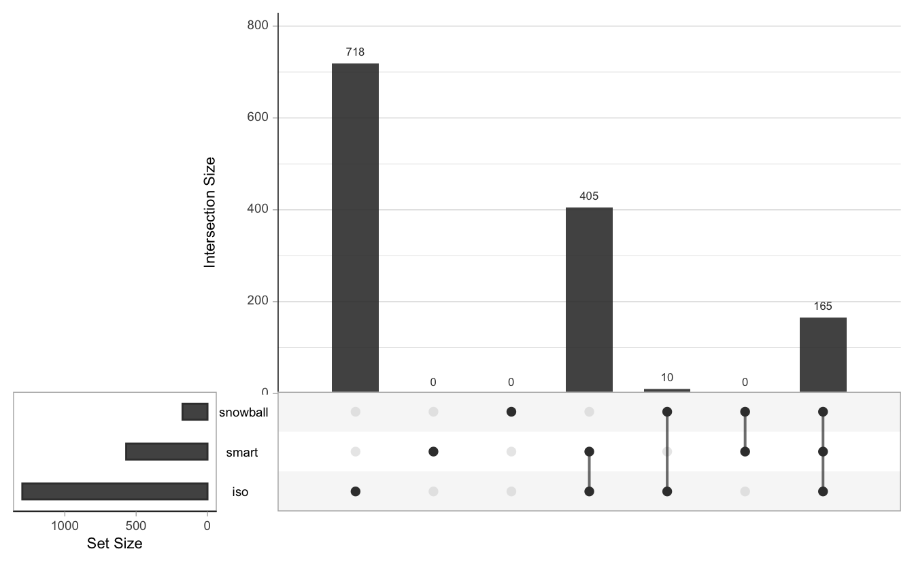
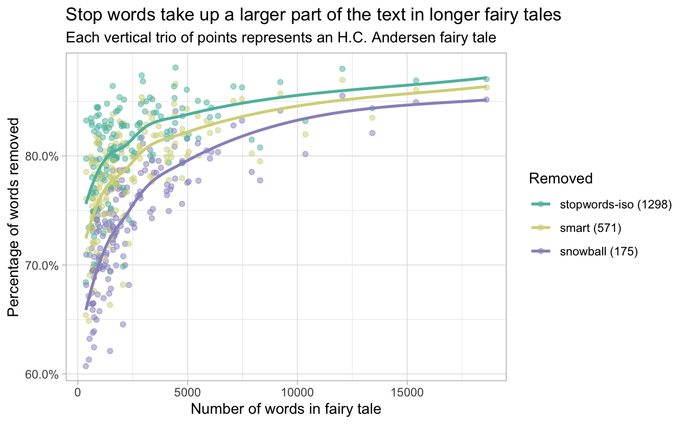

# Stop words {#stopwords}

Once we have split text into tokens, it often becomes clear that not all words carry the same amount of information, if any information at all, for a predictive modeling task. Common words that carry little (or perhaps no) meaningful information are called **stop words**. It is common advice and practice to remove stop words for various NLP tasks, but the task of stop word removal is more nuanced than many resources may lead you to believe. In this chapter, we will investigate what a stop word list is, the differences between them, and the effects of using them in your preprocessing workflow.

The concept of stop words has a long history with Hans Peter Luhn credited with coining the term in 1960 [@Luhn1960]. Examples of these words in English are "a", "the", "of", and "didn't". These words are very common and typically don't add much to the meaning of a text but instead ensure the structure of a sentence is sound. 

<div class="rmdnote">
<p>Categorizing words as either informative or non-informative is limiting, and we prefer to consider words as having a more fluid or continuous amount of information associated with them. This informativeness is context-specific as well. In fact, stop words themselves are often important in genre or authorship identification.</p>
</div>

Historically, one of the main reasons for removing stop words was to decrease the computational time for text mining; it can be regarded as a dimensionality reduction of text data and was commonly used in search engines to give better results [@Huston2010].

Stop words can have different roles in a corpus. We generally categorize stop words into three groups: global, subject, and document stop words. 

Global stop words are words that are almost always low in meaning in a given language; these are words such as "of" and "and" in English which are needed to glue text together. These words are likely a safe bet for removal but they are small in number. You can find some global stop words in pre-made stop word lists (Section \@ref(premadestopwords)).

Next up are subject-specific stop words. These words are uninformative for a given subject area. Subjects can be broad like finance and medicine or can be more specific like obituaries, health code violations, and job listings for librarians in Kansas.
Words like "bath", "bedroom", and "entryway" are generally not considered stop words in English, but they may not provide much information for differentiating suburban house listings and could be subject stop words for certain analysis. You will likely need to manually construct such a stop word list (Section \@ref(homemadestopwords)). These kinds of stop words may improve your performance if you have the domain expertise to create a good list.

Lastly, we have document level stop words. These words do not provide any or much information for a given document. These are difficult to classify and won't be worth the trouble to identify. Even if you can find document stop words, it is not obvious how to incorporate this kind of information in a regression or classification task.

## Using premade stop word lists {#premadestopwords}

A quick option for using stop words is to get a list that has already been created. This is appealing because it is not difficult, but be aware that not all lists are created equal. @nothman-etal-2018-stop found some alarming results in a study of 52 stop word lists available in open-source software packages. Among some of the more grave issues were misspellings ("fify" instead of "fifty"), the inclusion of clearly informative words such as "computer" and "cry", and internal inconsistencies such as including the word "has" but not the word "does". This is not to say that you should never use a stop word list that has been included in an open-source software project. However, you should always inspect and verify the list you are using, both to make sure it hasn't changed since you used it last, and also to check that it is appropriate for your use case.

There is a broad selection of stop word lists available today. For the purpose of this chapter, we will focus on three of the lists of English stop words provided by the **stopwords** package [@R-stopwords]. The first is from the SMART (System for the Mechanical Analysis and Retrieval of Text) Information Retrieval System, an information retrieval system developed at Cornell University in the 1960s [@Lewis2014]. The second is the English Snowball stop word list [@porter2001snowball], and the last is the English list from the [Stopwords ISO](https://github.com/stopwords-iso/stopwords-iso) collection. These stop word lists are all considered general purpose and not domain-specific.

Before we start delving into the content inside the lists, let's take a look at how many words are included in each.


```r
library(stopwords)
length(stopwords(source = "smart"))
length(stopwords(source = "snowball"))
length(stopwords(source = "stopwords-iso"))
```

```
#> [1] 571
#> [1] 175
#> [1] 1298
```

The lengths of these lists are quite different, with the longest list being over seven times longer than the shortest! Let's examine the overlap of the words that appear in the three lists in an UpSet plot in Figure \@ref(fig:stopwordoverlap). An UpSet plot [@Lex2014] visualizes intersections and aggregates of intersections of sets using a matrix layout, presenting the number of elements as well as summary statistics.

<div class="figure" style="text-align: center">

<p class="caption">(\#fig:stopwordoverlap)Set intersections for three common stop word lists visualized as an UpSet plot</p>
</div>

The UpSet plot in Figure \@ref(fig:stopwordoverlap) shows us that these three lists are almost true subsets of each other. The only exception is a set of ten words that appear in Snowball and ISO but not in the SMART list. What are those words?


```r
setdiff(stopwords(source = "snowball"),
        stopwords(source = "smart"))
```

```
#>  [1] "she's"   "he'd"    "she'd"   "he'll"   "she'll"  "shan't"  "mustn't"
#>  [8] "when's"  "why's"   "how's"
```

All these words are contractions. This is *not* because the SMART lexicon doesn't include contractions; if we look, there are almost fifty of them.


```r
str_subset(stopwords(source = "smart"), "'")
```

```
#>  [1] "a's"       "ain't"     "aren't"    "c'mon"     "c's"       "can't"    
#>  [7] "couldn't"  "didn't"    "doesn't"   "don't"     "hadn't"    "hasn't"   
#> [13] "haven't"   "he's"      "here's"    "i'd"       "i'll"      "i'm"      
#> [19] "i've"      "isn't"     "it'd"      "it'll"     "it's"      "let's"    
#> [25] "shouldn't" "t's"       "that's"    "there's"   "they'd"    "they'll"  
#> [31] "they're"   "they've"   "wasn't"    "we'd"      "we'll"     "we're"    
#> [37] "we've"     "weren't"   "what's"    "where's"   "who's"     "won't"    
#> [43] "wouldn't"  "you'd"     "you'll"    "you're"    "you've"
```

We seem to have stumbled upon an inconsistency; why does SMART include `"he's"` but not `"she's"`? It is hard to say, but this could be worth rectifying before applying these stop word lists to an analysis or model preprocessing. This stop word list was likely generated by selecting the most frequent words across a large corpus of text that had more representation for text about men than women. This is once again a reminder that we should always look carefully at any pre-made word list or another artifact we use to make sure it works well with our needs^[This advice applies to any kind of pre-made lexicon or word list, not just stop words. For instance, the same concerns apply to sentiment lexicons. The NRC sentiment lexicon of @Mohammad13 associates the word "white" with trust and the word "black" with sadness, which could have unintended consequences when analyzing text about racial groups.]. 

<div class="rmdwarning">
<p>It is perfectly acceptable to start with a premade word list and remove or append additional words according to your particular use case.</p>
</div>

When you select a stop word list, it is important that you consider its size and breadth. Having a small and concise list of words can moderately reduce your token count while not having too great of an influence on your models, assuming that you picked appropriate words. As the size of your stop word list grows, each word added will have a diminishing positive effect with the increasing risk that a meaningful word has been placed on the list by mistake. In Section \@ref(casestudystopwords), we show the effects of different stop word lists on model training.

### Stop word removal in R

Now that we have seen stop word lists, we can move forward with removing these words. The particular way we remove stop words depends on the shape of our data. If you have your text in a tidy format with one word per row, you can use `filter()` from **dplyr** with a negated `%in%` if you have the stop words as a vector, or you can use `anti_join()` from **dplyr** if the stop words are in a `tibble()`. Like in our previous chapter, let's examine the text of "The Fir-Tree" by Hans Christian Andersen, and use **tidytext** to tokenize the text into words.


```r
library(hcandersenr)
library(tidyverse)
library(tidytext)

fir_tree <- hca_fairytales() %>%
  filter(book == "The fir tree",
         language == "English")

tidy_fir_tree <- fir_tree %>%
  unnest_tokens(word, text)
```

Let's use the Snowball stop word list as an example. Since the stop words return from this function as a vector, we will use `filter()`.


```r
tidy_fir_tree %>%
  filter(!(word %in% stopwords(source = "snowball")))
```

```
#> # A tibble: 1,547 x 3
#>    book         language word   
#>    <chr>        <chr>    <chr>  
#>  1 The fir tree English  far    
#>  2 The fir tree English  forest 
#>  3 The fir tree English  warm   
#>  4 The fir tree English  sun    
#>  5 The fir tree English  fresh  
#>  6 The fir tree English  air    
#>  7 The fir tree English  made   
#>  8 The fir tree English  sweet  
#>  9 The fir tree English  resting
#> 10 The fir tree English  place  
#> # … with 1,537 more rows
```

If we use the `get_stopwords()` function from **tidytext** instead, then we can use the `anti_join()` function.


```r
tidy_fir_tree %>%
  anti_join(get_stopwords(source = "snowball"))
```

```
#> # A tibble: 1,547 x 3
#>    book         language word   
#>    <chr>        <chr>    <chr>  
#>  1 The fir tree English  far    
#>  2 The fir tree English  forest 
#>  3 The fir tree English  warm   
#>  4 The fir tree English  sun    
#>  5 The fir tree English  fresh  
#>  6 The fir tree English  air    
#>  7 The fir tree English  made   
#>  8 The fir tree English  sweet  
#>  9 The fir tree English  resting
#> 10 The fir tree English  place  
#> # … with 1,537 more rows
```

The result of these two stop word removals is the same since we used the same stop word list in both cases.

## Creating your own stop words list {#homemadestopwords}

Another way to get a stop word list is to create one yourself. Let's explore a few different ways to find appropriate words to use. We will use the tokenized data from "The Fir-Tree" as a first example. Let's take the words and rank them by their count or frequency.


```{=html}
<div style="column-count:5;font-size:11pt;line-height:11.5pt">
<p>1: the</p>
<p>2: and</p>
<p>3: tree</p>
<p>4: it</p>
<p>5: a</p>
<p>6: in</p>
<p>7: of</p>
<p>8: to</p>
<p>9: i</p>
<p>10: was</p>
<p>11: they</p>
<p>12: fir</p>
<p>13: were</p>
<p>14: all</p>
<p>15: with</p>
<p>16: but</p>
<p>17: on</p>
<p>18: then</p>
<p>19: had</p>
<p>20: is</p>
<p>21: at</p>
<p>22: little</p>
<p>23: so</p>
<p>24: not</p>
<p>25: said</p>
<p>26: what</p>
<p>27: as</p>
<p>28: that</p>
<p>29: he</p>
<p>30: you</p>
<p>31: its</p>
<p>32: out</p>
<p>33: be</p>
<p>34: them</p>
<p>35: this</p>
<p>36: branches</p>
<p>37: came</p>
<p>38: for</p>
<p>39: now</p>
<p>40: one</p>
<p>41: story</p>
<p>42: would</p>
<p>43: forest</p>
<p>44: have</p>
<p>45: how</p>
<p>46: know</p>
<p>47: thought</p>
<p>48: mice</p>
<p>49: trees</p>
<p>50: we</p>
<p>51: been</p>
<p>52: down</p>
<p>53: oh</p>
<p>54: very</p>
<p>55: when</p>
<p>56: where</p>
<p>57: who</p>
<p>58: children</p>
<p>59: dumpty</p>
<p>60: humpty</p>
<p>61: or</p>
<p>62: shall</p>
<p>63: there</p>
<p>64: while</p>
<p>65: will</p>
<p>66: after</p>
<p>67: by</p>
<p>68: come</p>
<p>69: happy</p>
<p>70: my</p>
<p>71: old</p>
<p>72: only</p>
<p>73: their</p>
<p>74: which</p>
<p>75: again</p>
<p>76: am</p>
<p>77: are</p>
<p>78: beautiful</p>
<p>79: evening</p>
<p>80: him</p>
<p>81: like</p>
<p>82: me</p>
<p>83: more</p>
<p>84: about</p>
<p>85: christmas</p>
<p>86: do</p>
<p>87: fell</p>
<p>88: fresh</p>
<p>89: from</p>
<p>90: here</p>
<p>91: last</p>
<p>92: much</p>
<p>93: no</p>
<p>94: princess</p>
<p>95: tall</p>
<p>96: young</p>
<p>97: asked</p>
<p>98: can</p>
<p>99: could</p>
<p>100: cried</p>
<p>101: going</p>
<p>102: grew</p>
<p>103: if</p>
<p>104: large</p>
<p>105: looked</p>
<p>106: made</p>
<p>107: many</p>
<p>108: seen</p>
<p>109: stairs</p>
<p>110: think</p>
<p>111: too</p>
<p>112: up</p>
<p>113: yes</p>
<p>114: air</p>
<p>115: also</p>
<p>116: away</p>
<p>117: birds</p>
<p>118: corner</p>
<p>119: cut</p>
<p>120: did</p>
</div>
```

We recognize many of what we would consider stop words in the first column here, with three big exceptions. We see `"tree"` at 3, `"fir"` at 12 and `"little"` at 22. These words appear high on our list but they do provide valuable information as they all reference the main character. What went wrong with this approach? Creating a stop word list using high-frequency words works best when it is created on a **corpus** of documents, not an individual document. This is because the words found in a single document will be document specific and the overall pattern of words will not generalize that well. 

<div class="rmdnote">
<p>In NLP, a corpus is a set of texts or documents. The set of Hans Christian Andersen’s fairy tales can be considered a corpus, with each fairy tale a document within that corpus. The set of United States Supreme Court opinions can be considered a different corpus, with each written opinion being a document within <em>that</em> corpus. Both data sets are described in more detail in Appendix @ref(appendixdata).</p>
</div>

The word `"tree"` does seem important as it is about the main character, but it could also be appearing so often that it stops providing any information. Let's try a different approach, extracting high-frequency words from the corpus of *all* English fairy tales by H.C. Andersen.


```{=html}
<div style="column-count:5;font-size:11pt;line-height:11.5pt">
<p>1: the</p>
<p>2: and</p>
<p>3: of</p>
<p>4: a</p>
<p>5: to</p>
<p>6: in</p>
<p>7: was</p>
<p>8: it</p>
<p>9: he</p>
<p>10: that</p>
<p>11: i</p>
<p>12: she</p>
<p>13: had</p>
<p>14: his</p>
<p>15: they</p>
<p>16: but</p>
<p>17: as</p>
<p>18: her</p>
<p>19: with</p>
<p>20: for</p>
<p>21: is</p>
<p>22: on</p>
<p>23: said</p>
<p>24: you</p>
<p>25: not</p>
<p>26: were</p>
<p>27: so</p>
<p>28: all</p>
<p>29: be</p>
<p>30: at</p>
<p>31: one</p>
<p>32: there</p>
<p>33: him</p>
<p>34: from</p>
<p>35: have</p>
<p>36: little</p>
<p>37: then</p>
<p>38: which</p>
<p>39: them</p>
<p>40: this</p>
<p>41: old</p>
<p>42: out</p>
<p>43: could</p>
<p>44: when</p>
<p>45: into</p>
<p>46: now</p>
<p>47: who</p>
<p>48: my</p>
<p>49: their</p>
<p>50: by</p>
<p>51: we</p>
<p>52: will</p>
<p>53: like</p>
<p>54: are</p>
<p>55: what</p>
<p>56: if</p>
<p>57: me</p>
<p>58: up</p>
<p>59: very</p>
<p>60: would</p>
<p>61: no</p>
<p>62: been</p>
<p>63: about</p>
<p>64: over</p>
<p>65: where</p>
<p>66: an</p>
<p>67: how</p>
<p>68: only</p>
<p>69: came</p>
<p>70: or</p>
<p>71: down</p>
<p>72: great</p>
<p>73: good</p>
<p>74: do</p>
<p>75: more</p>
<p>76: here</p>
<p>77: its</p>
<p>78: did</p>
<p>79: man</p>
<p>80: see</p>
<p>81: can</p>
<p>82: through</p>
<p>83: beautiful</p>
<p>84: must</p>
<p>85: has</p>
<p>86: away</p>
<p>87: thought</p>
<p>88: still</p>
<p>89: than</p>
<p>90: well</p>
<p>91: people</p>
<p>92: time</p>
<p>93: before</p>
<p>94: day</p>
<p>95: other</p>
<p>96: stood</p>
<p>97: too</p>
<p>98: went</p>
<p>99: come</p>
<p>100: never</p>
<p>101: much</p>
<p>102: house</p>
<p>103: know</p>
<p>104: every</p>
<p>105: looked</p>
<p>106: many</p>
<p>107: again</p>
<p>108: eyes</p>
<p>109: our</p>
<p>110: quite</p>
<p>111: young</p>
<p>112: even</p>
<p>113: shall</p>
<p>114: tree</p>
<p>115: go</p>
<p>116: your</p>
<p>117: long</p>
<p>118: upon</p>
<p>119: two</p>
<p>120: water</p>
</div>
```

This list is more appropriate for our concept of stop words, and now it is time for us to make some choices. How many do we want to include in our stop word list? Which words should we add and/or remove based on prior information? Selecting the number of words to remove is best done by a case-by-case basis as it can be difficult to determine a priori how many different "meaningless" words appear in a corpus. Our suggestion is to start with a low number like twenty and increase by ten words until you get to words that are not appropriate as stop words for your analytical purpose. 

It is worth keeping in mind that such a list is not perfect. Depending on how your text was generated or processed, strange tokens can surface as possible stop words due to encoding or optical character recognition errors. Further, these results are based on the corpus of documents we have available, which is potentially biased. In our example here, all the fairy tales were written by the same European white man from the early 1800s. 

<div class="rmdnote">
<p>This bias can be minimized by removing words we would expect to be over-represented or to add words we expect to be under-represented.</p>
</div>

Easy examples are to include the complements to the words in the list if they are not already present. Include "big" if "small" is present, "old" if "young" is present. This example list has words associated with women often listed lower in rank than words associated with men. With `"man"` being at rank 79 but `"woman"` at rank 179, choosing a threshold of 100 would lead to only one of these words being included. Depending on how important you think such nouns are going to be in your texts, consider either adding `"woman"` or deleting `"man"`.^[On the other hand, the more biased stop word list may be helpful when modeling a corpus with gender imbalance, depending on your goal; words like "she" and "her" can identify where women are mentioned.]

Figure \@ref(fig:genderrank) shows how the words associated with men have a higher rank than the words associated with women. By using a single threshold to create a stop word list, you would likely only include one form of such words.

<div class="figure" style="text-align: center">

<p class="caption">(\#fig:genderrank)Tokens ranked according to total occurrences, with rank 1 having the most occurrences</p>
</div>

Imagine now we would like to create a stop word list that spans multiple different genres, in such a way that the subject-specific stop words don't overlap. For this case, we would like words to be denoted as a stop word only if it is a stop word in all the genres. You could find the words individually in each genre and use the right intersections. However, that approach might take a substantial amount of time.

Below is a bad approach where we try to create a multi-language list of stop words. To accomplish this we calculate the [*inverse document frequency*](https://www.tidytextmining.com/tfidf.html) (IDF) of each word. The inverse document frequency of a word is a quantity that is low for commonly used words in a collection of documents and high for words not used often in a collection of documents. It is typically defined as

$$idf(\text{term}) = \ln{\left(\frac{n_{\text{documents}}}{n_{\text{documents containing term}}}\right)}$$
If the word "dog" appears in 4 out of 100 documents then it would have an `idf("dog") = log(100/4) = 3.22` and if the word "cat" appears in 99 out of 100 documents then it would have an `idf("cat") = log(100/99) = 0.01`. Notice how the idf values goes to zero (as a matter of fact when a term appears in all the documents then the idf of that word is 0 `log(100/100) = log(1) = 0`), the more documents it is contained in.
What happens if we create a stop word list based on words with the lowest IDF? The following function takes a tokenized dataframe and returns a dataframe with a column for each word and a column for the IDF.


```r
library(rlang)
calc_idf <- function(df, word, document) {
  words <- df %>% pull({{word}}) %>% unique()
  n_docs <- length(unique(pull(df, {{document}})))
  n_words <- df %>%
    nest(data = c({{word}})) %>%
    pull(data) %>%
    map_dfc(~ words %in% unique(pull(.x, {{word}}))) %>%
    rowSums()
  
  tibble(word = words,
         idf = log(n_docs / n_words))
}
```

Here is the result when we try to create a cross-language list of stop words, by taking each fairy tale as a document. It is not very good! 

<div class="rmdnote">
<p>The overlap between words that appear in each language is very small, but these words are what we mostly see in this list.</p>
</div>


```{=html}
<div style="column-count:5;font-size:11pt;line-height:11.5pt">
<p>1: a</p>
<p>2: de</p>
<p>3: man</p>
<p>4: en</p>
<p>5: da</p>
<p>6: se</p>
<p>7: es</p>
<p>8: an</p>
<p>9: in</p>
<p>10: her</p>
<p>11: me</p>
<p>12: so</p>
<p>13: no</p>
<p>14: i</p>
<p>15: for</p>
<p>16: den</p>
<p>17: at</p>
<p>18: der</p>
<p>19: was</p>
<p>20: du</p>
<p>21: er</p>
<p>22: dem</p>
<p>23: over</p>
<p>24: sin</p>
<p>25: he</p>
<p>26: alle</p>
<p>27: ja</p>
<p>28: have</p>
<p>29: to</p>
<p>30: mit</p>
<p>31: all</p>
<p>32: oh</p>
<p>33: will</p>
<p>34: am</p>
<p>35: la</p>
<p>36: sang</p>
<p>37: le</p>
<p>38: des</p>
<p>39: y</p>
<p>40: un</p>
<p>41: que</p>
<p>42: on</p>
<p>43: men</p>
<p>44: stand</p>
<p>45: al</p>
<p>46: si</p>
<p>47: son</p>
<p>48: han</p>
<p>49: ser</p>
<p>50: et</p>
<p>51: lo</p>
<p>52: die</p>
<p>53: just</p>
<p>54: bien</p>
<p>55: vor</p>
<p>56: las</p>
<p>57: del</p>
<p>58: still</p>
<p>59: land</p>
<p>60: under</p>
<p>61: has</p>
<p>62: los</p>
<p>63: by</p>
<p>64: as</p>
<p>65: not</p>
<p>66: end</p>
<p>67: fast</p>
<p>68: hat</p>
<p>69: see</p>
<p>70: but</p>
<p>71: from</p>
<p>72: is</p>
<p>73: and</p>
<p>74: o</p>
<p>75: alt</p>
<p>76: war</p>
<p>77: ni</p>
<p>78: su</p>
<p>79: time</p>
<p>80: von</p>
<p>81: hand</p>
<p>82: the</p>
<p>83: that</p>
<p>84: it</p>
<p>85: of</p>
<p>86: there</p>
<p>87: sit</p>
<p>88: with</p>
<p>89: por</p>
<p>90: el</p>
<p>91: con</p>
<p>92: una</p>
<p>93: be</p>
<p>94: they</p>
<p>95: one</p>
<p>96: como</p>
<p>97: pero</p>
<p>98: them</p>
<p>99: had</p>
<p>100: vi</p>
<p>101: das</p>
<p>102: his</p>
<p>103: les</p>
<p>104: sagte</p>
<p>105: ist</p>
<p>106: ein</p>
<p>107: und</p>
<p>108: zu</p>
<p>109: para</p>
<p>110: sol</p>
<p>111: auf</p>
<p>112: sie</p>
<p>113: nicht</p>
<p>114: aber</p>
<p>115: sich</p>
<p>116: then</p>
<p>117: were</p>
<p>118: said</p>
<p>119: into</p>
<p>120: más</p>
</div>
```

This didn't work very well because there is very little overlap between common words. Instead, let us limit the calculation to only one language and calculate the IDF of each word we can find compared to words that appear in a lot of documents.


```{=html}
<div style="column-count:5;font-size:11pt;line-height:11.5pt">
<p>1: a</p>
<p>2: the</p>
<p>3: and</p>
<p>4: to</p>
<p>5: in</p>
<p>6: that</p>
<p>7: it</p>
<p>8: but</p>
<p>9: of</p>
<p>10: was</p>
<p>11: as</p>
<p>12: there</p>
<p>13: on</p>
<p>14: at</p>
<p>15: is</p>
<p>16: for</p>
<p>17: with</p>
<p>18: all</p>
<p>19: not</p>
<p>20: they</p>
<p>21: one</p>
<p>22: he</p>
<p>23: his</p>
<p>24: so</p>
<p>25: them</p>
<p>26: be</p>
<p>27: from</p>
<p>28: had</p>
<p>29: then</p>
<p>30: were</p>
<p>31: said</p>
<p>32: into</p>
<p>33: by</p>
<p>34: have</p>
<p>35: which</p>
<p>36: this</p>
<p>37: up</p>
<p>38: out</p>
<p>39: what</p>
<p>40: who</p>
<p>41: no</p>
<p>42: an</p>
<p>43: now</p>
<p>44: i</p>
<p>45: only</p>
<p>46: old</p>
<p>47: like</p>
<p>48: when</p>
<p>49: if</p>
<p>50: little</p>
<p>51: over</p>
<p>52: are</p>
<p>53: very</p>
<p>54: you</p>
<p>55: him</p>
<p>56: we</p>
<p>57: great</p>
<p>58: how</p>
<p>59: their</p>
<p>60: came</p>
<p>61: been</p>
<p>62: down</p>
<p>63: would</p>
<p>64: where</p>
<p>65: or</p>
<p>66: she</p>
<p>67: can</p>
<p>68: could</p>
<p>69: about</p>
<p>70: her</p>
<p>71: will</p>
<p>72: time</p>
<p>73: good</p>
<p>74: must</p>
<p>75: my</p>
<p>76: than</p>
<p>77: away</p>
<p>78: more</p>
<p>79: has</p>
<p>80: thought</p>
<p>81: did</p>
<p>82: other</p>
<p>83: still</p>
<p>84: do</p>
<p>85: even</p>
<p>86: before</p>
<p>87: me</p>
<p>88: know</p>
<p>89: much</p>
<p>90: see</p>
<p>91: here</p>
<p>92: well</p>
<p>93: through</p>
<p>94: day</p>
<p>95: too</p>
<p>96: people</p>
<p>97: own</p>
<p>98: come</p>
<p>99: its</p>
<p>100: whole</p>
<p>101: just</p>
<p>102: many</p>
<p>103: never</p>
<p>104: made</p>
<p>105: stood</p>
<p>106: yet</p>
<p>107: looked</p>
<p>108: again</p>
<p>109: say</p>
<p>110: may</p>
<p>111: yes</p>
<p>112: went</p>
<p>113: every</p>
<p>114: each</p>
<p>115: such</p>
<p>116: world</p>
<p>117: some</p>
<p>118: long</p>
<p>119: eyes</p>
<p>120: go</p>
</div>
```

This time we get better results. The list starts with "a", "the", "and", and "to" and continues with many more reasonable choices of stop words. We need to look at these results manually to turn this into a list. We need to go as far down in rank as we are comfortable with. You as a data practitioner are in full control of how you want to create the list. If you don't want to include "little" you are still able to add "are" to your list even though it is lower on the list.

## All stop word lists are context-specific

Context is important in text modeling, so it is important to ensure that the stop word lexicon you use reflects the word space that you are planning on using it in. One common concern to consider is how pronouns bring information to your text. Pronouns are included in many different stop word lists (although inconsistently) but they will often *not* be noise in text data. Similarly, @Bender2021 discuss how a list of about 400 "Dirty, Naughty, Obscene or Otherwise Bad Words" were used to filter and remove text before training a trillion parameter large language model, to protect it from learning offensive language, but the authors point out that in some community contexts, such words are reclaimed or used to describe marginalized identities.

On the other hand, sometimes you will have to add in words yourself, depending on the domain. If you are working with texts for dessert recipes, certain ingredients (sugar, eggs, water) and actions (whisking, baking, stirring) may be frequent enough to pass your stop word threshold, but you may want to keep them as they may be informative. Throwing away "eggs" as a common word would make it harder or downright impossible to determine if certain recipes are vegan or not while whisking and stirring may be fine to remove as distinguishing between recipes that do and don't require a whisk might not be that big of a deal.

## What happens when you remove stop words

We have discussed different ways of finding and removing stop words; now let's see what happens once you do remove them. First, let's explore the impact of the number of words that are included in the list. Figure \@ref(fig:stopwordresults) shows what percentage of words are removed as a function of the number of words in a text. The different colors represent the three different stop word lists we have considered in this chapter.

<div class="figure" style="text-align: center">

<p class="caption">(\#fig:stopwordresults)Proportion of words removed for different stop word lists and different document lengths</p>
</div>

We notice, as we would predict, that larger stop word lists remove more words than shorter stop word lists. In this example with fairy tales, over half of the words have been removed, with the largest list removing over 80% of the words. We observe that shorter texts have a lower percentage of stop words. Since we are looking at fairy tales, this could be explained by the fact that a story has to be told regardless of the length of the fairy tale, so shorter texts are going to be denser with more informative words.

Another problem you may face is dealing with misspellings. 

<div class="rmdwarning">
<p>Most premade stop word lists assume that all the words are spelled correctly.</p>
</div>

Handling misspellings when using premade lists can be done by manually adding common misspellings. You could imagine creating all words that are a certain string distance away from the stop words, but we do not recommend this as you would quickly include informative words this way.

One of the downsides of creating your own stop word lists using frequencies is that you are limited to using words that you have already observed. It could happen that "she'd" is included in your training corpus but the word "he'd" did not reach the threshold. This is a case where you need to look at your words and adjust accordingly. Here the large premade stop word lists can serve as inspiration for missing words.

In Section \@ref(casestudystopwords) we investigate the influence of removing stop words in the context of modeling. Given the right list of words, we see no harm to the model performance, and may even find improvement in due to noise reduction [@Feldman2007].

## Stop words in languages other than English

So far in this chapter, we have focused on English stop words, but English is not representative of every language. The notion of "short" and "long" lists we have used so far are specific to English as a language. You should expect different languages to have a different number of "uninformative" words, and for this number to depend on the morphological richness of a language; lists that contain all possible morphological variants of each stop word could become quite large.

Different languages have different numbers of words in each class of words. An example is how the grammatical case influences the articles used in German. Below are tables showing the use of definite and indefinite articles in German [@germanarticles]. Notice how German nouns have three genders (masculine, feminine, and neuter), which are not uncommon in languages around the world. Articles are almost always considered to be stop words in English as they carry very little information. However, German articles give some indication of the case which can be used when selecting a list of stop words in German, or any other language where the grammatical case is reflected in the text.


```{=html}
<style>html {
  font-family: -apple-system, BlinkMacSystemFont, 'Segoe UI', Roboto, Oxygen, Ubuntu, Cantarell, 'Helvetica Neue', 'Fira Sans', 'Droid Sans', Arial, sans-serif;
}

#kqenozbqfz .gt_table {
  display: table;
  border-collapse: collapse;
  margin-left: auto;
  margin-right: auto;
  color: #333333;
  font-size: 16px;
  font-weight: normal;
  font-style: normal;
  background-color: #FFFFFF;
  width: auto;
  border-top-style: solid;
  border-top-width: 2px;
  border-top-color: #A8A8A8;
  border-right-style: none;
  border-right-width: 2px;
  border-right-color: #D3D3D3;
  border-bottom-style: solid;
  border-bottom-width: 2px;
  border-bottom-color: #A8A8A8;
  border-left-style: none;
  border-left-width: 2px;
  border-left-color: #D3D3D3;
}

#kqenozbqfz .gt_heading {
  background-color: #FFFFFF;
  text-align: center;
  border-bottom-color: #FFFFFF;
  border-left-style: none;
  border-left-width: 1px;
  border-left-color: #D3D3D3;
  border-right-style: none;
  border-right-width: 1px;
  border-right-color: #D3D3D3;
}

#kqenozbqfz .gt_title {
  color: #333333;
  font-size: 125%;
  font-weight: initial;
  padding-top: 4px;
  padding-bottom: 4px;
  border-bottom-color: #FFFFFF;
  border-bottom-width: 0;
}

#kqenozbqfz .gt_subtitle {
  color: #333333;
  font-size: 85%;
  font-weight: initial;
  padding-top: 0;
  padding-bottom: 4px;
  border-top-color: #FFFFFF;
  border-top-width: 0;
}

#kqenozbqfz .gt_bottom_border {
  border-bottom-style: solid;
  border-bottom-width: 2px;
  border-bottom-color: #D3D3D3;
}

#kqenozbqfz .gt_col_headings {
  border-top-style: solid;
  border-top-width: 2px;
  border-top-color: #D3D3D3;
  border-bottom-style: solid;
  border-bottom-width: 2px;
  border-bottom-color: #D3D3D3;
  border-left-style: none;
  border-left-width: 1px;
  border-left-color: #D3D3D3;
  border-right-style: none;
  border-right-width: 1px;
  border-right-color: #D3D3D3;
}

#kqenozbqfz .gt_col_heading {
  color: #333333;
  background-color: #FFFFFF;
  font-size: 100%;
  font-weight: normal;
  text-transform: inherit;
  border-left-style: none;
  border-left-width: 1px;
  border-left-color: #D3D3D3;
  border-right-style: none;
  border-right-width: 1px;
  border-right-color: #D3D3D3;
  vertical-align: bottom;
  padding-top: 5px;
  padding-bottom: 6px;
  padding-left: 5px;
  padding-right: 5px;
  overflow-x: hidden;
}

#kqenozbqfz .gt_column_spanner_outer {
  color: #333333;
  background-color: #FFFFFF;
  font-size: 100%;
  font-weight: normal;
  text-transform: inherit;
  padding-top: 0;
  padding-bottom: 0;
  padding-left: 4px;
  padding-right: 4px;
}

#kqenozbqfz .gt_column_spanner_outer:first-child {
  padding-left: 0;
}

#kqenozbqfz .gt_column_spanner_outer:last-child {
  padding-right: 0;
}

#kqenozbqfz .gt_column_spanner {
  border-bottom-style: solid;
  border-bottom-width: 2px;
  border-bottom-color: #D3D3D3;
  vertical-align: bottom;
  padding-top: 5px;
  padding-bottom: 6px;
  overflow-x: hidden;
  display: inline-block;
  width: 100%;
}

#kqenozbqfz .gt_group_heading {
  padding: 8px;
  color: #333333;
  background-color: #FFFFFF;
  font-size: 100%;
  font-weight: initial;
  text-transform: inherit;
  border-top-style: solid;
  border-top-width: 2px;
  border-top-color: #D3D3D3;
  border-bottom-style: solid;
  border-bottom-width: 2px;
  border-bottom-color: #D3D3D3;
  border-left-style: none;
  border-left-width: 1px;
  border-left-color: #D3D3D3;
  border-right-style: none;
  border-right-width: 1px;
  border-right-color: #D3D3D3;
  vertical-align: middle;
}

#kqenozbqfz .gt_empty_group_heading {
  padding: 0.5px;
  color: #333333;
  background-color: #FFFFFF;
  font-size: 100%;
  font-weight: initial;
  border-top-style: solid;
  border-top-width: 2px;
  border-top-color: #D3D3D3;
  border-bottom-style: solid;
  border-bottom-width: 2px;
  border-bottom-color: #D3D3D3;
  vertical-align: middle;
}

#kqenozbqfz .gt_from_md > :first-child {
  margin-top: 0;
}

#kqenozbqfz .gt_from_md > :last-child {
  margin-bottom: 0;
}

#kqenozbqfz .gt_row {
  padding-top: 8px;
  padding-bottom: 8px;
  padding-left: 5px;
  padding-right: 5px;
  margin: 10px;
  border-top-style: solid;
  border-top-width: 1px;
  border-top-color: #D3D3D3;
  border-left-style: none;
  border-left-width: 1px;
  border-left-color: #D3D3D3;
  border-right-style: none;
  border-right-width: 1px;
  border-right-color: #D3D3D3;
  vertical-align: middle;
  overflow-x: hidden;
}

#kqenozbqfz .gt_stub {
  color: #333333;
  background-color: #FFFFFF;
  font-size: 100%;
  font-weight: initial;
  text-transform: inherit;
  border-right-style: solid;
  border-right-width: 2px;
  border-right-color: #D3D3D3;
  padding-left: 12px;
}

#kqenozbqfz .gt_summary_row {
  color: #333333;
  background-color: #FFFFFF;
  text-transform: inherit;
  padding-top: 8px;
  padding-bottom: 8px;
  padding-left: 5px;
  padding-right: 5px;
}

#kqenozbqfz .gt_first_summary_row {
  padding-top: 8px;
  padding-bottom: 8px;
  padding-left: 5px;
  padding-right: 5px;
  border-top-style: solid;
  border-top-width: 2px;
  border-top-color: #D3D3D3;
}

#kqenozbqfz .gt_grand_summary_row {
  color: #333333;
  background-color: #FFFFFF;
  text-transform: inherit;
  padding-top: 8px;
  padding-bottom: 8px;
  padding-left: 5px;
  padding-right: 5px;
}

#kqenozbqfz .gt_first_grand_summary_row {
  padding-top: 8px;
  padding-bottom: 8px;
  padding-left: 5px;
  padding-right: 5px;
  border-top-style: double;
  border-top-width: 6px;
  border-top-color: #D3D3D3;
}

#kqenozbqfz .gt_striped {
  background-color: rgba(128, 128, 128, 0.05);
}

#kqenozbqfz .gt_table_body {
  border-top-style: solid;
  border-top-width: 2px;
  border-top-color: #D3D3D3;
  border-bottom-style: solid;
  border-bottom-width: 2px;
  border-bottom-color: #D3D3D3;
}

#kqenozbqfz .gt_footnotes {
  color: #333333;
  background-color: #FFFFFF;
  border-bottom-style: none;
  border-bottom-width: 2px;
  border-bottom-color: #D3D3D3;
  border-left-style: none;
  border-left-width: 2px;
  border-left-color: #D3D3D3;
  border-right-style: none;
  border-right-width: 2px;
  border-right-color: #D3D3D3;
}

#kqenozbqfz .gt_footnote {
  margin: 0px;
  font-size: 90%;
  padding: 4px;
}

#kqenozbqfz .gt_sourcenotes {
  color: #333333;
  background-color: #FFFFFF;
  border-bottom-style: none;
  border-bottom-width: 2px;
  border-bottom-color: #D3D3D3;
  border-left-style: none;
  border-left-width: 2px;
  border-left-color: #D3D3D3;
  border-right-style: none;
  border-right-width: 2px;
  border-right-color: #D3D3D3;
}

#kqenozbqfz .gt_sourcenote {
  font-size: 90%;
  padding: 4px;
}

#kqenozbqfz .gt_left {
  text-align: left;
}

#kqenozbqfz .gt_center {
  text-align: center;
}

#kqenozbqfz .gt_right {
  text-align: right;
  font-variant-numeric: tabular-nums;
}

#kqenozbqfz .gt_font_normal {
  font-weight: normal;
}

#kqenozbqfz .gt_font_bold {
  font-weight: bold;
}

#kqenozbqfz .gt_font_italic {
  font-style: italic;
}

#kqenozbqfz .gt_super {
  font-size: 65%;
}

#kqenozbqfz .gt_footnote_marks {
  font-style: italic;
  font-size: 65%;
}
</style>
<div id="kqenozbqfz" style="overflow-x:auto;overflow-y:auto;width:auto;height:auto;"><table class="gt_table">
  <thead class="gt_header">
    <tr>
      <th colspan="5" class="gt_heading gt_title gt_font_normal" style>German Definite Articles (the)</th>
    </tr>
    <tr>
      <th colspan="5" class="gt_heading gt_subtitle gt_font_normal gt_bottom_border" style></th>
    </tr>
  </thead>
  <thead class="gt_col_headings">
    <tr>
      <th class="gt_col_heading gt_columns_bottom_border gt_left" rowspan="1" colspan="1"></th>
      <th class="gt_col_heading gt_columns_bottom_border gt_left" rowspan="1" colspan="1">Masculine</th>
      <th class="gt_col_heading gt_columns_bottom_border gt_left" rowspan="1" colspan="1">Feminine</th>
      <th class="gt_col_heading gt_columns_bottom_border gt_left" rowspan="1" colspan="1">Neuter</th>
      <th class="gt_col_heading gt_columns_bottom_border gt_left" rowspan="1" colspan="1">Plural</th>
    </tr>
  </thead>
  <tbody class="gt_table_body">
    <tr>
      <td class="gt_row gt_left gt_stub">Nominative</td>
      <td class="gt_row gt_left">der</td>
      <td class="gt_row gt_left">die</td>
      <td class="gt_row gt_left">das</td>
      <td class="gt_row gt_left">die</td>
    </tr>
    <tr>
      <td class="gt_row gt_left gt_stub">Accusative</td>
      <td class="gt_row gt_left">den</td>
      <td class="gt_row gt_left">die</td>
      <td class="gt_row gt_left">das</td>
      <td class="gt_row gt_left">die</td>
    </tr>
    <tr>
      <td class="gt_row gt_left gt_stub">Dative</td>
      <td class="gt_row gt_left">dem</td>
      <td class="gt_row gt_left">der</td>
      <td class="gt_row gt_left">dem</td>
      <td class="gt_row gt_left">den</td>
    </tr>
    <tr>
      <td class="gt_row gt_left gt_stub">Genitive</td>
      <td class="gt_row gt_left">des</td>
      <td class="gt_row gt_left">der</td>
      <td class="gt_row gt_left">des</td>
      <td class="gt_row gt_left">der</td>
    </tr>
  </tbody>
  
  
</table></div>
```


```{=html}
<style>html {
  font-family: -apple-system, BlinkMacSystemFont, 'Segoe UI', Roboto, Oxygen, Ubuntu, Cantarell, 'Helvetica Neue', 'Fira Sans', 'Droid Sans', Arial, sans-serif;
}

#ffqjtedojy .gt_table {
  display: table;
  border-collapse: collapse;
  margin-left: auto;
  margin-right: auto;
  color: #333333;
  font-size: 16px;
  font-weight: normal;
  font-style: normal;
  background-color: #FFFFFF;
  width: auto;
  border-top-style: solid;
  border-top-width: 2px;
  border-top-color: #A8A8A8;
  border-right-style: none;
  border-right-width: 2px;
  border-right-color: #D3D3D3;
  border-bottom-style: solid;
  border-bottom-width: 2px;
  border-bottom-color: #A8A8A8;
  border-left-style: none;
  border-left-width: 2px;
  border-left-color: #D3D3D3;
}

#ffqjtedojy .gt_heading {
  background-color: #FFFFFF;
  text-align: center;
  border-bottom-color: #FFFFFF;
  border-left-style: none;
  border-left-width: 1px;
  border-left-color: #D3D3D3;
  border-right-style: none;
  border-right-width: 1px;
  border-right-color: #D3D3D3;
}

#ffqjtedojy .gt_title {
  color: #333333;
  font-size: 125%;
  font-weight: initial;
  padding-top: 4px;
  padding-bottom: 4px;
  border-bottom-color: #FFFFFF;
  border-bottom-width: 0;
}

#ffqjtedojy .gt_subtitle {
  color: #333333;
  font-size: 85%;
  font-weight: initial;
  padding-top: 0;
  padding-bottom: 4px;
  border-top-color: #FFFFFF;
  border-top-width: 0;
}

#ffqjtedojy .gt_bottom_border {
  border-bottom-style: solid;
  border-bottom-width: 2px;
  border-bottom-color: #D3D3D3;
}

#ffqjtedojy .gt_col_headings {
  border-top-style: solid;
  border-top-width: 2px;
  border-top-color: #D3D3D3;
  border-bottom-style: solid;
  border-bottom-width: 2px;
  border-bottom-color: #D3D3D3;
  border-left-style: none;
  border-left-width: 1px;
  border-left-color: #D3D3D3;
  border-right-style: none;
  border-right-width: 1px;
  border-right-color: #D3D3D3;
}

#ffqjtedojy .gt_col_heading {
  color: #333333;
  background-color: #FFFFFF;
  font-size: 100%;
  font-weight: normal;
  text-transform: inherit;
  border-left-style: none;
  border-left-width: 1px;
  border-left-color: #D3D3D3;
  border-right-style: none;
  border-right-width: 1px;
  border-right-color: #D3D3D3;
  vertical-align: bottom;
  padding-top: 5px;
  padding-bottom: 6px;
  padding-left: 5px;
  padding-right: 5px;
  overflow-x: hidden;
}

#ffqjtedojy .gt_column_spanner_outer {
  color: #333333;
  background-color: #FFFFFF;
  font-size: 100%;
  font-weight: normal;
  text-transform: inherit;
  padding-top: 0;
  padding-bottom: 0;
  padding-left: 4px;
  padding-right: 4px;
}

#ffqjtedojy .gt_column_spanner_outer:first-child {
  padding-left: 0;
}

#ffqjtedojy .gt_column_spanner_outer:last-child {
  padding-right: 0;
}

#ffqjtedojy .gt_column_spanner {
  border-bottom-style: solid;
  border-bottom-width: 2px;
  border-bottom-color: #D3D3D3;
  vertical-align: bottom;
  padding-top: 5px;
  padding-bottom: 6px;
  overflow-x: hidden;
  display: inline-block;
  width: 100%;
}

#ffqjtedojy .gt_group_heading {
  padding: 8px;
  color: #333333;
  background-color: #FFFFFF;
  font-size: 100%;
  font-weight: initial;
  text-transform: inherit;
  border-top-style: solid;
  border-top-width: 2px;
  border-top-color: #D3D3D3;
  border-bottom-style: solid;
  border-bottom-width: 2px;
  border-bottom-color: #D3D3D3;
  border-left-style: none;
  border-left-width: 1px;
  border-left-color: #D3D3D3;
  border-right-style: none;
  border-right-width: 1px;
  border-right-color: #D3D3D3;
  vertical-align: middle;
}

#ffqjtedojy .gt_empty_group_heading {
  padding: 0.5px;
  color: #333333;
  background-color: #FFFFFF;
  font-size: 100%;
  font-weight: initial;
  border-top-style: solid;
  border-top-width: 2px;
  border-top-color: #D3D3D3;
  border-bottom-style: solid;
  border-bottom-width: 2px;
  border-bottom-color: #D3D3D3;
  vertical-align: middle;
}

#ffqjtedojy .gt_from_md > :first-child {
  margin-top: 0;
}

#ffqjtedojy .gt_from_md > :last-child {
  margin-bottom: 0;
}

#ffqjtedojy .gt_row {
  padding-top: 8px;
  padding-bottom: 8px;
  padding-left: 5px;
  padding-right: 5px;
  margin: 10px;
  border-top-style: solid;
  border-top-width: 1px;
  border-top-color: #D3D3D3;
  border-left-style: none;
  border-left-width: 1px;
  border-left-color: #D3D3D3;
  border-right-style: none;
  border-right-width: 1px;
  border-right-color: #D3D3D3;
  vertical-align: middle;
  overflow-x: hidden;
}

#ffqjtedojy .gt_stub {
  color: #333333;
  background-color: #FFFFFF;
  font-size: 100%;
  font-weight: initial;
  text-transform: inherit;
  border-right-style: solid;
  border-right-width: 2px;
  border-right-color: #D3D3D3;
  padding-left: 12px;
}

#ffqjtedojy .gt_summary_row {
  color: #333333;
  background-color: #FFFFFF;
  text-transform: inherit;
  padding-top: 8px;
  padding-bottom: 8px;
  padding-left: 5px;
  padding-right: 5px;
}

#ffqjtedojy .gt_first_summary_row {
  padding-top: 8px;
  padding-bottom: 8px;
  padding-left: 5px;
  padding-right: 5px;
  border-top-style: solid;
  border-top-width: 2px;
  border-top-color: #D3D3D3;
}

#ffqjtedojy .gt_grand_summary_row {
  color: #333333;
  background-color: #FFFFFF;
  text-transform: inherit;
  padding-top: 8px;
  padding-bottom: 8px;
  padding-left: 5px;
  padding-right: 5px;
}

#ffqjtedojy .gt_first_grand_summary_row {
  padding-top: 8px;
  padding-bottom: 8px;
  padding-left: 5px;
  padding-right: 5px;
  border-top-style: double;
  border-top-width: 6px;
  border-top-color: #D3D3D3;
}

#ffqjtedojy .gt_striped {
  background-color: rgba(128, 128, 128, 0.05);
}

#ffqjtedojy .gt_table_body {
  border-top-style: solid;
  border-top-width: 2px;
  border-top-color: #D3D3D3;
  border-bottom-style: solid;
  border-bottom-width: 2px;
  border-bottom-color: #D3D3D3;
}

#ffqjtedojy .gt_footnotes {
  color: #333333;
  background-color: #FFFFFF;
  border-bottom-style: none;
  border-bottom-width: 2px;
  border-bottom-color: #D3D3D3;
  border-left-style: none;
  border-left-width: 2px;
  border-left-color: #D3D3D3;
  border-right-style: none;
  border-right-width: 2px;
  border-right-color: #D3D3D3;
}

#ffqjtedojy .gt_footnote {
  margin: 0px;
  font-size: 90%;
  padding: 4px;
}

#ffqjtedojy .gt_sourcenotes {
  color: #333333;
  background-color: #FFFFFF;
  border-bottom-style: none;
  border-bottom-width: 2px;
  border-bottom-color: #D3D3D3;
  border-left-style: none;
  border-left-width: 2px;
  border-left-color: #D3D3D3;
  border-right-style: none;
  border-right-width: 2px;
  border-right-color: #D3D3D3;
}

#ffqjtedojy .gt_sourcenote {
  font-size: 90%;
  padding: 4px;
}

#ffqjtedojy .gt_left {
  text-align: left;
}

#ffqjtedojy .gt_center {
  text-align: center;
}

#ffqjtedojy .gt_right {
  text-align: right;
  font-variant-numeric: tabular-nums;
}

#ffqjtedojy .gt_font_normal {
  font-weight: normal;
}

#ffqjtedojy .gt_font_bold {
  font-weight: bold;
}

#ffqjtedojy .gt_font_italic {
  font-style: italic;
}

#ffqjtedojy .gt_super {
  font-size: 65%;
}

#ffqjtedojy .gt_footnote_marks {
  font-style: italic;
  font-size: 65%;
}
</style>
<div id="ffqjtedojy" style="overflow-x:auto;overflow-y:auto;width:auto;height:auto;"><table class="gt_table">
  <thead class="gt_header">
    <tr>
      <th colspan="4" class="gt_heading gt_title gt_font_normal" style>German Indefinite Articles (a/an)</th>
    </tr>
    <tr>
      <th colspan="4" class="gt_heading gt_subtitle gt_font_normal gt_bottom_border" style></th>
    </tr>
  </thead>
  <thead class="gt_col_headings">
    <tr>
      <th class="gt_col_heading gt_columns_bottom_border gt_left" rowspan="1" colspan="1"></th>
      <th class="gt_col_heading gt_columns_bottom_border gt_left" rowspan="1" colspan="1">Masculine</th>
      <th class="gt_col_heading gt_columns_bottom_border gt_left" rowspan="1" colspan="1">Feminine</th>
      <th class="gt_col_heading gt_columns_bottom_border gt_left" rowspan="1" colspan="1">Neuter</th>
    </tr>
  </thead>
  <tbody class="gt_table_body">
    <tr>
      <td class="gt_row gt_left gt_stub">Nominative</td>
      <td class="gt_row gt_left">ein</td>
      <td class="gt_row gt_left">eine</td>
      <td class="gt_row gt_left">ein</td>
    </tr>
    <tr>
      <td class="gt_row gt_left gt_stub">Accusative</td>
      <td class="gt_row gt_left">einen</td>
      <td class="gt_row gt_left">eine</td>
      <td class="gt_row gt_left">ein</td>
    </tr>
    <tr>
      <td class="gt_row gt_left gt_stub">Dative</td>
      <td class="gt_row gt_left">einem</td>
      <td class="gt_row gt_left">einer</td>
      <td class="gt_row gt_left">einem</td>
    </tr>
    <tr>
      <td class="gt_row gt_left gt_stub">Genitive</td>
      <td class="gt_row gt_left">eines</td>
      <td class="gt_row gt_left">einer</td>
      <td class="gt_row gt_left">eines</td>
    </tr>
  </tbody>
  
  
</table></div>
```

Building lists of stop words in Chinese has been done both manually and automatically [@Zou2006ACC] but so far none has been accepted as a standard [@Zou2006]. A full discussion of stop word identification in Chinese text would be out of scope for this book, so we will just highlight some of the challenges that differentiate it from English. 

<div class="rmdwarning">
<p>Chinese text is much more complex than portrayed here. With different systems and billions of users, there is much we won’t be able to touch on here.</p>
</div>

The main difference from English is the use of logograms instead of letters to convey information. However, Chinese characters should not be confused with Chinese words. The majority of words in modern Chinese are composed of multiple characters. This means that inferring the presence of words is more complicated and the notion of stop words will affect how this segmentation of characters is done.

## Summary {#stopwordssummary}

In many standard NLP workflows, the removal of stop words is presented as a default or the correct choice without comment. Although removing stop words can improve the accuracy of your machine learning using text data, choices around such a step are complex. The content of existing stop word lists varies tremendously, and the available strategies for building your own can have subtle to not-so-subtle effects on your model results.

### In this chapter, you learned:

- what a stop word is and how to remove stop words from text data
- how different stop word lists can vary
- that the impact of stop word removal is different for different kinds of texts
- about the bias built in to stop word lists and strategies for building such lists
