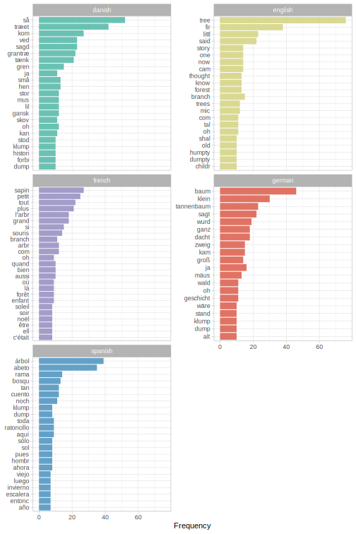
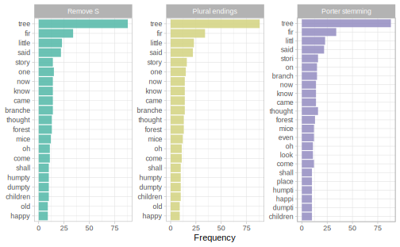
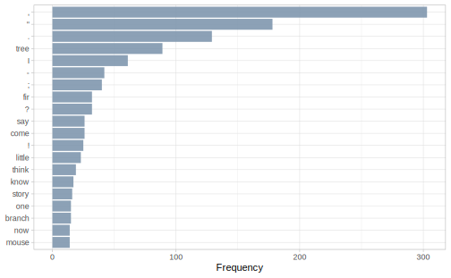

# Stemming {#stemming}

When we deal with text, often documents contain different versions of one base word, often called a *stem*. "The Fir-Tree", for example, contains more than one version (i.e., inflected form) of the word `"tree"`.


```r
library(hcandersenr)
library(tidyverse)
library(tidytext)

fir_tree <- hca_fairytales() %>%
  filter(book == "The fir tree",
         language == "English")

tidy_fir_tree <- fir_tree %>%
  unnest_tokens(word, text) %>%
  anti_join(get_stopwords())

tidy_fir_tree %>%
  count(word, sort = TRUE) %>%
  filter(str_detect(word, "^tree"))
```

```
#> # A tibble: 3 x 2
#>   word       n
#>   <chr>  <int>
#> 1 tree      76
#> 2 trees     12
#> 3 tree's     1
```

Trees, we see once again, are important in this story; the singular form appears 76 times and the plural form appears twelve times. (We'll come back to how we might handle the apostrophe in `"tree's"` later in this chapter.)

What if we aren't interested in the difference between `"trees"` and `"tree"` \index{singular versus plural}and we want to treat both together? That idea is at the heart of *stemming*, the process of identifying the base word (or stem) for a data set of words. Stemming is concerned with the linguistics subfield of morphology\index{morphology}, how words are formed. In this example, `"trees"` would lose its letter `"s"` while `"tree"` stays the same. If we counted word frequencies again after stemming, we would find that there are 88 occurrences of the stem `"tree"` (89, if we also find the stem for `"tree's"`).

## How to stem text in R

There have been many algorithms built for stemming words over the past half century or so; we'll focus on two approaches. \index{stemming algorithm!Porter}The first is the stemming algorithm of @Porter80, probably the most widely used stemmer for English. Porter himself released the algorithm implemented in the framework [Snowball](https://snowballstem.org/) with an open-source license; you can use it from R via the **SnowballC** package [@R-SnowballC]. (It has been extended to languages other than English as well.)


```r
library(SnowballC)

tidy_fir_tree %>%
  mutate(stem = wordStem(word)) %>%
  count(stem, sort = TRUE)
```

```
#> # A tibble: 570 x 2
#>    stem        n
#>    <chr>   <int>
#>  1 tree       88
#>  2 fir        34
#>  3 littl      23
#>  4 said       22
#>  5 stori      16
#>  6 thought    16
#>  7 branch     15
#>  8 on         15
#>  9 came       14
#> 10 know       14
#> # … with 560 more rows
```

Take a look at those stems. Notice that we do now have 88 incidences of `"tree"`. Also notice that some words don't look like they are spelled as real words; this is normal and expected with this stemming algorithm. The Porter algorithm identifies the stem of both `"story"` and `"stories"` as `"stori"`, not a regular English word but instead a special stem object.

\BeginKnitrBlock{rmdnote}<div class="rmdnote">If you want to tokenize *and* stem your text data, you can try out the function `tokenize_word_stems()` from the tokenizers package, which implements Porter stemming just like what we demonstrated here. For more on tokenization, see Chapter \@ref(tokenization).
</div>\EndKnitrBlock{rmdnote}

Does Porter stemming\index{stemming algorithm!Porter} only work for English? Far from it! We can use the `language` argument to implement Porter stemming in multiple languages.\index{language!Non-English} First we can tokenize the text and `nest()` into list-columns.


```r
stopword_df <- tribble(~language, ~two_letter,
                       "danish",  "da",
                       "english", "en",
                       "french",  "fr",
                       "german",  "de",
                       "spanish", "es")

tidy_by_lang <- hca_fairytales() %>%
  filter(book == "The fir tree") %>%
  select(text, language) %>%
  mutate(language = str_to_lower(language)) %>%
  unnest_tokens(word, text) %>%
  nest(data = word)
```

Then we can remove stop words (using `get_stopwords(language = "da")` and similar for each language) and stem with the language-specific Porter algorithm. What are the top 20 stems for "The Fir-Tree" in each of these five languages, after removing the Snowball stop words\index{stop word lists!Snowball} for that language?


```r
tidy_by_lang %>%
  inner_join(stopword_df) %>%
  mutate(data = map2(
    data, two_letter, ~ anti_join(.x, get_stopwords(language = .y)))
  ) %>%
  unnest(data) %>%
  mutate(stem = wordStem(word, language = language)) %>%
  group_by(language) %>%
  count(stem) %>%
  top_n(20, n) %>%
  ungroup %>%
  ggplot(aes(n, fct_reorder(stem, n), fill = language)) +
  geom_col(show.legend = FALSE) +
  facet_wrap(~language, scales = "free_y", ncol = 2) +
  labs(x = "Frequency", y = NULL)
```

<div class="figure" style="text-align: center">

<p class="caption">(\#fig:porterlanguages)Porter stemming results in five languages</p>
</div>

Figure \@ref(fig:porterlanguages) demonstrates some of the challenges in working with languages other English\index{preprocessing!challenges}\index{language!Non-English}; the stop word lists may not be even from language to language, and tokenization strategies that work for a language like English may struggle for a language like French with more stop word contractions. Given that, we see here words about little fir trees at the top for all languages, in their stemmed forms.

\index{stemming algorithm!Porter}The Porter stemmer is an algorithm that starts with a word and ends up with a single stem, but that's not the only kind of stemmer out there. Another class of stemmer are dictionary-based stemmers. One such stemmer is the stemming algorithm of the [Hunspell](http://hunspell.github.io/) library.\index{stemming algorithm!Hunspell} The "Hun" in Hunspell stands for Hungarian; this set of NLP algorithms was originally written to handle Hungarian but has since been extended to handle many languages with compound words and complicated morphology.\index{language!Non-English} The Hunspell library is used mostly as a spell checker, but as part of identifying correct spellings, this library identifies word stems as well. You can use the Hunspell library from R via the **hunspell** [@R-hunspell] package.


```r
library(hunspell)

tidy_fir_tree %>%
  mutate(stem = hunspell_stem(word)) %>%
  unnest(stem) %>%
  count(stem, sort = TRUE)
```

```
#> # A tibble: 595 x 2
#>    stem       n
#>    <chr>  <int>
#>  1 tree      89
#>  2 fir       34
#>  3 little    23
#>  4 said      22
#>  5 story     16
#>  6 branch    15
#>  7 one       15
#>  8 came      14
#>  9 know      14
#> 10 now       14
#> # … with 585 more rows
```

Notice that the code here is a little different (we had to use `unnest()`) and that the results are a little different. We have only real English words, and we have more total rows in the result. What happened?


```r
hunspell_stem("discontented")
```

```
#> [[1]]
#> [1] "contented" "content"
```

\index{stemming algorithm!Hunspell}We have *two* stems! This stemmer works differently; it uses both morphological analysis of a word and existing dictionaries to find possible stems. It's possible to end up with more than one, and it's possible for a stem to be a word that is not related by meaning to the original word. For example, one of the stems of "number" is "numb" with this library. The Hunspell library was built to be a spell checker, so depending on your analytical purposes, it may not be an appropriate choice.

## Should you use stemming at all?

You will often see stemming as part of NLP pipelines, sometimes without much comment about when it is helpful or not. We encourage you to think of stemming as a preprocessing\index{preprocessing}  step in text modeling, one that must be thought through and chosen (or not) with good judgment.

Why does stemming often help, if you are training a machine learning model for text? Stemming *reduces the feature space* of text data. Let's see this in action, with a data set of United States Supreme Court opinions available in the **scotus** package, discussed in more detail in Section \@ref(scotus-opinions). How many words are there, after removing a standard data set of stopwords?


```r
library(scotus)

tidy_scotus <- scotus_filtered %>%
  unnest_tokens(word, text) %>%
  anti_join(get_stopwords())

tidy_scotus %>%
  count(word, sort = TRUE)
```

```
#> # A tibble: 167,879 x 2
#>    word        n
#>    <chr>   <int>
#>  1 court  286448
#>  2 v      204176
#>  3 state  148320
#>  4 states 128160
#>  5 case   121439
#>  6 act    111033
#>  7 s.ct   108168
#>  8 u.s    106413
#>  9 upon   105069
#> 10 united 103267
#> # … with 167,869 more rows
```

There are 167,879 distinct words in this data set we have created (after removing stopwords) but notice that even in the most common words we see a pair like `"state"` and `"states"`. A common data structure for modeling, and a helpful mental model for thinking about the sparsity of text data, is a matrix.\index{matrix!sparse}  Let's `cast()` this tidy data to a sparse matrix, technically, a document-feature matrix object from the **quanteda** [@R-quanteda] package.


```r
tidy_scotus %>%
  count(case_name, word) %>%
  cast_dfm(case_name, word, n)
```

```
#> Document-feature matrix of: 9,642 documents, 167,879 features (99.49% sparse) and 0 docvars.
```

Look at the sparsity of this matrix. It's high! Think of this sparsity as the sparsity of data that we will want to use to build a supervised machine learning model.

What if instead we use stemming as a preprocessing step here?


```r
tidy_scotus %>%
  mutate(stem = wordStem(word)) %>%
  count(case_name, stem) %>%
  cast_dfm(case_name, stem, n)
```

```
#> Document-feature matrix of: 9,642 documents, 135,570 features (99.48% sparse) and 0 docvars.
```

We reduced the number of word features by many thousands, although the sparsity did not change much. Why is it possibly helpful to reduce the number of features? Common sense says that reducing the number of word features in our data set so dramatically will improve the performance of any machine learning model we train with it, *assuming that we haven't lost any important information by stemming*.

\index{preprocessing!challenges}There is a growing body of academic research demonstrating that stemming can be counterproductive for text modeling. For example, @Schofield16 and related work explore how choices around stemming and other preprocessing steps don't help and can actually hurt performance when training topic models for text. From @Schofield16 specifically,

> Despite their frequent use in topic modeling, we find that stemmers produce no meaningful improvement in likelihood and coherence and in fact can degrade topic stability.

Topic modeling is an example of unsupervised machine learning\index{machine learning!unsupervised} for text and is not the same as the predictive modeling approaches we'll be focusing on in this book, but the lesson remains that stemming may or may not be beneficial for any specific context. As we work through the rest of this chapter and learn more about stemming, consider what information we lose when we stem text in exchange for reducing the number of word features. Stemming can be helpful in some contexts, but typical stemming algorithms are somewhat aggressive and have been built to favor sensitivity (or recall, or the true positive rate) at the expense of specificity (or precision, or the true negative rate). 

Most common stemming algorithms you are likely to encounter will successfully reduce words to stems (i.e., not leave extraneous word endings on the words) but at the expense of collapsing some words with dramatic differences in meaning, semantics, use, etc. to the same stems. Examples of the latter are numerous, but some include:

- meaning and mean

- likely, like, liking

- university and universe

In a supervised machine learning context, this affects a model's positive predictive value (precision), or ability to not incorrectly label true negatives as positive. In Chapter \@ref(mlclassification), we will train models to predict whether a complaint to the United States Consumer Financial Protection Bureau was about a mortgage or not. Stemming can increase a model's ability to find the positive examples, i.e., the complaints about mortgages. However, if the complaint text is over-stemmed, the resulting model loses its ability to label the negative examples, the complaints _not_ about mortgages, correctly.

## Understand a stemming algorithm

If stemming is going to be in our NLP toolbox, it's worth sitting down with one approach in detail to understand how it works under the hood. \index{stemming algorithm!Porter}The Porter stemming algorithm is so approachable that we can walk through its outline in less than a page or so. It involves five steps, and the idea of a word **measure**.


Think of any word as made up alternating groups of vowels $V$ and consonants $C$. One or more vowels together are one instance of $V$, and one or more consonants togther are one instance of $C$. We can write any word as

$$[C](VC)^m[V]$$
where $m$ is called the "measure" of the word. The first $C$ and the last $V$ in brackets are optional. In this framework, we could write out the word `"tree"` as

$$CV$$

with $C$ being "tr" and $V$ being "ee"; it's an `m = 0` word. We would write out the word `"algorithms"` as 

$$VCVCVC$$
and it is an `m = 3` word.

- The first step of the Porter stemmer is (perhaps this seems like cheating) actually made of three substeps working with plural and past participle word endings. In the first substep (1a), "sses" is replaced with "ss", "ies" is replaced with "i", and final single "s" letters are removed. The second substep (1b) depends on the measure of the word `m` but works with endings like "eed", "ed", "ing", adding "e" back on to make endings like "ate", "ble", and "ize" when appropriate. The third substep (1c) replaces "y" with "i" for words of a certain `m`.

- The second step of the Porter stemmer takes the output of the first step and regularizes a set of 20 endings. In this step, "ization" goes to "ize", "alism" goes to "al", "aliti" goes to "al" (notice that the ending "i" there came from the first step), and so on for the other 17 endings.

- The third step again processes the output, using a list of seven endings. Here, "ical" and "iciti" both go to "ic", "ful" and "ness" are both removed, and so forth for the three other endings in this step.

- The fourth step involves a longer list of endings to deal with again (19), and they are all removed. Endings like "ent", "ism", "ment", and more are removed in this step.

- The fifth and final step has two substeps, both which depend on the measure `m` of the word. In this step, depending on `m`, final "e" letters are sometimes removed and final double letters are sometimes removed.


<div class="rmdnote">
<p>How would this work for a few example words? The word “supervised” loses its “ed” in step 1b and is not touched by the rest of the algorithm, ending at “supervis”. The word “relational” changes “ational” to “ate” in step 2 and loses its final “e” in step 5, ending at “relat”. Notice that neither of these results are regular English words, but instead special stem objects. This is expected.</p>
</div>

This algorithm was first published in @Porter80 and is still broadly used; read @Willett06 for background on how and why it has become a stemming standard. We can reach even *further* back and examine what is considered the \index{stemming algorithm!Lovins}first ever published stemming algorithm in @Lovins68. The domain Lovins worked in was engineering, so her approach was particularly suited to technical terms. This algorithm uses much larger lists of word endings, conditions, and rules than the Porter algorithm and, although considered old-fashioned, is actually faster!

<div class="rmdwarning">
<p>Check out the <a href="https://snowballstem.org/algorithms/german/stemmer.html">steps of a Snowball stemming algorithm for German</a>.</p>
</div>

\index{stemming algorithm!Snowball}

## Handling punctuation when stemming

Punctuation contains information that can be used in text analysis. Punctuation *is* typically less information-dense than the words themselves and thus it is often removed early in a text mining analysis project, but it's worth thinking through the impact of punctuation specifically on stemming. Think about words like `"they're"` and `"child's"`.

\index{preprocessing!challenges}We've already seen how punctuation and stemming can interact with our small example of "The Fir-Tree"; none of the stemming strategies we've discussed so far have recognized `"tree's"` as belonging to the same stem as `"trees"` and `"tree"`.


```r
tidy_fir_tree %>%
  count(word, sort = TRUE) %>%
  filter(str_detect(word, "^tree"))
```

```
#> # A tibble: 3 x 2
#>   word       n
#>   <chr>  <int>
#> 1 tree      76
#> 2 trees     12
#> 3 tree's     1
```

It is possible to split tokens not only on white space but **also** on punctuation, using a regular expression (see Appendix \@ref(regexp)). 


```r
fir_tree_counts <- fir_tree %>%
  unnest_tokens(word, text, token = "regex", pattern = "\\s+|[[:punct:]]+") %>%
  anti_join(get_stopwords()) %>%
  mutate(stem = wordStem(word)) %>%
  count(stem, sort = TRUE)

fir_tree_counts
```

```
#> # A tibble: 572 x 2
#>    stem        n
#>    <chr>   <int>
#>  1 tree       89
#>  2 fir        34
#>  3 littl      23
#>  4 said       22
#>  5 stori      16
#>  6 thought    16
#>  7 branch     15
#>  8 on         15
#>  9 came       14
#> 10 know       14
#> # … with 562 more rows
```

Now we are able to put all these related words together, having identified them with the same stem.


```r
fir_tree_counts %>%
  filter(str_detect(stem, "^tree"))
```

```
#> # A tibble: 1 x 2
#>   stem      n
#>   <chr> <int>
#> 1 tree     89
```

Handling punctuation in this way further reduces sparsity in word features. Whether this kind of tokenization and stemming strategy is a good choice in any particular data analysis situation depends on the particulars of the text characteristics.

## Compare some stemming options

Let's compare a few simple stemming algorithms and see what results we end with. Let's look at "The Fir-Tree", specifically the tidied data set from which we have removed stop words. Let's compare three very straightforward stemming approaches.

- **Only remove final instances of the letter "s".** This probably strikes you as not a great idea after our discussion in this chapter, but it is something that people try in real life, so let's see what the impact is.\index{singular versus plural}

- **Handle plural endings with slightly more complex rules in the "S" stemmer.** The S-removal stemmer or "S" stemmer of @Harman91 is a simple algorithm with only three rules.^[This simple, "weak" stemmer is handy to have in your toolkit for many applications. Notice how we implement it here using `dplyr::case_when()`.]

- **Implement actual Porter stemming.** We can now compare to the most commonly used stemming algorithm in English.\index{stemming algorithm!Porter}


```r
stemming <- tidy_fir_tree %>%
  select(-book, -language) %>%
  mutate(`Remove S` = str_remove(word, "s$"),
         `Plural endings` = case_when(str_detect(word, "[^e|aies$]ies$") ~
                                        str_replace(word, "ies$", "y"),
                                      str_detect(word, "[^e|a|oes$]es$") ~
                                        str_replace(word, "es$", "e"),
                                      str_detect(word, "[^ss$|us$]s$") ~
                                        str_remove(word, "s$"),
                                      TRUE ~ word),
         `Porter stemming` = wordStem(word)) %>%
  rename(`Original word` = word)
```

Figure \@ref(fig:stemmingresults) shows the results of these stemming strategies. All successfully handled the transition from `"trees"` to `"tree"` in the same way, but we have different results for `"stories"` to `"story"` or `"stori"`, different handling of `"branches"`, and more. There are subtle differences in the output of even these straightforward stemming approaches that can effect the transformation of text features for modeling.


```r
stemming %>%
  gather(Type, Result, `Remove S`:`Porter stemming`) %>%
  mutate(Type = fct_inorder(Type)) %>%
  count(Type, Result) %>%
  group_by(Type) %>%
  top_n(20, n) %>%
  ungroup %>%
  ggplot(aes(fct_reorder(Result, n),
             n, fill = Type)) +
  geom_col(show.legend = FALSE) +
  facet_wrap(~Type, scales = "free_y") +
  coord_flip() +
  labs(x = NULL, y = "Frequency")
```

<div class="figure" style="text-align: center">

<p class="caption">(\#fig:stemmingresults)Results for three different stemming strategies</p>
</div>

\index{stemming algorithm!Porter}Porter stemming is the most different from the other two approaches. In the top twenty words here, we don't see a difference between removing only the letter "s" and taking the slightly more sophisticated "S" stemmer approach to plural endings. In what situations *do* we see a difference?


```r
stemming %>%
  filter(`Remove S` != `Plural endings`) %>%
  distinct(`Remove S`, `Plural endings`, .keep_all = TRUE)
```

```
#> # A tibble: 13 x 4
#>    `Original word` `Remove S`  `Plural endings` `Porter stemming`
#>    <chr>           <chr>       <chr>            <chr>            
#>  1 raspberries     raspberrie  raspberry        raspberri        
#>  2 strawberries    strawberrie strawberry       strawberri       
#>  3 less            les         less             less             
#>  4 us              u           us               u                
#>  5 brightness      brightnes   brightness       bright           
#>  6 conscious       consciou    conscious        consciou         
#>  7 faintness       faintnes    faintness        faint            
#>  8 happiness       happines    happiness        happi            
#>  9 ladies          ladie       lady             ladi             
#> 10 babies          babie       baby             babi             
#> 11 anxious         anxiou      anxious          anxiou           
#> 12 princess        princes     princess         princess         
#> 13 stories         storie      story            stori
```

We also see situations where the same sets of original words are bucketed differently (not just with different stem labels) under different stemming strategies. In the following very small example, two of the strategies bucket these words into two stems while one strategy buckets them into one stem.


```r
stemming %>%
  gather(Type, Result, `Remove S`:`Porter stemming`) %>%
  filter(Result %in% c("come", "coming")) %>%
  distinct(`Original word`, Type, Result)
```

```
#> # A tibble: 9 x 3
#>   `Original word` Type            Result
#>   <chr>           <chr>           <chr> 
#> 1 come            Remove S        come  
#> 2 comes           Remove S        come  
#> 3 coming          Remove S        coming
#> 4 come            Plural endings  come  
#> 5 comes           Plural endings  come  
#> 6 coming          Plural endings  coming
#> 7 come            Porter stemming come  
#> 8 comes           Porter stemming come  
#> 9 coming          Porter stemming come
```

\index{preprocessing!challenges}These different characteristics can either be positive or negative, depending on the nature of the text being modeled and the analytical question being pursued.

<div class="rmdwarning">
<p>Language use is connected to culture and identity. How might the results of stemming strategies be different for text created with the same language (like English) but in different social or cultural contexts, or by people with different identities? With what kind of text do you think stemming algorithms behave most consistently, or most as expected? What impact might that have on text modeling?</p>
</div>


## Lemmatization and stemming {#lemmatization}

\index{lemmas}When people use the word "stemming" in natural language processing, they typically mean a system like the one we've been describing in this chapter, with rules, conditions, heuristics, and lists of word endings. Think of stemming as typically implemented in NLP as **rule-based**, operating on the word by itself. There is another option for normalizing words to a root that takes a different approach. Instead of using rules to cut words down to their stems, lemmatization\index{lemmatization|see {lemmas}} uses knowledge about a language's structure to reduce words down to their lemmas, the canonical or dictionary forms of words. Think of lemmatization as typically implemented in NLP as **linguistics-based**, operating on the word in its context.

Lemmatization requires more information than the rule-based stemmers we've discussed so far. We need to know what part of speech a word\index{part of speech} is to correctly identify its lemma ^[Part-of-speech information is also sometimes used directly in machine learning], and we also need more information about what words mean in their contexts. Often lemmatizers use a rich lexical database like [WordNet](https://wordnet.princeton.edu/) as a way to look up word meanings for a given part-of-speech use [@Miller95]. Notice that lemmatization involves more linguistic knowledge of a language than stemming. 

<div class="rmdnote">
<p>How does lemmatization work in languages other than English? Lookup dictionaries connecting words, lemmas, and parts of speech for languages other than English have been developed as well.</p>
</div>
\index{language!Non-English}

A modern, efficient implementation for lemmatization is available in the excellent [spaCy](https://spacy.io/) library [@spacy2], which is written in Python.\index{Python}

\BeginKnitrBlock{rmdpackage}<div class="rmdpackage">NLP practitioners who work with R can use this library via the **spacyr** package [@Benoit19], the [**cleanNLP**](https://statsmaths.github.io/cleanNLP/) package [@Arnold17], or as an "engine" in the [**textrecipes**](https://textrecipes.tidymodels.org/) package [@textrecipes]. </div>\EndKnitrBlock{rmdpackage}

Section \@ref(mlregressionlemmatization) demonstrates how to use textrecipes with spaCy as an engine and include lemmas as features for modeling. You might also consider using spaCy directly in R Markdown [via its Python engine](https://rstudio.github.io/reticulate/articles/r_markdown.html).\index{Python}

Let's briefly walk through how to use spacyr.


```r
library(spacyr)
spacy_initialize(entity = FALSE)

fir_tree %>%
  mutate(doc_id = paste0("doc", row_number())) %>%
  select(doc_id, everything()) %>%
  spacy_parse() %>%
  anti_join(get_stopwords(), by = c("lemma" = "word")) %>%
  count(lemma, sort = TRUE) %>%
  top_n(20, n) %>%
  ggplot(aes(n, fct_reorder(lemma, n))) +
  geom_col() +
  labs(x = "Frequency", y = NULL)
```

<div class="figure" style="text-align: center">

<p class="caption">(\#fig:lemmafirtree)Results for lemmatization, rather than stemming</p>
</div>

Figure \@ref(fig:lemmafirtree) demonstrates how different lemmatization\index{lemmas} is from stemming, especially if we compare to Figure \@ref(fig:stemmingresults). Punctuation characters are treated as tokens (these punctuation tokens can have predictive power for some modeling questions!) and all pronouns are lemmatized to `-PRON-`. We see our familiar friends "tree" and "fir", but notice that we see the normalized version "say" instead of "said", "come" instead of "came", and similar. This transformation to the canonical or dictionary form of words is the goal of lemmatization.

<div class="rmdnote">
<p>Why did we need to initialize the spaCy library? You may not need to, but spaCy is a full-featured NLP pipeline that not only tokenizes and identifies lemmas but also performs entity recognition. We will not use entity recognition in modeling or analysis in this book and it takes a lot of computational power. Initializing with <code>entity = FALSE</code> will allow lemmatization to run much faster.</p>
</div>

Implementing lemmatization\index{lemmas} is slower and more complex than stemming. Just like with stemming, lemmatization often improves the true positive rate (or recall) but at the expense of the true negative rate (or precision)\index{precision} compared to not using lemmatization, but typically less so than stemming.

## Stemming and stop words

Our deep dive into stemming came *after* our chapters on tokenization (Chapter \@ref(tokenization)) and stop words (Chapter \@ref(stopwords)) because this is typically when you will want to implement stemming, if appropriate to your analytical question. Stop word lists are usually unstemmed, so you need to remove stop words before stemming text data. For example, the \index{stemming algorithm!Porter}Porter stemming algorithm transforms words like `"themselves"` to `"themselv"`, so stemming first would leave you without the ability to match up to the commonly used stop word lexicons.

A handy trick is to use the following function on your stop word list to return the words that don't have a stemmed version in the list. If the function returns a length 0 vector then you can stem and remove stop words in any order.


```r
library(stopwords)
not_stemmed_in <- function(x) {
  x[!SnowballC::wordStem(x) %in% x]
}

not_stemmed_in(stopwords(source = "snowball"))
```

```
#>  [1] "ourselves"  "yourselves" "his"        "they"       "themselves"
#>  [6] "this"       "are"        "was"        "has"        "does"      
#> [11] "you're"     "he's"       "she's"      "it's"       "we're"     
#> [16] "they're"    "i've"       "you've"     "we've"      "they've"   
#> [21] "let's"      "that's"     "who's"      "what's"     "here's"    
#> [26] "there's"    "when's"     "where's"    "why's"      "how's"     
#> [31] "because"    "during"     "before"     "above"      "once"      
#> [36] "any"        "only"       "very"
```

Here we see that many of the words that are lost are the contractions.

\BeginKnitrBlock{rmdwarning}<div class="rmdwarning">In Section \@ref(homemadestopwords), we explored whether to include "tree" as a stop word for "The Fir-Tree". Now we can understand that this is more complicated than we first discussed, because there are different versions of the base word ("trees", "tree's") in our data set. Interactions between preprocessing steps can have a major impact on your analysis.</div>\EndKnitrBlock{rmdwarning}

## Summary {#stemmingsummary}

In this chapter, we explored stemming, the practice of identifying and extracting the base or stem for a word using rules and heuristics. Stemming reduces the sparsity of text data which can be helpful when training models, but at the cost of throwing information away. Lemmatization is another way to normalize words to a root, based on language structure and how words are used in their context.

### In this chapter, you learned:

- about the most broadly used stemming algorithms

- how to implement stemming

- that stemming changes the sparsity or feature space of text data

- the differences between stemming and lemmatization

