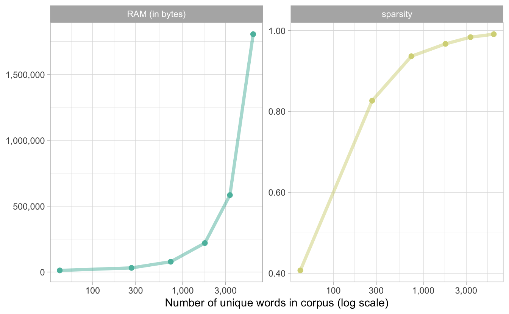
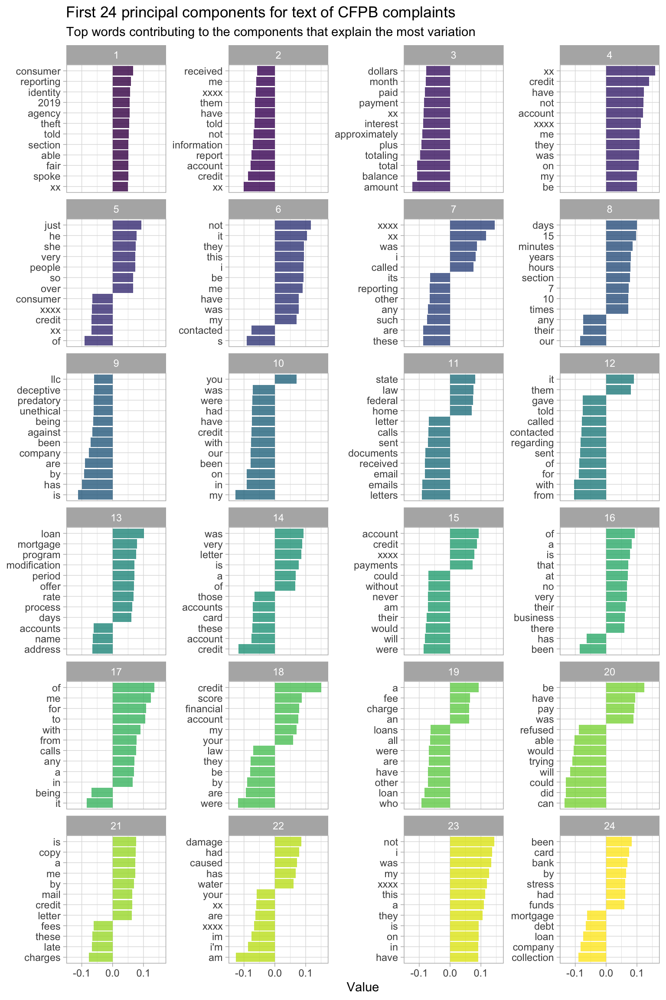

# Word Embeddings {#embeddings}

> You shall know a word by the company it keeps.  
> <footer>--- [John Rupert Firth](https://en.wikiquote.org/wiki/John_Rupert_Firth)</footer>

So far in our discussion of natural language features, we have discussed preprocessing steps such as tokenization, removing stop words, and stemming in detail. We implement these types of preprocessing steps to be able to represent our text data in some data structure that is a good fit for modeling. 

## Motivating embeddings for sparse, high-dimensional data {#motivatingsparse}

What kind of data structure might work well for typical text data? Perhaps, if we wanted to analyse or build a model for consumer complaints to the [United States Consumer Financial Protection Bureau (CFPB)](https://www.consumerfinance.gov/data-research/consumer-complaints/), described in Section \@ref(cfpb-complaints), we would start with straightforward word counts. Let's create a sparse matrix where the matrix elements are the counts of words in each document.


```r
library(tidyverse)
library(tidytext)
library(SnowballC)

complaints <- read_csv("data/complaints.csv.gz")

complaints %>%
  unnest_tokens(word, consumer_complaint_narrative) %>%
  anti_join(get_stopwords(), by = "word") %>%
  mutate(stem = wordStem(word)) %>%
  count(complaint_id, stem) %>%
  cast_dfm(complaint_id, stem, n)
```

```
#> Document-feature matrix of: 117,214 documents, 46,099 features (99.88% sparse) and 0 docvars.
```

<div class="rmdwarning">
<p>A <em>sparse matrix</em> is a matrix where most of the elements are zero. When working with text data, we say our data is “sparse” because most documents do not contain most words, resulting in a representation of mostly zeroes. There are special data structures and algorithms for dealing with sparse data that can take advantage of their structure. For example, an array can more efficiently store the locations and values of only the non-zero elements instead of all elements.</p>
</div>

The data set of consumer complaints used in this book has been filtered to those submitted to the CFPB since 1 January 2019 that include a consumer complaint narrative (i.e., some submitted text).

Another way to represent our text data is to create a sparse matrix where the elements are weighted, rather than straightforward counts only. The *term frequency* of a word is how frequently a word occurs in a document, and the *inverse document frequency* of a word decreases the weight for commonly used words and increases the weight for words that are not used often in a collection of documents. It is typically defined as:

$$idf(\text{term}) = \ln{\left(\frac{n_{\text{documents}}}{n_{\text{documents containing term}}}\right)}$$

These two quantities can be combined to calculate a term's tf-idf (the two quantities multiplied together). This statistic measures the frequency of a term adjusted for how rarely it is used, and it is an example of a weighting scheme that can often work better than counts for predictive modeling with text features. 


```r
complaints %>%
  unnest_tokens(word, consumer_complaint_narrative) %>%
  anti_join(get_stopwords(), by = "word") %>%
  mutate(stem = wordStem(word)) %>%
  count(complaint_id, stem) %>%
  bind_tf_idf(stem, complaint_id, n) %>%
  cast_dfm(complaint_id, stem, tf_idf)
```

```
#> Document-feature matrix of: 117,214 documents, 46,099 features (99.88% sparse) and 0 docvars.
```

Notice that in either case, our final data structure is incredibly sparse and of high dimensionality with a huge number of features. Some modeling algorithms and the libraries which implement them can take advantage of the memory characteristics of sparse matrices for better performance; an example of this is regularized regression implemented in **glmnet** [@Friedman2010]. Some modeling algorithms, including tree-based algorithms, do not perform better with sparse input, and then some libraries are not built to take advantage of sparse data structures, even if it would improve performance for those algorithms. We have some computational tools to take advantage of sparsity, but they don't always solve all the problems that come along with big text data sets.

As the size of a corpus increases in terms of words or other tokens, both the sparsity and RAM required to hold the corpus in memory increase. Figure \@ref(fig:sparsityram) shows how this works out; as the corpus grows, there are more words used just a few times included in the corpus. The sparsity increases and approaches 100%, but even more notably, the memory required to store the corpus increases with the square of the number of tokens.


```r
get_dfm <- function(frac) {
  complaints %>%
    sample_frac(frac) %>%
    unnest_tokens(word, consumer_complaint_narrative) %>%
    anti_join(get_stopwords(), by = "word") %>%
    mutate(stem = wordStem(word)) %>%
    count(complaint_id, stem) %>%
    cast_dfm(complaint_id, stem, n)
}

set.seed(123)
tibble(frac = 2 ^ seq(-16, -6, 2)) %>%
  mutate(dfm = map(frac, get_dfm),
         words = map_dbl(dfm, quanteda::nfeat),
         sparsity = map_dbl(dfm, quanteda::sparsity),
         `RAM (in bytes)` = map_dbl(dfm, lobstr::obj_size)) %>%
  pivot_longer(sparsity:`RAM (in bytes)`, names_to = "measure") %>%
  ggplot(aes(words, value, color = measure)) +
  geom_line(size = 1.5, alpha = 0.5) +
  geom_point(size = 2) +
  facet_wrap(~measure, scales = "free_y") +
  scale_x_log10(labels = scales::label_comma()) +
  scale_y_continuous(labels = scales::label_comma()) +
  theme(legend.position = "none") +
  labs(x = "Number of unique words in corpus (log scale)",
       y = NULL)
```

<div class="figure" style="text-align: center">

<p class="caption">(\#fig:sparsityram)Memory requirements and sparsity increase with corpus size</p>
</div>

Linguists have long worked on vector models for language that can reduce the number of dimensions representing text data based on how people use language; the quote that opened this chapter dates to 1957. These kinds of dense word vectors are often called _word embeddings_.

## Understand word embeddings by finding them yourself

Word embeddings are a way to represent text data as vectors of numbers based on a huge corpus of text, capturing semantic meaning from words' context. 

<div class="rmdnote">
<p>Modern word embeddings are based on a statistical approach to modeling language, rather than a linguistics or rules-based approach.</p>
</div>

We can determine these vectors for a corpus of text using word counts and matrix factorization, as outlined by @Moody2017. This approach is valuable because it allows practitioners to find word vectors for their own collections of text (with no need to rely on pre-trained vectors) using familiar techniques that are not difficult to understand. Let's walk through how to do this using tidy data principles and sparse matrices, on the data set of CFPB complaints. First, let's filter out words that are used only rarely in this data set and create a nested dataframe, with one row per complaint.


```r
tidy_complaints <- complaints %>%
  select(complaint_id, consumer_complaint_narrative) %>%
  unnest_tokens(word, consumer_complaint_narrative) %>%
  add_count(word) %>%
  filter(n >= 50) %>%
  select(-n)

nested_words <- tidy_complaints %>%
  nest(words = c(word))

nested_words
```

```
#> # A tibble: 117,170 x 2
#>    complaint_id words             
#>           <dbl> <list>            
#>  1      3384392 <tibble [18 × 1]> 
#>  2      3417821 <tibble [71 × 1]> 
#>  3      3433198 <tibble [77 × 1]> 
#>  4      3366475 <tibble [69 × 1]> 
#>  5      3385399 <tibble [213 × 1]>
#>  6      3444592 <tibble [19 × 1]> 
#>  7      3379924 <tibble [121 × 1]>
#>  8      3446975 <tibble [22 × 1]> 
#>  9      3214857 <tibble [64 × 1]> 
#> 10      3417374 <tibble [44 × 1]> 
#> # … with 117,160 more rows
```

Next, let’s create a `slide_windows()` function, using the `slide()` function from the **slider** package [@Vaughan2020] which implements fast sliding window computations written in C. Our new function identifies skipgram windows in order to calculate the skipgram probabilities, how often we find each word near each other word. We do this by defining a fixed-size moving window that centers around each word. Do we see `word1` and `word2` together within this window? We can calculate probabilities based on when we do or do not.

One of the arguments to this function is the `window_size`, which determines the size of the sliding window that moves through the text, counting up words that we find within the window. The best choice for this window size depends on your analytical question because it determines what kind of semantic meaning the embeddings capture. A smaller window size, like three or four, focuses on how the word is used and learns what other words are functionally similar. A larger window size, like ten, captures more information about the domain or topic of each word, not constrained by how functionally similar the words are [@Levy2014]. A smaller window size is also faster to compute.


```r
slide_windows <- function(tbl, window_size) {
  skipgrams <- slider::slide(
    tbl, 
    ~.x, 
    .after = window_size - 1, 
    .step = 1, 
    .complete = TRUE
  )
  
  safe_mutate <- safely(mutate)
  
  out <- map2(skipgrams,
              1:length(skipgrams),
              ~ safe_mutate(.x, window_id = .y))

  out %>%
    transpose() %>%
    pluck("result") %>%
    compact() %>%
    bind_rows()
}
```

Now that we can find all the skipgram windows, we can calculate how often words occur on their own, and how often words occur together with other words. We do this using the point-wise mutual information (PMI), a measure of association that measures exactly what we described in the previous sentence; it's the logarithm of the probability of finding two words together, normalized for the probability of finding each of the words alone. We use PMI to measure which words occur together more often than expected based on how often they occurred on their own. 

For this example, let's use a window size of *four*.

\BeginKnitrBlock{rmdpackage}<div class="rmdpackage">This next step is the computationally expensive part of finding word embeddings with this method, and can take a while to run. Fortunately, we can use the **furrr** package [@Vaughan2018] to take advantage of parallel processing because identifying skipgram windows in one document is independent from all the other documents.</div>\EndKnitrBlock{rmdpackage}


```r
library(widyr)
library(furrr)

plan(multisession)  ## for parallel processing

tidy_pmi <- nested_words %>%
  mutate(words = future_map(words, slide_windows, 4L)) %>%
  unnest(words) %>%
  unite(window_id, complaint_id, window_id) %>%
  pairwise_pmi(word, window_id)

tidy_pmi
```


```
#> # A tibble: 4,818,402 x 3
#>    item1   item2           pmi
#>    <chr>   <chr>         <dbl>
#>  1 systems transworld  7.09   
#>  2 inc     transworld  5.96   
#>  3 is      transworld -0.135  
#>  4 trying  transworld -0.107  
#>  5 to      transworld -0.00206
#>  6 collect transworld  1.07   
#>  7 a       transworld -0.516  
#>  8 debt    transworld  0.919  
#>  9 that    transworld -0.542  
#> 10 not     transworld -1.17   
#> # … with 4,818,392 more rows
```

When PMI is high, the two words are associated with each other, likely to occur together. When PMI is low, the two words are not associated with each other, unlikely to occur together.

<div class="rmdwarning">
<p>The step above used <code>unite()</code>, a function from <strong>tidyr</strong> that pastes multiple columns into one, to make a new column for <code>window_id</code> from the old <code>window_id</code> plus the <code>complaint_id</code>. This new column tells us which combination of window and complaint each word belongs to.</p>
</div>

We can next determine the word vectors from the PMI values using singular value decomposition (SVD). 
SVD is a method for dimensionality reduction via matrix factorization [@Golub1970] which works by taking our data and decomposing it onto special orthogonal axes. The first axis is chosen to capture as much of the variance as possible. Keeping that first axis fixed, the remaining orthogonal axes are rotated to maximize the variance in the second. This is repeated for all the remaining axes.

In our application, we will use SVD to factor the PMI matrix into a set of smaller matrices containing the word embeddings with a size we get to choose. The embedding size is typically chosen to be in the low hundreds. Thus we get a matrix of dimension (`n_vocabulary * n_dim`) instead of dimension (`n_vocabulary * n_vocabulary`), which can be a vast reduction in size for large vocabularies.
Let's use the `widely_svd()` function in **widyr** [@R-widyr], creating 100-dimensional word embeddings. This matrix factorization is much faster than the previous step of identifying the skipgram windows and calculating PMI.


```r
tidy_word_vectors <- tidy_pmi %>%
  widely_svd(
    item1, item2, pmi,
    nv = 100, maxit = 1000
  )

tidy_word_vectors
```

```
#> # A tibble: 747,500 x 3
#>    item1   dimension   value
#>    <chr>       <int>   <dbl>
#>  1 systems         1 0.0165 
#>  2 inc             1 0.0191 
#>  3 is              1 0.0202 
#>  4 trying          1 0.0423 
#>  5 to              1 0.00904
#>  6 collect         1 0.0370 
#>  7 a               1 0.0126 
#>  8 debt            1 0.0430 
#>  9 that            1 0.0136 
#> 10 not             1 0.0213 
#> # … with 747,490 more rows
```

<div class="rmdnote">
<p><code>tidy_word_vectors</code> is not drastically smaller than <code>tidy_pmi</code> since the vocabulary is not enormous and <code>tidy_pmi</code> is represented in a sparse format.</p>
</div>

We have now successfully found word embeddings, with clear and understandable code. This is a real benefit of this approach; this approach is based on counting, dividing, and matrix decomposition and is thus easier to understand and implement than options based on deep learning. Training word vectors or embeddings, even with this straightforward method, still requires a large data set (ideally, hundreds of thousands of documents or more) and a not insignificant investment of time and computational power. 

## Exploring CFPB word embeddings

Now that we have determined word embeddings for the data set of CFPB complaints, let's explore them and talk about they are used in modeling. We have projected the sparse, high-dimensional set of word features into a more dense, 100-dimensional set of features. 

<div class="rmdwarn">
<p>Each word can be represented as a numeric vector in this new feature space. A single word is mapped to only one vector, so be aware that all senses of a word are conflated in word embeddings. Because of this, word embeddings are limited for understanding lexical semantics.</p>
</div>

Which words are close to each other in this new feature space of word embeddings? Let's create a simple function that will find the nearest words to any given example in using our newly created word embeddings.


```r
nearest_neighbors <- function(df, token) {
  df %>%
    widely(
      ~ {
        y <- .[rep(token, nrow(.)), ]
        res <- rowSums(. * y) / 
          (sqrt(rowSums(. ^ 2)) * sqrt(sum(.[token, ] ^ 2)))

        matrix(res, ncol = 1, dimnames = list(x = names(res)))
        },
      sort = TRUE
    )(item1, dimension, value) %>%
    select(-item2)
}
```

This function takes the tidy word embeddings as input, along with a word (or token, more strictly) as a string. It uses matrix multiplication and sums to calculate the cosine similarity between the word and all the words in the embedding to find which words are closer or farther to the input word, and returns a dataframe sorted by similarity.

What words are closest to `"error"` in the data set of CFPB complaints, as determined by our word embeddings?


```r
tidy_word_vectors %>%
    nearest_neighbors("error")
```

```
#> # A tibble: 7,475 x 2
#>    item1            value
#>    <chr>            <dbl>
#>  1 error            1    
#>  2 mistake          0.683
#>  3 clerical         0.627
#>  4 problem          0.582
#>  5 glitch           0.580
#>  6 errors           0.571
#>  7 miscommunication 0.512
#>  8 misunderstanding 0.486
#>  9 issue            0.478
#> 10 discrepancy      0.474
#> # … with 7,465 more rows
```

Mistakes, problems, glitches -- sounds bad!

What is closest to the word `"month"`?


```r
tidy_word_vectors %>%
    nearest_neighbors("month")
```

```
#> # A tibble: 7,475 x 2
#>    item1        value
#>    <chr>        <dbl>
#>  1 month        1    
#>  2 year         0.607
#>  3 months       0.593
#>  4 monthly      0.454
#>  5 installments 0.446
#>  6 payment      0.429
#>  7 week         0.406
#>  8 weeks        0.400
#>  9 85.00        0.399
#> 10 bill         0.396
#> # … with 7,465 more rows
```

We see words about installments and payments, along with other time periods such as years and weeks. Notice that we did not stem this text data (see Chapter \@ref(stemming)) but the word embeddings learned that "month", "months", and "monthly" belong together.

What words are closest in this embedding space to `"fee"`?


```r
tidy_word_vectors %>%
    nearest_neighbors("fee")
```

```
#> # A tibble: 7,475 x 2
#>    item1     value
#>    <chr>     <dbl>
#>  1 fee       1    
#>  2 fees      0.746
#>  3 overdraft 0.678
#>  4 12.00     0.675
#>  5 14.00     0.645
#>  6 37.00     0.632
#>  7 charge    0.630
#>  8 11.00     0.630
#>  9 36.00     0.627
#> 10 28.00     0.624
#> # … with 7,465 more rows
```

We find a lot of dollar amounts, which makes sense. Let us filter out the numbers to see what non-dollar words are similar to "fee".


```r
tidy_word_vectors %>%
  nearest_neighbors("fee") %>%
  filter(str_detect(item1, "[0-9]*.[0-9]{2}", negate = TRUE))
```

```
#> # A tibble: 7,047 x 2
#>    item1     value
#>    <chr>     <dbl>
#>  1 fee       1    
#>  2 fees      0.746
#>  3 overdraft 0.678
#>  4 charge    0.630
#>  5 nsf       0.609
#>  6 charged   0.594
#>  7 od        0.552
#>  8 waived    0.547
#>  9 assessed  0.538
#> 10 charges   0.530
#> # … with 7,037 more rows
```

We now find words about overdrafts and charges. The top two words are "fee" and "fees"; word embeddings can learn that singular and plural forms of words are related and belong together. In fact, word embeddings can accomplish many of the same goals of tasks like stemming (Chapter \@ref(stemming)) but more reliably and less arbitrarily.

Since we have found word embeddings via singular value decomposition, we can use these vectors to understand what principal components explain the most variation in the CFPB complaints. The orthogonal axes that SVD used to represent our data were chosen so that the first axis accounts for the most variance, the second axis accounts for the next most variance, and so on. We can now explore which and how much each _original_ dimension (tokens in this case) contributed to each of the resulting principal components produced using SVD.


```r
tidy_word_vectors %>%
    filter(dimension <= 24) %>%
    group_by(dimension) %>%
    top_n(12, abs(value)) %>%
    ungroup %>%
    mutate(item1 = reorder_within(item1, value, dimension)) %>%
    ggplot(aes(item1, value, fill = dimension)) +
    geom_col(alpha = 0.8, show.legend = FALSE) +
    facet_wrap(~dimension, scales = "free_y", ncol = 4) +
    scale_x_reordered() +
    coord_flip() +
    labs(
      x = NULL,
      y = "Value",
      title = "First 24 principal components for text of CFPB complaints",
      subtitle = paste("Top words contributing to the components that explain",
                       "the most variation")
    )
```

<div class="figure" style="text-align: center">

<p class="caption">(\#fig:embeddingpca)Word embeddings for Consumer Finance Protection Bureau complaints</p>
</div>

It becomes very clear in Figure \@ref(fig:embeddingpca) that stop words have not been removed, but notice that we can learn meaningful relationships in how very common words are used. Component 12 shows us how common prepositions are often used with words like `"regarding"`, `"contacted"`, and `"called"`, while component 9 highlights the use of *different* common words when submitting a complaint about unethical, predatory, and/or deceptive practices. Stop words do carry information, and methods like determining word embeddings can make that information usable.

We created word embeddings and can explore them to understand our text data set, but how do we use this vector representation in modeling? The classic and simplest approach is to treat each document as a collection of words and summarize the word embeddings into *document embeddings*, either using a mean or sum. This approach loses information about word order but is straightforward to implement. Let's `count()` to find the sum here in our example.


```r
word_matrix <- tidy_complaints %>%
  count(complaint_id, word) %>%
  cast_sparse(complaint_id, word, n)

embedding_matrix <- tidy_word_vectors %>%
  cast_sparse(item1, dimension, value)

doc_matrix <- word_matrix %*% embedding_matrix

dim(doc_matrix)
```

```
#> [1] 117170    100
```

We have a new matrix here that we can use as the input for modeling. Notice that we still have over 100,000 documents (we did lose a few complaints, compared to our example sparse matrices at the beginning of the chapter, when we filtered out rarely used words) but instead of tens of thousands of features, we have exactly 100 features.  

<div class="rmdnote">
<p>These hundred features are the word embeddings we learned from the text data itself.</p>
</div>

If our word embeddings are of high quality, this translation of the high-dimensional space of words to the lower-dimensional space of the word embeddings allows our modeling based on such an input matrix to take advantage of the semantic meaning captured in the embeddings.

This is a straightforward method for finding and using word embeddings, based on counting and linear algebra. It is valuable both for understanding what word embeddings are and how they work, but also in many real-world applications. This is not the method to reach for if you want to publish an academic NLP paper, but is excellent for many applied purposes. Other methods for determining word embeddings include GloVe [@Pennington2014], implemented in R in the **text2vec** package [@Selivanov2018], word2vec [@Mikolov2013], and FastText [@Bojanowski2016]. 

## Use pre-trained word embeddings {#glove}

If your data set is too small, you typically cannot train reliable word embeddings. 

<div class="rmdwarning">
<p>How small is too small? It is hard to make definitive statements because being able to determine useful word embeddings depends on the semantic and pragmatic details of <em>how</em> words are used in any given data set. However, it may be unreasonable to expect good results with data sets smaller than about a million words or tokens. (Here, we do not mean about a million unique tokens, i.e. the vocabulary size, but instead about that many observations in the text data.)</p>
</div>

In such situations, we can still use word embeddings for feature creation in modeling, just not embeddings that we determine ourselves from our own data set. Instead, we can turn to *pre-trained* word embeddings, such as the GloVe word vectors trained on six billion tokens from Wikipedia and news sources. Several pre-trained GloVe vector representations are available in R via the **textdata** package [@Hvitfeldt2020]. Let's use `dimensions = 100`, since we trained 100-dimensional word embeddings in the previous section.


```r
library(textdata)

glove6b <- embedding_glove6b(dimensions = 100)
glove6b
```

```
#> # A tibble: 400,000 x 101
#>    token      d1      d2      d3      d4      d5      d6      d7      d8      d9
#>    <chr>   <dbl>   <dbl>   <dbl>   <dbl>   <dbl>   <dbl>   <dbl>   <dbl>   <dbl>
#>  1 "the" -0.0382 -0.245   0.728  -0.400   0.0832  0.0440 -0.391   0.334  -0.575 
#>  2 ","   -0.108   0.111   0.598  -0.544   0.674   0.107   0.0389  0.355   0.0635
#>  3 "."   -0.340   0.209   0.463  -0.648  -0.384   0.0380  0.171   0.160   0.466 
#>  4 "of"  -0.153  -0.243   0.898   0.170   0.535   0.488  -0.588  -0.180  -1.36  
#>  5 "to"  -0.190   0.0500  0.191  -0.0492 -0.0897  0.210  -0.550   0.0984 -0.201 
#>  6 "and" -0.0720  0.231   0.0237 -0.506   0.339   0.196  -0.329   0.184  -0.181 
#>  7 "in"   0.0857 -0.222   0.166   0.134   0.382   0.354   0.0129  0.225  -0.438 
#>  8 "a"   -0.271   0.0440 -0.0203 -0.174   0.644   0.712   0.355   0.471  -0.296 
#>  9 "\""  -0.305  -0.236   0.176  -0.729  -0.283  -0.256   0.266   0.0253 -0.0748
#> 10 "'s"   0.589  -0.202   0.735  -0.683  -0.197  -0.180  -0.392   0.342  -0.606 
#> # … with 399,990 more rows, and 91 more variables: d10 <dbl>, d11 <dbl>,
#> #   d12 <dbl>, d13 <dbl>, d14 <dbl>, d15 <dbl>, d16 <dbl>, d17 <dbl>,
#> #   d18 <dbl>, …
```

We can transform these word embeddings into a more tidy format, using `pivot_longer()` from **tidyr**. Let's also give this tidied version the same column names as `tidy_word_vectors`, for convenience.


```r
tidy_glove <- glove6b %>%
  pivot_longer(contains("d"),
               names_to = "dimension") %>%
  rename(item1 = token)

tidy_glove
```

```
#> # A tibble: 40,000,000 x 3
#>    item1 dimension   value
#>    <chr> <chr>       <dbl>
#>  1 the   d1        -0.0382
#>  2 the   d2        -0.245 
#>  3 the   d3         0.728 
#>  4 the   d4        -0.400 
#>  5 the   d5         0.0832
#>  6 the   d6         0.0440
#>  7 the   d7        -0.391 
#>  8 the   d8         0.334 
#>  9 the   d9        -0.575 
#> 10 the   d10        0.0875
#> # … with 39,999,990 more rows
```

We've already explored some sets of "synonyms" in the embedding space we determined ourselves from the CPFB complaints. What about this embedding space learned via the GloVe algorithm on a much larger data set? We just need to make one change to our `nearest_neighbors()` function and add `maximum_size = NULL`, because the matrices we are multiplying together are much larger this time.


```r
nearest_neighbors <- function(df, token) {
  df %>%
    widely(
      ~ {
        y <- .[rep(token, nrow(.)), ]
        res <- rowSums(. * y) / 
          (sqrt(rowSums(. ^ 2)) * sqrt(sum(.[token, ] ^ 2)))

        matrix(res, ncol = 1, dimnames = list(x = names(res)))
        },
      sort = TRUE,
      maximum_size = NULL
    )(item1, dimension, value) %>%
    select(-item2)
}
```

Pre-trained word embeddings are trained on very large, general purpose English language data sets. Commonly used [word2vec embeddings](https://code.google.com/archive/p/word2vec/) are based on the Google News data set, and commonly used [GloVe embeddings](https://nlp.stanford.edu/projects/glove/) (what we are using here) and [FastText embeddings](https://fasttext.cc/docs/en/english-vectors.html) are learned from the text of Wikipedia plus other sources. Keeping that in mind, what words are closest to `"error"` in the GloVe embeddings?


```r
tidy_glove %>%
    nearest_neighbors("error")
```

```
#> # A tibble: 400,000 x 2
#>    item1       value
#>    <chr>       <dbl>
#>  1 error       1    
#>  2 errors      0.792
#>  3 mistake     0.664
#>  4 correct     0.621
#>  5 incorrect   0.613
#>  6 fault       0.607
#>  7 difference  0.594
#>  8 mistakes    0.586
#>  9 calculation 0.584
#> 10 probability 0.583
#> # … with 399,990 more rows
```

Instead of problems and mistakes like in the CFPB embeddings, we now see words related to sports, especially baseball, where an error is a certain kind of act recorded in statistics. This could present a challenge for using the GloVe embeddings with the CFPB text data. Remember that different senses or uses of the same word are conflated in word embeddings; the high dimensional space of any set of word embeddings cannot distinguish between different uses of a word, such as the word "error".

What is closest to the word `"month"` in these pre-trained GloVe embeddings?


```r
tidy_glove %>%
    nearest_neighbors("month")
```

```
#> # A tibble: 400,000 x 2
#>    item1    value
#>    <chr>    <dbl>
#>  1 month    1    
#>  2 week     0.939
#>  3 last     0.924
#>  4 months   0.898
#>  5 year     0.893
#>  6 weeks    0.865
#>  7 earlier  0.859
#>  8 tuesday  0.846
#>  9 ago      0.844
#> 10 thursday 0.841
#> # … with 399,990 more rows
```

Instead of words about payments, the GloVe results here focus on different time periods only.

What words are closest in the GloVe embedding space to `"fee"`?


```r
tidy_glove %>%
    nearest_neighbors("fee")
```

```
#> # A tibble: 400,000 x 2
#>    item1        value
#>    <chr>        <dbl>
#>  1 fee          1    
#>  2 fees         0.832
#>  3 payment      0.741
#>  4 pay          0.711
#>  5 salary       0.700
#>  6 paid         0.668
#>  7 payments     0.653
#>  8 subscription 0.647
#>  9 paying       0.623
#> 10 expenses     0.619
#> # … with 399,990 more rows
```

The most similar words are, like with the CPFB embeddings, generally financial, but they are largely about salary and pay instead of about charges and overdrafts.

<div class="rmdnote">
<p>These examples highlight how pre-trained word embeddings can be useful because of the incredibly rich semantic relationships they encode, but also how these vector representations are often less than ideal for specific tasks.</p>
</div>

If we do choose to use pre-trained word embeddings, how do we go about integrating them into a modeling workflow? Again, we can create simple document embeddings by treating each document as a collection of words and summarizing the word embeddings. The GloVe embeddings do not contain all the tokens in the CPFB complaints, and vice versa, so let's use `inner_join()` to match up our data sets.


```r
word_matrix <- tidy_complaints %>%
  inner_join(by = "word",
             tidy_glove %>%
               distinct(item1) %>%
               rename(word = item1)) %>%
  count(complaint_id, word) %>%
  cast_sparse(complaint_id, word, n)

glove_matrix <- tidy_glove %>%
  inner_join(by = "item1",
             tidy_complaints %>%
               distinct(word) %>%
               rename(item1 = word)) %>%
  cast_sparse(item1, dimension, value)

doc_matrix <- word_matrix %*% glove_matrix

dim(doc_matrix)
```

```
#> [1] 117163    100
```

Since these GloVe embeddings had the same number of dimensions as the word embeddings we found ourselves (100), we end up with the same number of columns as before but with slightly fewer documents in the data set. We have lost documents which contain only words not included in the GloVe embeddings.

\BeginKnitrBlock{rmdpackage}<div class="rmdpackage">The package **wordsalad** [@R-wordsalad] provides a unified interface for finding different kinds of word vectors from text using pre-trained embeddings. The options include fastText, GloVe, and word2vec.</div>\EndKnitrBlock{rmdpackage}

## Fairness and word embeddings {#fairnessembeddings}

Perhaps more than any of the other preprocessing steps this book has covered so far, using word embeddings opens an analysis or model up to the possibility of being influenced by systemic unfairness and bias. 

<div class="rmdwarning">
<p>Embeddings are trained or learned from a large corpus of text data, and whatever human prejudice or bias exists in the corpus becomes imprinted into the vector data of the embeddings.</p>
</div>

This is true of all machine learning to some extent (models learn, reproduce, and often amplify whatever biases exist in training data) but this is literally, concretely true of word embeddings. @Caliskan2016 show how the GloVe word embeddings (the same embeddings we used in Section \@ref(glove)) replicate human-like semantic biases.

- Typically Black first names are associated with more unpleasant feelings than typically white first names.

- Women's first names are more associated with family and men's first names are more associated with career.

- Terms associated with women are more associated with the arts and terms associated with men are more associated with science.

Results like these have been confirmed over and over again, such as when @Bolukbasi2016 demonstrated gender stereotypes in how word embeddings encode professions or when Google Translate [exhibited apparently sexist behavior when translating text from languages with no gendered pronouns](https://twitter.com/seyyedreza/status/935291317252493312). Google has since [worked to correct this problem](https://www.blog.google/products/translate/reducing-gender-bias-google-translate/) but in 2021 the problem [still exists for some languages](https://twitter.com/doravargha/status/1373211762108076034). @Garg2018 even used the way bias and stereotypes can be found in word embeddings to quantify how social attitudes towards women and minorities have changed over time. 

Remember that word embeddings are *learned* or trained from some large data set of text; this training data is the source of the biases we observe when applying word embeddings to NLP tasks. @Bender2021 outline how the very large data sets used in large language models do not mean that such models reflect representative or diverse viewpoints, or even can respond to changing social views. As one concrete example, a common data set used to train large embedding models is the text of Wikipedia, but Wikipedia [itself has problems with, for example, gender bias]((https://en.wikipedia.org/wiki/Gender_bias_on_Wikipedia)). Some of the gender discrepancies on Wikipedia can be attributed to social and historical factors, but some can be attributed to the site mechanics of Wikipedia itself [@Wagner2016].

<div class="rmdnote">
<p>It’s safe to assume that any large corpus of language will contain latent structure reflecting the biases of the people who generated that language.</p>
</div>

When embeddings with these kinds of stereotypes are used as a preprocessing step in training a predictive model, the final model can exhibit racist, sexist, or otherwise biased characteristics. @Speer2017 demonstrated how using pre-trained word embeddings to train a straightforward sentiment analysis model can result in text such as 

> "Let's go get Italian food"

being scored much more positively than text such as

> "Let's go get Mexican food"

because of characteristics of the text the word embeddings were trained on.

## Using word embeddings in the real world

Given these profound and fundamental challenges with word embeddings, what options are out there? First, consider not using word embeddings when building a text model. Depending on the particular analytical question you are trying to answer, another numerical representation of text data (such as word frequencies or tf-idf of single words or n-grams) may be more appropriate. Consider this option even more seriously if the model you want to train is already entangled with issues of bias, such as the sentiment analysis example in Section \@ref(fairnessembeddings).

Consider whether finding your own word embeddings, instead of relying on pre-trained embeddings created using an algorithm such as GloVe or word2vec, may help you. Building your own vectors is likely to be a good option when the text domain you are working in is *specific* rather than general purpose; some examples of such domains could include customer feedback for a clothing e-commerce site, comments posted on a coding Q&A site, or legal documents. 

Learning good quality word embeddings is only realistic when you have a large corpus of text data (say, a million tokens) but if you have that much data, it is possible that embeddings learned from scratch based on your own data may not exhibit the same kind of semantic biases that exist in pre-trained word embeddings. Almost certainly there will be some kind of bias latent in any large text corpus, but when you use your own training data for learning word embeddings, you avoid the problem of *adding* historic, systemic prejudice from general purpose language data sets.

<div class="rmdnote">
<p>You can use the same approaches discussed in this chapter to check any new embeddings for dangerous biases such as racism or sexism.</p>
</div>

NLP researchers have also proposed methods for debiasing embeddings. @Bolukbasi2016 aim to remove stereotypes by postprocessing pre-trained word vectors, choosing specific sets of words that are reprojected in the vector space so that some specific bias, such as gender bias, is mitigated. This is the most established method for reducing bias in embeddings to date, although other methods have been proposed as well, such as augmenting data with counterfactuals [@Lu2018]. Recent work [@Ethayarajh2019] has explored whether the association tests used to measure bias are even useful, and under what conditions debiasing can be effective.

Other researchers, such as @Caliskan2016, suggest that corrections for fairness should happen at the point of *decision* or action rather than earlier in the process of modeling, such as preprocessing steps like building word embeddings. The concern is that methods for debiasing word embeddings may allow the stereotypes to seep back in, and more recent work shows that this is exactly what can happen. @Gonen2019 highlight how pervasive and consistent gender bias is across different word embedding models, *even after* applying current debiasing methods.

## Summary {#embeddingssummary}

Mapping words (or other tokens) to an embedding in a special vector space is a powerful approach in natural language processing. This chapter started from fundamentals to demonstrate how to determine word embeddings from a text data set, but a whole host of highly sophisticated techniques have been built on this foundation. For example, document embeddings can be learned from text directly [@Le2014] rather than summarized from word embeddings. More recently, embeddings have acted as one part of language models with transformers like ULMFiT [@Howard2018] and ELMo [@Peters2018]. It's important to keep in mind that even more advanced natural language algorithms, such as these language models with transformers, also exhibit such systemic biases [@Sheng2019].

### In this chapter, you learned:

- what a word embedding is and why we use them

- how to determine word embeddings from a text data set

- how the vector space of word embeddings encodes word similarity

- about a simple strategy to find document similarity

- how to handle pre-trained word embeddings

- why word embeddings carry historic and systemic bias

- about approaches for debiasing word embeddings
