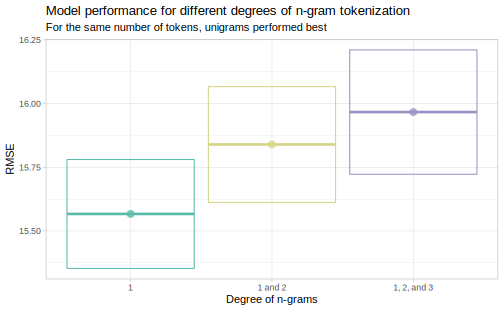

# Regression {#mlregression}

In this chapter, we will use machine learning to predict *continuous values* that are associated with text data. Like in all predictive modeling tasks, this chapter demonstrates how to use learning algorithms to find and model relationships between an outcome or target variable and other input features. What is unique about the focus of this book is that our features are created from text data following the techniques laid out in Chapters \@ref(language) through \@ref(embeddings), and what is unique about the focus of this particular chapter is that our outcome is numeric and continuous. For example, let's consider a sample of opinions from the United States Supreme Court, available in the **scotus** [@R-scotus] package.


```r
library(tidyverse)
library(scotus)

scotus_filtered %>%
  as_tibble()
```

```
#> # A tibble: 10,000 × 5
#>    year  case_name                  docket_number     id text                   
#>    <chr> <chr>                      <chr>          <dbl> <chr>                  
#>  1 1903  Clara Perry, Plff. In Err… 16             80304 "No. 16.\n State Repor…
#>  2 1987  West v. Conrail            85-1804        96216 "No. 85-1804.\n\n     …
#>  3 1957  Roth v. United States      582            89930 "Nos. 582, 61.\nNo. 61…
#>  4 1913  McDermott v. Wisconsin     Nos. 112 and … 82218 "Nos. 112 and 113.\nMr…
#>  5 1826  Wetzell v. Bussard         <NA>           52899 "Feb. 7th.\nThis cause…
#>  6 1900  Forsyth v. Vehmeyer        180            79609 "No. 180.\nMr. Edward …
#>  7 1871  Reed v. United States      <NA>           57846 "APPEAL and cross appe…
#>  8 1833  United States v. Mills     <NA>           53394 "CERTIFICATE of Divisi…
#>  9 1940  Puerto Rico v. Rubert Her… 582            87714 "No. 582.\nMr. Wm. Cat…
#> 10 1910  Williams v. First Nat. Ba… 130            81588 "No. 130.\nThe defenda…
#> # … with 9,990 more rows
```

This data set contains the entire text of each opinion in the `text` column, along with the `case_name` and `docket_number`. Notice that we also have the `year` that each case was decided by the Supreme Court; this is basically a continuous variable (rather than a group membership of discrete label). 

<div class="rmdnote">
<p>If we want to build a model to predict which court opinions were written in which years, we would build a regression model.</p>
</div>


- A **classification model** predicts a class label or group membership.

- A **regression model** predicts a numeric or continuous value.

In text modeling, we use text data (such as the text of the court opinions), sometimes combined with other structured, non-text data, to predict the continuous value of interest (such as year of the court opinion). The goal of predictive modeling with text input features and a continuous outcome is to learn and model the relationship between the input features and the numeric target (outcome).

## A first regression model {#firstmlregression}

Let's build our first regression model using this sample of Supreme Court opinions. Before we start, let's check out how many opinions we have for each decade in Figure \@ref(fig:scotushist).


```r
scotus_filtered %>%
  mutate(year = as.numeric(year),
         year = 10 * (year %/% 10)) %>%
  count(year) %>%
  ggplot(aes(year, n)) +
  geom_col() +
  labs(x = "Year", y = "Number of opinions per decade")
```

<div class="figure" style="text-align: center">

<p class="caption">(\#fig:scotushist)Supreme Court opinions per decade in sample</p>
</div>

This sample of opinions reflects the distribution over time of available opinions for analysis; there are many more opinions per year in this data set after about 1850 than before. This is an example of bias already in our data, as we discussed in the overview to these chapters, and we will need to account for that in choosing a model and understanding our results.

### Building our first regression model {#firstregression}

Our first step in building a model is to split our data into training and testing sets. We use functions from **tidymodels** for this; we use `initial_split()` to set up *how* to split the data, and then we use the functions `training()` and `testing()` to create the data sets we need. Let's also convert the year to a numeric value since it was originally stored as a character, and remove the `'` character because of its effect on one of the models^[The random forest implementation in the **ranger** package, demonstrated in Section \@ref(comparerf), does not handle special characters in columns names well.] we want to try out.


```r
library(tidymodels)
set.seed(1234)
scotus_split <- scotus_filtered %>%
  mutate(year = as.numeric(year),
         text = str_remove_all(text, "'")) %>%
  initial_split()

scotus_train <- training(scotus_split)
scotus_test <- testing(scotus_split)
```

Next, let's \index{preprocessing}preprocess our data to get it ready for modeling using a recipe. We'll use both general preprocessing functions from **tidymodels** and specialized functions just for text from **textrecipes** in this preprocessing.

\BeginKnitrBlock{rmdpackage}<div class="rmdpackage">The **recipes** package [@R-recipes] is part of **tidymodels** and provides functions for data preprocessing and feature engineering. The **textrecipes** package [@textrecipes] extends **recipes** by providing steps that create features for modeling from text, as we explored in the first five chapters of this book.</div>\EndKnitrBlock{rmdpackage}
\index{preprocessing}
\index{feature engineering}

What are the steps in creating this recipe?

- First, we must specify in our initial `recipe()` statement the form of our model (with the formula `year ~ text`, meaning we will predict the year of each opinion from the text of that opinion) and what our training data is.

- Then, we tokenize (Chapter \@ref(tokenization)) the text of the court opinions. 

- Next, we filter to only keep the top 1000 tokens by term frequency. We filter out those less frequent words because we expect them to be too rare to be reliable, at least for our first attempt. (We are _not_ removing stop words yet; we'll explore removing them in Section \@ref(casestudystopwords).)

- The recipe step `step_tfidf()`, used with defaults here, weights each token frequency by the inverse document frequency.\index{tf-idf}

- As a last step, we normalize (center and scale) these tf-idf values. This centering and scaling is needed because we're going to use a support vector machine model.


```r
library(textrecipes)

scotus_rec <- recipe(year ~ text, data = scotus_train) %>%
  step_tokenize(text) %>%
  step_tokenfilter(text, max_tokens = 1e3) %>%
  step_tfidf(text) %>%
  step_normalize(all_predictors())

scotus_rec
```

```
#> Data Recipe
#> 
#> Inputs:
#> 
#>       role #variables
#>    outcome          1
#>  predictor          1
#> 
#> Operations:
#> 
#> Tokenization for text
#> Text filtering for text
#> Term frequency-inverse document frequency with text
#> Centering and scaling for all_predictors()
```

Now that we have a full specification of the preprocessing recipe, we can `prep()` this recipe to estimate all the necessary parameters for each step using the training data and `bake()` it to apply the steps to data, like the training data (with `new_data = NULL`), testing data, or new data at prediction time. 


```r
scotus_prep <- prep(scotus_rec)
scotus_bake <- bake(scotus_prep, new_data = NULL)

dim(scotus_bake)
```

```
#> [1] 7500 1001
```

For most modeling tasks, you will not need to `prep()` or `bake()` your recipe directly; instead you can build up a tidymodels `workflow()` to bundle together your modeling components.

\BeginKnitrBlock{rmdpackage}<div class="rmdpackage">In **tidymodels**, the **workflows** package [@R-workflows] offers infrastructure for bundling model components. A _model workflow_ is a convenient way to combine different modeling components (a preprocessor plus a model specification); when these are bundled explicitly, it can be easier to keep track of your modeling plan, as well as fit your model and predict on new data.</div>\EndKnitrBlock{rmdpackage}

Let's create a `workflow()` to bundle together our recipe with any model specifications we may want to create later. First, let's create an empty `workflow()` and then only add the data preprocessor `scotus_rec` to it.


```r
scotus_wf <- workflow() %>%
  add_recipe(scotus_rec)

scotus_wf
```

```
#> ══ Workflow ════════════════════════════════════════════════════════════════════
#> Preprocessor: Recipe
#> Model: None
#> 
#> ── Preprocessor ────────────────────────────────────────────────────────────────
#> 4 Recipe Steps
#> 
#> • step_tokenize()
#> • step_tokenfilter()
#> • step_tfidf()
#> • step_normalize()
```

Notice that there is no model yet: `Model: None`. It's time to specify the model we will use! Let's build a support vector machine (SVM) model. While they don't see widespread use in cutting-edge machine learning research today, they are frequently used in practice and have properties that make them well-suited for text classification [@Joachims1998] and can give good performance [@Vantu2016].

\BeginKnitrBlock{rmdnote}<div class="rmdnote">An SVM model can be used for either regression or classification, and linear SVMs often work well with text data. Even better, linear SVMs typically do not need to be tuned (see Section \@ref(tunelasso) for tuning model hyperparameters).</div>\EndKnitrBlock{rmdnote}

Before fitting, we set up a model specification. There are three components to specifying a model using tidymodels: the model algorithm (a linear SVM here), the mode (typically either classification or regression), and the computational engine we are choosing to use. For our linear SVM, let's use the **LiblineaR** engine [@R-LiblineaR].


```r
svm_spec <- svm_linear() %>%
  set_mode("regression") %>%
  set_engine("LiblineaR")
```

Everything is now ready for us to fit our model. Let's add our model to the workflow with `add_model()` and fit to our training data `scotus_train`.


```r
svm_fit <- scotus_wf %>%
  add_model(svm_spec) %>%
  fit(data = scotus_train)
```

We have successfully fit an SVM model to this data set of Supreme Court opinions. What does the result look like? We can access the fit using `pull_workflow_fit()`, and even `tidy()` the model coefficient results into a convenient dataframe format.


```r
svm_fit %>%
  pull_workflow_fit() %>%
  tidy() %>%
  arrange(-estimate)
```

```
#> # A tibble: 1,001 × 2
#>    term                  estimate
#>    <chr>                    <dbl>
#>  1 Bias                   1920.  
#>  2 tfidf_text_later          1.50
#>  3 tfidf_text_appeals        1.48
#>  4 tfidf_text_see            1.39
#>  5 tfidf_text_noted          1.38
#>  6 tfidf_text_example        1.27
#>  7 tfidf_text_petitioner     1.26
#>  8 tfidf_text_even           1.23
#>  9 tfidf_text_rather         1.21
#> 10 tfidf_text_including      1.13
#> # … with 991 more rows
```

The term `Bias` here means the same thing as an intercept. We see here what terms contribute to a Supreme Court opinion being written more recently, like "appeals" and "petitioner". 

What terms contribute to a Supreme Court opinion being written further in the past, for this first attempt at a model?


```r
svm_fit %>%
  pull_workflow_fit() %>%
  tidy() %>%
  arrange(estimate)
```

```
#> # A tibble: 1,001 × 2
#>    term                 estimate
#>    <chr>                   <dbl>
#>  1 tfidf_text_ought        -2.77
#>  2 tfidf_text_1st          -1.94
#>  3 tfidf_text_but          -1.63
#>  4 tfidf_text_same         -1.62
#>  5 tfidf_text_the          -1.57
#>  6 tfidf_text_therefore    -1.54
#>  7 tfidf_text_it           -1.46
#>  8 tfidf_text_which        -1.40
#>  9 tfidf_text_this         -1.39
#> 10 tfidf_text_be           -1.33
#> # … with 991 more rows
```

Here we see words like "ought" and "therefore".

### Evaluation {#firstregressionevaluation}

One option for evaluating our model is to predict one time on the testing set to measure performance. 

<div class="rmdwarning">
<p>The testing set is extremely valuable data, however, and in real-world situations, we advise that you only use this precious resource one time (or at most, twice).</p>
</div>

The purpose of the testing data is to estimate how your final model will perform on new data; we set aside a proportion of the data available and pretend that it is not available to us for training the model so we can use it to estimate model performance on strictly out-of-sample data. Often during the process of modeling, we want to compare models or different model parameters. If we use the test set for these kinds of tasks, we risk fooling ourselves that we are doing better than we really are.

Another option for evaluating models is to predict one time on the training set to measure performance. This is the _same data_ that was used to train the model, however, and evaluating on the training data often results in performance estimates that are too optimistic. This is especially true for powerful machine learning algorithms that can learn subtle patterns from data; we risk overfitting to the training set.\index{models!comparing}

Yet another option for evaluating or comparing models is to use a separate validation set. In this situation, we split our data _not_ into two sets (training and testing) but into three sets (testing, training, and validation). The validation set is used for computing performance metrics to compare models or model parameters. This can be a great option if you have enough data for it, but often we as machine learning practitioners are not so lucky. 

What are we to do, then, if we want to train multiple models and find the best one? Or compute a reliable estimate for how our model has performed without wasting the valuable testing set? We can use **resampling**. When we resample, we create new simulated data sets from the training set for the purpose of, for example, measuring model performance.

Let's estimate the performance of the linear SVM regression model we just fit. We can do this using resampled data sets built from the training set. 

\BeginKnitrBlock{rmdpackage}<div class="rmdpackage">In **tidymodels**, the package for data splitting and resampling is **\mbox{rsample}** [@R-rsample].</div>\EndKnitrBlock{rmdpackage}

Let's create 10-fold cross-validation sets, and use these resampled sets for performance estimates.


```r
set.seed(123)
scotus_folds <- vfold_cv(scotus_train)

scotus_folds
```

```
#> #  10-fold cross-validation 
#> # A tibble: 10 × 2
#>    splits             id    
#>    <list>             <chr> 
#>  1 <split [6750/750]> Fold01
#>  2 <split [6750/750]> Fold02
#>  3 <split [6750/750]> Fold03
#>  4 <split [6750/750]> Fold04
#>  5 <split [6750/750]> Fold05
#>  6 <split [6750/750]> Fold06
#>  7 <split [6750/750]> Fold07
#>  8 <split [6750/750]> Fold08
#>  9 <split [6750/750]> Fold09
#> 10 <split [6750/750]> Fold10
```

Each of these "splits" contains information about how to create cross-validation folds from the original training data. In this example, 90% of the training data is included in each fold for analysis and the other 10% is held out for assessment. Since we used cross-validation, each Supreme Court opinion appears in only one of these held-out assessment sets.

In Section \@ref(firstregression), we fit one time to the training data as a whole. Now, to estimate how well that model performs, let's fit many times, once to each of these resampled folds, and then evaluate on the heldout part of each resampled fold.


```r
set.seed(123)
svm_rs <- fit_resamples(
  scotus_wf %>% add_model(svm_spec),
  scotus_folds,
  control = control_resamples(save_pred = TRUE)
)

svm_rs
```

```
#> # Resampling results
#> # 10-fold cross-validation 
#> # A tibble: 10 × 5
#>    splits             id     .metrics         .notes           .predictions     
#>    <list>             <chr>  <list>           <list>           <list>           
#>  1 <split [6750/750]> Fold01 <tibble [2 × 4]> <tibble [0 × 1]> <tibble [750 × 4…
#>  2 <split [6750/750]> Fold02 <tibble [2 × 4]> <tibble [0 × 1]> <tibble [750 × 4…
#>  3 <split [6750/750]> Fold03 <tibble [2 × 4]> <tibble [0 × 1]> <tibble [750 × 4…
#>  4 <split [6750/750]> Fold04 <tibble [2 × 4]> <tibble [0 × 1]> <tibble [750 × 4…
#>  5 <split [6750/750]> Fold05 <tibble [2 × 4]> <tibble [0 × 1]> <tibble [750 × 4…
#>  6 <split [6750/750]> Fold06 <tibble [2 × 4]> <tibble [0 × 1]> <tibble [750 × 4…
#>  7 <split [6750/750]> Fold07 <tibble [2 × 4]> <tibble [0 × 1]> <tibble [750 × 4…
#>  8 <split [6750/750]> Fold08 <tibble [2 × 4]> <tibble [0 × 1]> <tibble [750 × 4…
#>  9 <split [6750/750]> Fold09 <tibble [2 × 4]> <tibble [0 × 1]> <tibble [750 × 4…
#> 10 <split [6750/750]> Fold10 <tibble [2 × 4]> <tibble [0 × 1]> <tibble [750 × 4…
```

These results look a lot like the resamples, but they have some additional columns, like the `.metrics` that we can use to measure how well this model performed and the `.predictions` we can use to explore that performance more deeply. What results do we see, in terms of performance metrics?


```r
collect_metrics(svm_rs)
```

```
#> # A tibble: 2 × 6
#>   .metric .estimator   mean     n std_err .config             
#>   <chr>   <chr>       <dbl> <int>   <dbl> <chr>               
#> 1 rmse    standard   15.6      10 0.216   Preprocessor1_Model1
#> 2 rsq     standard    0.895    10 0.00244 Preprocessor1_Model1
```


The default performance metrics to be computed for regression models are RMSE (root mean squared error) and $R^2$ (coefficient of determination). RMSE is a metric that is in the same units as the original data, so in units of _years_, in our case; the RMSE of this first regression model is 15.6 years.

\index{root mean squared error|see {RMSE}}
\index{RMSE}
\index{coefficient of determination}
<div class="rmdnote">
<p>RSME and <span class="math inline">\(R^2\)</span> are performance metrics used for regression models.</p>
<p>RSME is a measure of the difference between the predicted and observed values; if the model fits the data well, RMSE is lower. To compute RMSE, you take the mean values of the squared difference between the predicted and observed values, then take the square root.</p>
<p><span class="math inline">\(R^2\)</span> is the squared correlation between the predicted and observed values. When the model fits the data well, the predicted and observed values are closer together with a higher correlation between them. The correlation between two variables is bounded between −1 and 1, so the closer <span class="math inline">\(R^2\)</span> is to one, the better.</p>
</div>

These values are quantitative estimates for how well our model performed, and can be compared across different kinds of models. Figure \@ref(fig:firstregpredict) shows the predicted years for these Supreme Court opinions plotted against the true years when they were published, for all the resampled data sets.


```r
svm_rs %>%
  collect_predictions() %>%
  ggplot(aes(year, .pred, color = id)) +
  geom_abline(lty = 2, color = "gray80", size = 1.5) +
  geom_point(alpha = 0.3) +
  labs(
    x = "Truth",
    y = "Predicted year",
    color = NULL,
    title = "Predicted and true years for Supreme Court opinions",
    subtitle = "Each cross-validation fold is shown in a different color"
  )
```

<div class="figure" style="text-align: center">

<p class="caption">(\#fig:firstregpredict)Most Supreme Court opinions are near the dashed line, indicating good agreement between our SVM regression predictions and the real years</p>
</div>

The average spread of points in this plot above and below the dashed line corresponds to RMSE, which is 15.6 years for this model. When RMSE is better (lower), the points will be closer to the dashed line. This first model we have tried did not do a great job for Supreme Court opinions from before 1850, but for opinions after 1850, this looks pretty good!

<div class="rmdwarning">
<p>Hopefully you are convinced that using resampled data sets for measuring performance is the right choice, but it can be computationally expensive. Instead of fitting once, we must fit the model one time for <em>each</em> resample. The resamples are independent of each other, so this is a great fit for parallel processing. The tidymodels framework is designed to work fluently with parallel processing in R, using multiple cores or multiple machines. The implementation details of parallel processing are operating system specific, so <a href="https://tune.tidymodels.org/articles/extras/optimizations.html">look at tidymodels’ documentation for how to get started</a>.</p>
</div>

## Compare to the null model {#regnull}

One way to assess a model like this one is to compare its performance to a "null model".

\BeginKnitrBlock{rmdnote}<div class="rmdnote">A null model is a simple, non-informative model that always predicts the largest class (for classification) or the mean (such as the mean year of Supreme Court opinions, in our specific regression case)^[This is sometimes called a "baseline model".].</div>\EndKnitrBlock{rmdnote}

We can use the same function `fit_resamples()` and the same preprocessing recipe as before, switching out our SVM model specification for the `null_model()` specification.


```r
null_regression <- null_model() %>%
  set_engine("parsnip") %>%
  set_mode("regression")

null_rs <- fit_resamples(
  scotus_wf %>% add_model(null_regression),
  scotus_folds,
  metrics = metric_set(rmse)
)

null_rs
```

```
#> # Resampling results
#> # 10-fold cross-validation 
#> # A tibble: 10 × 4
#>    splits             id     .metrics         .notes          
#>    <list>             <chr>  <list>           <list>          
#>  1 <split [6750/750]> Fold01 <tibble [1 × 4]> <tibble [0 × 1]>
#>  2 <split [6750/750]> Fold02 <tibble [1 × 4]> <tibble [0 × 1]>
#>  3 <split [6750/750]> Fold03 <tibble [1 × 4]> <tibble [0 × 1]>
#>  4 <split [6750/750]> Fold04 <tibble [1 × 4]> <tibble [0 × 1]>
#>  5 <split [6750/750]> Fold05 <tibble [1 × 4]> <tibble [0 × 1]>
#>  6 <split [6750/750]> Fold06 <tibble [1 × 4]> <tibble [0 × 1]>
#>  7 <split [6750/750]> Fold07 <tibble [1 × 4]> <tibble [0 × 1]>
#>  8 <split [6750/750]> Fold08 <tibble [1 × 4]> <tibble [0 × 1]>
#>  9 <split [6750/750]> Fold09 <tibble [1 × 4]> <tibble [0 × 1]>
#> 10 <split [6750/750]> Fold10 <tibble [1 × 4]> <tibble [0 × 1]>
```

What results do we obtain from the null model, in terms of performance metrics?


```r
collect_metrics(null_rs)
```

```
#> # A tibble: 1 × 6
#>   .metric .estimator  mean     n std_err .config             
#>   <chr>   <chr>      <dbl> <int>   <dbl> <chr>               
#> 1 rmse    standard    47.9    10   0.294 Preprocessor1_Model1
```

The RMSE indicates that this null model is dramatically worse than our first model. Even our first very attempt at a regression model (using only unigrams and very little specialized preprocessing)\index{preprocessing} did much better than the null model; the text of the Supreme Court opinions has enough information in it related to the year the opinions were published that we can build successful models.

## Compare to a random forest model {#comparerf}

Random forest models are broadly used in predictive modeling contexts because they are low-maintenance and perform well. For example, see @Caruana2008 and @Olson2017 for comparisons of the performance of common models such as random forest, decision tree, support vector machines, etc. trained on benchmark data sets; random forest models were one of the best overall. Let's see how a random forest model performs with our data set of Supreme Court opinions.

First, let's build a random forest model specification, using the ranger implementation. Random forest models are known for performing well without hyperparameter tuning, so we will just make sure we have enough `trees`.


```r
rf_spec <- rand_forest(trees = 1000) %>%
  set_engine("ranger") %>%
  set_mode("regression")

rf_spec
```

```
#> Random Forest Model Specification (regression)
#> 
#> Main Arguments:
#>   trees = 1000
#> 
#> Computational engine: ranger
```

Now we can fit this random forest model. Let's use `fit_resamples()` again, so we can evaluate the model performance. We will use three arguments to this function:

- Our modeling `workflow()`, with the same preprocessing recipe we have been using so far in this chapter plus our new random forest model specification

- Our cross-validation resamples of the Supreme Court opinions

- A `control` argument to specify that we want to keep the predictions, to explore after fitting


```r
rf_rs <- fit_resamples(
  scotus_wf %>% add_model(rf_spec),
  scotus_folds,
  control = control_resamples(save_pred = TRUE)
)
```

We can use `collect_metrics()` to obtain and format the performance metrics for this random forest model.


```r
collect_metrics(rf_rs)
```

```
#> # A tibble: 2 × 6
#>   .metric .estimator   mean     n std_err .config             
#>   <chr>   <chr>       <dbl> <int>   <dbl> <chr>               
#> 1 rmse    standard   15.0      10 0.264   Preprocessor1_Model1
#> 2 rsq     standard    0.919    10 0.00283 Preprocessor1_Model1
```

This looks pretty promising, so let's explore the predictions for this random forest model.


```r
collect_predictions(rf_rs) %>%
  ggplot(aes(year, .pred, color = id)) +
  geom_abline(lty = 2, color = "gray80", size = 1.5) +
  geom_point(alpha = 0.3) +
  labs(
    x = "Truth",
    y = "Predicted year",
    color = NULL,
    title = paste("Predicted and true years for Supreme Court opinions using",
                  "a random forest model", sep = "\n"),
    subtitle = "Each cross-validation fold is shown in a different color"
  )
```

<div class="figure" style="text-align: center">

<p class="caption">(\#fig:rfpredict)The random forest model did not perform very sensibly across years, compared to our first attempt using a linear SVM model</p>
</div>

Figure \@ref(fig:rfpredict) shows some of the strange behavior from our fitted model. The overall performance metrics look pretty good, but predictions are too high and too low around certain threshold years. \index{models!challenges}

It is very common to run into problems when using tree-based models like random forests with text data. One of the defining characteristics of text data is that it is _sparse_, with many features but most features not occurring in most observations. Tree-based models such as random forests are often not well-suited to sparse data because of how decision trees model outcomes [@Tang2018].

<div class="rmdnote">
<p>Models that work best with text tend to be models designed for or otherwise appropriate for sparse data.</p>
</div>

Algorithms that work well with sparse data are less important when text has been transformed to a non-sparse representation, such as with word embeddings (Chapter \@ref(embeddings)).

## Case study: removing stop words {#casestudystopwords}

We did not remove stop words (Chapter \@ref(stopwords)) in any of our models so far in this chapter. What impact will removing stop words have, and how do we know which stop word list is the best to use? The best way to answer these questions is with experimentation. 

Removing stop words is part of \index{preprocessing}data preprocessing, so we define this step as part of our preprocessing recipe. Let's use the best model we've found so far (the linear SVM model from Section \@ref(firstregressionevaluation)) and switch in a different recipe in our modeling workflow.

Let's build a small recipe wrapper helper function so we can pass a value `stopword_name` to `step_stopwords()`.


```r
stopword_rec <- function(stopword_name) {
  recipe(year ~ text, data = scotus_train) %>%
    step_tokenize(text) %>%
    step_stopwords(text, stopword_source = stopword_name) %>%
    step_tokenfilter(text, max_tokens = 1e3) %>%
    step_tfidf(text) %>%
    step_normalize(all_predictors())
}
```

For example, now we can create a recipe that removes the Snowball stop words list\index{stop word lists!Snowball} by calling this function.


```r
stopword_rec("snowball")
```

```
#> Data Recipe
#> 
#> Inputs:
#> 
#>       role #variables
#>    outcome          1
#>  predictor          1
#> 
#> Operations:
#> 
#> Tokenization for text
#> Stop word removal for text
#> Text filtering for text
#> Term frequency-inverse document frequency with text
#> Centering and scaling for all_predictors()
```

Next, let's set up a new workflow that has a model only, using `add_model()`. We start with the empty `workflow()` and then add our linear SVM regression model.


```r
svm_wf <- workflow() %>%
  add_model(svm_spec)

svm_wf
```

```
#> ══ Workflow ════════════════════════════════════════════════════════════════════
#> Preprocessor: None
#> Model: svm_linear()
#> 
#> ── Model ───────────────────────────────────────────────────────────────────────
#> Linear Support Vector Machine Specification (regression)
#> 
#> Computational engine: LiblineaR
```

Notice that for this workflow, there is no preprocessor yet: `Preprocessor: None`. This workflow uses the same linear SVM specification that we used in Section \@ref(firstmlregression), but we are going to combine several different preprocessing recipes with it, one for each stop word lexicon we want to try.

Now we can put this all together and fit these models that include stop word removal. We could create a little helper function for fitting like we did for the recipe, but we have printed out all three calls to `fit_resamples()` for extra clarity. Notice for each one that there are two arguments:

- A workflow, which consists of the linear SVM model specification and a data preprocessing recipe with stop word removal

- The same cross-validation folds we created earlier


```r
set.seed(123)
snowball_rs <- fit_resamples(
  svm_wf %>% add_recipe(stopword_rec("snowball")),
  scotus_folds
)

set.seed(234)
smart_rs <- fit_resamples(
  svm_wf %>% add_recipe(stopword_rec("smart")),
  scotus_folds
)

set.seed(345)
stopwords_iso_rs <- fit_resamples(
  svm_wf %>% add_recipe(stopword_rec("stopwords-iso")),
  scotus_folds
)
```


After fitting models to each of the cross-validation folds, these sets of results contain metrics computed for removing that set of stop words.


```r
collect_metrics(smart_rs)
```

```
#> # A tibble: 2 × 6
#>   .metric .estimator   mean     n std_err .config             
#>   <chr>   <chr>       <dbl> <int>   <dbl> <chr>               
#> 1 rmse    standard   17.2      10 0.199   Preprocessor1_Model1
#> 2 rsq     standard    0.876    10 0.00261 Preprocessor1_Model1
```

We can explore whether one of these sets of stop words performed better than the others by comparing the performance, for example in terms of RMSE as shown Figure \@ref(fig:snowballrmse). This plot shows the five best models for each set of stop words, using `show_best()` applied to each via `purrr::map_dfr()`.


```r
word_counts <- tibble(name = c("snowball", "smart", "stopwords-iso")) %>%
  mutate(words = map_int(name, ~length(stopwords::stopwords(source = .))))

list(snowball = snowball_rs,
     smart = smart_rs,
     `stopwords-iso` = stopwords_iso_rs) %>%
  map_dfr(show_best, "rmse", .id = "name") %>%
  left_join(word_counts, by = "name") %>%
  mutate(name = paste0(name, " (", words, " words)"),
         name = fct_reorder(name, words)) %>%
  ggplot(aes(name, mean, color = name)) +
  geom_crossbar(aes(ymin = mean - std_err, ymax = mean + std_err), alpha = 0.6) +
  geom_point(size = 3, alpha = 0.8) +
  theme(legend.position = "none") +
  labs(x = NULL, y = "RMSE",
       title = "Model performance for three stop word lexicons",
       subtitle = "For this data set, the Snowball lexicon performed best")
```

<div class="figure" style="text-align: center">

<p class="caption">(\#fig:snowballrmse)Comparing model performance for predicting the year of Supreme Court opinions with three different stop word lexicons</p>
</div>

The \index{stop word lists!Snowball}Snowball lexicon contains the smallest number of words (see Figure \@ref(fig:stopwordoverlap)) and, in this case, results in the best performance. Removing fewer stop words results in the best performance.

<div class="rmdwarning">
<p>This result is not generalizable to all data sets and contexts, but the approach outlined in this section <strong>is</strong> generalizable.</p>
</div>

This approach can be used to compare different lexicons and find the best one for a specific data set and model. Notice how the results for all stop word lexicons are worse than removing no stop words at all (remember that the RMSE was 15.6 years in Section \@ref(firstregressionevaluation)). This indicates that, for this particular data set, removing even a small stop word list is not a great choice.

When removing stop words does appear to help a model, it's good to know that removing stop words isn't computationally slow or difficult so the cost for this improvement is low.\index{computational speed}

## Case study: varying n-grams {#casestudyngrams}

Each model trained so far in this chapter has involved single words or _unigrams_, but using \index{tokenization!n-gram}n-grams (Section \@ref(tokenizingngrams)) can integrate different kinds of information into a model. Bigrams and trigrams (or even higher-order n-grams) capture concepts that span single words, as well as effects from word order, that can be predictive.

This is another part of data preprocessing\index{preprocessing}, so we again define this step as part of our preprocessing recipe. Let's build another small recipe wrapper helper function so we can pass a list of options `ngram_options` to `step_tokenize()`. We'll use it with the same model as the previous section.


```r
ngram_rec <- function(ngram_options) {
  recipe(year ~ text, data = scotus_train) %>%
    step_tokenize(text, token = "ngrams", options = ngram_options) %>%
    step_tokenfilter(text, max_tokens = 1e3) %>%
    step_tfidf(text) %>%
    step_normalize(all_predictors())
}
```

There are two options we can specify, `n` and `n_min`, when we are using `engine = "tokenizers"`. We can set up a recipe with only `n = 1` to tokenize and only extract the unigrams.


```r
ngram_rec(list(n = 1))
```

We can use `n = 3, n_min = 1` to identify the set of all trigrams, bigrams, _and_ unigrams.\index{tokenization!n-gram}


```r
ngram_rec(list(n = 3, n_min = 1))
```

<div class="rmdnote">
<p>Including n-grams of different orders in a model (such as trigrams, bigrams, plus unigrams) allows the model to learn at different levels of linguistic organization and context.</p>
</div>

We can reuse the same workflow `svm_wf` from our earlier case study; these types of modular components are a benefit to adopting this approach to supervised machine learning. This workflow provides the linear SVM specification. Let's put it all together and create a helper function to use `fit_resamples()` with this model plus our helper recipe function.


```r
fit_ngram <- function(ngram_options) {
  fit_resamples(
    svm_wf %>% add_recipe(ngram_rec(ngram_options)),
    scotus_folds
  )
}
```

\BeginKnitrBlock{rmdwarning}<div class="rmdwarning">We could have created this type of small function for trying out different stop word lexicons in Section \@ref(casestudystopwords), but there we showed each call to `fit_resamples()` for extra clarity.</div>\EndKnitrBlock{rmdwarning}

With this helper function, let's try out predicting the year of Supreme Court opinions using:

- only unigrams

- bigrams and unigrams

- trigrams, bigrams, and unigrams


```r
set.seed(123)
unigram_rs <- fit_ngram(list(n = 1))

set.seed(234)
bigram_rs <- fit_ngram(list(n = 2, n_min = 1))

set.seed(345)
trigram_rs <- fit_ngram(list(n = 3, n_min = 1))
```

These sets of results contain metrics computed for the model with that tokenization strategy.\index{tokenization!n-gram}


```r
collect_metrics(bigram_rs)
```


```
#> # A tibble: 2 × 6
#>   .metric .estimator   mean     n std_err .config             
#>   <chr>   <chr>       <dbl> <dbl>   <dbl> <chr>               
#> 1 rmse    standard   15.9      10 0.225   Preprocessor1_Model1
#> 2 rsq     standard    0.892    10 0.00240 Preprocessor1_Model1
```

We can compare the performance of these models in terms of RMSE as shown Figure \@ref(fig:ngramrmse).


```r
list(`1` = unigram_rs,
     `1 and 2` = bigram_rs,
     `1, 2, and 3` = trigram_rs) %>%
  map_dfr(collect_metrics, .id = "name") %>%
  filter(.metric == "rmse") %>%
  ggplot(aes(name, mean, color = name)) +
  geom_crossbar(aes(ymin = mean - std_err, ymax = mean + std_err), alpha = 0.6) +
  geom_point(size = 3, alpha = 0.8) +
  theme(legend.position = "none") +
  labs(
    x = "Degree of n-grams",
    y = "RMSE",
    title = "Model performance for different degrees of n-gram tokenization",
    subtitle = "For the same number of tokens, unigrams performed best"
  )
```

<div class="figure" style="text-align: center">

<p class="caption">(\#fig:ngramrmse)Comparing model performance for predicting the year of Supreme Court opinions with three different degrees of n-grams</p>
</div>

Each of these models was trained with `max_tokens = 1e3`, i.e., including only the top 1000 tokens for each tokenization strategy. Holding the number of tokens constant, using unigrams alone performs best for this corpus of Supreme Court opinions. To be able to incorporate the more complex information in bigrams or trigrams, we would need to increase the number of tokens in the model considerably. 

Keep in mind that adding n-grams\index{tokenization!n-gram} is computationally expensive\index{computational speed} to start with, especially compared to the typical improvement in model performance gained. We can benchmark the whole model workflow, including preprocessing\index{preprocessing} and modeling. Using bigrams plus unigrams takes more than twice as long to train than only unigrams (number of tokens held constant), and adding in trigrams as well takes almost five times as long as training on unigrams alone.

## Case study: lemmatization {#mlregressionlemmatization}

As we discussed in Section \@ref(lemmatization), we can normalize words to their roots or \index{lemma}**lemmas** based on each word's context and the structure of a language. Table \@ref(tab:lemmatb) shows both the original words and the lemmas for one sentence from a Supreme Court opinion, using lemmatization implemented via the [spaCy](https://spacy.io/) library as made available through the **spacyr** R package [@Benoit19].


Table: (\#tab:lemmatb)Lemmatization of one sentence from a Supreme Court opinion

|original word |lemma        |
|:-------------|:------------|
|However       |however      |
|,             |,            |
|the           |the          |
|Court         |Court        |
|of            |of           |
|Appeals       |Appeals      |
|disagreed     |disagree     |
|with          |with         |
|the           |the          |
|District      |District     |
|Court         |Court        |
|'s            |'s           |
|construction  |construction |
|of            |of           |
|the           |the          |
|state         |state        |
|statute       |statute      |
|,             |,            |
|concluding    |conclude     |
|that          |that         |
|it            |it           |
|did           |do           |
|authorize     |authorize    |
|issuance      |issuance     |
|of            |of           |
|the           |the          |
|orders        |order        |
|to            |to           |
|withhold      |withhold     |
|to            |to           |
|the           |the          |
|Postal        |Postal       |
|Service       |Service      |
|.             |.            |


Notice several things about lemmatization\index{lemma} that are different from the kind of default tokenization (Chapter \@ref(tokenization)) you may be more familiar with.

- Words are converted to lowercase except for proper nouns.

- The lemma for pronouns is `-PRON-`.

- Words are converted from their existing form in the text to their canonical roots, like "disagree" and "conclude".

- Irregular verbs are converted to their canonical form ("did" to "do").

Using lemmatization\index{lemma} instead of a more straightforward tokenization strategy is slower because of the increased complexity involved, but it can be worth it. Let's explore how to train a model using _lemmas_ instead of _words_.

Lemmatization is, like choices around n-grams and stop words, part of data preprocessing\index{preprocessing} so we define how to set up lemmatization as part of our preprocessing recipe. We use `engine = "spacyr"` for tokenization (instead of the default) and add `step_lemma()` to our preprocessing. This step extracts the lemmas from the parsing done by the tokenization engine.


```r
spacyr::spacy_initialize(entity = FALSE)

lemma_rec <- recipe(year ~ text, data = scotus_train) %>%
  step_tokenize(text, engine = "spacyr") %>%
  step_lemma(text) %>%
  step_tokenfilter(text, max_tokens = 1e3) %>%
  step_tfidf(text) %>%
  step_normalize(all_predictors())

lemma_rec
```

```
#> Data Recipe
#> 
#> Inputs:
#> 
#>       role #variables
#>    outcome          1
#>  predictor          1
#> 
#> Operations:
#> 
#> Tokenization for text
#> Lemmatization for text
#> Text filtering for text
#> Term frequency-inverse document frequency with text
#> Centering and scaling for all_predictors()
```

Let's combine this lemmatized\index{lemma} text with our linear SVM workflow. We can then fit our workflow to our resampled data sets and estimate performance using lemmatization.


```r
lemma_rs <- fit_resamples(
  svm_wf %>% add_recipe(lemma_rec),
  scotus_folds
)
```

How did this model perform? 


```r
collect_metrics(lemma_rs)
```


```
#> # A tibble: 2 × 6
#>   .metric .estimator   mean     n std_err .config             
#>   <chr>   <chr>       <dbl> <dbl>   <dbl> <chr>               
#> 1 rmse    standard   14.2      10 0.276   Preprocessor1_Model1
#> 2 rsq     standard    0.913    10 0.00304 Preprocessor1_Model1
```

The best value for RMSE at 14.2 shows us that using lemmatization\index{lemma} can have a significant benefit for model performance, compared to 15.6 from fitting a non-lemmatized linear SVM model in Section \@ref(firstregressionevaluation). The best model using lemmatization is better than the best model without. However, this comes at a cost of much slower training because of the procedure involved in identifying lemmas; adding `step_lemma()` to our preprocessing increases the overall time to train the workflow by over 10-fold.\index{computational speed}

<div class="rmdnote">
<p>We can use <code>engine = "spacyr"</code> to assign part-of-speech tags to the tokens during tokenization, and this information can be used in various useful ways in text modeling. One approach is to filter tokens to only retain a certain part of speech, like nouns. An example of how to do this is illustrated in this <a href="https://www.hvitfeldt.me/blog/tidytuesday-pos-textrecipes-the-office/"><strong>textrecipes</strong> blogpost</a> and can be performed with <code>step_pos_filter()</code>.</p>
</div>
\index{part of speech}

## Case study: feature hashing

The models we have created so far have used tokenization (Chapter \@ref(tokenization)) to split apart text data into tokens that are meaningful to us as human beings (words, bigrams) and then weighted these tokens by simple counts with word frequencies or weighted counts with tf-idf.\index{tf-idf}
A problem with these methods is that the output space can be vast and dynamic.
We have limited ourselves to 1000 tokens so far in this chapter, but we could easily have more than 10,000 features in our training set. 
We may run into computational problems with memory or long processing times; deciding how many tokens to include can become a trade-off between computational time and information.
This style of approach also doesn't let us take advantage of new tokens we didn't see in our training data.

One method that has gained popularity in the machine learning field is the **hashing trick**.
This method addresses many of the challenges outlined above and is very fast with a low memory footprint.

Let's start with the basics of feature hashing.\index{hashing function}
First proposed by @Weinberger2009, feature hashing was introduced as a dimensionality reduction method with a simple premise.
We begin with a hashing function that we then apply to our tokens.

<div class="rmdwarning">
<p>A hashing function takes input of variable size and maps it to output of a fixed size. Hashing functions are commonly used in cryptography.</p>
</div>

We will use the `hash()` function from the **rlang** package to illustrate the behavior of hashing functions.
The `rlang::hash()` function uses the XXH128 hash algorithm of the xxHash library, which generates a 128-bit hash. This is a more complex hashing function than what is normally used for the hashing trick. The 32-bit version of MurmurHash3 [@appleby2008] is often used for its speed and good properties.

<div class="rmdnote">
<p>Hashing functions are typically very fast and have certain properties. For example, the output of a hash function is expected to be uniform, with the whole output space filled evenly. The “avalanche effect” describes how similar strings are hashed in such a way that their hashes are not similar in the output space.</p>
</div>

Suppose we have many country names in a character vector.
We can apply the hashing function\index{hashing function} to each of the country names to project them into an integer space defined by the hashing function.

Since `hash()` creates hashes that are very long, let's create `small_hash()` for demonstration purposes here that generates slightly smaller hashes. (The specific details of what hashes are generated are not important here.)


```r
library(rlang)
countries <- c("Palau", "Luxembourg", "Vietnam", "Guam", "Argentina",
               "Mayotte", "Bouvet Island", "South Korea", "San Marino",
               "American Samoa")

small_hash <- function(x) {
  strtoi(substr(hash(x), 26, 32), 16)
}

map_int(countries, small_hash)
```

```
#>  [1]   4292706   2881716 242176357 240902473 204438359  88787026 230339508
#>  [8]  15112074  96146649 192775182
```

Our `small_hash()` function uses `7 * 4 = 28` bits, so the number of possible values is `2^28 = 268435456`. This is admittedly not much of an improvement over 10 country names.
Let's take the modulo of these big integer values to project them down to a more manageable space.


```r
map_int(countries, small_hash) %% 24
```

```
#>  [1] 18 12 13  1 23 10 12 18  9  6
```

Now we can use these values as indices when creating a matrix.\index{matrix!sparse}


```
#> 10 x 24 sparse Matrix of class "ngCMatrix"
#>                                                               
#> Palau          . . . . . . . . . . . . . . . . . | . . . . . .
#> Luxembourg     . . . . . . . . . . . | . . . . . . . . . . . .
#> Vietnam        . . . . . . . . . . . . | . . . . . . . . . . .
#> Guam           | . . . . . . . . . . . . . . . . . . . . . . .
#> Argentina      . . . . . . . . . . . . . . . . . . . . . . | .
#> Mayotte        . . . . . . . . . | . . . . . . . . . . . . . .
#> Bouvet Island  . . . . . . . . . . . | . . . . . . . . . . . .
#> South Korea    . . . . . . . . . . . . . . . . . | . . . . . .
#> San Marino     . . . . . . . . | . . . . . . . . . . . . . . .
#> American Samoa . . . . . | . . . . . . . . . . . . . . . . . .
```

This method is very fast\index{computational speed}; both the hashing and modulo can be performed independently for each input since neither need information about the full corpus.
Since we are reducing the space, there is a chance that multiple words are hashed to the same value.
This is called a collision and, at first glance, it seems like it would be a big problem for a model.
However, research finds that using feature hashing has roughly the same accuracy as a simple bag-of-words model, and the effect of collisions is quite minor [@Forman2008].

<div class="rmdnote">
<p>Another step that is taken to avoid the negative effects of hash collisions is to use a <em>second</em> hashing function that returns 1 and −1. This determines if we are adding or subtracting the index we get from the first hashin function. Suppose both the words “outdoor” and “pleasant” hash to the integer value 583. Without the second hashing they would collide to 2. Using signed hashing, we have a 50% chance that they will cancel each other out, which tries to stop one feature from growing too much.</p>
</div>

There are downsides to using feature hashing.\index{hashing function}\index{hashing function!challenges} Feature hashing:

- still has one tuning parameter, and

- cannot be reversed.

The number of buckets you have correlates with computation speed and collision rate, which in turn affects performance. 
It is your job to find the output that best suits your needs.
Increasing the number of buckets will decrease the collision rate but will, in turn, return a larger output data set, which increases model fitting time. 
The number of buckets is tunable in tidymodels using the **tune** package.

Perhaps the more important downside to using feature hashing is that the operation can't be reversed. 
We are not able to detect if a collision occurs and it is difficult to understand the effect of any word in the model.
Remember that we are left with `n` columns of _hashes_ (not tokens), so if we find that the 274th column is a highly predictive feature, we cannot know in general which tokens contribute to that column. 
We cannot directly connect model values to words or tokens at all.
We could go back to our training set and create a paired list of the tokens and what hashes they map to. Sometimes we might find only one token in that list, but it may have two (or three or four or more!) different tokens contributing.
This feature hashing method is used because of its speed and scalability, not because it is interpretable.

Feature hashing on tokens\index{hashing function} is available in tidymodels using the `step_texthash()` step from **textrecipes**. Let's `prep()` and `bake()` this recipe for demonstration purposes.


```r
scotus_hash <- recipe(year ~ text, data = scotus_train) %>%
  step_tokenize(text) %>%
  step_texthash(text, signed = TRUE, num_terms = 512) %>%
  prep() %>%
  bake(new_data = NULL)

dim(scotus_hash)
```

```
#> [1] 7500  513
```

There are many columns in the results. Let's take a `glimpse()` at the first 10 columns.


```r
scotus_hash %>%
  select(num_range("text_hash00", 1:9)) %>%
  glimpse()
```

```
#> Rows: 7,500
#> Columns: 9
#> $ text_hash001 <dbl> -16, -5, -12, -10, -10, -2, -7, -13, -16, -18, -1, -2, -1…
#> $ text_hash002 <dbl> -1, 1, 3, -2, 0, 0, 5, -1, 1, 6, 0, 2, 0, 0, 0, -3, 1, 2,…
#> $ text_hash003 <dbl> -2, 0, 4, -1, -1, 1, -5, -2, -2, 0, 0, -1, 1, 6, 0, 0, -3…
#> $ text_hash004 <dbl> -2, 0, -1, 0, 0, 0, -14, -14, -4, -2, 0, -10, -1, -2, 0, …
#> $ text_hash005 <dbl> 0, 0, 0, 0, 0, 0, -2, -1, 2, 1, 0, -1, 0, -1, 0, 0, -1, 0…
#> $ text_hash006 <dbl> 24, 2, 4, 6, 7, 2, 14, 13, 13, 22, 1, 41, 2, 49, 9, 1, 17…
#> $ text_hash007 <dbl> 13, 1, 1, -3, 0, -6, -2, -4, -8, -1, 0, 0, -4, -11, 0, 0,…
#> $ text_hash008 <dbl> -8, 3, 1, 1, 1, 0, -19, 0, 1, 0, 1, -1, 1, 1, -2, 1, -8, …
#> $ text_hash009 <dbl> -2, 0, -1, 1, 0, 0, 0, -1, -1, -1, 0, -1, -1, -1, 0, 0, -…
```

By using `step_texthash()` we can quickly generate machine-ready data with a consistent number of variables.
This typically results in a slight loss of performance compared to using a traditional bag-of-words representation. An example of this loss is illustrated in this [**textrecipes** blogpost](https://www.hvitfeldt.me/blog/textrecipes-series-featurehashing/).

### Text normalization

\index{preprocessing!challenges}When working with text, you will inevitably run into problems with encodings and related irregularities.
These kinds of problems have a significant influence on feature hashing\index{hashing function}, as well as other preprocessing steps.
Consider the German word "schön".\index{language!Non-English}
The o with an umlaut (two dots over it) is a fairly simple character, but it can be represented in a couple of different ways.
We can either use a single character [\\U00f6](https://www.fileformat.info/info/unicode/char/00f6/index.htm) to represent the letter with an umlaut. 
Alternatively, we can use two characters, one for the o and one character to denote the presence of two dots over the previous character [\\U0308](https://www.fileformat.info/info/unicode/char/0308/index.htm).


```r
s1 <- "sch\U00f6n"
s2 <- "scho\U0308n"
```

These two strings will print the same for us as human readers.


```r
s1
```

```
#> [1] "schön"
```

```r
s2
```

```
#> [1] "schön"
```

However, they are not equal.


```r
s1 == s2
```

```
#> [1] FALSE
```

This poses a problem for the avalanche effect, which is needed for feature hashing to perform correctly. The avalanche effect will result in these two words (which should be identical) hashing to completely different values.


```r
small_hash(s1)
```

```
#> [1] 180735918
```

```r
small_hash(s2)
```

```
#> [1] 3013209
```

We can deal with this problem by performing **text normalization** on our text before feeding it into our preprocessing\index{preprocessing} engine.
One library to perform text normalization is the **stringi** package, which includes many different text normalization methods.
How these methods work is beyond the scope of this book, but know that the text normalization functions make text like our two versions of "schön"\index{language!Non-English} equivalent. We will use `stri_trans_nfc()` for this example, which performs canonical decomposition, followed by canonical composition, but we could also use `textrecipes::step_text_normalize()` within a tidymodels recipe for the same task.


```r
library(stringi)

stri_trans_nfc(s1) == stri_trans_nfc(s2)
```

```
#> [1] TRUE
```

```r
small_hash(stri_trans_nfc(s1))
```

```
#> [1] 180735918
```

```r
small_hash(stri_trans_nfc(s2))
```

```
#> [1] 180735918
```

Now we see that the strings are equal after normalization.

<div class="rmdwarning">
<p>This issue of text normalization can be important even if you don’t use feature hashing in your machine learning.</p>
</div>
\index{hashing function}

Since these words are encoded in different ways, they will be counted separately when we are counting token frequencies. 
Representing what should be a single token in multiple ways will split the counts. This will introduce noise in the best case, and in worse cases, some tokens will fall below the cutoff when we select tokens, leading to a loss of potentially informative words.

Luckily this is easily addressed by using `stri_trans_nfc()` on our text columns _before_ starting preprocessing, or perhaps more conveniently, by using `textrecipes::step_text_normalize()` _within_ a preprocessing recipe.

## What evaluation metrics are appropriate?

We have focused on using RMSE and $R^2$ as metrics for our models in this chapter, the defaults in the tidymodels framework. Other metrics can also be appropriate for regression models. Another common set of regression metric options are the various flavors of mean absolute error.

If you know before you fit your model that you want to compute one or more of these metrics, you can specify them in a call to `metric_set()`. Let's set up a tuning grid for mean absolute error (`mae`) and mean absolute percent error (`mape`).


```r
lemma_rs <- fit_resamples(
  svm_wf %>% add_recipe(lemma_rec),
  scotus_folds,
  metrics = metric_set(mae, mape)
)
```

If you have already fit your model, you can still compute and explore non-default metrics as long as you saved the predictions for your resampled data sets using `control_resamples(save_pred = TRUE)`. 

Let's go back to the first linear SVM model we tuned in Section \@ref(firstregressionevaluation), with results in `svm_rs`. We can compute the overall mean absolute percent error.


```r
svm_rs %>%
  collect_predictions() %>%
  mape(year, .pred)
```

```
#> # A tibble: 1 × 3
#>   .metric .estimator .estimate
#>   <chr>   <chr>          <dbl>
#> 1 mape    standard       0.616
```

We can also compute the mean absolute percent error for each resample.


```r
svm_rs %>%
  collect_predictions() %>%
  group_by(id) %>%
  mape(year, .pred)
```

```
#> # A tibble: 10 × 4
#>    id     .metric .estimator .estimate
#>    <chr>  <chr>   <chr>          <dbl>
#>  1 Fold01 mape    standard       0.603
#>  2 Fold02 mape    standard       0.660
#>  3 Fold03 mape    standard       0.596
#>  4 Fold04 mape    standard       0.639
#>  5 Fold05 mape    standard       0.618
#>  6 Fold06 mape    standard       0.611
#>  7 Fold07 mape    standard       0.618
#>  8 Fold08 mape    standard       0.602
#>  9 Fold09 mape    standard       0.604
#> 10 Fold10 mape    standard       0.605
```

Similarly, we can do the same for the mean absolute error, which gives a result in units of the original data (years, in this case) instead of relative units.


```r
svm_rs %>%
  collect_predictions() %>%
  group_by(id) %>%
  mae(year, .pred)
```

```
#> # A tibble: 10 × 4
#>    id     .metric .estimator .estimate
#>    <chr>  <chr>   <chr>          <dbl>
#>  1 Fold01 mae     standard        11.5
#>  2 Fold02 mae     standard        12.6
#>  3 Fold03 mae     standard        11.4
#>  4 Fold04 mae     standard        12.2
#>  5 Fold05 mae     standard        11.8
#>  6 Fold06 mae     standard        11.7
#>  7 Fold07 mae     standard        11.9
#>  8 Fold08 mae     standard        11.5
#>  9 Fold09 mae     standard        11.6
#> 10 Fold10 mae     standard        11.6
```

<div class="rmdnote">
<p>For the full set of regression metric options, see the <a href="https://yardstick.tidymodels.org/reference/">yardstick documentation</a>.</p>
</div>

## The full game: regression {#mlregressionfull}

In this chapter, we started from the beginning and then explored both different types of models and different data preprocessing steps. Let's take a step back and build one final model, using everything we've learned. For our final model, let's again use a linear SVM regression model, since it performed better than the other options we looked at. We will:

- train on the same set of cross-validation resamples used throughout this chapter,

- _tune_ the number of tokens used in the model to find a value that fits our needs,

- include both unigrams and bigrams\index{tokenization!n-gram},

- choose not to use lemmatization\index{lemmas}, to demonstrate what is possible for situations when training time makes lemmatization an impractical choice, and

- finally evaluate on the testing set, which we have not touched at all yet.

We will include a much larger number of tokens than before, which should give us the latitude to include both unigrams and bigrams, despite the result we saw in Section \@ref(casestudyngrams).

### Preprocess the data

First, let's create the data preprocessing recipe. By setting the tokenization options to `list(n = 2, n_min = 1)`, we will include both unigrams and bigrams in our model. 

When we set `max_tokens = tune()`, we can train multiple models with different numbers of maximum tokens and then compare these models' performance to choose the best value. Previously, we set `max_tokens = 1e3` to choose a specific value for the number of tokens included in our model, but here we are going to try multiple different values.


```r
final_rec <- recipe(year ~ text, data = scotus_train) %>%
  step_tokenize(text, token = "ngrams", options = list(n = 2, n_min = 1)) %>%
  step_tokenfilter(text, max_tokens = tune()) %>%
  step_tfidf(text) %>%
  step_normalize(all_predictors())

final_rec
```

```
#> Data Recipe
#> 
#> Inputs:
#> 
#>       role #variables
#>    outcome          1
#>  predictor          1
#> 
#> Operations:
#> 
#> Tokenization for text
#> Text filtering for text
#> Term frequency-inverse document frequency with text
#> Centering and scaling for all_predictors()
```


### Specify the model

Let's use the same linear SVM regression model specification we have used multiple times in this chapter, and set it up here again to remind ourselves.


```r
svm_spec <- svm_linear() %>%
  set_mode("regression") %>%
  set_engine("LiblineaR")

svm_spec
```

```
#> Linear Support Vector Machine Specification (regression)
#> 
#> Computational engine: LiblineaR
```

We can combine the preprocessing recipe and the model specification in a tunable workflow. We can't fit this workflow right away to training data, because the value for `max_tokens` hasn't been chosen yet.


```r
tune_wf <- workflow() %>%
  add_recipe(final_rec) %>%
  add_model(svm_spec)

tune_wf
```

```
#> ══ Workflow ════════════════════════════════════════════════════════════════════
#> Preprocessor: Recipe
#> Model: svm_linear()
#> 
#> ── Preprocessor ────────────────────────────────────────────────────────────────
#> 4 Recipe Steps
#> 
#> • step_tokenize()
#> • step_tokenfilter()
#> • step_tfidf()
#> • step_normalize()
#> 
#> ── Model ───────────────────────────────────────────────────────────────────────
#> Linear Support Vector Machine Specification (regression)
#> 
#> Computational engine: LiblineaR
```

### Tune the model

\index{models!tuning}Before we tune the model, we need to set up a set of possible parameter values to try. 

<div class="rmdwarning">
<p>There is <em>one</em> tunable parameter in this model, the maximum number of tokens included in the model.</p>
</div>

Let's include different possible values for this parameter starting from the value we've already tried, for a combination of six models.


```r
final_grid <- grid_regular(
  max_tokens(range = c(1e3, 6e3)),
  levels = 6
)
final_grid
```

```
#> # A tibble: 6 × 1
#>   max_tokens
#>        <int>
#> 1       1000
#> 2       2000
#> 3       3000
#> 4       4000
#> 5       5000
#> 6       6000
```

Now it's time for tuning. Instead of using `fit_resamples()` as we have throughout this chapter, we are going to use `tune_grid()`, a function that has a very similar set of arguments. We pass this function our workflow (which holds our preprocessing recipe and SVM model), our resampling folds, and also the grid of possible parameter values to try. Let's save the predictions so we can explore them in more detail, and let's also set custom metrics instead of using the defaults. Let's compute RMSE, mean absolute error, and mean absolute percent error during tuning.


```r
final_rs <- tune_grid(
  tune_wf,
  scotus_folds,
  grid = final_grid,
  metrics = metric_set(rmse, mae, mape),
  control = control_resamples(save_pred = TRUE)
)

final_rs
```

```
#> # Tuning results
#> # 10-fold cross-validation 
#> # A tibble: 10 × 5
#>    splits             id     .metrics          .notes           .predictions    
#>    <list>             <chr>  <list>            <list>           <list>          
#>  1 <split [6750/750]> Fold01 <tibble [18 × 5]> <tibble [0 × 1]> <tibble [4,500 …
#>  2 <split [6750/750]> Fold02 <tibble [18 × 5]> <tibble [0 × 1]> <tibble [4,500 …
#>  3 <split [6750/750]> Fold03 <tibble [18 × 5]> <tibble [0 × 1]> <tibble [4,500 …
#>  4 <split [6750/750]> Fold04 <tibble [18 × 5]> <tibble [0 × 1]> <tibble [4,500 …
#>  5 <split [6750/750]> Fold05 <tibble [18 × 5]> <tibble [0 × 1]> <tibble [4,500 …
#>  6 <split [6750/750]> Fold06 <tibble [18 × 5]> <tibble [0 × 1]> <tibble [4,500 …
#>  7 <split [6750/750]> Fold07 <tibble [18 × 5]> <tibble [0 × 1]> <tibble [4,500 …
#>  8 <split [6750/750]> Fold08 <tibble [18 × 5]> <tibble [0 × 1]> <tibble [4,500 …
#>  9 <split [6750/750]> Fold09 <tibble [18 × 5]> <tibble [0 × 1]> <tibble [4,500 …
#> 10 <split [6750/750]> Fold10 <tibble [18 × 5]> <tibble [0 × 1]> <tibble [4,500 …
```

We trained all these models!

### Evaluate the modeling {#regression-final-evaluation}

Now that all of the models with possible parameter values have been trained, we can compare their performance. Figure \@ref(fig:scotusfinaltunevis) shows us the relationship between performance (as measured by the metrics we chose) and the number of tokens.


```r
final_rs %>%
  collect_metrics() %>%
  ggplot(aes(max_tokens, mean, color = .metric)) +
  geom_line(size = 1.5, alpha = 0.5) +
  geom_point(size = 2, alpha = 0.9) +
  facet_wrap(~.metric, scales = "free_y", ncol = 1) +
  theme(legend.position = "none") +
  labs(
    x = "Number of tokens",
    title = "Linear SVM performance across number of tokens",
    subtitle = "Performance improves as we include more tokens"
  )
```

<div class="figure" style="text-align: center">

<p class="caption">(\#fig:scotusfinaltunevis)Performance improves significantly at about 4000 tokens</p>
</div>

Since this is our final version of this model, we want to choose final parameters and update our model object so we can use it with new data. We have several options for choosing our final parameters, such as selecting the numerically best model (which would be one of the ones with the most tokens in our situation here) or the simplest model within some limit around the numerically best result. In this situation, we likely want to choose a simpler model with fewer tokens that gives close-to-best performance. 

Let's choose by percent loss compared to the best model, with the default 2% loss.


```r
chosen_mae <- final_rs %>%
  select_by_pct_loss(metric = "mae", max_tokens)

chosen_mae
```

```
#> # A tibble: 1 × 9
#>   max_tokens .metric .estimator  mean     n std_err .config          .best .loss
#>        <int> <chr>   <chr>      <dbl> <int>   <dbl> <chr>            <dbl> <dbl>
#> 1       5000 mae     standard    10.1    10  0.0680 Preprocessor5_M…  9.98 0.795
```

After we have those parameters, `penalty` and `max_tokens`, we can finalize our earlier tunable workflow, by updating it with this value.


```r
final_wf <- finalize_workflow(tune_wf, chosen_mae)

final_wf
```

```
#> ══ Workflow ════════════════════════════════════════════════════════════════════
#> Preprocessor: Recipe
#> Model: svm_linear()
#> 
#> ── Preprocessor ────────────────────────────────────────────────────────────────
#> 4 Recipe Steps
#> 
#> • step_tokenize()
#> • step_tokenfilter()
#> • step_tfidf()
#> • step_normalize()
#> 
#> ── Model ───────────────────────────────────────────────────────────────────────
#> Linear Support Vector Machine Specification (regression)
#> 
#> Computational engine: LiblineaR
```

The `final_wf` workflow now has a finalized value for `max_tokens`.

We can now fit this finalized workflow on training data and _finally_ return to our testing data. 

<div class="rmdwarning">
<p>Notice that this is the first time we have used our testing data during this entire chapter; we compared and now tuned models using resampled data sets instead of touching the testing set.</p>
</div>

We can use the function `last_fit()` to **fit** our model one last time on our training data and **evaluate** it on our testing data. We only have to pass this function our finalized model/workflow and our data split.


```r
final_fitted <- last_fit(final_wf, scotus_split)

collect_metrics(final_fitted)
```

```
#> # A tibble: 2 × 4
#>   .metric .estimator .estimate .config             
#>   <chr>   <chr>          <dbl> <chr>               
#> 1 rmse    standard      13.8   Preprocessor1_Model1
#> 2 rsq     standard       0.921 Preprocessor1_Model1
```

The metrics for the test set look about the same as the resampled training data and indicate we did not overfit during tuning. The RMSE of our final model has improved compared to our earlier models, both because we are combining multiple preprocessing steps and because we have tuned the number of tokens.

The output of `last_fit()` also contains a fitted model (a `workflow`, to be more specific), that has been trained on the _training_ data. We can `tidy()` this final result to understand what the most important variables are in the predictions, shown in Figure \@ref(fig:scotusvip).


```r
scotus_fit <- pull_workflow_fit(final_fitted$.workflow[[1]])

scotus_fit %>%
  tidy() %>%
  filter(term != "Bias") %>%
  mutate(
    sign = case_when(estimate > 0 ~ "Later (after mean year)",
                     TRUE ~ "Earlier (before mean year)"),
    estimate = abs(estimate),
    term = str_remove_all(term, "tfidf_text_")
  ) %>%
  group_by(sign) %>%
  top_n(20, estimate) %>%
  ungroup() %>%
  ggplot(aes(x = estimate,
             y = fct_reorder(term, estimate),
             fill = sign)) +
  geom_col(show.legend = FALSE) +
  scale_x_continuous(expand = c(0, 0)) +
  facet_wrap(~sign, scales = "free") +
  labs(
    y = NULL,
    title = paste("Variable importance for predicting year of",
                  "Supreme Court opinions"),
    subtitle = paste("These features are the most importance",
                     "in predicting the year of an opinion")
  )
```

<div class="figure" style="text-align: center">

<p class="caption">(\#fig:scotusvip)Some words or bigrams increase a Supreme Court opinion's probability of being written later (more recently) while some increase its probability of being written earlier</p>
</div>

The tokens (unigrams or bigrams) that contribute in the positive direction, like “court said” and “constitutionally,” are associated with higher, later years; those that contribute in the negative direction, like “ought” and “the judges,” are associated with lower, earlier years for these Supreme Court opinions.

<div class="rmdnote">
<p>Some of these features are unigrams and some are bigrams, and stop words are included because we did not remove them from the model.</p>
</div>

We can also examine how the true and predicted years compare for the testing set. Figure \@ref(fig:scotusfinalpredvis) shows us that, like for our earlier models on the resampled training data, we can predict the year of Supreme Court opinions for the testing data starting from about 1850. Predictions are less reliable before that year. This is an example of finding different error rates across sub-groups of observations, like we discussed in the overview to these chapters; these differences can lead to unfairness and algorithmic bias\index{bias} when models are applied in the real world.


```r
final_fitted %>%
  collect_predictions() %>%
  ggplot(aes(year, .pred)) +
  geom_abline(lty = 2, color = "gray80", size = 1.5) +
  geom_point(alpha = 0.3) +
  labs(
    x = "Truth",
    y = "Predicted year",
    title = paste("Predicted and true years for the testing set of",
                  "Supreme Court opinions"),
    subtitle = "For the testing set, predictions are more reliable after 1850"
  )
```

<div class="figure" style="text-align: center">

<p class="caption">(\#fig:scotusfinalpredvis)Predicted and true years from a linear SVM regression model with bigrams and unigrams</p>
</div>

Finally, we can gain more insight into our model and how it is behaving by looking at observations from the test set that have been _mispredicted_. Let's bind together the predictions on the test set with the original Supreme Court opinion test data and filter to observations with a prediction that is more than 25 years wrong.


```r
scotus_bind <- collect_predictions(final_fitted) %>%
  bind_cols(scotus_test %>% select(-year, -id)) %>%
  filter(abs(year - .pred) > 25)
```

There isn't too much training data to start with for the earliest years, so we are unlikely to quickly gain insight from looking at the oldest opinions. However, what do the more recent opinions that were predicted inaccurately look like?


```r
scotus_bind %>%
  arrange(-year) %>%
  select(year, .pred, case_name, text)
```

```
#> # A tibble: 168 × 4
#>     year .pred case_name                                text                    
#>    <dbl> <dbl> <chr>                                    <chr>                   
#>  1  2009 2055. Nijhawan v. Holder                       "Supreme Court of Unite…
#>  2  2008 1957. Green v. Johnson                         "                 Cite …
#>  3  2008 1952. Dalehite v. United States                "Supreme Court of Unite…
#>  4  2008 1982. Preston v. Ferrer                        "Supreme Court of Unite…
#>  5  2007 1876. Quebec Bank of Toronto v. Hellman        "Supreme Court of Unite…
#>  6  2004 2035. Illinois v. Lidster                      "No. 02-1060.\nPolice s…
#>  7  2002 1969. Borgner v. Florida Board of Dentistry    "No. 02-165.\nCERTIORAR…
#>  8  2000 1974. Ohler v. United States                   "OHLERv.UNITED STATES\n…
#>  9  2000 1955. Bush v. Palm Beach County Canvassing Bd. "No. 00-836\nON WRIT OF…
#> 10  1999 1964. Dickinson v. Zurko                       "No. 98 377\nQ. TODD DI…
#> # … with 158 more rows
```

There are some interesting examples here where we can understand why the model would mispredict:

- *Dalehite v. United States* was a case about a fertilizer explosion that is mislabeled in our dataset; it was decided in 1953, not 2008 as we see in our data, and we predict a year of 1952, very close to the true decision date.

- *Bush v. Palm Beach County Canvassing Board* in 2000 was part of the fallout of the 2000 presidential election and dealt with historical issues like the due process clause of the U.S. Constitution; these “old” textual elements push its prediction much earlier than its true date.

<div class="rmdwarning">
<p>Looking at examples that your model does not perform well for is well worth your time, for similar reasons that exploratory data analysis is valuable before you begin training your model.</p>
</div>

## Summary {#mlregressionsummary}

You can use regression modeling to predict a continuous variable from a data set, including a text data set. Linear support vector machine models, along with regularized linear models (which we will cover in the next chapter), often work well for text data sets, while tree-based models such as random forest often behave poorly in practice. There are many possible \index{preprocessing}preprocessing steps for text data, from removing stop words to \index{tokenization!n-gram}n-gram tokenization strategies to \index{lemmas}lemmatization, that may improve your model. Resampling data sets and careful use of metrics allow you to make good choices among these possible options, given your own concerns and priorities.

### In this chapter, you learned:

- what kind of quantities can be modeled using regression

- to evaluate a model using resampled data

- how to compare different model types

- about measuring the impact of n-gram tokenization on models

- how to implement lemmatization and stop word removal with text models

- how feature hashing can be used as a fast alternative to bag-of-words

- about performance metrics for regression models

