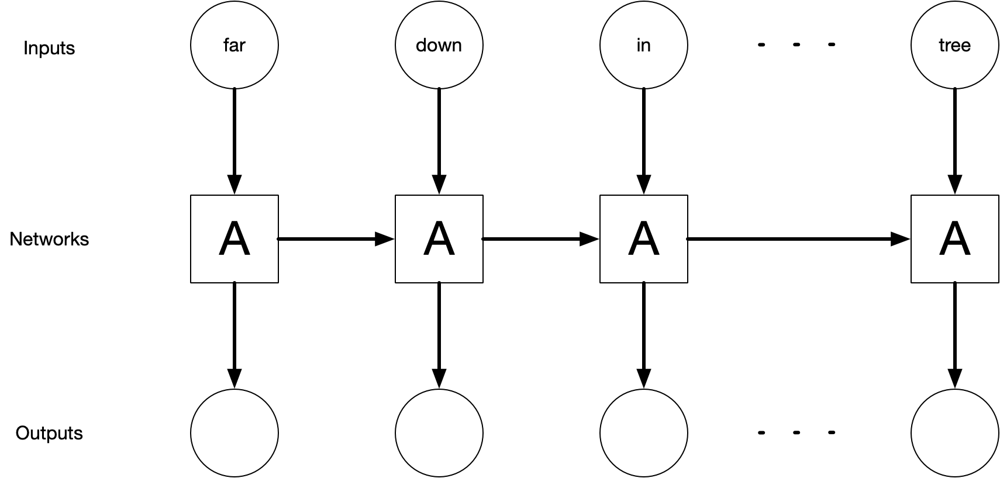

# Long short-term memory (LSTM) networks  {#dllstm}


In Chapter \@ref(dldnn), we trained our first deep learning models, with straightforward dense network architectures that provide a bridge for our understanding as we move from shallow learning algorithms to more complex network architectures. Those first neural network architectures are not simple compared to the kinds of models we used in Chapters \@ref(mlregression) and \@ref(mlclassification), but it is possible to build many more different and more complex kinds of networks for prediction with text data. This chapter will focus on the family of **long short-term memory** networks (LSTMs) [@Hochreiter1997].

## A first LSTM model {#firstlstm}

We will be using the same data from the previous chapter, described in Sections \@ref(kickstarter) and \@ref(kickstarter-blurbs). This data contains short text blurbs for prospective crowdfunding campaigns and whether those campaigns were successful. Our modeling goal is to predict whether a Kickstarter crowdfunding campaign was successful or not, based on the text blurb describing the campaign. Let's start by splitting our data into training and testing sets.


```r
library(tidyverse)

kickstarter <- read_csv("data/kickstarter.csv.gz")
kickstarter
```

```
#> # A tibble: 269,790 x 3
#>    blurb                                                        state created_at
#>    <chr>                                                        <dbl> <date>    
#>  1 Exploring paint and its place in a digital world.                0 2015-03-17
#>  2 Mike Fassio wants a side-by-side photo of me and Hazel eati…     0 2014-07-11
#>  3 I need your help to get a nice graphics tablet and Photosho…     0 2014-07-30
#>  4 I want to create a Nature Photograph Series of photos of wi…     0 2015-05-08
#>  5 I want to bring colour to the world in my own artistic skil…     0 2015-02-01
#>  6 We start from some lovely pictures made by us and we decide…     0 2015-11-18
#>  7 Help me raise money to get a drawing tablet                      0 2015-04-03
#>  8 I would like to share my art with the world and to do that …     0 2014-10-15
#>  9 Post Card don’t set out to simply decorate stories. Our goa…     0 2015-06-25
#> 10 My name is Siu Lon Liu and I am an illustrator seeking fund…     0 2014-07-19
#> # … with 269,780 more rows
```

```r
library(tidymodels)
set.seed(1234)
kickstarter_split <- kickstarter %>%
  filter(nchar(blurb) >= 15) %>%
  mutate(state = as.integer(state)) %>%
  initial_split()

kickstarter_train <- training(kickstarter_split)
kickstarter_test <- testing(kickstarter_split)
```

Just as described in Chapter \@ref(dldnn), the preprocessing needed for deep learning network architectures is somewhat different than for the models we used in Chapters \@ref(mlregression) and \@ref(mlclassification). The first step is still to tokenize the text, as described in Chapter \@ref(tokenization). After we tokenize, we filter to keep only how many words we'll include in the analysis; `step_tokenfilter()` keeps the top tokens based on frequency in this data set.


```r
library(textrecipes)

max_words <- 2e4
max_length <- 30

kick_rec <- recipe(~ blurb, data = kickstarter_train) %>%
  step_tokenize(blurb) %>%
  step_tokenfilter(blurb, max_tokens = max_words) %>%
  step_sequence_onehot(blurb, sequence_length = max_length)
```

After tokenizing, the preprocessing is different. We use `step_sequence_onehot()` to encode the sequences of words as integers representing each token in the vocabulary of 20,000 words, as described in detail in Section \@ref(onehotsequence). This is different than the representations we used in Chapters \@ref(mlregression) and \@ref(mlclassification), mainly because information about word sequence is encoded in this representation.

\BeginKnitrBlock{rmdnote}<div class="rmdnote">Using `step_sequence_onehot()` to preprocess text data records and encodes _sequence_ information, unlike the document-term matrix and/or bag-of-tokens approaches we used in Chapters \@ref(mlclassification) and \@ref(mlregression).</div>\EndKnitrBlock{rmdnote}

There are 202,093 blurbs in the training set and 67,364 in the testing set.

<div class="rmdpackage">
<p>Like we discussed in the last chapter, we are using <strong>recipes</strong> and <strong>textrecipes</strong> for preprocessing before modeling. When we <code>prep()</code> a recipe, we compute or estimate statistics from the training set; the output of <code>prep()</code> is a recipe. When we <code>bake()</code> a recipe, we apply the preprocessing to a data set, either the training set that we started with or another set like the testing data or new data. The output of <code>bake()</code> is a data set like a tibble or a matrix.</p>
</div>

We could have applied these `prep()` and `bake()` functions to any preprocessing recipes throughout this book, but we typically didn't need to because our modeling workflows automated these steps.


```r
kick_prep <- prep(kick_rec)
kick_matrix <- bake(kick_prep, new_data = NULL, composition = "matrix")

dim(kick_matrix)
```

```
#> [1] 202093     30
```

Here we use `composition = "matrix"` because the Keras modeling functions operate on matrices, rather than a dataframe or tibble.

### Building an LSTM

An LSTM is a specific kind of network architecture with feedback loops that allow information to persist through steps^[Vanilla neural networks do not have this ability for information to persist at all; they start learning from scratch at every step.] and memory cells that can learn to "remember" and "forget" information through sequences. LSTMs are well-suited for text because of this ability to process text as a long sequence of words or characters, and can model structures within text like word dependencies. LSTMs are useful in text modeling because of this memory through long sequences; they are also used for time series, machine translation, and similar problems.

Figure \@ref(fig:rnndiag) depicts a high-level diagram of how the LSTM unit of a network works. In the diagram, part of the neural network, $A$, operates on some of the input and outputs a value. During this process, some information is held inside $A$ to make the network "remember" this updated network. Network $A$ is then applied to the next input where it predicts new output and its memory is updated.

<div class="figure" style="text-align: center">

<p class="caption">(\#fig:rnndiag)High-level diagram of an unrolled recurrent neural network. The recurrent neural network is the backbone of LSTM networks.</p>
</div>

The exact shape and function of network $A$ are beyond the reach of this book. For further study, Christopher Olah's blog post ["Understanding LSTM Networks"](https://colah.github.io/posts/2015-08-Understanding-LSTMs/) gives a more technical overview of how LSTM networks work.

The Keras library has convenient functions for broadly used architectures like LSTMs so we don't have to build it from scratch using layers; we can instead use `layer_lstm()`. This comes _after_ an embedding layer that makes dense vectors from our word sequences and _before_ a densely-connected layer for output. 


```r
library(keras)

lstm_mod <- keras_model_sequential() %>%
  layer_embedding(input_dim = max_words + 1, output_dim = 32) %>%
  layer_lstm(units = 32) %>%
  layer_dense(units = 1, activation = "sigmoid")

lstm_mod
```

```
#> Model
#> Model: "sequential"
#> ________________________________________________________________________________
#> Layer (type)                        Output Shape                    Param #     
#> ================================================================================
#> embedding (Embedding)               (None, None, 32)                640032      
#> ________________________________________________________________________________
#> lstm (LSTM)                         (None, 32)                      8320        
#> ________________________________________________________________________________
#> dense (Dense)                       (None, 1)                       33          
#> ================================================================================
#> Total params: 648,385
#> Trainable params: 648,385
#> Non-trainable params: 0
#> ________________________________________________________________________________
```

\BeginKnitrBlock{rmdwarning}<div class="rmdwarning">Notice the number of parameters in this LSTM model, about twice as many as the dense neural networks in Chapter \@ref(dldnn). It is easier to overfit an LSTM model, and it takes more time and memory to train, because of the large number of parameters.</div>\EndKnitrBlock{rmdwarning}

Because we are training a binary classification model, we use `activation = "sigmoid"` for the last layer; we want to fit and predict to class probabilities.

Next we `compile()` the model, which configures the model for training with a specific optimizer and set of metrics. 

<div class="rmdnote">
<p>A good default optimizer for many problems is <code>"adam"</code> <span class="citation">[@kingma2017adam]</span>, and a good loss function for binary classification is <code>"binary_crossentropy"</code>.</p>
</div>


```r
lstm_mod %>%
  compile(
    optimizer = "adam",
    loss = "binary_crossentropy",
    metrics = c("accuracy")
  )
```

\BeginKnitrBlock{rmdwarning}<div class="rmdwarning">As we noted in Chapter \@ref(dldnn), the neural network model is modified **in place**; the object `lstm_mod` is different after we compile it, even though we didn't assign the object to anything. This is different from how most objects in R work, so pay special attention to the state of your model objects.</div>\EndKnitrBlock{rmdwarning}

After the model is compiled, we can fit it. The `fit()` method for Keras models has an argument `validation_split` that will set apart a fraction of the training data for evaluation and assessment. The performance metrics are evaluated on the validation set at the _end_ of each epoch.


```r
lstm_history <- lstm_mod %>%
  fit(
    kick_matrix,
    kickstarter_train$state,
    epochs = 10,
    validation_split = 0.25,
    batch_size = 512,
    verbose = FALSE
  )

lstm_history
```

```
#> 
#> Final epoch (plot to see history):
#>         loss: 0.2636
#>     accuracy: 0.8776
#>     val_loss: 0.5831
#> val_accuracy: 0.7825
```

The loss on the training data (called `loss` here) is much better than the loss on the validation data (`val_loss`), indicating that we are overfitting pretty dramatically. We can see this by plotting the history as well in Figure \@ref(fig:firstlstmhistory).


```r
plot(lstm_history)
```

<div class="figure" style="text-align: center">

<p class="caption">(\#fig:firstlstmhistory)Training and validation metrics for LSTM</p>
</div>

<div class="rmdnote">
<p>Remember that lower loss indicates a better fitting model, and higher accuracy (closer to 1) indicates a better model.</p>
</div>

This model continues to improve epoch after epoch on the training data, but performs worse on the validation set than the training set after the first few epochs and eventually starts to exhibit _worsening_ performance on the validation set as epochs pass, demonstrating how extremely it is overfitting to the training data. This is very common for powerful deep learning models, including LSTMs.

### Evaluation {#lstmevaluation}

We used some Keras defaults for model evaluation in the previous section, but just like we demonstrated in Section \@ref(evaluate-dnn), we can take more control if we want or need to. Instead of using the `validation_split` argument, we can use the `validation_data` argument and send in our own validation set creating with rsample.


```r
set.seed(234)
kick_val <- validation_split(kickstarter_train, strata = state)
kick_val
```

```
#> # Validation Set Split (0.75/0.25)  using stratification 
#> # A tibble: 1 x 2
#>   splits                 id        
#>   <list>                 <chr>     
#> 1 <split [151571/50522]> validation
```

We can access the two data sets specified by this `split` via the functions `analysis()` (the analog to training) and `assessment()` (the analog to testing). We need to apply our prepped preprocessing recipe `kick_prep` to both to transform this data to the appropriate format for our neural network architecture.


```r
kick_analysis <- bake(kick_prep, new_data = analysis(kick_val$splits[[1]]),
                      composition = "matrix")
dim(kick_analysis)
```

```
#> [1] 151571     30
```

```r
kick_assess <- bake(kick_prep, new_data = assessment(kick_val$splits[[1]]),
                    composition = "matrix")
dim(kick_assess)
```

```
#> [1] 50522    30
```

These are each matrices appropriate for a Keras model. We will also need the outcome variables for both sets.


```r
state_analysis <- analysis(kick_val$splits[[1]]) %>% pull(state)
state_assess <- assessment(kick_val$splits[[1]]) %>% pull(state)
```

Let's also think about our LSTM model architecture. We saw evidence for significant overfitting with our first LSTM, and we can counteract that by including dropout, both in the regular sense (`dropout`) and in the feedback loops (`recurrent_dropout`). 

<div class="rmdwarning">
<p>When we include some dropout, we temporarily remove some units together with their connections from the network. The purpose of this is typically to reduce overfitting <span class="citation">[@Srivastava2014]</span>. Dropout is not exclusive to LSTM models, and can also be used in many other kinds of network architectures. Another way to add dropout to a network is with <code>layer_dropout()</code>.</p>
</div>


```r
lstm_mod <- keras_model_sequential() %>%
  layer_embedding(input_dim = max_words + 1, output_dim = 32) %>%
  layer_lstm(units = 32, dropout = 0.4, recurrent_dropout = 0.4) %>%
  layer_dense(units = 1, activation = "sigmoid")

lstm_mod %>%
  compile(
    optimizer = "adam",
    loss = "binary_crossentropy",
    metrics = c("accuracy")
  )

val_history <- lstm_mod %>%
  fit(
    kick_analysis,
    state_analysis,
    epochs = 10,
    validation_data = list(kick_assess, state_assess),
    batch_size = 512,
    verbose = FALSE
  )

val_history
```

```
#> 
#> Final epoch (plot to see history):
#>         loss: 0.3756
#>     accuracy: 0.824
#>     val_loss: 0.6022
#> val_accuracy: 0.7385
```

The overfitting has been reduced, and Figure \@ref(fig:lstmvalhistory) shows that the difference between our model's performance on training and validation data is now smaller.


```r
plot(val_history)
```

<div class="figure" style="text-align: center">

<p class="caption">(\#fig:lstmvalhistory)Training and validation metrics for LSTM with dropout</p>
</div>

Remember that this is specific validation data that we have chosen ahead of time, so we can evaluate metrics flexibly in any way we need to, for example, using yardstick functions. We can create a tibble with the true and predicted values for the validation set.


```r
val_res <- keras_predict(lstm_mod, kick_assess, state_assess)
val_res %>% metrics(state, .pred_class, .pred_1)
```

```
#> # A tibble: 4 x 3
#>   .metric     .estimator .estimate
#>   <chr>       <chr>          <dbl>
#> 1 accuracy    binary         0.739
#> 2 kap         binary         0.475
#> 3 mn_log_loss binary         0.602
#> 4 roc_auc     binary         0.808
```


A regularized linear model trained on this data set achieved results of accuracy of 0.684 and an AUC for the ROC curve of 0.752 (Appendix \@ref(appendixbaseline)). This first LSTM with dropout is already performing better than such a linear model. We can plot the ROC curve in Figure \@ref(fig:lstmvalroc) to evaluate the performance across the range of thresholds. 


```r
val_res %>%
  roc_curve(state, .pred_1) %>%
  autoplot()
```

<div class="figure" style="text-align: center">

<p class="caption">(\#fig:lstmvalroc)ROC curve for LSTM with dropout predictions of Kickstarter campaign success</p>
</div>

## Compare to a recurrent neural network

An LSTM is actually a specific kind of recurrent neural network (RNN) [@ELMAN1990179]. Simple RNNs have feedback loops and hidden state that allow information to persist through steps but do not have memory cells like LSTMs. This difference between RNNs and LSTMs amounts to what happens in network $A$ in Figure \@ref(fig:rnndiag). RNNs tend to have a very simple structure, typically just a single `tanh()` layer, much simpler than what happens in LSTMs.

<div class="rmdwarning">
<p>Simple RNNs can only connect very recent information and structure in sequences, but LSTMS can learn long-range dependencies and broader context.</p>
</div>

Let's train an RNN to see how it compares to the LSTM.


```r
rnn_mod <- keras_model_sequential() %>%
  layer_embedding(input_dim = max_words + 1, output_dim = 32) %>%
  layer_simple_rnn(units = 32, dropout = 0.4, recurrent_dropout = 0.4) %>%
  layer_dense(units = 1, activation = "sigmoid")

rnn_mod %>%
  compile(
    optimizer = "adam",
    loss = "binary_crossentropy",
    metrics = c("accuracy")
  )

rnn_history <- rnn_mod %>%
  fit(
    kick_analysis,
    state_analysis,
    epochs = 10,
    validation_data = list(kick_assess, state_assess),
    batch_size = 512,
    verbose = FALSE
  )

rnn_history
```

```
#> 
#> Final epoch (plot to see history):
#>         loss: 0.4996
#>     accuracy: 0.7663
#>     val_loss: 0.6204
#> val_accuracy: 0.6949
```

Looks like more overfitting! We can see this by plotting the history as well in Figure \@ref(fig:rnnhistory).


```r
plot(rnn_history)
```

<div class="figure" style="text-align: center">

<p class="caption">(\#fig:rnnhistory)Training and validation metrics for RNN</p>
</div>

These results are pretty disappointing overall, with worse performance than our first LSTM. Simple RNNs like the ones in this section can be challenging to train well, and just cranking up the number of embedding dimensions, units, or other network characteristics usually does not fix the problem. Often, RNNs just don't work well compared to simpler deep learning architectures like the dense network introduced in Section \@ref(firstdlclassification) [@Minaee2020], or even other machine learning approaches like regularized linear models with good preprocessing. 

Fortunately, we can build on the ideas of a simple RNN with more complex architectures like LSTMs to build better performing models.

## Case study: bidirectional LSTM {#bilstm}

The RNNs and LSTMs that we have fit so far have modeled text as sequences, specifically sequences where information and memory persists moving forward. These kinds of models can learn structures and dependencies moving forward _only_. In language, the structures move both directions, though; the words that come _after_ a given structure or word can be just as important for understanding it as the ones that come before it.

We can build this into our neural network architecture with a **bidirectional** wrapper for RNNs or LSTMs. 

<div class="rmdnote">
<p>A bidirectional LSTM allows the network to have both the forward and backward information about the sequences at each step.</p>
</div>

The input sequences are passed through the network in two directions, both forward and backward, allowing the network to learn more context, structures, and dependencies.


```r
bilstm_mod <- keras_model_sequential() %>%
  layer_embedding(input_dim = max_words + 1, output_dim = 32) %>%
  bidirectional(layer_lstm(units = 32, dropout = 0.4,
                           recurrent_dropout = 0.4)) %>%
  layer_dense(units = 1, activation = "sigmoid")

bilstm_mod %>%
  compile(
    optimizer = "adam",
    loss = "binary_crossentropy",
    metrics = c("accuracy")
  )

bilstm_history <- bilstm_mod %>%
  fit(
    kick_analysis,
    state_analysis,
    epochs = 10,
    validation_data = list(kick_assess, state_assess),
    batch_size = 512,
    verbose = FALSE
  )

bilstm_history
```

```
#> 
#> Final epoch (plot to see history):
#>         loss: 0.3659
#>     accuracy: 0.8294
#>     val_loss: 0.6045
#> val_accuracy: 0.7396
```

The bidirectional LSTM is more able to represent the data well, but with the same amount of dropout, we do see more dramatic overfitting. Still, there is some improvement on the validation set as well. 


```r
bilstm_res <- keras_predict(bilstm_mod, kick_assess, state_assess)
bilstm_res %>% metrics(state, .pred_class, .pred_1)
```

```
#> # A tibble: 4 x 3
#>   .metric     .estimator .estimate
#>   <chr>       <chr>          <dbl>
#> 1 accuracy    binary         0.740
#> 2 kap         binary         0.478
#> 3 mn_log_loss binary         0.604
#> 4 roc_auc     binary         0.809
```

This bidirectional LSTM, able to learn both forward and backward text structures, provides some improvement over the regular LSTM on the validation set (which had an accuracy of 0.739). 

## Case study: stacking LSTM layers

Deep learning architectures can be built up to create extremely complex networks. For example, RNN and/or LSTM layers can be stacked on top of each other, or together with other kinds of layers. The idea of this stacking is to increase the ability of a network to represent the data well. 

<div class="rmdwarning">
<p>Intermediate layers must be set up to return sequences (with <code>return_sequences = TRUE</code>) instead of the last output for each sequence.</p>
</div>

Let's start by adding one single additional layer.


```r
stacked_mod <- keras_model_sequential() %>%
  layer_embedding(input_dim = max_words + 1, output_dim = 32) %>%
  layer_lstm(units = 32, dropout = 0.4, recurrent_dropout = 0.4,
             return_sequences = TRUE) %>%
  layer_lstm(units = 32, dropout = 0.4, recurrent_dropout = 0.4) %>%
  layer_dense(units = 1, activation = "sigmoid")

stacked_mod %>%
  compile(
    optimizer = "adam",
    loss = "binary_crossentropy",
    metrics = c("accuracy")
  )

stacked_history <- stacked_mod %>%
  fit(
    kick_analysis,
    state_analysis,
    epochs = 10,
    validation_data = list(kick_assess, state_assess),
    batch_size = 512,
    verbose = FALSE
  )

stacked_history
```

```
#> 
#> Final epoch (plot to see history):
#>         loss: 0.3812
#>     accuracy: 0.8226
#>     val_loss: 0.5919
#> val_accuracy: 0.7387
```

Adding another separate layer in the forward direction appears to have improved the network, about as much as extending the LSTM layer to handle information in the backward direction via the bidirectional LSTM.


```r
stacked_res <- keras_predict(stacked_mod, kick_assess, state_assess)
stacked_res %>% metrics(state, .pred_class, .pred_1)
```

```
#> # A tibble: 4 x 3
#>   .metric     .estimator .estimate
#>   <chr>       <chr>          <dbl>
#> 1 accuracy    binary         0.739
#> 2 kap         binary         0.475
#> 3 mn_log_loss binary         0.592
#> 4 roc_auc     binary         0.806
```

We can gradually improve a model by changing and adding to its architecture.

## Case study: padding {#lstmpadding}

One of the most important themes of this book is that text must be heavily preprocessed in order to be useful for machine learning algorithms, and these preprocessing decisions have big effects on model results. One decision that seems like it may not be all that important is how sequences are _padded_ for a deep learning model. The matrix that is used as input for a neural network must be rectangular, but the training data documents are typically all different lengths. Sometimes, like the case of the Supreme Court opinions, the lengths vary a lot; sometimes, like with the Kickstarter data, the lengths vary a little bit. 

Either way, the sequences that are too long must be truncated and the sequences that are too short must be padded, typically with zeroes. This does literally mean that words or tokens are thrown away for the long documents and zeroes are added to the shorter documents, with the goal of creating a rectangular matrix that can be used for computation. 

<div class="rmdnote">
<p>It is possible to set up an LSTM network that works with sequences of varied length; this can sometimes improve performance but takes more work to set up and is outside the scope of this book.</p>
</div>

The default in textrecipes, as well as most deep learning for text, is `padding = "pre"`, where zeroes are added at the beginning, and `truncating = "pre"`, where values at the beginning are removed. What happens if we change one of these defaults?


```r
padding_rec <- recipe(~ blurb, data = kickstarter_train) %>%
  step_tokenize(blurb) %>%
  step_tokenfilter(blurb, max_tokens = max_words) %>%
  step_sequence_onehot(blurb, sequence_length = max_length, padding = "post")

padding_prep <- prep(padding_rec)
padding_matrix <- bake(padding_prep, new_data = NULL, composition = "matrix")
dim(padding_matrix)
```

```
#> [1] 202093     30
```

This matrix has the same dimensions as `kick_matrix` but instead of padding with zeroes at the beginning of these Kickstarter blurbs, this matrix is padded with zeroes at the end. (This preprocessing strategy still truncates longer sequences in the same way.)


```r
pad_analysis <- bake(padding_prep, new_data = analysis(kick_val$splits[[1]]),
                     composition = "matrix")
pad_assess <- bake(padding_prep, new_data = assessment(kick_val$splits[[1]]),
                   composition = "matrix")
```

Now, let's create and fit an LSTM to this preprocessed data.


```r
padding_mod <- keras_model_sequential() %>%
  layer_embedding(input_dim = max_words + 1, output_dim = 32) %>%
  layer_lstm(units = 32, dropout = 0.4, recurrent_dropout = 0.4) %>%
  layer_dense(units = 1, activation = "sigmoid")

padding_mod %>%
  compile(
    optimizer = "adam",
    loss = "binary_crossentropy",
    metrics = c("accuracy")
  )

padding_history <- padding_mod %>%
  fit(
    pad_analysis,
    state_analysis,
    epochs = 10,
    validation_data = list(pad_assess, state_assess),
    batch_size = 512,
    verbose = FALSE
  )

padding_history
```

```
#> 
#> Final epoch (plot to see history):
#>         loss: 0.4404
#>     accuracy: 0.7811
#>     val_loss: 0.5868
#> val_accuracy: 0.7178
```

This padding strategy results in noticeably worse performance than the default option!


```r
padding_res <- keras_predict(padding_mod, pad_assess, state_assess)
padding_res %>% metrics(state, .pred_class, .pred_1)
```

```
#> # A tibble: 4 x 3
#>   .metric     .estimator .estimate
#>   <chr>       <chr>          <dbl>
#> 1 accuracy    binary         0.718
#> 2 kap         binary         0.433
#> 3 mn_log_loss binary         0.587
#> 4 roc_auc     binary         0.791
```

The same model architecture with default padding preprocessing resulted in an accuracy of 0.739 and an AUC of 0.808; changing to `padding = "post"` has resulted in a remarkable degrading of predictive capacity. This result is typically attributed to the RNN/LSTM's hidden states being flushed out by the added zeroes, before getting to the text itself.

<div class="rmdwarning">
<p>Different preprocessing strategies have a huge impact on deep learning results.</p>
</div>

## Case study: training a regression model

All our deep learning models for text so far have used the Kickstarter crowdfunding blurbs to predict whether the campaigns were successful or not, a classification problem. In our experience, classification is more common than regression tasks with text data, but these techniques can be used for either kind of supervised machine learning question. Let's return to the regression problem of Chapter \@ref(mlregression) and predict the year of United States Supreme Court decisions, starting out by splitting into training and testing sets.


```r
library(scotus)
set.seed(1234)
scotus_split <- scotus_filtered %>%
  mutate(
    year = (as.numeric(year) - 1920) / 50,
    text = str_remove_all(text, "'")
  ) %>%
  initial_split(strata = year)

scotus_train <- training(scotus_split)
scotus_test <- testing(scotus_split)
```

<div class="rmdwarning">
<p>Notice that we also shifted (subtracted) and scaled (divided) the <code>year</code> outcome by constant factors so all the values are centered around zero and not too large. Neural networks for regression problems typically behave better when dealing with outcomes that are roughly between -1 and 1.</p>
</div>

Next, let's build a preprocessing recipe for these Supreme Court decisions. These documents are much longer than the Kickstarter blurbs, many thousands of words long instead of just a handful. Let's try keeping the size of our vocabulary the same (`max_words`) but we will need to increase the sequence length information we store (`max_length`) by a great deal.


```r
max_words <- 2e4
max_length <- 1e3

scotus_rec <- recipe(~ text, data = scotus_train) %>%
  step_tokenize(text) %>%
  step_tokenfilter(text, max_tokens = max_words) %>%
  step_sequence_onehot(text, sequence_length = max_length)

scotus_prep <- prep(scotus_rec)
scotus_train_baked <- bake(scotus_prep,
                           new_data = scotus_train,
                           composition = "matrix")
scotus_test_baked <- bake(scotus_prep,
                          new_data = scotus_test,
                          composition = "matrix")
```

What does our training data look like now?


```r
dim(scotus_train_baked)
```

```
#> [1] 7502 1000
```

We only have 7502 rows of training data, and because these documents are so long and we want to keep more of each sequence, the training data has 1000 columns. You are probably starting to guess that we are going to run into problems.

Let's create an LSTM and see what we can do. We will need to use higher-dimensional embeddings, since our sequences are much longer (we may want to increase the number of `units` as well, but will leave that out for the time being). Because we are training a regression model, there is no activation function for the last layer; we want to fit and predict to arbitrary values for the year.

<div class="rmdnote">
<p>A good default loss function for regression is mean squared error, <code>"mse"</code>.</p>
</div>


```r
scotus_mod <- keras_model_sequential() %>%
  layer_embedding(input_dim = max_words + 1, output_dim = 64) %>%
  layer_lstm(units = 32, dropout = 0.4, recurrent_dropout = 0.4) %>%
  layer_dense(units = 1)

scotus_mod %>%
  compile(
    optimizer = "adam",
    loss = "mse",
    metrics = c("mean_squared_error")
  )

scotus_history <- scotus_mod %>%
  fit(
    scotus_train_baked,
    scotus_train$year,
    epochs = 10,
    validation_split = 0.25,
    verbose = FALSE
  )
```

How does this model perform on the test data? Let's transform back to real values for `year` so our metrics will be on the same scale as in Chapter \@ref(mlregression).


```r
scotus_res <- tibble(year = scotus_test$year,
                     .pred = predict(scotus_mod, scotus_test_baked)[, 1]) %>%
  mutate(across(everything(), ~ . * 50 + 1920))

scotus_res %>% metrics(year, .pred)
```

```
#> # A tibble: 3 x 3
#>   .metric .estimator .estimate
#>   <chr>   <chr>          <dbl>
#> 1 rmse    standard      18.4  
#> 2 rsq     standard       0.862
#> 3 mae     standard      13.6
```

This is much worse than the final regularized linear model trained in Section \@ref(mlregressionfull), with an RMSE almost a decade worth of years worse. It's possible we may be able to do a little better than this simple LSTM, but as this chapter has demonstrated, our improvements will likely not be enormous compared to the first LSTM baseline. 

<div class="rmdwarning">
<p>The main problem with this regression model is that there isn’t that much data to start with; this is an example where a deep learning model is <em>not</em> a good choice and we should stick with a different machine learning algorithm like regularized regression.</p>
</div>

## Case study: vocabulary size

In this chapter so far, we've worked with a vocabulary of 20,000 words or tokens. This is a _hyperparameter_ of the model, and could be tuned, as we show in detail in Section \@ref(keras-hyperparameter). Instead of tuning in this chapter, let's try a smaller value, corresponding to faster preprocessing and model fitting but a less powerful model, and explore whether and how much it affects model performance. 


```r
max_words <- 1e4
max_length <- 30

smaller_rec <- recipe(~ blurb, data = kickstarter_train) %>%
  step_tokenize(blurb) %>%
  step_tokenfilter(blurb, max_tokens = max_words) %>%
  step_sequence_onehot(blurb, sequence_length = max_length)

kick_prep <- prep(smaller_rec)
kick_analysis <- bake(kick_prep, new_data = analysis(kick_val$splits[[1]]),
                      composition = "matrix")
kick_assess <- bake(kick_prep, new_data = assessment(kick_val$splits[[1]]),
                    composition = "matrix")
```

Once our preprocessing is done and applied to our validation split `kick_val`, we can set up our model, another straightforward LSTM neural network.


```r
smaller_mod <- keras_model_sequential() %>%
  layer_embedding(input_dim = max_words + 1, output_dim = 32) %>%
  layer_lstm(units = 32, dropout = 0.4, recurrent_dropout = 0.4) %>%
  layer_dense(units = 1, activation = "sigmoid")

smaller_mod %>%
  compile(
    optimizer = "adam",
    loss = "binary_crossentropy",
    metrics = c("accuracy")
  )

smaller_history <- smaller_mod %>%
  fit(
    kick_analysis,
    state_analysis,
    epochs = 10,
    validation_data = list(kick_assess, state_assess),
    batch_size = 512,
    verbose = FALSE
  )

smaller_history
```

```
#> 
#> Final epoch (plot to see history):
#>         loss: 0.4712
#>     accuracy: 0.7669
#>     val_loss: 0.582
#> val_accuracy: 0.7093
```

How did this smaller model, based on a smaller vocabulary in the model, perform?


```r
smaller_res <- keras_predict(smaller_mod, kick_assess, state_assess)
smaller_res %>% metrics(state, .pred_class, .pred_1)
```

```
#> # A tibble: 4 x 3
#>   .metric     .estimator .estimate
#>   <chr>       <chr>          <dbl>
#> 1 accuracy    binary         0.709
#> 2 kap         binary         0.417
#> 3 mn_log_loss binary         0.582
#> 4 roc_auc     binary         0.782
```

The original LSTM model with the larger vocabulary had an accuracy of 0.739 and an AUC of 0.808. Reducing the model's capacity to capture and learn text meaning by restricting its access to vocabulary does result in a corresponding reduction in model performance, but a small one.

<div class="rmdnote">
<p>The relationship between this hyperparameter and model performance is weak over this range. Notice that we cut the vocabulary in half, and saw only modest reductions in accuracy.</p>
</div>

## The full game: LSTM {#lstmfull}

We've come a long way in this chapter, even though we've focused on a very specific kind of recurrent neural network, the LSTM. Let's step back and build one final model, incorporating what we have been able to learn.

### Preprocess the data {#lstmfullpreprocess}

We know that we want to stick with the defaults for padding, and to use a larger vocabulary for our final model. For this final model, we are not going to use our validation split again, so we only need to preprocess the training data.


```r
max_words <- 2e4
max_length <- 30

kick_rec <- recipe(~ blurb, data = kickstarter_train) %>%
  step_tokenize(blurb) %>%
  step_tokenfilter(blurb, max_tokens = max_words) %>%
  step_sequence_onehot(blurb, sequence_length = max_length)

kick_prep <- prep(kick_rec)
kick_matrix <- bake(kick_prep, new_data = NULL, composition = "matrix")

dim(kick_matrix)
```

```
#> [1] 202093     30
```

### Specify the model {#lstmfullmodel}

We've learned a lot about how to model this data set over the course of this chapter.

- We can use `dropout` to reduce overfitting.

- Let's stack several layers together, and in fact increase the number of LSTM layers to three.

- The bidirectional LSTM performed better than the regular LSTM, so let's set up each LSTM layer to be able to learn sequences in both directions.

Instead of using specific validation data that we can then compute performance metrics for, let's go back to specifying `validation_split = 0.1` and let the Keras model choose the validation set.


```r
final_mod <- keras_model_sequential() %>%
  layer_embedding(input_dim = max_words + 1, output_dim = 32) %>%
  bidirectional(layer_lstm(
    units = 32, dropout = 0.4, recurrent_dropout = 0.4,
    return_sequences = TRUE
  )) %>%
  bidirectional(layer_lstm(
    units = 32, dropout = 0.4, recurrent_dropout = 0.4,
    return_sequences = TRUE
  )) %>%
  bidirectional(layer_lstm(
    units = 32, dropout = 0.4, recurrent_dropout = 0.4
  )) %>%
  layer_dense(units = 1, activation = "sigmoid")

final_mod %>%
  compile(
    optimizer = "adam",
    loss = "binary_crossentropy",
    metrics = c("accuracy")
  )

final_history <- final_mod %>%
  fit(
    kick_matrix,
    kickstarter_train$state,
    epochs = 10,
    validation_split = 0.1,
    batch_size = 512,
    verbose = FALSE
  )

final_history
```

```
#> 
#> Final epoch (plot to see history):
#>         loss: 0.3358
#>     accuracy: 0.8487
#>     val_loss: 0.5305
#> val_accuracy: 0.7794
```

This looks promising! Let's finally turn to the testing set, for the first time during this chapter, to evaluate this last model on data that has never been touched as part of the fitting process.


```r
kick_matrix_test <- bake(kick_prep, new_data = kickstarter_test,
                         composition = "matrix")
final_res <- keras_predict(final_mod, kick_matrix_test, kickstarter_test$state)
final_res %>% metrics(state, .pred_class, .pred_1)
```

```
#> # A tibble: 4 x 3
#>   .metric     .estimator .estimate
#>   <chr>       <chr>          <dbl>
#> 1 accuracy    binary         0.763
#> 2 kap         binary         0.524
#> 3 mn_log_loss binary         0.565
#> 4 roc_auc     binary         0.832
```

This is our best performing model in this chapter on LSTM models, although not by much. We can again create an ROC curve, this time using the test data in Figure \@ref(fig:lstmfinalroc).


```r
final_res %>%
  roc_curve(state, .pred_1) %>%
  autoplot()
```

<div class="figure" style="text-align: center">

<p class="caption">(\#fig:lstmfinalroc)ROC curve for final LSTM model predictions on testing set of Kickstarter campaign success</p>
</div>

We have been able to incrementally improve our model by adding to the structure and making good choices about preprocessing. We can visualize this final LSTM model's performance using a confusion matrix as well, in Figure \@ref(fig:lstmheatmap).


```r
final_res %>%
  conf_mat(state, .pred_class) %>%
  autoplot(type = "heatmap")
```

<div class="figure" style="text-align: center">

<p class="caption">(\#fig:lstmheatmap)Confusion matrix for final LSTM model predictions on testing set of Kickstarter campaign success</p>
</div>

Notice that this final model still does not perform as well as any of the best models of Chapter \@ref(dldnn).

<div class="rmdnote">
<p>For this data set of Kickstarter campaign blurbs, an LSTM architecture is not turning out to give a great result compared to other options. However, LSTMs typically perform very well for text data and are an important piece of the text modeling toolkit.</p>
</div>

For the Kickstarter data, these less-than-spectacular results are likely due to the documents' short lengths. LSTMs often work well for text data, but this is not universally true for all kinds of text. Also, keep in mind that LSTMs take both more time and memory to train, compared to the simpler models discussed in Chapter \@ref(dldnn).

## Summary {#dllstmsummary}

LSTMs are a specific kind of recurrent neural network that are capable of learning long-range dependencies and broader context. They are often an excellent choice for building supervised models for text because of this ability to model sequences and structures within text like word dependencies. Text must be heavily preprocessed for LSTMs in much the same way it needs to be preprocessed for dense neural networks, with tokenization and one-hot encoding of sequences. A major characteristic of LSTMs, like other deep learning architectures, is their tendency to memorize the features of training data; we can use strategies like dropout and ensuring that the batch size is large enough to reduce overfitting.

### In this chapter, you learned:

- how to preprocess text data for LSTM models

- about RNN, LSTM, and bidirectional LSTM network architectures

- how to use dropout to reduce overfitting for deep learning models

- that network layers (including RNNs and LSTMs) can be stacked for greater model capacity

- about the importance of centering and scaling regression outcomes for neural networks

- how to evaluate LSTM models for text
