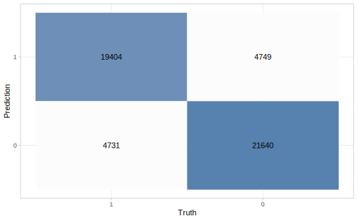
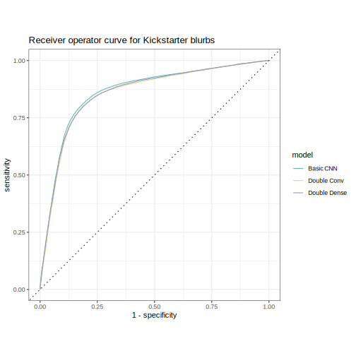
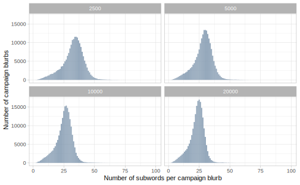
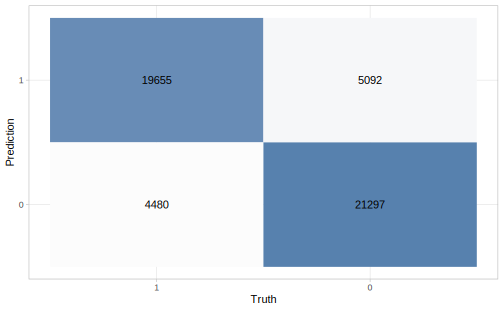
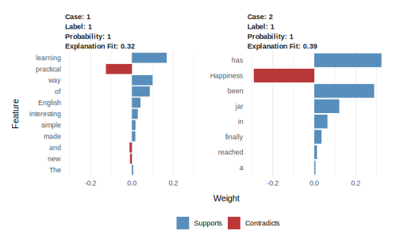
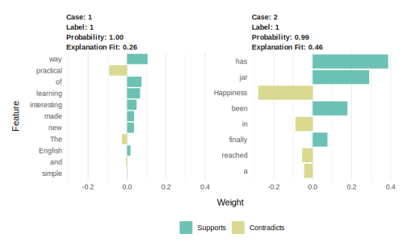
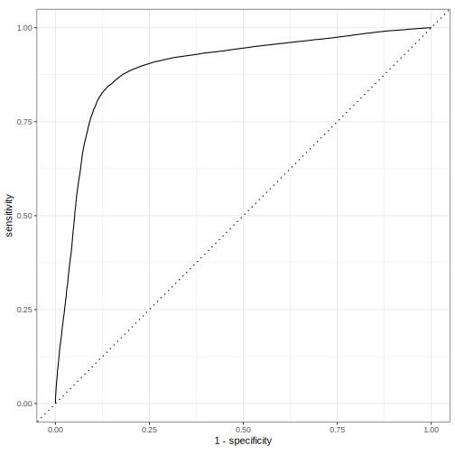
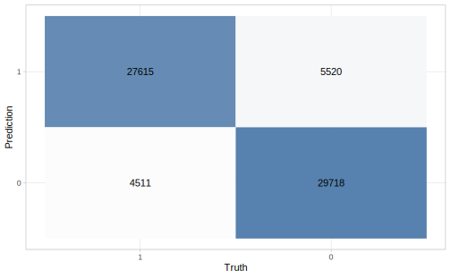

# Convolutional neural networks {#dlcnn}


The first neural networks\index{network architecture} we built in Chapter \@ref(dldnn) did not have the capacity to learn much about structure, sequences, or long-range dependencies in our text data. The LSTM networks we trained in Chapter \@ref(dllstm) were especially suited to learning long-range dependencies. In this final chapter, we will focus on \index{neural network!convolutional} **convolutional neural network** (CNN) architecture [@kim2014], which can learn local, spatial structure within data.

CNNs can be well-suited for modeling text data because text often contains quite a lot of local structure. A CNN does not learn long-range structure within a sequence like an LSTM, but instead detects local patterns. A CNN network layer takes data (like text) as input and then hopefully produces output that represents specific structures\index{language!structure} in the data.

<div class="rmdnote">
<p>Let’s take more time with CNNs in this chapter to explore their construction, different features, and the hyperparameters we can tune.</p>
</div>

## What are CNNs?

CNNs can work with data of different dimensions (like two-dimensional images or three-dimensional video), but for text modeling, we typically work in one dimension. The illustrations and explanations in this chapter use only one dimension to match the text use case. 
Figure \@ref(fig:cnn-architecture) illustrates a typical CNN architecture.
A convolutional filter slides along the sequence to produce a new, smaller sequence. This is repeated multiple times, typically with different parameters for each layer, until we are left with a small data cube that we can transform into our required output shape, a value between 0 and 1 in the case of binary classification.

<div class="figure" style="text-align: center">

<p class="caption">(\#fig:cnn-architecture)A template CNN architecture for one-dimensional input data. A sequence of consecutive CNN layers incremently reduces the size, ending with single output value.</p>
</div>

This figure isn't entirely accurate because we technically don't feed characters into a CNN, but instead use one-hot sequence encoding (Section \@ref(onehotsequence)) with a possible word embedding.
Let's talk about two of the most important CNN concepts, **kernels** and **kernel size**.

### Kernel

The kernel is a small vector that slides along the input. When it is sliding, it performs element-wise multiplication of the values in the input and its own weights, and then sums up the values to get a single value. 
Sometimes an activation function is applied as well.
It is these weights that are trained via gradient descent to find the best fit.
In Keras, the `filters` represent how many different kernels are trained in each layer. You typically start with fewer `filters` at the beginning of your network and then increase them as you go along. 

### Kernel size

The most prominent hyperparameter is the kernel size. 
The kernel size is the length of the vector that contains the weights. A kernel of size 5 will have 5 weights. These kernels can capture local information similarly to how n-grams capture location patterns. Increasing the size of the kernel decreases the size of the output, as shown in Figure \@ref(fig:cnn-kernel-size).

<div class="figure" style="text-align: center">

<p class="caption">(\#fig:cnn-kernel-size)The kernel size affects the size of the output. A kernel size of 3 uses the information from 3 values to compute 1 value.</p>
</div>

Larger kernels learn larger and less frequent patterns, while smaller kernels will find fine-grained features. 
Notice how the choice of token affects how we think about kernel size. 
For character tokenization, a kernel size of 5 will (in early layers) find patterns in subwords more often than patterns across words, since 5 characters will typically not span multiple words. 
By contrast, a kernel size of 5 with word tokenization will learn patterns within sentences instead. 

## A first CNN model {#firstcnn}

\index{neural network!convolutional}We will be using the same data, which we examine in Sections \@ref(kickstarter) and \@ref(kickstarter-blurbs) and use throughout Chapters \@ref(dldnn) and \@ref(dllstm). This data set contains short text blurbs for prospective crowdfunding campaigns on Kickstarter, along with if they were successful. Our goal of this modeling is to predict successful campaigns from the text contained in the blurb. We will also use the same \index{preprocessing}preprocessing and feature engineering recipe that we created and described in Sections \@ref(dnnrecipe) and \@ref(firstlstm).


Our first CNN will look a lot like what is shown in Figure \@ref(fig:cnn-architecture).
We start with an embedding layer, followed by a single one-dimensional convolution layer `layer_conv_1d()`, then a global max pooling layer `layer_global_max_pooling_1d()`, a densely connected layer, and end with a dense layer with a sigmoid activation function to give us one value between 0 and 1 to use in our binary classification task.


```r
library(keras)

simple_cnn_model <- keras_model_sequential() %>%
  layer_embedding(input_dim = max_words + 1, output_dim = 16,
                  input_length = max_length) %>%
  layer_conv_1d(filter = 32, kernel_size = 5, activation = "relu") %>%
  layer_global_max_pooling_1d() %>%
  layer_dense(units = 64, activation = "relu") %>%
  layer_dense(units = 1, activation = "sigmoid")

simple_cnn_model
```

```
#> Model
#> Model: "sequential"
#> ________________________________________________________________________________
#> Layer (type)                        Output Shape                    Param #     
#> ================================================================================
#> embedding (Embedding)               (None, 30, 16)                  320016      
#> ________________________________________________________________________________
#> conv1d (Conv1D)                     (None, 26, 32)                  2592        
#> ________________________________________________________________________________
#> global_max_pooling1d (GlobalMaxPool (None, 32)                      0           
#> ________________________________________________________________________________
#> dense_1 (Dense)                     (None, 64)                      2112        
#> ________________________________________________________________________________
#> dense (Dense)                       (None, 1)                       65          
#> ================================================================================
#> Total params: 324,785
#> Trainable params: 324,785
#> Non-trainable params: 0
#> ________________________________________________________________________________
```

We are using the same embedding layer with the same `max_length` as in the previous networks so there is nothing new there.
The `layer_global_max_pooling_1d()` layer collapses the remaining CNN output into one dimension so we can finish it off with a densely connected layer and the sigmoid activation function.

This might not end up being the best CNN configuration, but it is a good starting point.
One of the challenges when working with CNNs is to ensure that we manage the dimensionality correctly. The length of the sequence decreases by `(kernel_size - 1)` for each layer. For this input, we have a sequence of length `max_length = 30`, which is decreased by `(5 - 1) = 4` resulting in a sequence of 26, as shown in the printed output of `simple_cnn_model`. We could create seven layers with `kernel_size = 5`, since we would end with `30 - 4 - 4 - 4 - 4 - 4 - 4 - 4 = 2` elements in the resulting sequence. However, we would not be able to do a network with 3 layers of 
`kernel_size = 7` followed by 3 layers of `kernel_size = 5` since the resulting sequence would be `30 - 6 - 6 - 6 - 4 - 4 - 4 = 0` and we must have a positive length for our sequence.
Remember that `kernel_size` is not the only argument that will change the length of the resulting sequence. \index{network architecture}

<div class="rmdnote">
<p>Constructing a sequence layer by layer and using the print method from <strong>keras</strong> to check the configuration is a great way to make sure your architecture is valid.</p>
</div>


The compilation and fitting are the same as we have seen before, using a validation split created with tidymodels as shown in Sections \@ref(evaluate-dnn) and \@ref(lstmevaluation). 


```r
simple_cnn_model %>% compile(
  optimizer = "adam",
  loss = "binary_crossentropy",
  metrics = c("accuracy")
)

cnn_history <- simple_cnn_model %>% fit(
  x = kick_analysis,
  y = state_analysis,
  batch_size = 512,
  epochs = 10,
  validation_data = list(kick_assess, state_assess)
)
```

\index{optimization algorithm}
<div class="rmdnote">
<p>We are using the <code>"adam"</code> optimizer since it performs well for many kinds of models. You may have to experiment to find the optimizer that works best for your model and data.</p>
</div>

Now that the model is done fitting, we can evaluate it on the validation data set using the same `keras_predict()` function we created in Section \@ref(evaluate-dnn) and used throughout Chapters \@ref(dldnn) and \@ref(dllstm).


```r
val_res <- keras_predict(simple_cnn_model, kick_assess, state_assess)
val_res
```

```
#> # A tibble: 50,524 × 3
#>      .pred_1 .pred_class state
#>        <dbl> <fct>       <fct>
#>  1 0.0000813 0           0    
#>  2 0.000250  0           0    
#>  3 0.000561  0           0    
#>  4 0.952     1           0    
#>  5 1.00      1           1    
#>  6 1.00      1           1    
#>  7 0.0000564 0           0    
#>  8 0.00195   0           0    
#>  9 1.00      1           1    
#> 10 0.998     1           1    
#> # … with 50,514 more rows
```

We can calculate some standard metrics with `metrics()`.


```r
metrics(val_res, state, .pred_class, .pred_1)
```

```
#> # A tibble: 4 × 3
#>   .metric     .estimator .estimate
#>   <chr>       <chr>          <dbl>
#> 1 accuracy    binary         0.809
#> 2 kap         binary         0.618
#> 3 mn_log_loss binary         0.951
#> 4 roc_auc     binary         0.862
```

We already see improvement over the densely connected network from Chapter \@ref(dldnn), our best performing model on the Kickstarter data so far.

The heatmap\index{matrix!confusion} in Figure \@ref(fig:cnnheatmap) shows that the model performs about the same for the two classes, success and failure for the crowdfunding campaigns; we are getting fairly good results from a baseline CNN model!


```r
val_res %>%
  conf_mat(state, .pred_class) %>%
  autoplot(type = "heatmap")
```

<div class="figure" style="text-align: center">

<p class="caption">(\#fig:cnnheatmap)Confusion matrix for first CNN model predictions of Kickstarter campaign success</p>
</div>

The ROC curve in Figure \@ref(fig:cnnroccurve) shows how the model performs at different thresholds.


```r
val_res %>%
  roc_curve(truth = state, .pred_1) %>%
  autoplot() +
  labs(
    title = "Receiver operator curve for Kickstarter blurbs"
  )
```

<div class="figure" style="text-align: center">

<p class="caption">(\#fig:cnnroccurve)ROC curve for first CNN model predictions of Kickstarter campaign success</p>
</div>

## Case study: adding more layers

Now that we know how our basic CNN performs, we can see what happens when we apply some common modifications to it.
This case study will examine: 

- how we can add additional _convolutional_ layers to our base model and

- how additional _dense_ layers can be added.

\index{network architecture}Let's start by adding another fully connected layer. We take the architecture we used in `simple_cnn_model` and add another `layer_dense()` after the first `layer_dense()` in the model.
Increasing the depth of the model via the fully connected layers allows the model to find more complex patterns.
There is, however, a trade-off. Adding more layers adds more weights to the model, making it more complex and harder to train. If you don't have enough data or the patterns you are trying to classify aren't that complex, then model performance will suffer since the model will start overfitting as it starts memorizing patterns in the training data that don't generalize to new data.


<div class="rmdwarning">
<p>When working with CNNs, the different layers perform different tasks. A convolutional layer extracts local patterns as it slides along the sequences, while a fully connected layer finds global patterns.</p>
</div>

We can think of the convolutional layers as doing preprocessing\index{preprocessing} on the text, which is then fed into the dense neural network that tries to fit the best curve. Adding more fully connected layers allows the network to create more intricate curves, and adding more convolutional layers creates richer features that are used when fitting the curves. Your job when constructing a CNN is to make the architecture just complex enough to match the data without overfitting. One ad-hoc rule to follow when refining your network architecture is to start small and keep adding layers until the validation error does not improve anymore.


```r
cnn_double_dense <- keras_model_sequential() %>%
  layer_embedding(input_dim = max_words + 1, output_dim = 16,
                  input_length = max_length) %>%
  layer_conv_1d(filter = 32, kernel_size = 5, activation = "relu") %>%
  layer_global_max_pooling_1d() %>%
  layer_dense(units = 64, activation = "relu") %>%
  layer_dense(units = 64, activation = "relu") %>%
  layer_dense(units = 1, activation = "sigmoid")

cnn_double_dense
```

```
#> Model
#> Model: "sequential_1"
#> ________________________________________________________________________________
#> Layer (type)                        Output Shape                    Param #     
#> ================================================================================
#> embedding_1 (Embedding)             (None, 30, 16)                  320016      
#> ________________________________________________________________________________
#> conv1d_1 (Conv1D)                   (None, 26, 32)                  2592        
#> ________________________________________________________________________________
#> global_max_pooling1d_1 (GlobalMaxPo (None, 32)                      0           
#> ________________________________________________________________________________
#> dense_4 (Dense)                     (None, 64)                      2112        
#> ________________________________________________________________________________
#> dense_3 (Dense)                     (None, 64)                      4160        
#> ________________________________________________________________________________
#> dense_2 (Dense)                     (None, 1)                       65          
#> ================================================================================
#> Total params: 328,945
#> Trainable params: 328,945
#> Non-trainable params: 0
#> ________________________________________________________________________________
```

We can compile and fit this new model. We will try to keep as much as we can constant as we compare the different models.


```r
cnn_double_dense %>% compile(
  optimizer = "adam",
  loss = "binary_crossentropy",
  metrics = c("accuracy")
)

history <- cnn_double_dense %>% fit(
  x = kick_analysis,
  y = state_analysis,
  batch_size = 512,
  epochs = 10,
  validation_data = list(kick_assess, state_assess)
)
```


```r
val_res_double_dense <- keras_predict(
  cnn_double_dense,
  kick_assess,
  state_assess
)

metrics(val_res_double_dense, state, .pred_class, .pred_1)
```

```
#> # A tibble: 4 × 3
#>   .metric     .estimator .estimate
#>   <chr>       <chr>          <dbl>
#> 1 accuracy    binary         0.806
#> 2 kap         binary         0.611
#> 3 mn_log_loss binary         0.951
#> 4 roc_auc     binary         0.858
```

This model performs well, but it is not entirely clear that it is working much better than the first CNN model we tried. This could be an indication that the original model had enough fully connected layers for the amount of training data we have available.

<div class="rmdwarning">
<p>If we have two models with nearly identical performance, we should choose the less complex of the two, since it will have faster performance.</p>
</div>

We can also change the number of convolutional layers, by adding more such layers.


```r
cnn_double_conv <- keras_model_sequential() %>%
  layer_embedding(input_dim = max_words + 1, output_dim = 16,
                  input_length = max_length) %>%
  layer_conv_1d(filter = 32, kernel_size = 5, activation = "relu") %>%
  layer_max_pooling_1d(pool_size = 2) %>%
  layer_conv_1d(filter = 64, kernel_size = 3, activation = "relu") %>%
  layer_global_max_pooling_1d() %>%
  layer_dense(units = 64, activation = "relu") %>%
  layer_dense(units = 1, activation = "sigmoid")

cnn_double_conv
```

```
#> Model
#> Model: "sequential_2"
#> ________________________________________________________________________________
#> Layer (type)                        Output Shape                    Param #     
#> ================================================================================
#> embedding_2 (Embedding)             (None, 30, 16)                  320016      
#> ________________________________________________________________________________
#> conv1d_3 (Conv1D)                   (None, 26, 32)                  2592        
#> ________________________________________________________________________________
#> max_pooling1d (MaxPooling1D)        (None, 13, 32)                  0           
#> ________________________________________________________________________________
#> conv1d_2 (Conv1D)                   (None, 11, 64)                  6208        
#> ________________________________________________________________________________
#> global_max_pooling1d_2 (GlobalMaxPo (None, 64)                      0           
#> ________________________________________________________________________________
#> dense_6 (Dense)                     (None, 64)                      4160        
#> ________________________________________________________________________________
#> dense_5 (Dense)                     (None, 1)                       65          
#> ================================================================================
#> Total params: 333,041
#> Trainable params: 333,041
#> Non-trainable params: 0
#> ________________________________________________________________________________
```

There are a lot of different ways we can extend the network by adding convolutional layers with `layer_conv_1d()`. We must consider the individual characteristics of each layer, with respect to kernel size, as well as other CNN parameters we have not discussed in detail yet like stride, padding, and dilation rate. We also have to consider the progression of these layers within the network itself. 
The model is using an increasing number of filters in each layer, doubling the number of filters for each layer. This is to ensure that there are more filters later on to capture enough of the global information.

This model is using a kernel size of 5 twice. There aren't any hard rules about how you structure kernel sizes, but the sizes you choose will change what features the model can detect.  

<div class="rmdnote">
<p>The early layers extract general or low-level features while the later layers learn finer detail or high-level features in the data. The choice of kernel size determines the size of these features.</p>
</div>

Having a small kernel size in the first layer will let the model detect low-level features locally.

We are also including a max-pooling layer with `layer_max_pooling_1d()` between the convolutional layers. This layer performs a pooling operation that calculates the maximum values in its pooling window; in this model, that is set to 2.
This is done in the hope that the pooled features will be able to perform better by weeding out the small weights.
This is another parameter you can tinker with when you are designing the network.

We compile this model like the others, again trying to keep as much as we can constant. The only thing that changed in this model compared to the first is the addition of a `layer_max_pooling_1d()` and a `layer_conv_1d()`.


```r
cnn_double_conv %>% compile(
  optimizer = "adam",
  loss = "binary_crossentropy",
  metrics = c("accuracy")
)

history <- cnn_double_conv %>% fit(
  x = kick_analysis,
  y = state_analysis,
  batch_size = 512,
  epochs = 10,
  validation_data = list(kick_assess, state_assess)
)
```


```r
val_res_double_conv <- keras_predict(
  cnn_double_conv,
  kick_assess,
  state_assess
)

metrics(val_res_double_conv, state, .pred_class, .pred_1)
```

```
#> # A tibble: 4 × 3
#>   .metric     .estimator .estimate
#>   <chr>       <chr>          <dbl>
#> 1 accuracy    binary         0.807
#> 2 kap         binary         0.613
#> 3 mn_log_loss binary         1.05 
#> 4 roc_auc     binary         0.854
```

This model also performs well compared to earlier results. Let us extract the the prediction using `keras_predict()` we defined in Section \@ref(evaluate-dnn).


```r
all_cnn_model_predictions <- bind_rows(
  mutate(val_res, model = "Basic CNN"),
  mutate(val_res_double_dense, model = "Double Dense"),
  mutate(val_res_double_conv, model = "Double Conv")
)

all_cnn_model_predictions
```

```
#> # A tibble: 151,572 × 4
#>      .pred_1 .pred_class state model    
#>        <dbl> <fct>       <fct> <chr>    
#>  1 0.0000813 0           0     Basic CNN
#>  2 0.000250  0           0     Basic CNN
#>  3 0.000561  0           0     Basic CNN
#>  4 0.952     1           0     Basic CNN
#>  5 1.00      1           1     Basic CNN
#>  6 1.00      1           1     Basic CNN
#>  7 0.0000564 0           0     Basic CNN
#>  8 0.00195   0           0     Basic CNN
#>  9 1.00      1           1     Basic CNN
#> 10 0.998     1           1     Basic CNN
#> # … with 151,562 more rows
```

Now that the results are combined in `all_cnn_model_predictions` we can calculate group-wise evaluation statistics by grouping them by the `model` variable.


```r
all_cnn_model_predictions %>%
  group_by(model) %>%
  metrics(state, .pred_class, .pred_1)
```

```
#> # A tibble: 12 × 4
#>    model        .metric     .estimator .estimate
#>    <chr>        <chr>       <chr>          <dbl>
#>  1 Basic CNN    accuracy    binary         0.809
#>  2 Double Conv  accuracy    binary         0.807
#>  3 Double Dense accuracy    binary         0.806
#>  4 Basic CNN    kap         binary         0.618
#>  5 Double Conv  kap         binary         0.613
#>  6 Double Dense kap         binary         0.611
#>  7 Basic CNN    mn_log_loss binary         0.951
#>  8 Double Conv  mn_log_loss binary         1.05 
#>  9 Double Dense mn_log_loss binary         0.951
#> 10 Basic CNN    roc_auc     binary         0.862
#> 11 Double Conv  roc_auc     binary         0.854
#> 12 Double Dense roc_auc     binary         0.858
```

We can also compute ROC curves for all our models so far. Figure \@ref(fig:allcnnroccurve) shows the three different ROC curves together in one chart.


```r
all_cnn_model_predictions %>%
  group_by(model) %>%
  roc_curve(truth = state, .pred_1) %>%
  autoplot() +
  labs(
    title = "Receiver operator curve for Kickstarter blurbs"
  )
```

<div class="figure" style="text-align: center">

<p class="caption">(\#fig:allcnnroccurve)ROC curve for three CNN variants' predictions of Kickstarter campaign success</p>
</div>

The curves are _very_ close in this chart, indicating that we don't have much to gain by adding more layers and that they don't improve performance substantively.
This doesn't mean that we are done with CNNs! There are still many things we can explore, like different tokenization approaches and hyperparameters that can be trained.

## Case study: byte pair encoding

\index{tokenization!subword}In our models in this chapter so far we have used words as the token of interest. We saw in Section \@ref(casestudyngrams) how n-grams can be used in modeling as well.
One of the reasons why the Kickstarter data set is hard to work with is because the text is quite short so we don't have that many individual tokens to work with in a given blurb.
Another choice of token is _subwords_, where we split the text into smaller units than words; longer words especially will be broken into multiple subword units. One way to tokenize text into subword units is _byte pair encoding_ [@Gage1994ANA].
This algorithm has been repurposed to work on text by iteratively merging frequently occurring subword pairs.
Methods such as [BERT](https://github.com/google-research/bert) and [GPT-2](https://openai.com/blog/better-language-models/) use subword units for text with great success.
The byte pair encoding algorithm has a hyperparameter controlling the size of the vocabulary. Setting it to higher values allows the models to find more rarely used character sequences in the text.

Byte pair encoding offers a good trade-off between character-level and word-level information, and can also encode unknown words. For example, suppose that the model is aware of the word "woman". A simple tokenizer would have to put a word such as "womanhood" into an unknown bucket or ignore it completely, whereas byte pair encoding should be able to pick up on the subwords "woman" and "hood" (or "woman", "h", and "ood", depending on whether the model found "hood" as a common enough subword).
Using a subword tokenizer such as byte pair encoding should let us see the text with more granularity since we will have more and smaller tokens for each observation.

\BeginKnitrBlock{rmdnote}<div class="rmdnote">Character-level CNNs have also proven successful in some contexts. They have been explored by @Zhang2015 and work quite well on some shorter texts such as headlines and tweets [@Vosoughi2016].</div>\EndKnitrBlock{rmdnote}

We need to remind ourselves that these models don't contain any linguistic knowledge at all; they only "learn" the morphological\index{morphology} patterns of sequences of characters (Section \@ref(morphology)) in the training set. This does not make the models useless, but it should set our expectations about what any given model is capable of.

Since we are using a completely different preprocessing approach, we need to specify a new feature engineering recipe. 

<div class="rmdpackage">
<p>The <strong>textrecipes</strong> package has a tokenization engine to perform byte pair encoding, but we need to determine the vocabulary size and the appropriate sequence length.</p>
</div>

Let's write a function that takes a character vector and a vocabulary size and returns a dataframe with the number of tokens in each observation.


```r
library(textrecipes)

get_bpe_token_dist <- function(vocab_size, x) {
  recipe(~text, data = tibble(text = x)) %>%
    step_mutate(text = tolower(text)) %>%
    step_tokenize(text,
                  engine = "tokenizers.bpe",
                  training_options = list(vocab_size = vocab_size)) %>%
    prep() %>%
    bake(new_data = NULL) %>%
    transmute(n_tokens = lengths(textrecipes:::get_tokens(text)),
              vocab_size = vocab_size)
}
```

We can use `map()` to try a handful of different vocabulary sizes.


```r
bpe_token_dist <- map_dfr(
  c(2500, 5000, 10000, 20000),
  get_bpe_token_dist,
  kickstarter_train$blurb
)
bpe_token_dist
```

```
#> # A tibble: 808,368 × 2
#>    n_tokens vocab_size
#>       <int>      <dbl>
#>  1       16       2500
#>  2       34       2500
#>  3       22       2500
#>  4       26       2500
#>  5       13       2500
#>  6       19       2500
#>  7       33       2500
#>  8       24       2500
#>  9       35       2500
#> 10       37       2500
#> # … with 808,358 more rows
```

If we compare with the word count distribution we saw in Figure \@ref(fig:kickstarterwordlength), then we see in Figure \@ref(fig:kickstartersubwordlength) that any of these choices for vocabulary size will result in more tokens overall.


```r
bpe_token_dist %>%
  ggplot(aes(n_tokens)) +
  geom_bar() +
  facet_wrap(~vocab_size) +
  labs(x = "Number of subwords per campaign blurb",
       y = "Number of campaign blurbs")
```

<div class="figure" style="text-align: center">

<p class="caption">(\#fig:kickstartersubwordlength)Distribution of subword count for Kickstarter campaign blurbs for different vocabulary sizes</p>
</div>

Let's pick a vocabulary size of 10,000 and a corresponding sequence length of 40. To use byte pair encoding as a tokenizer in textrecipes set `engine = "tokenizers.bpe"`; the vocabulary size can be denoted using the `training_options` argument. Everything else in the recipe stays the same.


```r
max_subwords <- 10000
bpe_max_length <- 40

bpe_rec <- recipe(~blurb, data = kickstarter_train) %>%
  step_mutate(blurb = tolower(blurb)) %>%
  step_tokenize(blurb,
                engine = "tokenizers.bpe",
                training_options = list(vocab_size = max_subwords)) %>%
  step_sequence_onehot(blurb, sequence_length = bpe_max_length)

bpe_prep <- prep(bpe_rec)

bpe_analysis <- bake(bpe_prep, new_data = analysis(kick_val$splits[[1]]),
                     composition = "matrix")
bpe_assess <- bake(bpe_prep, new_data = assessment(kick_val$splits[[1]]),
                   composition = "matrix")
```

Our model will be very similar to the baseline CNN model from Section \@ref(firstcnn); we'll use a larger kernel size of 7 to account for the finer detail in the tokens.


```r
cnn_bpe <- keras_model_sequential() %>%
  layer_embedding(input_dim = max_words + 1, output_dim = 16,
                  input_length = bpe_max_length) %>%
  layer_conv_1d(filter = 32, kernel_size = 7, activation = "relu") %>%
  layer_global_max_pooling_1d() %>%
  layer_dense(units = 64, activation = "relu") %>%
  layer_dense(units = 1, activation = "sigmoid")

cnn_bpe
```

```
#> Model
#> Model: "sequential"
#> ________________________________________________________________________________
#> Layer (type)                        Output Shape                    Param #     
#> ================================================================================
#> embedding (Embedding)               (None, 40, 16)                  320016      
#> ________________________________________________________________________________
#> conv1d (Conv1D)                     (None, 34, 32)                  3616        
#> ________________________________________________________________________________
#> global_max_pooling1d (GlobalMaxPool (None, 32)                      0           
#> ________________________________________________________________________________
#> dense_1 (Dense)                     (None, 64)                      2112        
#> ________________________________________________________________________________
#> dense (Dense)                       (None, 1)                       65          
#> ================================================================================
#> Total params: 325,809
#> Trainable params: 325,809
#> Non-trainable params: 0
#> ________________________________________________________________________________
```

We can compile and train like we have done so many times now.


```r
cnn_bpe %>% compile(
  optimizer = "adam",
  loss = "binary_crossentropy",
  metrics = c("accuracy")
)

bpe_history <- cnn_bpe %>% fit(
  bpe_analysis,
  state_analysis,
  epochs = 10,
  validation_data = list(bpe_assess, state_assess),
  batch_size = 512
)

bpe_history
```

```
#> 
#> Final epoch (plot to see history):
#>         loss: 0.03052
#>     accuracy: 0.9952
#>     val_loss: 0.9909
#> val_accuracy: 0.8083
```

The performance is doing quite well, which is a pleasant surprise! This is what we hoped would happen if we switched to a higher-detail tokenizer.

The \index{matrix!confusion}confusion matrix in Figure \@ref(fig:bpeheatmap) also clearly shows that there isn't much bias between the two classes with this new tokenizer.


```r
val_res_bpe <- keras_predict(cnn_bpe, bpe_assess, state_assess)

val_res_bpe %>%
  conf_mat(state, .pred_class) %>%
  autoplot(type = "heatmap")
```

<div class="figure" style="text-align: center">

<p class="caption">(\#fig:bpeheatmap)Confusion matrix for CNN model using byte pair encoding tokenization</p>
</div>

What are the subwords being used in this model? We can extract them from `step_sequence_onehot()` using `tidy()` on the prepped recipe. All the tokens that start with an `"h"` are seen here.


```r
bpe_rec %>%
  prep() %>%
  tidy(3) %>%
  filter(str_detect(token, "^h")) %>%
  pull(token)
```

```
#>  [1] "h"       "ha"      "hab"     "hal"     "ham"     "hand"    "he"     
#>  [8] "head"    "heart"   "hearted" "heast"   "hed"     "hedul"   "heim"   
#> [15] "hel"     "help"    "hem"     "hen"     "hent"    "her"     "here"   
#> [22] "hern"    "hero"    "hes"     "hes,"    "hes."    "hest"    "het"    
#> [29] "hetic"   "hett"    "hib"     "hic"     "hing"    "hing."   "hip"    
#> [36] "hist"    "hn"      "hol"     "hold"    "hood"    "hop"     "hor"    
#> [43] "hous"    "house"   "how"     "hr"      "hs"      "hu"
```

Notice how some of these subword tokens\index{tokenization!subword} are full words, and some are parts of words. This is what allows the model to be able to "read" long unknown words by combining many smaller subwords.
We can also look at common long words.


```r
bpe_rec %>%
  prep() %>%
  tidy(3) %>%
  arrange(desc(nchar(token))) %>%
  slice_head(n = 25) %>%
  pull(token)
```

```
#>  [1] "▁singer-songwriter" "▁singer/songwriter" "▁post-apocalyptic" 
#>  [4] "▁interchangeable"   "▁singer/songwrit"   "▁entertainment."   
#>  [7] "▁feature-length"    "▁groundbreaking"    "▁illustrations."   
#> [10] "▁professionally"    "▁relationships."    "▁self-published"   
#> [13] "▁sustainability"    "▁transformation"    "▁unconventional"   
#> [16] "▁architectural"     "▁automatically"     "▁award-winning"    
#> [19] "▁collaborating"     "▁collaboration"     "▁collaborative"    
#> [22] "▁coming-of-age"     "▁communication"     "▁comprehensive"    
#> [25] "▁consciousness"
```

These 25 words were common enough to get their own subword token, and helps us understand the nature of these Kickstarter crowdfunding campaigns.

<div class="rmdwarning">
<p>Examining the longest subword tokens gives you a good sense of the data you are working with!</p>
</div>


## Case study: explainability with LIME {#lime}

\index{models!explainability}
\index{models!interpretability|see {models, explainability}}
We noted in Section \@ref(dllimitations) that one of the significant limitations of deep learning models is that they are hard to reason about. One of the ways to understand a predictive model, even a "black box"\index{black box} one, is using an algorithm for observation-level variable importance like the *Local Interpretable Model-Agnostic Explanations* [@ribeiro2016why] algorithm, or **LIME** for short. 

<div class="rmdnote">
<p>As indicated by its name, LIME is an approach to compute local feature importance, or explainability at the individual observation level. It does not offer global feature importance, or explainability for the model as a whole.</p>
</div>

\BeginKnitrBlock{rmdpackage}<div class="rmdpackage">The **lime** package in R [@R-lime] implements the LIME algorithm; it can take a prediction from a model and determine a small set of features in the original data that drives the outcome of the prediction. </div>\EndKnitrBlock{rmdpackage}

To use this package we need to write a helper function to get the data in the format we want. The `lime()` function takes two mandatory arguments, `x` and `model`. The `model` argument is the trained model we are trying to explain. The `lime()` function works out of the box with Keras models so we should be good to go there.  The `x` argument is the training data used for training the model. This is where we need to to create a helper function; the lime package is expecting `x` to be a character vector so we'll need a function that takes a character vector as input and returns the matrix the Keras model is expecting.


```r
kick_prepped_rec <- prep(kick_rec)

text_to_matrix <- function(x) {
  bake(
    kick_prepped_rec,
    new_data = tibble(blurb = x),
    composition = "matrix"
  )
}
```

<div class="rmdnote">
<p>Since the function needs to be able to work with just the <code>x</code> parameter alone, we need to put <code>prepped_recipe</code> inside the function rather than passing it in as an argument. This will work with R’s scoping rules but does require you to create a new function for each recipe.</p>
</div>

Let's select a couple of training observations to explain.


```r
sentence_to_explain <- kickstarter_train %>%
  slice(c(1, 5)) %>%
  pull(blurb)

sentence_to_explain
```

```
#> [1] "The new way of learning English made simple, interesting and practical!"
#> [2] "Happiness in a jar has finally been reached."
```

We now load the lime package and pass observations into `lime()` along with the model we are trying to explain and the preprocess function.

<div class="rmdwarning">
<p>Be sure that the preprocessing function <em>matches</em> the preprocessing that was used to train the model.</p>
</div>


```r
library(lime)

explainer <- lime(
  x = sentence_to_explain,
  model = simple_cnn_model,
  preprocess = text_to_matrix
)
```

This `explainer` object can now be used with `explain()` to generate explanations for the sentences. We set `n_labels = 1` to only get explanations for the first label, since we are working with a binary classification model^[The explanations of the second label would just be the inverse of the first label. If you have more than two labels, it makes sense to explore some or all of them.]. We set `n_features = 12` to return the 12 most important features. If we were dealing with longer text, we might want to change `n_features` to return more features (tokens).


```r
explanation <- explain(
  x = sentence_to_explain,
  explainer = explainer,
  n_labels = 1,
  n_features = 12
)

explanation
```

```
#> # A tibble: 19 × 13
#>    model_type      case label label_prob model_r2 model_intercept model_prediction
#>  * <chr>          <int> <chr>      <dbl>    <dbl>           <dbl>            <dbl>
#>  1 classification     1 1          0.999    0.371           0.537            1.04 
#>  2 classification     1 1          0.999    0.371           0.537            1.04 
#>  3 classification     1 1          0.999    0.371           0.537            1.04 
#>  4 classification     1 1          0.999    0.371           0.537            1.04 
#>  5 classification     1 1          0.999    0.371           0.537            1.04 
#>  6 classification     1 1          0.999    0.371           0.537            1.04 
#>  7 classification     1 1          0.999    0.371           0.537            1.04 
#>  8 classification     1 1          0.999    0.371           0.537            1.04 
#>  9 classification     1 1          0.999    0.371           0.537            1.04 
#> 10 classification     1 1          0.999    0.371           0.537            1.04 
#> 11 classification     1 1          0.999    0.371           0.537            1.04 
#> 12 classification     2 1          0.999    0.571           0.536            0.879
#> 13 classification     2 1          0.999    0.571           0.536            0.879
#> 14 classification     2 1          0.999    0.571           0.536            0.879
#> 15 classification     2 1          0.999    0.571           0.536            0.879
#> 16 classification     2 1          0.999    0.571           0.536            0.879
#> 17 classification     2 1          0.999    0.571           0.536            0.879
#> 18 classification     2 1          0.999    0.571           0.536            0.879
#> 19 classification     2 1          0.999    0.571           0.536            0.879
#> # … with 6 more variables: feature <chr>, feature_value <chr>,
#> #   feature_weight <dbl>, feature_desc <chr>, data <chr>, prediction <list>
```

The output comes in a tibble format where `feature` and `feature_weight` are included, but fortunately lime contains some functions to visualize these weights. Figure \@ref(fig:limeplotfeatures) shows the result of using `plot_features()`, with each facet containing an observation-label pair and the bars showing the weight of the different tokens. Bars in the positive direction (darker) indicate that the weights _support_ the prediction and bars in the negative direction (lighter) indicate _contradictions_. This chart is great for finding the most prominent features in an observation.


```r
plot_features(explanation)
```



<div class="figure" style="text-align: center">

<p class="caption">(\#fig:limeplotfeatures)Plot of most important features for a CNN model predicting two observations.</p>
</div>

\index{models!explainability}Figure \@ref(fig:limeplottextexplanations) shows the weights by highlighting the words directly in the text. This gives us a way to see if any local patterns contain a lot of weight.


```r
plot_text_explanations(explanation)
```

```{=html}
<div id="htmlwidget-7235292f32d1c7f5b25d" style="width:100%;height:auto;" class="plot_text_explanations html-widget"></div>
<script type="application/json" data-for="htmlwidget-7235292f32d1c7f5b25d">{"x":{"html":"<div style=\"overflow-y:scroll;font-family:sans-serif;height:100%\"> <p> <span class='negative_1'>The<\/span> <span class='positive_1'>new<\/span> <span class='positive_2'>way<\/span> <span class='positive_1'>of<\/span> <span class='positive_1'>learning<\/span> <span class='negative_1'>English<\/span> <span class='positive_1'>made<\/span> <span class='positive_1'>simple<\/span>, <span class='positive_1'>interesting<\/span> <span class='positive_1'>and<\/span> <span class='negative_1'>practical<\/span>! <\/br> <sub>Label predicted: 1 (99.93%)<br/>Explainer fit: 0.37<\/sub> <\/p><br/><p> <span class='negative_2'>Happiness<\/span> <span class='negative_1'>in<\/span> <span class='positive_1'>a<\/span> <span class='positive_1'>jar<\/span> <span class='positive_1'>has<\/span> <span class='negative_1'>finally<\/span> <span class='positive_1'>been<\/span> <span class='positive_2'>reached<\/span>. <\/br> <sub>Label predicted: 1 (99.94%)<br/>Explainer fit: 0.57<\/sub> <\/p> <\/div>"},"evals":[],"jsHooks":[]}</script>
```

<div class="figure" style="text-align: center">

```{=html}
<style>.match_positive, .positive_1, .positive_2, .positive_3, .positive_4, .positive_5
         { border: 1px solid #42A999FF;} .match_negative, .negative_1, .negative_2, .negative_3, .negative_4, .negative_5
         { border: 1px solid #BEBE6EFF;} .plot_text_explanations .positive_1 {
    background-color: #65C4B4FF;} .plot_text_explanations .negative_1 {
    background-color: #DADA8CFF;}
.match_positive, .positive_1, .positive_2, .positive_3, .positive_4, .positive_5
         { border: 1px solid #42A999FF;} .match_negative, .negative_1, .negative_2, .negative_3, .negative_4, .negative_5
         { border: 1px solid #BEBE6EFF;} .plot_text_explanations .positive_2 {
    background-color: #78D4C4FF;} .plot_text_explanations .negative_2 {
    background-color: #E3E395FF;}
.match_positive, .positive_1, .positive_2, .positive_3, .positive_4, .positive_5
         { border: 1px solid #42A999FF;} .match_negative, .negative_1, .negative_2, .negative_3, .negative_4, .negative_5
         { border: 1px solid #BEBE6EFF;} .plot_text_explanations .positive_3 {
    background-color: #8AE5D5FF;} .plot_text_explanations .negative_3 {
    background-color: #ECEC9FFF;}
.match_positive, .positive_1, .positive_2, .positive_3, .positive_4, .positive_5
         { border: 1px solid #42A999FF;} .match_negative, .negative_1, .negative_2, .negative_3, .negative_4, .negative_5
         { border: 1px solid #BEBE6EFF;} .plot_text_explanations .positive_4 {
    background-color: #9CF6E6FF;} .plot_text_explanations .negative_4 {
    background-color: #F5F5A9FF;}
.match_positive, .positive_1, .positive_2, .positive_3, .positive_4, .positive_5
         { border: 1px solid #42A999FF;} .match_negative, .negative_1, .negative_2, .negative_3, .negative_4, .negative_5
         { border: 1px solid #BEBE6EFF;} .plot_text_explanations .positive_5 {
    background-color: #D5FFF7FF;} .plot_text_explanations .negative_5 {
    background-color: #FFFFB2FF;}</style>
<div id="htmlwidget-7235292f32d1c7f5b25d" style="width:100%;height:auto;" class="plot_text_explanations html-widget"></div>
<script type="application/json" data-for="htmlwidget-7235292f32d1c7f5b25d">{"x":{"html":"<div style=\"overflow-y:scroll;font-family:sans-serif;height:100%\"> <p> <span class='negative_1'>The<\/span> <span class='positive_1'>new<\/span> <span class='positive_2'>way<\/span> <span class='positive_1'>of<\/span> <span class='positive_1'>learning<\/span> <span class='negative_1'>English<\/span> <span class='positive_1'>made<\/span> <span class='positive_1'>simple<\/span>, <span class='positive_1'>interesting<\/span> <span class='positive_1'>and<\/span> <span class='negative_1'>practical<\/span>! <\/br> <sub>Label predicted: 1 (99.93%)<br/>Explainer fit: 0.37<\/sub> <\/p><br/><p> <span class='negative_2'>Happiness<\/span> <span class='negative_1'>in<\/span> <span class='positive_1'>a<\/span> <span class='positive_1'>jar<\/span> <span class='positive_1'>has<\/span> <span class='negative_1'>finally<\/span> <span class='positive_1'>been<\/span> <span class='positive_2'>reached<\/span>. <\/br> <sub>Label predicted: 1 (99.94%)<br/>Explainer fit: 0.57<\/sub> <\/p> <\/div>"},"evals":[],"jsHooks":[]}</script>
```

<p class="caption">(\#fig:limeplottextexplanations)Feature highlighting of words for two examples explained by a CNN model.</p>
</div>

<div class="rmdnote">
<p>The <code>interactive_text_explanations()</code> function can be used to launch an interactive Shiny app where you can explore the model weights.</p>
</div>

\index{models!explainability}One of the ways a deep learning model is hard to explain is that changes to a part of the input can affect how the input is being used as a whole. Remember that in bag-of-words models adding another token when predicting would just add another unit in the weight; this is not always the case when using deep learning models.
The following example shows this effect. We have created two very similar sentences in `fake_sentences`. 


```r
fake_sentences <- c(
  "Fun and exciting dice game for the whole family",
  "Fun and exciting dice game for the family"
)

explainer <- lime(
  x = fake_sentences,
  model = simple_cnn_model,
  preprocess = text_to_matrix
)

explanation <- explain(
  x = fake_sentences,
  explainer = explainer,
  n_labels = 1,
  n_features = 12
)
```

Explanations based on these two sentences are fairly similar as we can see in Figure \@ref(fig:robustlimeplottextexplanations). However, notice how the removal of the word "whole" affects the weights of the other words in the examples, in some cases switching the sign from supporting to contradicting.


```r
plot_text_explanations(explanation)
```

```{=html}
<div id="htmlwidget-9eedbe84082c945df517" style="width:100%;height:auto;" class="plot_text_explanations html-widget"></div>
<script type="application/json" data-for="htmlwidget-9eedbe84082c945df517">{"x":{"html":"<div style=\"overflow-y:scroll;font-family:sans-serif;height:100%\"> <p> <span class='positive_2'>Fun<\/span> <span class='positive_1'>and<\/span> <span class='positive_1'>exciting<\/span> <span class='negative_3'>dice<\/span> <span class='positive_1'>game<\/span> <span class='positive_1'>for<\/span> <span class='negative_1'>the<\/span> <span class='positive_1'>whole<\/span> <span class='positive_1'>family<\/span> <\/br> <sub>Label predicted: 1 (54.74%)<br/>Explainer fit: 0.55<\/sub> <\/p><br/><p> <span class='positive_2'>Fun<\/span> <span class='positive_1'>and<\/span> <span class='positive_1'>exciting<\/span> <span class='negative_2'>dice<\/span> <span class='positive_1'>game<\/span> <span class='positive_1'>for<\/span> <span class='negative_1'>the<\/span> <span class='positive_1'>family<\/span> <\/br> <sub>Label predicted: 1 (89.96%)<br/>Explainer fit: 0.42<\/sub> <\/p> <\/div>"},"evals":[],"jsHooks":[]}</script>
```


<div class="figure" style="text-align: center">

```{=html}
<style>.match_positive, .positive_1, .positive_2, .positive_3, .positive_4, .positive_5
         { border: 1px solid #42A999FF;} .match_negative, .negative_1, .negative_2, .negative_3, .negative_4, .negative_5
         { border: 1px solid #BEBE6EFF;} .plot_text_explanations .positive_1 {
    background-color: #65C4B4FF;} .plot_text_explanations .negative_1 {
    background-color: #DADA8CFF;}
.match_positive, .positive_1, .positive_2, .positive_3, .positive_4, .positive_5
         { border: 1px solid #42A999FF;} .match_negative, .negative_1, .negative_2, .negative_3, .negative_4, .negative_5
         { border: 1px solid #BEBE6EFF;} .plot_text_explanations .positive_2 {
    background-color: #78D4C4FF;} .plot_text_explanations .negative_2 {
    background-color: #E3E395FF;}
.match_positive, .positive_1, .positive_2, .positive_3, .positive_4, .positive_5
         { border: 1px solid #42A999FF;} .match_negative, .negative_1, .negative_2, .negative_3, .negative_4, .negative_5
         { border: 1px solid #BEBE6EFF;} .plot_text_explanations .positive_3 {
    background-color: #8AE5D5FF;} .plot_text_explanations .negative_3 {
    background-color: #ECEC9FFF;}
.match_positive, .positive_1, .positive_2, .positive_3, .positive_4, .positive_5
         { border: 1px solid #42A999FF;} .match_negative, .negative_1, .negative_2, .negative_3, .negative_4, .negative_5
         { border: 1px solid #BEBE6EFF;} .plot_text_explanations .positive_4 {
    background-color: #9CF6E6FF;} .plot_text_explanations .negative_4 {
    background-color: #F5F5A9FF;}
.match_positive, .positive_1, .positive_2, .positive_3, .positive_4, .positive_5
         { border: 1px solid #42A999FF;} .match_negative, .negative_1, .negative_2, .negative_3, .negative_4, .negative_5
         { border: 1px solid #BEBE6EFF;} .plot_text_explanations .positive_5 {
    background-color: #D5FFF7FF;} .plot_text_explanations .negative_5 {
    background-color: #FFFFB2FF;}</style>
<div id="htmlwidget-9eedbe84082c945df517" style="width:100%;height:auto;" class="plot_text_explanations html-widget"></div>
<script type="application/json" data-for="htmlwidget-9eedbe84082c945df517">{"x":{"html":"<div style=\"overflow-y:scroll;font-family:sans-serif;height:100%\"> <p> <span class='positive_2'>Fun<\/span> <span class='positive_1'>and<\/span> <span class='positive_1'>exciting<\/span> <span class='negative_3'>dice<\/span> <span class='positive_1'>game<\/span> <span class='positive_1'>for<\/span> <span class='negative_1'>the<\/span> <span class='positive_1'>whole<\/span> <span class='positive_1'>family<\/span> <\/br> <sub>Label predicted: 1 (54.74%)<br/>Explainer fit: 0.55<\/sub> <\/p><br/><p> <span class='positive_2'>Fun<\/span> <span class='positive_1'>and<\/span> <span class='positive_1'>exciting<\/span> <span class='negative_2'>dice<\/span> <span class='positive_1'>game<\/span> <span class='positive_1'>for<\/span> <span class='negative_1'>the<\/span> <span class='positive_1'>family<\/span> <\/br> <sub>Label predicted: 1 (89.96%)<br/>Explainer fit: 0.42<\/sub> <\/p> <\/div>"},"evals":[],"jsHooks":[]}</script>
```

<p class="caption">(\#fig:robustlimeplottextexplanations)Feature highlighting of words in two examples explained by a CNN model.</p>
</div>

\index{models!explainability}It is these kinds of correlated patterns that can make deep learning models hard to reason about and can deliver surprising results.

<div class="rmdnote">
<p>The LIME algorithm and <strong>lime</strong> R package are not limited to explaining CNNs. This approach can be used with any of the models we have used in this book, even the ones trained with <strong>parsnip</strong>.</p>
</div>

## Case study: hyperparameter search {#keras-hyperparameter}

\index{models!tuning}So far in all our deep learning models, we have only used one configuration of hyperparameters. Sometimes we want to try different hyperparameters out and find what works best for our model like we did in Sections \@ref(mlregressionfull) and \@ref(mlclassificationfull) using the **tune** package. We can use the [**tfruns**](https://tensorflow.rstudio.com/tools/tfruns/overview/) package to run multiple Keras models and compare the results.

This workflow will be a little different than what we have seen in the book so far since we will have to create a `.R` file that contains the necessary modeling steps and then use that file to fit multiple models. Such an example file named `cnn-spec.R` used for the following models is available [on GitHub](https://raw.githubusercontent.com/EmilHvitfeldt/smltar/master/cnn-spec.R). The first thing we need to do is specify what hyperparameters we want to vary. By convention, this object is named `FLAGS` and it is created using the `flags()` function. For each parameter we want to tune, we add a corresponding `flag_*()` function, which can be `flag_integer()`, `flag_boolean()`, `flag_numeric()`, or `flag_string()` depending on what we need to tune.

<div class="rmdwarning">
<p>Be sure you are using the right type for each of these flags; Keras is quite picky! If Keras is expecting an integer and gets a numeric then you will get an error.</p>
</div>


```r
FLAGS <- flags(
  flag_integer("kernel_size1", 5),
  flag_integer("strides1", 1)
)
```

Notice how we are giving each flag a name and a possible value. The value itself isn't important, as it is not used once we start running multiple models, but it needs to be the right type for the model we are using.

Next, we specify the Keras model we want to run.


```r
model <- keras_model_sequential() %>%
  layer_embedding(input_dim = max_words + 1, output_dim = 16,
                  input_length = max_length) %>%
  layer_conv_1d(filter = 32,
                kernel_size = FLAGS$kernel_size1,
                strides = FLAGS$strides1,
                activation = "relu") %>%
  layer_global_max_pooling_1d() %>%
  layer_dense(units = 64, activation = "relu") %>%
  layer_dense(units = 1, activation = "sigmoid")

model %>% compile(
  optimizer = "adam",
  loss = "binary_crossentropy",
  metrics = c("accuracy")
)
```

We target the hyperparameters we want to change by marking them as `FLAGS$name`. So in this model, we are tuning different values of `kernel_size` and `strides`, which are denoted by the `kernel_size1` and `strides1` flag, respectively.

Lastly, we must specify how the model is trained and evaluated.


```r
history <- model %>%
  fit(
    x = kick_analysis,
    y = state_analysis,
    batch_size = 512,
    epochs = 10,
    validation_data = list(kick_assess, state_assess)
  )

plot(history)

score <- model %>% evaluate(
  kick_assess, state_assess
)

cat("Test accuracy:", score["accuracy"], "\n")
```

This is mostly the same as what we have seen before. When we are running these different models, the scripts will be run in the environment they are initialized from, so the models will have access to objects like `prepped_training` and `kickstarter_train`, and we don't have to create them inside the file.

Now that we have the file set up we need to specify the different hyperparameters we want to try. Three different values for the kernel size and two different values for the stride length give us `3 * 2 = 6` different runs.


```r
hyperparams <- list(
  kernel_size1 = c(3, 5, 7),
  strides1 = c(1, 2)
)
```

<div class="rmdnote">
<p>This is a small selection of hyperparameters and ranges. There is much more room for experimentation.</p>
</div>

Now we have everything we need for hyperparameter searching. Load up **tfruns** and pass the name of the file we just created along with `hyperparams` to the `tuning_run()` function.


```r
library(tfruns)
runs <- tuning_run(
  file = "cnn-spec.R",
  runs_dir = "_tuning",
  flags = hyperparams
)

runs_results <- as_tibble(ls_runs())
```


```
#> # A tibble: 9 × 27
#>   run_dir     eval_ metric_loss metric_accuracy metric_val_loss metric_val_accu…
#>   <chr>       <dbl>       <dbl>           <dbl>           <dbl>            <dbl>
#> 1 _tuning/2…  1.03       0.0321           0.993           1.03             0.803
#> 2 _tuning/2…  1.01       0.0348           0.992           1.01             0.810
#> 3 _tuning/2…  0.992      0.044            0.989           0.992            0.804
#> 4 _tuning/2…  0.972      0.0286           0.995           0.972            0.814
#> 5 _tuning/2…  0.924      0.037            0.992           0.924            0.815
#> 6 _tuning/2…  0.967      0.0414           0.990           0.966            0.810
#> 7 _tuning/2… NA         NA               NA              NA               NA    
#> 8 _tuning/2… NA         NA               NA              NA               NA    
#> 9 _tuning/2… NA         NA               NA              NA               NA    
#> # … with 21 more variables: flag_kernel_size1 <dbl>, flag_strides1 <dbl>,
#> #   steps_completed <dbl>, epochs <dbl>, epochs_completed <dbl>, metrics <chr>,
#> #   model <chr>, loss_function <chr>, optimizer <chr>, learning_rate <dbl>,
#> #   script <chr>, start <dttm>, end <dttm>, completed <lgl>, output <chr>,
#> #   error_message <chr>, error_traceback <chr>, source_code <chr>,
#> #   context <chr>, type <chr>, NA. <dbl>
```

You don't have to, but we have manually specified the `runs_dir` argument, which is where the results of the tuning will be saved.

A summary of all the runs in the folder can be retrieved with `ls_runs()`; here we use `as_tibble()` to get the results as a tibble.


```r
runs_results
```

```
#> # A tibble: 9 × 27
#>   run_dir     eval_ metric_loss metric_accuracy metric_val_loss metric_val_accu…
#>   <chr>       <dbl>       <dbl>           <dbl>           <dbl>            <dbl>
#> 1 _tuning/2…  1.03       0.0321           0.993           1.03             0.803
#> 2 _tuning/2…  1.01       0.0348           0.992           1.01             0.810
#> 3 _tuning/2…  0.992      0.044            0.989           0.992            0.804
#> 4 _tuning/2…  0.972      0.0286           0.995           0.972            0.814
#> 5 _tuning/2…  0.924      0.037            0.992           0.924            0.815
#> 6 _tuning/2…  0.967      0.0414           0.990           0.966            0.810
#> 7 _tuning/2… NA         NA               NA              NA               NA    
#> 8 _tuning/2… NA         NA               NA              NA               NA    
#> 9 _tuning/2… NA         NA               NA              NA               NA    
#> # … with 21 more variables: flag_kernel_size1 <dbl>, flag_strides1 <dbl>,
#> #   steps_completed <dbl>, epochs <dbl>, epochs_completed <dbl>, metrics <chr>,
#> #   model <chr>, loss_function <chr>, optimizer <chr>, learning_rate <dbl>,
#> #   script <chr>, start <dttm>, end <dttm>, completed <lgl>, output <chr>,
#> #   error_message <chr>, error_traceback <chr>, source_code <chr>,
#> #   context <chr>, type <chr>, NA. <dbl>
```

We can condense the results down a little bit by only pulling out the flags we are looking at and arranging them according to their performance.


```r
best_runs <- runs_results %>%
  select(metric_val_accuracy, flag_kernel_size1, flag_strides1) %>%
  arrange(desc(metric_val_accuracy))

best_runs
```

```
#> # A tibble: 9 × 3
#>   metric_val_accuracy flag_kernel_size1 flag_strides1
#>                 <dbl>             <dbl>         <dbl>
#> 1               0.815                 5             1
#> 2               0.814                 7             1
#> 3               0.810                 3             1
#> 4               0.810                 5             2
#> 5               0.804                 3             2
#> 6               0.803                 7             2
#> 7              NA                     3             1
#> 8              NA                     3             1
#> 9              NA                     3             1
```

There isn't much performance difference between the different choices but using kernel size of 5 and stride length of 1 narrowly came out on top.

## Cross-validation for evaluation

In Section \@ref(dnncross), we saw how we can use resampling to create cross-validation folds for evaluation. The Kickstarter data set we are using is big enough that we have ample data for a single training set, validation set, and testing set that all contain enough observations in them to give reliable performance metrics. However, it is important to understand how to implement other resampling strategies for situations when your data budget may not be as plentiful or when you need to compute performance metrics that are more precise.


```r
set.seed(345)
kick_folds <- vfold_cv(kickstarter_train, v = 5)
kick_folds
```

```
#> #  5-fold cross-validation 
#> # A tibble: 5 × 2
#>   splits                 id   
#>   <list>                 <chr>
#> 1 <split [161673/40419]> Fold1
#> 2 <split [161673/40419]> Fold2
#> 3 <split [161674/40418]> Fold3
#> 4 <split [161674/40418]> Fold4
#> 5 <split [161674/40418]> Fold5
```

Each of these folds has an analysis or training set and an assessment or validation set. Instead of training our model one time and getting one measure of performance, we can train our model `v` times and get `v` measures (five, in this case), for more reliability.

Last time we saw how to create a custom function to handle preprocessing, fitting, and evaluation. We will use the same approach of creating the function, but this time use the model specification from Section \@ref(firstcnn).


```r
fit_split <- function(split, prepped_rec) {
  ## preprocessing
  x_train <- bake(prepped_rec, new_data = analysis(split),
                  composition = "matrix")
  x_val   <- bake(prepped_rec, new_data = assessment(split),
                  composition = "matrix")
  
  ## create model
  y_train <- analysis(split) %>% pull(state)
  y_val   <- assessment(split) %>% pull(state)
  
  mod <- keras_model_sequential() %>%
    layer_embedding(input_dim = max_words + 1, output_dim = 16,
                    input_length = max_length) %>%
    layer_conv_1d(filter = 32, kernel_size = 5, activation = "relu") %>%
    layer_global_max_pooling_1d() %>%
    layer_dense(units = 64, activation = "relu") %>%
    layer_dense(units = 1, activation = "sigmoid") %>%
    compile(
      optimizer = "adam",
      loss = "binary_crossentropy",
      metrics = c("accuracy")
    )
  
  ## fit model
  mod %>%
    fit(
      x_train,
      y_train,
      epochs = 10,
      validation_data = list(x_val, y_val),
      batch_size = 512,
      verbose = FALSE
    )
  
  ## evaluate model
  keras_predict(mod, x_val, y_val) %>%
    metrics(state, .pred_class, .pred_1)
}
```

We can `map()` this function across all our cross-validation folds. This takes longer than our previous models to train, since we are training for 10 epochs each on 5 folds.


```r
cv_fitted <- kick_folds %>%
  mutate(validation = map(splits, fit_split, kick_prep))

cv_fitted
```

```
#> #  5-fold cross-validation 
#> # A tibble: 5 × 3
#>   splits                 id    validation      
#>   <list>                 <chr> <list>          
#> 1 <split [161673/40419]> Fold1 <tibble [4 × 3]>
#> 2 <split [161673/40419]> Fold2 <tibble [4 × 3]>
#> 3 <split [161674/40418]> Fold3 <tibble [4 × 3]>
#> 4 <split [161674/40418]> Fold4 <tibble [4 × 3]>
#> 5 <split [161674/40418]> Fold5 <tibble [4 × 3]>
```

Now we can use `unnest()` to find the metrics we computed.


```r
cv_fitted %>%
  unnest(validation)
```

```
#> # A tibble: 20 × 5
#>    splits                 id    .metric     .estimator .estimate
#>    <list>                 <chr> <chr>       <chr>          <dbl>
#>  1 <split [161673/40419]> Fold1 accuracy    binary         0.828
#>  2 <split [161673/40419]> Fold1 kap         binary         0.656
#>  3 <split [161673/40419]> Fold1 mn_log_loss binary         0.907
#>  4 <split [161673/40419]> Fold1 roc_auc     binary         0.874
#>  5 <split [161673/40419]> Fold2 accuracy    binary         0.825
#>  6 <split [161673/40419]> Fold2 kap         binary         0.649
#>  7 <split [161673/40419]> Fold2 mn_log_loss binary         0.880
#>  8 <split [161673/40419]> Fold2 roc_auc     binary         0.874
#>  9 <split [161674/40418]> Fold3 accuracy    binary         0.826
#> 10 <split [161674/40418]> Fold3 kap         binary         0.650
#> 11 <split [161674/40418]> Fold3 mn_log_loss binary         0.868
#> 12 <split [161674/40418]> Fold3 roc_auc     binary         0.875
#> 13 <split [161674/40418]> Fold4 accuracy    binary         0.823
#> 14 <split [161674/40418]> Fold4 kap         binary         0.647
#> 15 <split [161674/40418]> Fold4 mn_log_loss binary         0.894
#> 16 <split [161674/40418]> Fold4 roc_auc     binary         0.872
#> 17 <split [161674/40418]> Fold5 accuracy    binary         0.825
#> 18 <split [161674/40418]> Fold5 kap         binary         0.650
#> 19 <split [161674/40418]> Fold5 mn_log_loss binary         0.877
#> 20 <split [161674/40418]> Fold5 roc_auc     binary         0.875
```

We can summarize the unnested results to match what we normally would get from `collect_metrics()`


```r
cv_fitted %>%
  unnest(validation) %>%
  group_by(.metric) %>%
  summarize(
    mean = mean(.estimate),
    n = n(),
    std_err = sd(.estimate) / sqrt(n)
  )
```

```
#> # A tibble: 4 × 4
#>   .metric      mean     n  std_err
#>   <chr>       <dbl> <int>    <dbl>
#> 1 accuracy    0.825     5 0.000821
#> 2 kap         0.650     5 0.00155 
#> 3 mn_log_loss 0.885     5 0.00686 
#> 4 roc_auc     0.874     5 0.000577
```

The metrics have little variance just like they did last time, which is reassuring; our model is robust with respect to the evaluation metrics. 

## The full game: CNN {#cnnfull}

We've come a long way in this chapter, and looked at the many different modifications to the simple CNN model we started with. Most of the alterations didn't add much so this final model is not going to be much different than what we have seen so far.

\index{models!challenges}

<div class="rmdwarning">
<p>There are an incredible number of ways to change a deep learning network architecture, but in most realistic situations, the benefit in model performance from such changes is modest.</p>
</div>


### Preprocess the data {#cnnfullpreprocess}

For this final model, we are not going to use our separate validation data again, so we only need to \index{preprocess}preprocess the training data.


```r
max_words <- 2e4
max_length <- 30

kick_rec <- recipe(~ blurb, data = kickstarter_train) %>%
  step_tokenize(blurb) %>%
  step_tokenfilter(blurb, max_tokens = max_words) %>%
  step_sequence_onehot(blurb, sequence_length = max_length)

kick_prep <- prep(kick_rec)
kick_matrix <- bake(kick_prep, new_data = NULL, composition = "matrix")

dim(kick_matrix)
```

```
#> [1] 202092     30
```

### Specify the model {#cnnfullmodel}

Instead of using specific validation data that we can then compute performance metrics for, let's go back to specifying `validation_split = 0.1` and let the Keras model choose the validation set.


```r
final_mod <- keras_model_sequential() %>%
  layer_embedding(input_dim = max_words + 1, output_dim = 16,
                  input_length = max_length) %>%
  layer_conv_1d(filter = 32, kernel_size = 7,
                strides = 1, activation = "relu") %>%
  layer_global_max_pooling_1d() %>%
  layer_dense(units = 64, activation = "relu") %>%
  layer_dense(units = 1, activation = "sigmoid")

final_mod %>%
  compile(
    optimizer = "adam",
    loss = "binary_crossentropy",
    metrics = c("accuracy")
  )

final_history <- final_mod %>%
  fit(
    kick_matrix,
    kickstarter_train$state,
    epochs = 10,
    validation_split = 0.1,
    batch_size = 512,
    verbose = FALSE
  )

final_history
```

```
#> 
#> Final epoch (plot to see history):
#>         loss: 0.03222
#>     accuracy: 0.9933
#>     val_loss: 0.7509
#> val_accuracy: 0.8553
```

This looks promising! Let's finally turn to the testing set, for the first time during this chapter, to evaluate this last model on data that has never been touched as part of the fitting process.


```r
kick_matrix_test <- bake(kick_prep, new_data = kickstarter_test,
                         composition = "matrix")
final_res <- keras_predict(final_mod, kick_matrix_test, kickstarter_test$state)
final_res %>% metrics(state, .pred_class, .pred_1)
```

```
#> # A tibble: 4 × 3
#>   .metric     .estimator .estimate
#>   <chr>       <chr>          <dbl>
#> 1 accuracy    binary         0.850
#> 2 kap         binary         0.699
#> 3 mn_log_loss binary         0.788
#> 4 roc_auc     binary         0.894
```

This is our best-performing model in this chapter on CNN models, although not by much. We can again create an ROC curve, this time using the test data in Figure \@ref(fig:cnnfinalroc).


```r
final_res %>%
  roc_curve(state, .pred_1) %>%
  autoplot()
```

<div class="figure" style="text-align: center">

<p class="caption">(\#fig:cnnfinalroc)ROC curve for final CNN model predictions on testing set of Kickstarter campaign success</p>
</div>

We have been able to incrementally improve our model by adding to the structure and making good choices about \index{preprocessing}preprocessing. We can visualize this final CNN model's performance using a \index{matrix!confusion}confusion matrix as well, in Figure \@ref(fig:cnnheatmapfinal).


```r
final_res %>%
  conf_mat(state, .pred_class) %>%
  autoplot(type = "heatmap")
```

<div class="figure" style="text-align: center">

<p class="caption">(\#fig:cnnheatmapfinal)Confusion matrix for final CNN model predictions on testing set of Kickstarter campaign success</p>
</div>

Notice that this final model performs better then any of the models we have tried so far in this chapter, Chapter \@ref(dldnn), and Chapter \@ref(dllstm). 

<div class="rmdnote">
<p>For this particular data set of short text blurbs, a CNN model able to learn local features performed the best, better than either a densely connected neural network or an LSTM.</p>
</div>

## Summary {#dlcnnsummary}

CNNs are a type of neural network that can learn local spatial patterns. They essentially perform feature extraction\index{feature engineering}, which can then be used efficiently in later layers of a network. Their simplicity and fast running time, compared to models like LSTMs, makes them excellent candidates for supervised models for text.

### In this chapter, you learned:

- how to preprocess text data for CNN models

- about CNN network architectures

- how CNN layers can be stacked to extract patterns of varying detail

- how byte pair encoding can be used to tokenize for finer detail

- how to do hyperparameter search in Keras with **tfruns**

- how to evaluate CNN models for text
