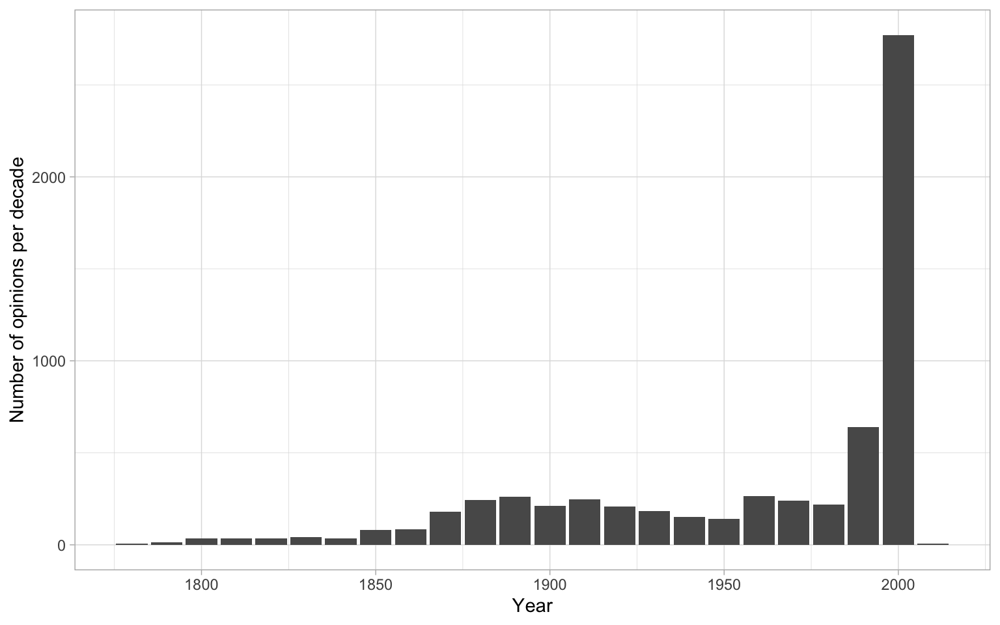
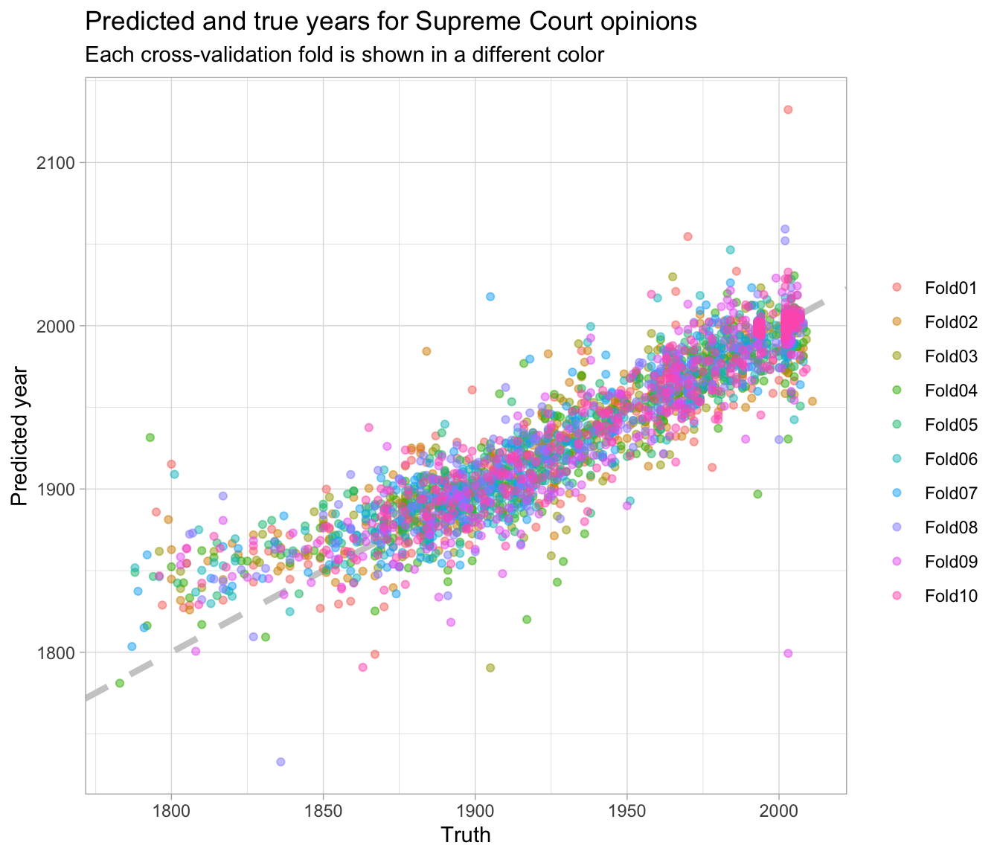
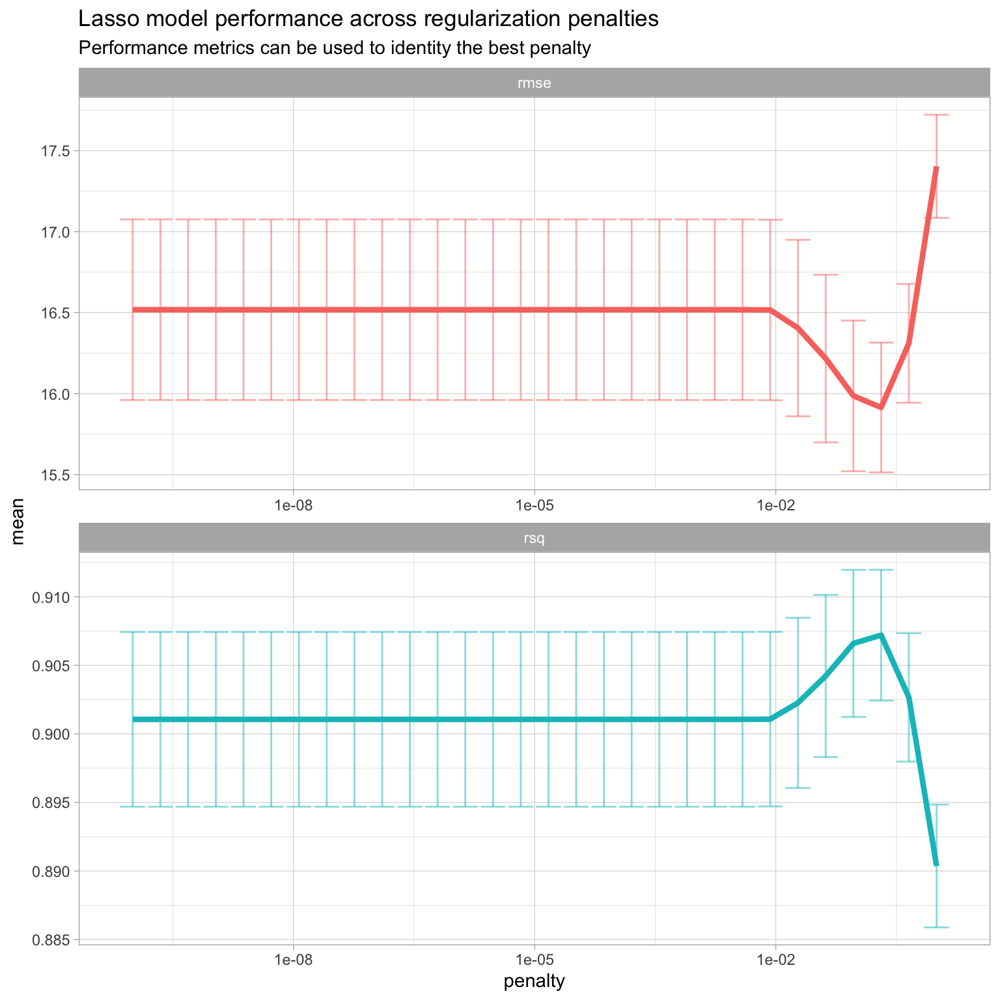
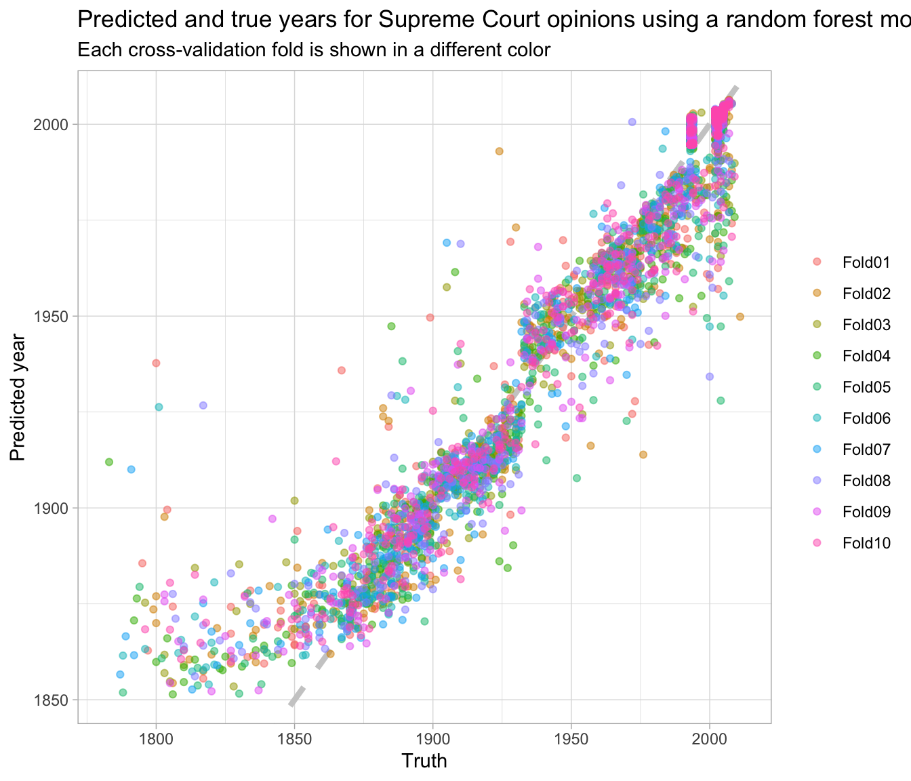
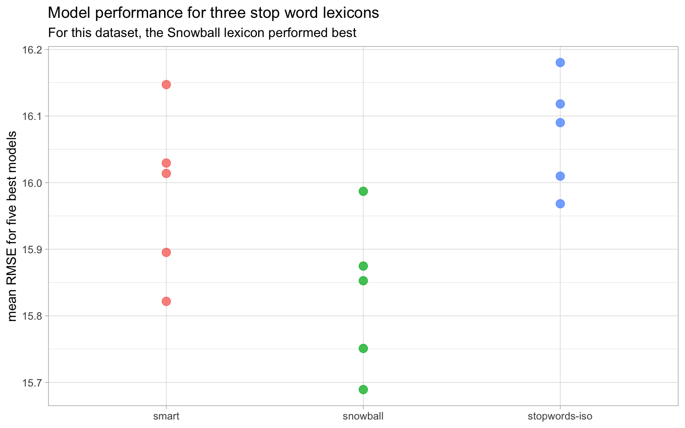
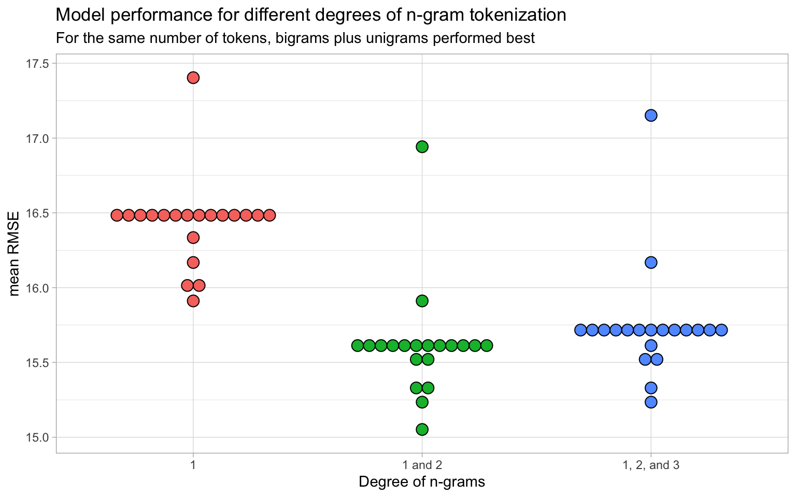
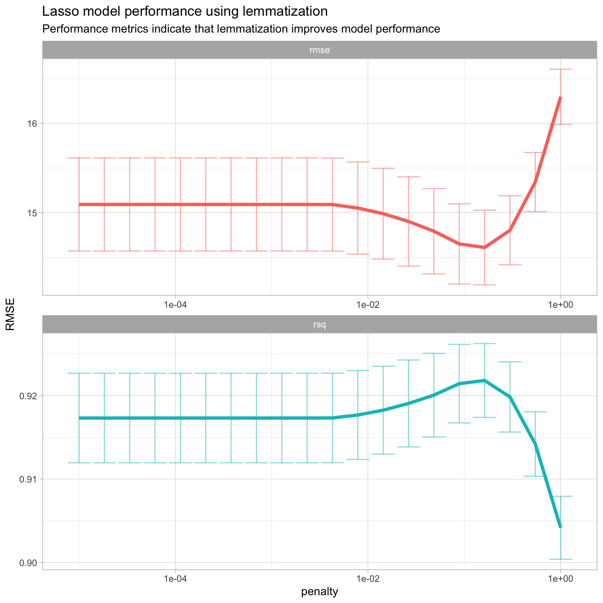
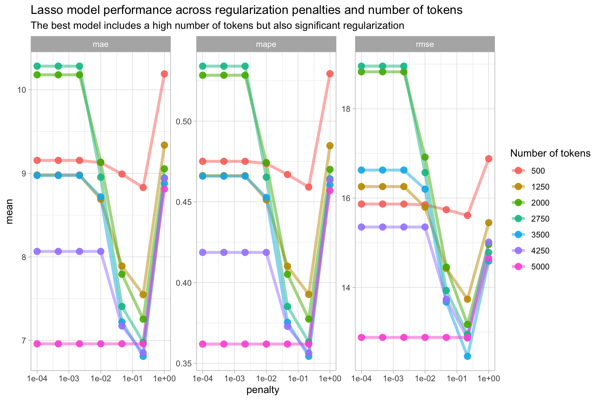
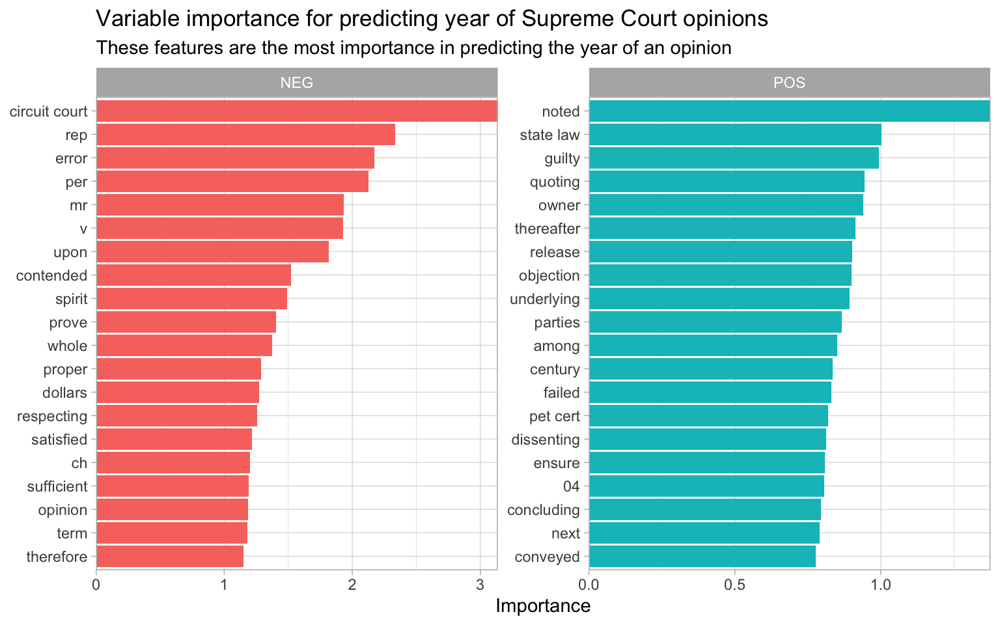
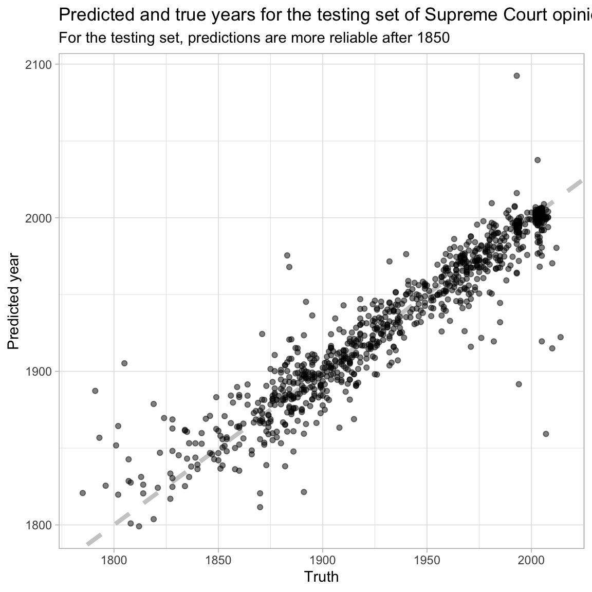

# Regression {#mlregression}


In the previous chapter, we focused on using modeling to predict *labels* on documents, such as what kind of financial product a CFPB complaint was discussing. These are examples of classification models. We can also use machine learning to predict *continuous values* that are associated with documents. For example, let's consider a sample of opinions from the United States Supreme Court, available in the **scotus** [@R-scotus] package.


```r
library(tidyverse)
library(scotus)

scotus_sample %>%
  as_tibble()
```

```
## # A tibble: 6,336 x 5
##    year  case_name                  docket_number     id text                   
##    <chr> <chr>                      <chr>          <dbl> <chr>                  
##  1 2002  Martinez-Garduno, AKA Gar… 02-5021       107750 "No. 02-5021.\nCERTIOR…
##  2 2002  Dinkins v. Cockrell, Dire… 02-5107       107820 "No. 02-5107.\nCERTIOR…
##  3 2002  Young v. Stubblefield, Su… 02-6152       108930 "No. 02-6152.\nCERTIOR…
##  4 1918  Cox v. Wood                833            83544 "No. 833.\nMr. Hannis …
##  5 1994  Withrow v. Williams        93-807        100733 "No. 93-807.\nAppeal f…
##  6 2000  United States v. Johnson   98-1696       102702 "UNITED STATESv.JOHNSO…
##  7 2005  Breton-Pichardo v. United… 04-8495       127464 "No. 04-8495.\nC. A. 4…
##  8 2004  Johnson v. Illinois        03-9984       121824 "No. 03-9984.\nApp. Ct…
##  9 1928  Security Mortgage Co. v. … 32             85729 "No. 32.\n[Syllabus fr…
## 10 1918  Salt Lake Investment Co. … 29             83523 "No. 29.\nMessrs. W. H…
## # … with 6,326 more rows
```

This dataset contains the entire text of each opinion in the `text` column, along with the `case_name` and `docket_number`. Notice that we also have the year that each case was decided by the Supreme Court; this is basically a continuous variable (rather than a group membership of discrete label). 

<div class="rmdnote">
<p>If we want to build a model to predict which court opinions were written in which years, we would build a regression model.</p>
</div>


- A **classification model** predicts a class label or group membership.
- A **regression model** predicts a numeric or continuous value.

In text modeling, we use text data (such as the text of the court opinions), sometimes combined with other structured, non-text data, to predict the continuous value of interest (such as year of the court opinion).

## A first regression model

Let's build our first regression model using this sample of Supreme Court opinions. Before we start, let's check out how many opinions we have over time in Figure \@ref(fig:scotushist).


```r
scotus_sample %>%
  mutate(
    year = as.numeric(year),
    year = 10 * (year %/% 10)
  ) %>%
  count(year) %>%
  ggplot(aes(year, n)) +
  geom_col() +
  labs(x = "Year", y = "Number of opinions per decade")
```

<div class="figure">

<p class="caption">(\#fig:scotushist)Supreme Court opinions per decade in sample</p>
</div>

This sample of opinions reflects the true distribution over time of available opinions for analysis; there are many more opinions per year in this dataset after about 1990 than before. We will need to account for that in our modeling.

### Building our first regression model {#firstregression}

Our first step in building a model is to split our data into training and testing sets. We use functions from **tidymodels** for this; we use `initial_split()` to set up *how* to split the data, and then we use the functions `training()` and `testing()` to create the datasets we need. Let's also convert the year to a numeric value since it was originally stored as a character, and remove the `'` character because of its effect on one of the models^[The random forest implementation in the ranger package, demonstrated in Section \@ref{comparerf}, does not handle special characters in columns names well.] we want to try out.


```r
library(tidymodels)
set.seed(1234)
scotus_split <- scotus_sample %>%
  mutate(
    year = as.numeric(year),
    text = str_remove_all(text, "'")
  ) %>%
  initial_split()

scotus_train <- training(scotus_split)
scotus_test <- testing(scotus_split)
```

Next, let's preprocess our data to get it ready for modeling using a recipe. We'll use both general preprocessing functions from **tidymodels** and specialized functions just for text from **textrecipes** in this preprocessing. What are the steps in creating this recipe?

- First, we must specify in our initial `recipe()` statement the form of our model (with the formula `year ~ text`, meaning we will predict the year of each opinion from the text of that opinion) and what our training data is.
- Then, we tokenize (Chapter \@ref(tokenization)) the text of the court opinions. 
- Next, we filter to only keep the top 500 tokens by term frequency, after removing stop words.
- The recipe step `step_tfidf()`, used with defaults here, weights each token frequency by the inverse document frequency.
- As a last step, we normalize (center and scale) these tf-idf values. We need to do this centering and scaling because it's important for lasso regularization.

Finally, we `prep()` the recipe. This means we compute values for all these steps using our training data; we estimate the required parameters from `scotus_train` to implement these steps so this whole sequence can be applied later to another dataset, such as resampled folds or testing data.


```r
library(textrecipes)

scotus_rec <- recipe(year ~ text, data = scotus_train) %>%
  step_tokenize(text) %>%
  step_tokenfilter(text, max_tokens = 500) %>%
  step_tfidf(text) %>%
  step_normalize(all_predictors())

scotus_prep <- prep(scotus_rec)

scotus_prep
```

```
## Data Recipe
## 
## Inputs:
## 
##       role #variables
##    outcome          1
##  predictor          1
## 
## Training data contained 4752 data points and no missing data.
## 
## Operations:
## 
## Tokenization for text [trained]
## Text filtering for text [trained]
## Term frequency-inverse document frequency with text [trained]
## Centering and scaling for tfidf_text_1, tfidf_text_10, ... [trained]
```

Let's create a `workflow()` to bundle together this recipe with any model specifications we may want to create later. A _model workflow_ is a convenient way to combine different modeling components (a preprocessor plus a model specification); when these are bundled explicitly, it can be easier to keep track of your modeling plan, as well as fit your model and predict on new data.

First, let's only add the data preprocessor, `scotus_rec`.


```r
scotus_wf <- workflow() %>%
  add_recipe(scotus_rec)

scotus_wf
```

```
## ══ Workflow ═════════════════════════════════════════════════════════════════════════════════════
## Preprocessor: Recipe
## Model: None
## 
## ── Preprocessor ─────────────────────────────────────────────────────────────────────────────────
## 4 Recipe Steps
## 
## ● step_tokenize()
## ● step_tokenfilter()
## ● step_tfidf()
## ● step_normalize()
```

Notice that there is no model yet: `Model: None`. It's time to specify the model we will use! Let's build a lasso regression model with `mixture = 1`. Before fitting, we set up a model specification.


```r
lasso_spec <- linear_reg(penalty = 0.1, mixture = 1) %>%
  set_mode("regression") %>%
  set_engine("glmnet")

lasso_spec
```

```
## Linear Regression Model Specification (regression)
## 
## Main Arguments:
##   penalty = 0.1
##   mixture = 1
## 
## Computational engine: glmnet
```

Everything is now ready for us to fit our model. Let's add our model to the workflow with `add_model()` and fit to our training data `scotus_train`.


```r
lasso_fit <- scotus_wf %>%
  add_model(lasso_spec) %>%
  fit(data = scotus_train)
```

We have successfully fit a regularized regression model to this dataset of Supreme Court opinions. What does the result look like? We can access the fit using `pull_workflow_fit()`, and even `tidy()` the results into a convenient dataframe format.


```r
lasso_fit %>%
  pull_workflow_fit() %>%
  tidy()
```

```
## # A tibble: 20,343 x 5
##    term            step estimate lambda dev.ratio
##    <chr>          <dbl>    <dbl>  <dbl>     <dbl>
##  1 (Intercept)        1 1963.      39.3    0     
##  2 (Intercept)        2 1963.      35.8    0.0986
##  3 tfidf_text_it      2   -3.34    35.8    0.0986
##  4 tfidf_text_was     2   -0.214   35.8    0.0986
##  5 (Intercept)        3 1963.      32.6    0.194 
##  6 tfidf_text_by      3   -0.214   32.6    0.194 
##  7 tfidf_text_it      3   -5.09    32.6    0.194 
##  8 tfidf_text_was     3   -2.01    32.6    0.194 
##  9 (Intercept)        4 1963.      29.7    0.278 
## 10 tfidf_text_by      4   -1.50    29.7    0.278 
## # … with 20,333 more rows
```

We see here, printing out for the most regularized examples, what contributes to a Supreme Court opinion being written more recently.

### Evaluating our model

One option for our evaluating our model is to predict one time on the testing set to measure performance. 

<div class="rmdwarning">
<p>The testing set is extremely valuable data, however, and in real world situations, you can only use this precious resource one time (or at most, twice).</p>
</div>

The purpose of the testing data is to estimate how your final model will perform on new data. Often during the process of modeling, we want to compare models or different model parameters. We can't use the test set for this.

Another option for evaluating models is to predict one time on the training set to measure performance. This is the _same data_ that was used to train the model, however, and evaluating on the training data often results in performance estimates that are too optimistic. This is especially true for powerful machine learning algorithms that can learn subtle patterns from data.

Yet another option for evaluating or comparing models is to use a separate validation set. In this situation, we split our data _not_ into two sets (training and testing) but into three sets (testing, training, and validation). The validation set is used for computing performance metrics to compare models or model parameters. This can be a great option if you have enough data for it, but often we as machine learning practitioners are not so lucky. 

What are we to do, then, if we want to train multiple models and find the best one? Or compute a reliable estimate for how our model has performed without wasting the valuable testing set? We can use **resampling**. When we resample, we create new simulated datasets from the training set for the purpose of, for example, measuring model performance.

Let's estimate the performance of the lasso regression model we just fit. We can do this using resampled datasets built from the training set. Let's create cross 10-fold cross-validation sets, and use these resampled sets for performance estimates.


```r
set.seed(123)
scotus_folds <- vfold_cv(scotus_train)

scotus_folds
```

```
## #  10-fold cross-validation 
## # A tibble: 10 x 2
##    splits             id    
##    <list>             <chr> 
##  1 <split [4.3K/476]> Fold01
##  2 <split [4.3K/476]> Fold02
##  3 <split [4.3K/475]> Fold03
##  4 <split [4.3K/475]> Fold04
##  5 <split [4.3K/475]> Fold05
##  6 <split [4.3K/475]> Fold06
##  7 <split [4.3K/475]> Fold07
##  8 <split [4.3K/475]> Fold08
##  9 <split [4.3K/475]> Fold09
## 10 <split [4.3K/475]> Fold10
```

Each of these "splits" contains information about how to create cross-validation folds from the original training data. In this example, 90% of the training data is included in each fold for analysis and the other 10% is held out for assessment.

In Section \@ref(firstregression), we fit one time to the training data as a whole. Now, to estimate how well that model performs, let's fit many times, once to each of these resampled folds, and then evaluate on the heldout part of each resampled fold.


```r
set.seed(123)
lasso_rs <- fit_resamples(
  scotus_wf %>% add_model(lasso_spec),
  scotus_folds,
  control = control_resamples(save_pred = TRUE)
)

lasso_rs
```

```
## # Resampling results
## # 10-fold cross-validation 
## # A tibble: 10 x 5
##    splits             id     .metrics         .notes           .predictions     
##    <list>             <chr>  <list>           <list>           <list>           
##  1 <split [4.3K/476]> Fold01 <tibble [2 × 3]> <tibble [0 × 1]> <tibble [476 × 3…
##  2 <split [4.3K/476]> Fold02 <tibble [2 × 3]> <tibble [0 × 1]> <tibble [476 × 3…
##  3 <split [4.3K/475]> Fold03 <tibble [2 × 3]> <tibble [0 × 1]> <tibble [475 × 3…
##  4 <split [4.3K/475]> Fold04 <tibble [2 × 3]> <tibble [0 × 1]> <tibble [475 × 3…
##  5 <split [4.3K/475]> Fold05 <tibble [2 × 3]> <tibble [0 × 1]> <tibble [475 × 3…
##  6 <split [4.3K/475]> Fold06 <tibble [2 × 3]> <tibble [0 × 1]> <tibble [475 × 3…
##  7 <split [4.3K/475]> Fold07 <tibble [2 × 3]> <tibble [0 × 1]> <tibble [475 × 3…
##  8 <split [4.3K/475]> Fold08 <tibble [2 × 3]> <tibble [0 × 1]> <tibble [475 × 3…
##  9 <split [4.3K/475]> Fold09 <tibble [2 × 3]> <tibble [0 × 1]> <tibble [475 × 3…
## 10 <split [4.3K/475]> Fold10 <tibble [2 × 3]> <tibble [0 × 1]> <tibble [475 × 3…
```

These results look a lot like the resamples, but they have some additional columns, like the `.metrics` that we can use to measure how well this model performed and the `.predictions` we can use to explore that performance more deeply. What results do we see, in terms of performance metrics?


```r
lasso_rs %>%
  collect_metrics()
```

```
## # A tibble: 2 x 5
##   .metric .estimator   mean     n std_err
##   <chr>   <chr>       <dbl> <int>   <dbl>
## 1 rmse    standard   16.0      10 0.459  
## 2 rsq     standard    0.907    10 0.00530
```

The default performance metrics to be computed for regression models are RMSE (root mean squared error) and $R^2$. RMSE is a metric that is in the same units as the original data, so in units of _years_, in our case; the RMSE of this first regression model is 16 years.

<div class="rmdnote">
<p>The lower RMSE is, the better; the closer <span class="math inline">\(R^2\)</span> is to one, the better.</p>
</div>

These values are quantitative estimates for how well our model performed, and can be compared across different kinds of models. Figure \@ref(fig:firstregpredict) shows the predicted years for these Supreme Court opinions plotted against the true years when they were published, for all the resampled datasets.


```r
lasso_rs %>%
  collect_predictions() %>%
  ggplot(aes(year, .pred, color = id)) +
  geom_abline(lty = 2, color = "gray80", size = 1.5) +
  geom_point(alpha = 0.5) +
  labs(
    x = "Truth",
    y = "Predicted year",
    color = NULL,
    title = "Predicted and true years for Supreme Court opinions",
    subtitle = "Each cross-validation fold is shown in a different color"
  )
```

<div class="figure">

<p class="caption">(\#fig:firstregpredict)Most Supreme Court opinions are near the dashed line, indicating good agreement between our lasso regression predictions and the real years</p>
</div>

This first model we have tried did not do a great job for Supreme Court opinions from before 1850, but for opinions after 1850, this looks pretty good!

## Compare to the null model

One way to assess a model like this one is to compare its performance to a "null model". 

<div class="rmdnote">
<p>A null model is a simple, non-informative model that always predicts the largest class (for classification) or the mean (such as the mean year of Supreme Court opinions, in our specific regression case).</p>
</div>

We can use the same function `fit_resamples()` and the same preprocessing recipe as before, switching out our lasso model specification for the `null_model()` specification.


```r
## not running until this change is on CRAN: https://github.com/tidymodels/tune/pull/207
null_regression <- null_model() %>%
  set_engine("parsnip") %>%
  set_mode("regression")

null_rs <- fit_resamples(
  scotus_wf %>% add_model(null_regression),
  scotus_folds
)

null_rs
```

What results do we obtain from the null model, in terms of performance metrics?


```r
null_rs %>%
  collect_metrics()
```

The RMSE and $R^2$ indicate that this null model is dramatically worse than our first model. Even our first very attempt at a regression model (using only unigrams and no tuning) did much better than the null model; the text of the Supreme Court opinions has enough information in it related to the year the opinions were published that we can build successful models.

## Tuning lasso hyperparameters {#tunelasso}

The value `penalty = 0.1` for regularization in Section \@ref(firstregression) was picked somewhat arbitrarily. How do we know the *right* or *best* regularization parameter penalty? This is a model hyperparameter and we cannot learn its best value during model training, but we can estimate the best value by training many models on resampled data sets and exploring how well all these models perform. Let's build a new model specification for **model tuning**. 


```r
tune_spec <- linear_reg(penalty = tune(), mixture = 1) %>%
  set_mode("regression") %>%
  set_engine("glmnet")

tune_spec
```

```
## Linear Regression Model Specification (regression)
## 
## Main Arguments:
##   penalty = tune()
##   mixture = 1
## 
## Computational engine: glmnet
```

After the tuning process, we can select a single best numeric value.

<div class="rmdnote">
<p>Think of <code>tune()</code> here as a placeholder for the regularization penalty.</p>
</div>

We can create a regular grid of values to try, using a convenience function for `penalty()`.


```r
lambda_grid <- grid_regular(penalty(), levels = 30)

lambda_grid
```

```
## # A tibble: 30 x 1
##     penalty
##       <dbl>
##  1 1.00e-10
##  2 2.21e-10
##  3 4.89e-10
##  4 1.08e- 9
##  5 2.40e- 9
##  6 5.30e- 9
##  7 1.17e- 8
##  8 2.59e- 8
##  9 5.74e- 8
## 10 1.27e- 7
## # … with 20 more rows
```

The function `grid_regular()` is from the **dials** package. It chooses sensible values to try for a parameter like the regularization penalty; here, we asked for 30 different possible values.

Now it is time to tune! Let's use `tune_grid()` to fit a model at each of the values for the regularization penalty in our regular grid.

<div class="rmdnote">
<p>Tuning a model uses a similar syntax compared to fitting a model to a set of resampled datasets for the purposes of evaluation (<code>fit_resamples()</code>) because the two tasks are so similar. The difference is that when you tune, each model that you fit has <em>different</em> parameters and you want to find the best one.</p>
</div>

We add our tuneable model specification `tune_spec` to the same workflow we've been using so far that contains the preprocessing recipe.


```r
set.seed(2020)
tune_rs <- tune_grid(
  scotus_wf %>% add_model(tune_spec),
  scotus_folds,
  grid = lambda_grid,
  control = control_resamples(save_pred = TRUE)
)

tune_rs
```

```
## # Tuning results
## # 10-fold cross-validation 
## # A tibble: 10 x 5
##    splits            id     .metrics         .notes          .predictions       
##    <list>            <chr>  <list>           <list>          <list>             
##  1 <split [4.3K/476… Fold01 <tibble [60 × 5… <tibble [0 × 1… <tibble [14,280 × …
##  2 <split [4.3K/476… Fold02 <tibble [60 × 5… <tibble [0 × 1… <tibble [14,280 × …
##  3 <split [4.3K/475… Fold03 <tibble [60 × 5… <tibble [0 × 1… <tibble [14,250 × …
##  4 <split [4.3K/475… Fold04 <tibble [60 × 5… <tibble [0 × 1… <tibble [14,250 × …
##  5 <split [4.3K/475… Fold05 <tibble [60 × 5… <tibble [0 × 1… <tibble [14,250 × …
##  6 <split [4.3K/475… Fold06 <tibble [60 × 5… <tibble [0 × 1… <tibble [14,250 × …
##  7 <split [4.3K/475… Fold07 <tibble [60 × 5… <tibble [0 × 1… <tibble [14,250 × …
##  8 <split [4.3K/475… Fold08 <tibble [60 × 5… <tibble [0 × 1… <tibble [14,250 × …
##  9 <split [4.3K/475… Fold09 <tibble [60 × 5… <tibble [0 × 1… <tibble [14,250 × …
## 10 <split [4.3K/475… Fold10 <tibble [60 × 5… <tibble [0 × 1… <tibble [14,250 × …
```


Now, instead of one set of metrics, we have a set of metrics for each value of the regularization penalty.


```r
tune_rs %>%
  collect_metrics()
```

```
## # A tibble: 60 x 7
##     penalty .metric .estimator   mean     n std_err .config
##       <dbl> <chr>   <chr>       <dbl> <int>   <dbl> <chr>  
##  1 1.00e-10 rmse    standard   16.5      10 0.558   Model01
##  2 1.00e-10 rsq     standard    0.901    10 0.00637 Model01
##  3 2.21e-10 rmse    standard   16.5      10 0.558   Model02
##  4 2.21e-10 rsq     standard    0.901    10 0.00637 Model02
##  5 4.89e-10 rmse    standard   16.5      10 0.558   Model03
##  6 4.89e-10 rsq     standard    0.901    10 0.00637 Model03
##  7 1.08e- 9 rmse    standard   16.5      10 0.558   Model04
##  8 1.08e- 9 rsq     standard    0.901    10 0.00637 Model04
##  9 2.40e- 9 rmse    standard   16.5      10 0.558   Model05
## 10 2.40e- 9 rsq     standard    0.901    10 0.00637 Model05
## # … with 50 more rows
```

Let's visualize these metrics, RMSE and $R^2$, in Figure \@ref(fig:scotustunevis) to see what the best model is.


```r
tune_rs %>%
  collect_metrics() %>%
  ggplot(aes(penalty, mean, color = .metric)) +
  geom_errorbar(aes(
    ymin = mean - std_err,
    ymax = mean + std_err
  ),
  alpha = 0.5
  ) +
  geom_line(size = 1.5) +
  facet_wrap(~.metric, scales = "free", nrow = 2) +
  scale_x_log10() +
  theme(legend.position = "none") +
  labs(
    title = "Lasso model performance across regularization penalties",
    subtitle = "Performance metrics can be used to identity the best penalty"
  )
```

<div class="figure">

<p class="caption">(\#fig:scotustunevis)We can identify the best regularization penalty from model performance metrics, for example, at the lowest RMSE</p>
</div>

We can view the best results with `show_best()` and a choice for the metric, such as RMSE.


```r
tune_rs %>%
  show_best("rmse")
```

```
## # A tibble: 5 x 7
##   penalty .metric .estimator  mean     n std_err .config
##     <dbl> <chr>   <chr>      <dbl> <int>   <dbl> <chr>  
## 1  0.204  rmse    standard    15.9    10   0.401 Model28
## 2  0.0924 rmse    standard    16.0    10   0.465 Model27
## 3  0.0418 rmse    standard    16.2    10   0.518 Model26
## 4  0.452  rmse    standard    16.3    10   0.367 Model29
## 5  0.0189 rmse    standard    16.4    10   0.545 Model25
```

The best value for RMSE from this tuning run is 15.9. We can extract the best regularization parameter for this value of RMSE from our tuning results with `select_best()`.


```r
lowest_rmse <- tune_rs %>%
  select_best("rmse")

lowest_rmse
```

```
## # A tibble: 1 x 2
##   penalty .config
##     <dbl> <chr>  
## 1   0.204 Model28
```

Next, let's finalize our tuneable workflow with this particular regularization penalty. This is the regularization penalty that our tuning results indicate give us the best model.


```r
final_lasso <- finalize_workflow(
  scotus_wf %>% add_model(tune_spec),
  lowest_rmse
)

final_lasso
```

```
## ══ Workflow ═════════════════════════════════════════════════════════════════════════════════════
## Preprocessor: Recipe
## Model: linear_reg()
## 
## ── Preprocessor ─────────────────────────────────────────────────────────────────────────────────
## 4 Recipe Steps
## 
## ● step_tokenize()
## ● step_tokenfilter()
## ● step_tfidf()
## ● step_normalize()
## 
## ── Model ────────────────────────────────────────────────────────────────────────────────────────
## Linear Regression Model Specification (regression)
## 
## Main Arguments:
##   penalty = 0.204335971785695
##   mixture = 1
## 
## Computational engine: glmnet
```

Instead of `penalty = tune()` like before, now our workflow has finalized values for all arguments. The preprocessing recipe has been evaluated on the training data, and we tuned the regularization penalty so that we have a penalty value of 0.204. This workflow is ready to go! It can now be applied to new data.

## Compare to a random forest model {#comparerf}

Random forest models are broadly used in predictive modeling contexts because they are low-maintenance and perform well. For example, see @Caruana2008 and @Olson2017 for comparisons of the performance of common models such as random forest, decision tree, support vector machines, etc. trained on benchmark datasets; random forest models were one of the best overall. Let's see how a random forest model performs with our dataset of Supreme Court opinions.

First, let's build a random forest model specification, using the ranger implementation. Random forest models are known for performing well without tuning, so we will just make sure we have enough `trees`.


```r
rf_spec <- rand_forest(trees = 1000) %>%
  set_engine("ranger") %>%
  set_mode("regression")

rf_spec
```

```
## Random Forest Model Specification (regression)
## 
## Main Arguments:
##   trees = 1000
## 
## Computational engine: ranger
```

Now we can fit this random forest model. Let's use `fit_resamples()` again, so we can evaluate the model performance. We will use three arguments to this function:

- Our modeling `workflow()`, with the same preprocessing recipe we have been using so far in this chapter plus our new random forest model specification
- Our cross-validation resamples of the Supreme Court opinions
- A `control` argument to specify that we want to keep the predictions, to explore after fitting


```r
rf_rs <- fit_resamples(
  scotus_wf %>% add_model(rf_spec),
  scotus_folds,
  control = control_resamples(save_pred = TRUE)
)

rf_rs
```

```
## # Resampling results
## # 10-fold cross-validation 
## # A tibble: 10 x 5
##    splits             id     .metrics         .notes           .predictions     
##    <list>             <chr>  <list>           <list>           <list>           
##  1 <split [4.3K/476]> Fold01 <tibble [2 × 3]> <tibble [0 × 1]> <tibble [476 × 3…
##  2 <split [4.3K/476]> Fold02 <tibble [2 × 3]> <tibble [0 × 1]> <tibble [476 × 3…
##  3 <split [4.3K/475]> Fold03 <tibble [2 × 3]> <tibble [0 × 1]> <tibble [475 × 3…
##  4 <split [4.3K/475]> Fold04 <tibble [2 × 3]> <tibble [0 × 1]> <tibble [475 × 3…
##  5 <split [4.3K/475]> Fold05 <tibble [2 × 3]> <tibble [0 × 1]> <tibble [475 × 3…
##  6 <split [4.3K/475]> Fold06 <tibble [2 × 3]> <tibble [0 × 1]> <tibble [475 × 3…
##  7 <split [4.3K/475]> Fold07 <tibble [2 × 3]> <tibble [0 × 1]> <tibble [475 × 3…
##  8 <split [4.3K/475]> Fold08 <tibble [2 × 3]> <tibble [0 × 1]> <tibble [475 × 3…
##  9 <split [4.3K/475]> Fold09 <tibble [2 × 3]> <tibble [0 × 1]> <tibble [475 × 3…
## 10 <split [4.3K/475]> Fold10 <tibble [2 × 3]> <tibble [0 × 1]> <tibble [475 × 3…
```

We can use `collect_metrics()` to obtain and format the performance metrics for this random forest model.


```r
collect_metrics(rf_rs)
```

```
## # A tibble: 2 x 5
##   .metric .estimator   mean     n std_err
##   <chr>   <chr>       <dbl> <int>   <dbl>
## 1 rmse    standard   13.3      10 0.337  
## 2 rsq     standard    0.939    10 0.00304
```


This looks pretty promising, so let's explore the predictions for this random forest model.


```r
rf_rs %>%
  collect_predictions() %>%
  ggplot(aes(year, .pred, color = id)) +
  geom_abline(lty = 2, color = "gray80", size = 1.5) +
  geom_point(alpha = 0.5) +
  labs(
    x = "Truth",
    y = "Predicted year",
    color = NULL,
    title = "Predicted and true years for Supreme Court opinions using a random forest model",
    subtitle = "Each cross-validation fold is shown in a different color"
  )
```




Figure \@ref(fig:rfpredict) shows some of the strange behavior from our fitted model. This model learned to predict the large number of opinions in 1999 and 2000 very accurately, but at the expense of all other years. One of the defining characteristics of text data is that it is **sparse**, and tree-based models such as random forests may not be well-suited to sparse data. 

<div class="rmdnote">
<p>Models that work best with text tend to be models designed for or otherwise appropriate for sparse data.</p>
</div>

Algorithms that work well with sparse data are less important when text has been transformed to a non-sparse representation such as with word embeddings (Chapter \@ref(embeddings)).

## Case study: removing stop words {#casestudystopwords}

We did not remove stop words (Chapter \@ref(stopwords)) in any of our models so far in this chapter. What impact will removing stop words have, and how do we know which stop word list is the best to use? The best way to answer these questions is with experimentation.

Removing stop words is part of data preprocessing, so we define this step as part of our preprocessing recipe. Let's build a small recipe wrapper helper function so we can pass a value `stopword_name` to `step_stopwords()`.


```r
stopword_rec <- function(stopword_name) {
  recipe(year ~ text, data = scotus_train) %>%
    step_tokenize(text) %>%
    step_stopwords(text, stopword_source = stopword_name) %>%
    step_tokenfilter(text, max_tokens = 500) %>%
    step_tfidf(text) %>%
    step_normalize(all_predictors())
}
```

For example, now we can create a recipe that removes the Snowball stop words list by calling this function.


```r
stopword_rec("snowball")
```

```
## Data Recipe
## 
## Inputs:
## 
##       role #variables
##    outcome          1
##  predictor          1
## 
## Operations:
## 
## Tokenization for text
## Stop word removal for text
## Text filtering for text
## Term frequency-inverse document frequency with text
## Centering and scaling for all_predictors()
```

Next, let's set up a workflow that has a model only, using `add_model()`.


```r
tuneable_wf <- workflow() %>%
  add_model(tune_spec)

tuneable_wf
```

```
## ══ Workflow ═════════════════════════════════════════════════════════════════════════════════════
## Preprocessor: None
## Model: linear_reg()
## 
## ── Model ────────────────────────────────────────────────────────────────────────────────────────
## Linear Regression Model Specification (regression)
## 
## Main Arguments:
##   penalty = tune()
##   mixture = 1
## 
## Computational engine: glmnet
```

Notice that for this workflow, there is no preprocessor yet: `Preprocessor: None`. This workflow uses the same tuneable lasso model specification that we used in Section \@ref(tunelasso) but we are going to combine several different preprocessing recipes with it, one for each stop word lexicon we want to try.

The last time we tuned a lasso model, we used the defaults for the penalty parameter and 30 levels. Let's restrict the values this time using the `range` argument, so we don't test out as small values for regularization, and only try 20 levels.


```r
grid_twenty <- grid_regular(penalty(range = c(-5, 0)), levels = 20)

grid_twenty
```

```
## # A tibble: 20 x 1
##      penalty
##        <dbl>
##  1 0.00001  
##  2 0.0000183
##  3 0.0000336
##  4 0.0000616
##  5 0.000113 
##  6 0.000207 
##  7 0.000379 
##  8 0.000695 
##  9 0.00127  
## 10 0.00234  
## 11 0.00428  
## 12 0.00785  
## 13 0.0144   
## 14 0.0264   
## 15 0.0483   
## 16 0.0886   
## 17 0.162    
## 18 0.298    
## 19 0.546    
## 20 1
```

Now we can put this all together and tune these models which include stop word removal. We could create a little helper function for tuning like we did for the recipe, but we have printed out all three calls to `tune_grid()` for extra clarity. Notice for each one that there are three arguments:

- A tuneable workflow, which consists of the tuneable lasso model specification and a data preprocessing recipe with stop word removal
- The same cross-validation folds we created earlier
- Our new grid of values for the regularization parameter


```r
set.seed(123)
snowball_rs <- tune_grid(
  tuneable_wf %>% add_recipe(stopword_rec("snowball")),
  scotus_folds,
  grid = grid_twenty
)

set.seed(234)
smart_rs <- tune_grid(
  tuneable_wf %>% add_recipe(stopword_rec("smart")),
  scotus_folds,
  grid = grid_twenty
)

set.seed(345)
stopwords_iso_rs <- tune_grid(
  tuneable_wf %>% add_recipe(stopword_rec("stopwords-iso")),
  scotus_folds,
  grid = grid_twenty
)
```


After fitting models for each of possible regularization values to each of the cross-validation folds, these sets of results contain metrics computed for removing that set of stop words.


```r
collect_metrics(smart_rs)
```

```
## # A tibble: 40 x 7
##      penalty .metric .estimator   mean     n std_err .config
##        <dbl> <chr>   <chr>       <dbl> <int>   <dbl> <chr>  
##  1 0.00001   rmse    standard   16.3      10 0.559   Model01
##  2 0.00001   rsq     standard    0.904    10 0.00602 Model01
##  3 0.0000183 rmse    standard   16.3      10 0.559   Model02
##  4 0.0000183 rsq     standard    0.904    10 0.00602 Model02
##  5 0.0000336 rmse    standard   16.3      10 0.559   Model03
##  6 0.0000336 rsq     standard    0.904    10 0.00602 Model03
##  7 0.0000616 rmse    standard   16.3      10 0.559   Model04
##  8 0.0000616 rsq     standard    0.904    10 0.00602 Model04
##  9 0.000113  rmse    standard   16.3      10 0.559   Model05
## 10 0.000113  rsq     standard    0.904    10 0.00602 Model05
## # … with 30 more rows
```


We can explore whether one of these sets of stop words performed better than the others by comparing the performance, for example in terms of RMSE as shown Figure \@ref(fig:snowballrmse). This plot shows the five best models for each set of stop words, using `show_best()` applied to each via `purrr::map_dfr()`.

TODO: add number of words in lexicon to plot


```r
list(
  snowball = snowball_rs,
  smart = smart_rs,
  `stopwords-iso` = stopwords_iso_rs
) %>%
  map_dfr(show_best, "rmse", .id = "name") %>%
  ggplot(aes(name, mean, color = name)) +
  geom_point(size = 3, alpha = 0.8, show.legend = FALSE) +
  labs(
    x = NULL, y = "mean RMSE for five best models",
    title = "Model performance for three stop word lexicons",
    subtitle = "For this dataset, the Snowball lexicon performed best"
  )
```




The Snowball lexicon contains the smallest number of words (see Figure \@ref(fig:stopwordoverlap)) and, in this case, results in the best performance. Removing fewer stop words results in the best performance.

<div class="rmdwarning">
<p>This result is not generalizable to all data sets and contexts, but the approach outlined in this section <strong>is</strong> generalizable.</p>
</div>

This approach can be used to compare different lexicons and find the best one for a specific data set and model. Notice also that the resulting RMSE is at least somewhat lower than _without_ removing stop words for all stop word lexicons (compare to Figure \@ref(fig:scotustunevis) and following), indicating that removing stop words is a good choice. This increase in performance isn't huge, but removing stop words isn't computationally slow or difficult so the cost for this improvement is low.

## Case study: varying n-grams 

Each model trained so far in this chapter has involved single words or _unigrams_, but using n-grams (Section \@ref(tokenizingngrams)) can integrate different kinds of information into a model. Bigrams and trigrams (or even higher order n-grams) capture concepts that span single words, as well as effects from word order, that can be predictive.

This is another part of data preprocessing, so we again define this step as part of our preprocessing recipe. Let's build another small recipe wrapper helper function so we can pass a list of options `ngram_options` to `step_tokenize()`.


```r
ngram_rec <- function(ngram_options) {
  recipe(year ~ text, data = scotus_train) %>%
    step_tokenize(text, token = "ngrams", options = ngram_options) %>%
    step_tokenfilter(text, max_tokens = 500) %>%
    step_tfidf(text) %>%
    step_normalize(all_predictors())
}
```

There are two options we can specify, `n` and `n_min`, when we are using `engine = "tokenizers"`. We can set up a recipe with only `n = 1` to tokenize and only extract the unigrams.


```r
ngram_rec(list(n = 1))
```

We can use `n = 3, n_min = 1` to identify the set of all trigrams, bigrams, _and_ unigrams.


```r
ngram_rec(list(n = 3, n_min = 1))
```

<div class="rmdnote">
<p>Including n-grams of different orders in a model (such as trigrams, bigrams, plus unigrams) allows the model to learn at different levels of linguistic organization and context.</p>
</div>

We can reuse the same components `tuneable_wf` and `grid_twenty` from our earlier case study; these modular components are a benefit to adopting this approach to supervised machine learning. These model components provide the tuneable lasso model specification and possible regularization parameters to try. Let's put it all together and create a helper function to use `tune_grid()` with these components plus our helper recipe function.


```r
tune_ngram <- function(ngram_options) {
  tune_grid(
    tuneable_wf %>% add_recipe(ngram_rec(ngram_options)),
    scotus_folds,
    grid = grid_twenty
  )
}
```

\BeginKnitrBlock{rmdwarning}<div class="rmdwarning">We could have created this type of small function for trying out different stop word lexicons in Section \@ref(casestudystopwords), but there we showed each call to `tune_grid()` for extra clarity.</div>\EndKnitrBlock{rmdwarning}

With this helper function, let's try out predicting the year of Supreme Court opinions using:

- only unigrams
- bigrams and unigrams
- trigrams, bigrams, and unigrams


```r
set.seed(123)
unigram_rs <- tune_ngram(list(n = 1))

set.seed(234)
bigram_rs <- tune_ngram(list(n = 2, n_min = 1))

set.seed(345)
trigram_rs <- tune_ngram(list(n = 3, n_min = 1))
```

These sets of results contain metrics computed for the model with that tokenization strategy.


```r
collect_metrics(bigram_rs)
```

```
## # A tibble: 40 x 7
##      penalty .metric .estimator   mean     n std_err .config
##        <dbl> <chr>   <chr>       <dbl> <int>   <dbl> <chr>  
##  1 0.00001   rmse    standard   15.6      10 0.418   Model01
##  2 0.00001   rsq     standard    0.912    10 0.00426 Model01
##  3 0.0000183 rmse    standard   15.6      10 0.418   Model02
##  4 0.0000183 rsq     standard    0.912    10 0.00426 Model02
##  5 0.0000336 rmse    standard   15.6      10 0.418   Model03
##  6 0.0000336 rsq     standard    0.912    10 0.00426 Model03
##  7 0.0000616 rmse    standard   15.6      10 0.418   Model04
##  8 0.0000616 rsq     standard    0.912    10 0.00426 Model04
##  9 0.000113  rmse    standard   15.6      10 0.418   Model05
## 10 0.000113  rsq     standard    0.912    10 0.00426 Model05
## # … with 30 more rows
```


We can compare the performance of these models in terms of RMSE as shown Figure \@ref(fig:ngramrmse). Instead of looking at the top 5 best-performing models with `show_best()` as in Figure \@ref(fig:snowballrmse), let's look at all the models we trained and make a dot plot.


```r
list(
  `1` = unigram_rs,
  `1 and 2` = bigram_rs,
  `1, 2, and 3` = trigram_rs
) %>%
  map_dfr(collect_metrics, .id = "name") %>%
  filter(.metric == "rmse") %>%
  ggplot(aes(name, mean, fill = name)) +
  geom_dotplot(
    binaxis = "y", stackdir = "center", binpositions = "all",
    show.legend = FALSE
  ) +
  labs(
    x = "Degree of n-grams", y = "mean RMSE",
    title = "Model performance for different degrees of n-gram tokenization",
    subtitle = "For the same number of tokens, bigrams plus unigrams performed best"
  )
```




Each of these models was trained with `max_tokens = 500`, i.e., including only the top 500 tokens for each tokenization strategy. Holding the number of tokens constant, using bigrams plus unigrams performs best for this corpus of Supreme Court opinions. The performance gain in moving from unigrams to unigrams plus bigrams is significant, but adding in trigrams doesn't change the situation as much.

## Case study: lemmatization {mlregressionlemmatization}

As we discussed in Section \@ref(lemmatization), we can normalize words to their roots or **lemmas** based on each word's context and the structure of a language. Table \@ref(tab:lemmatb) shows both the original words and the lemmas for one sentence from a Supreme Court opinion, using lemmatization implemented via the [spaCy](https://spacy.io/) library as made available through the spacyr R package [@Benoit19].


```
## NULL
```


Table: (\#tab:lemmatb)Lemmatization of one sentence from a Supreme Court opinion

|original word |lemma        |
|:-------------|:------------|
|However       |however      |
|,             |,            |
|the           |the          |
|Court         |Court        |
|of            |of           |
|Appeals       |Appeals      |
|disagreed     |disagree     |
|with          |with         |
|the           |the          |
|District      |District     |
|Court         |Court        |
|'s            |'s           |
|construction  |construction |
|of            |of           |
|the           |the          |
|state         |state        |
|statute       |statute      |
|,             |,            |
|concluding    |conclude     |
|that          |that         |
|it            |-PRON-       |
|did           |do           |
|authorize     |authorize    |
|issuance      |issuance     |
|of            |of           |
|the           |the          |
|orders        |order        |
|to            |to           |
|withhold      |withhold     |
|to            |to           |
|the           |the          |
|Postal        |Postal       |
|Service       |Service      |
|.             |.            |

Notice several things about lemmatization that are different from the kind of default tokenization (Chapter \@ref(tokenization)) you may be more familiar with.

- Words are converted to lower case except for proper nouns.
- The lemma for pronouns is `-PRON-`.
- Irregular verbs are converted to their canonical form ("did" to "do").

Using lemmatization instead of a more straightforward tokenization strategy is slower because of the increased complexity involved, but it can be worth it. Let's explore how to train a model using _lemmas_ instead of _words_.

Lemmatization is, like choices around n-grams and stop words, part of data preprocessing so we define how to set up lemmatization as part of our preprocessing recipe. We use `engine = "spacyr"` for tokenization (instead of the default) and add `step_lemma()` to our preprocessing. This step extracts the lemmas from the parsing done by the tokenization engine.


```r
spacyr::spacy_initialize(entity = FALSE)

lemma_rec <- recipe(year ~ text, data = scotus_train) %>%
  step_tokenize(text, engine = "spacyr") %>%
  step_lemma(text) %>%
  step_tokenfilter(text, max_tokens = 500) %>%
  step_tfidf(text) %>%
  step_normalize(all_predictors())

lemma_rec
```


Let's combine this lemmatized text with our tuneable workflow and grid of possible parameter values. We can then tune our workflow and identify the best model for the lemmatized text.


```r
set.seed(123)
lemma_rs <- tune_grid(
  tuneable_wf %>% add_recipe(lemma_rec),
  scotus_folds,
  grid = grid_twenty
)

lemma_rs
```

```
## # Tuning results
## # 10-fold cross-validation 
## # A tibble: 10 x 4
##    splits             id     .metrics          .notes          
##    <list>             <chr>  <list>            <list>          
##  1 <split [4.3K/476]> Fold01 <tibble [40 × 5]> <tibble [0 × 1]>
##  2 <split [4.3K/476]> Fold02 <tibble [40 × 5]> <tibble [0 × 1]>
##  3 <split [4.3K/475]> Fold03 <tibble [40 × 5]> <tibble [0 × 1]>
##  4 <split [4.3K/475]> Fold04 <tibble [40 × 5]> <tibble [0 × 1]>
##  5 <split [4.3K/475]> Fold05 <tibble [40 × 5]> <tibble [0 × 1]>
##  6 <split [4.3K/475]> Fold06 <tibble [40 × 5]> <tibble [0 × 1]>
##  7 <split [4.3K/475]> Fold07 <tibble [40 × 5]> <tibble [0 × 1]>
##  8 <split [4.3K/475]> Fold08 <tibble [40 × 5]> <tibble [0 × 1]>
##  9 <split [4.3K/475]> Fold09 <tibble [40 × 5]> <tibble [0 × 1]>
## 10 <split [4.3K/475]> Fold10 <tibble [40 × 5]> <tibble [0 × 1]>
```


Let's visualize the performance metrics, RMSE and $R^2$, in Figure \@ref(fig:scotuslemmavis) to see what the best model using lemmas is, much like we did in Figure \@ref(fig:scotustunevis).




What is the best model, using lemmatization?


```r
lemma_rs %>%
  show_best("rmse")
```

```
## # A tibble: 5 x 7
##   penalty .metric .estimator  mean     n std_err .config
##     <dbl> <chr>   <chr>      <dbl> <int>   <dbl> <chr>  
## 1  0.162  rmse    standard    14.6    10   0.418 Model17
## 2  0.0886 rmse    standard    14.7    10   0.449 Model16
## 3  0.0483 rmse    standard    14.8    10   0.478 Model15
## 4  0.298  rmse    standard    14.8    10   0.387 Model18
## 5  0.0264 rmse    standard    14.9    10   0.500 Model14
```


The best value for RMSE at 14.61 shows us that using lemmatization can have a significant benefit for model performance. However, this comes at a cost of slower training because of the procedure involved in identifying lemmas.

## What evaluation metrics are appropiate?

We have focused on using RMSE and $R^2$ as metrics for our models in this chapter, the defaults in the tidymodels framework. Other metrics can also be appropriate for regression models. Another common set of regression metric options are the various flavors of mean absolute error.

If you know before you fit your model that you want to compute one or more of these metrics, you can specify them in a call to `metric_set()`. Let's set up a tuning grid for mean absolute error (`mae`) and mean absolute percent error (`mape`).


```r
lemma_rs <- tune_grid(
  tuneable_wf %>% add_recipe(lemma_rec),
  scotus_folds,
  grid = grid_twenty,
  metrics = metric_set(mae, mape)
)
```

If you have already fit your model, you can still compute and explore non-default metrics as long as you saved the predictions for your resampled datasets using `control_resamples(save_pred = TRUE)`. 

Let's go back to the lasso model we tuned in Section \@ref(tunelasso), with results in `tune_rs`. We can compute the overall mean absolute percent error.


```r
tune_rs %>%
  collect_predictions() %>%
  mape(year, .pred)
```

```
## # A tibble: 1 x 3
##   .metric .estimator .estimate
##   <chr>   <chr>          <dbl>
## 1 mape    standard       0.508
```

We can also compute the mean absolute percent error for each resample.


```r
tune_rs %>%
  collect_predictions() %>%
  group_by(id) %>%
  mape(year, .pred)
```

```
## # A tibble: 10 x 4
##    id     .metric .estimator .estimate
##    <chr>  <chr>   <chr>          <dbl>
##  1 Fold01 mape    standard       0.523
##  2 Fold02 mape    standard       0.503
##  3 Fold03 mape    standard       0.502
##  4 Fold04 mape    standard       0.526
##  5 Fold05 mape    standard       0.482
##  6 Fold06 mape    standard       0.485
##  7 Fold07 mape    standard       0.476
##  8 Fold08 mape    standard       0.497
##  9 Fold09 mape    standard       0.573
## 10 Fold10 mape    standard       0.514
```

Similarly, we can do the same for the mean absolute error, which gives a result in units of the original data (years, in this case) instead of relative units.


```r
tune_rs %>%
  collect_predictions() %>%
  group_by(id) %>%
  mae(year, .pred)
```

```
## # A tibble: 10 x 4
##    id     .metric .estimator .estimate
##    <chr>  <chr>   <chr>          <dbl>
##  1 Fold01 mae     standard       10.1 
##  2 Fold02 mae     standard        9.70
##  3 Fold03 mae     standard        9.68
##  4 Fold04 mae     standard       10.1 
##  5 Fold05 mae     standard        9.31
##  6 Fold06 mae     standard        9.32
##  7 Fold07 mae     standard        9.16
##  8 Fold08 mae     standard        9.58
##  9 Fold09 mae     standard       11.1 
## 10 Fold10 mae     standard        9.91
```


<div class="rmdnote">
<p>For the full set of regression metric options, see the <a href="https://yardstick.tidymodels.org/reference/">yardstick documentation</a>.</p>
</div>


## The full game

In this chapter, we started from the beginning and then explored both different types of models and different data preprocessing steps. Let's take a step back and build one final model, using everything we've learned. For our final model, let's again used a lasso regression model, since it performed better than the other options we looked at. We will:

- train on the same set of cross-validation resamples used throughout this chapter,
- tune both the lasso regularization parameter _and_ the number of tokens used in the model,
- include both unigrams and bigrams,
- remove the Snowball stop word lexicon,
- choose not to use lemmatization, to demonstrate what is possible for situations when training time makes lemmatization an impractical choice, and
- finally evaluate on the testing set, which we have not touched at all yet.

### Preprocess the data

First, let's create the data preprocessing recipe. By setting the tokenization options to `list(n = 2, n_min = 1)`, we will include both unigrams and bigrams in our model. 

<div class="rmdnote">
<p>We can remove the Snowball lexicon of stop words from the text with the option <code>stopwords = stopwords::stopwords(source = "snowball")</code>; this will remove the stop words before tokenizing so that neither the unigrams or bigrams will include these stop words.</p>
</div>

When we set `max_tokens = tune()`, we can train multiple models with different numbers of maximum tokens and then compare these models' performance to choose the best value.


```r
final_rec <- recipe(year ~ text, data = scotus_train) %>%
  step_tokenize(
    text,
    token = "ngrams",
    options = list(
      n = 2, n_min = 1,
      stopwords = stopwords::stopwords(source = "snowball")
    )
  ) %>%
  step_tokenfilter(text, max_tokens = tune()) %>%
  step_tfidf(text) %>%
  step_normalize(all_predictors())

final_rec
```

```
## Data Recipe
## 
## Inputs:
## 
##       role #variables
##    outcome          1
##  predictor          1
## 
## Operations:
## 
## Tokenization for text
## Text filtering for text
## Term frequency-inverse document frequency with text
## Centering and scaling for all_predictors()
```


### Specify the model

Let's use the same lasso regression model specification we have used multiple times in this chapter, and set it up here again to remind ourselves.

<div class="rmdnote">
<p>Using <code>mixture = 1</code> sets up a lasso model, while <code>mixture = 0</code> would be a ridge model.</p>
</div>


We will `tune()` the regularization penalty to find the best value.


```r
tune_spec <- linear_reg(penalty = tune(), mixture = 1) %>%
  set_mode("regression") %>%
  set_engine("glmnet")

tune_spec
```

```
## Linear Regression Model Specification (regression)
## 
## Main Arguments:
##   penalty = tune()
##   mixture = 1
## 
## Computational engine: glmnet
```

We can combine the preprocessing recipe and the model specification in a tuneable workflow.


```r
tune_wf <- workflow() %>%
  add_recipe(final_rec) %>%
  add_model(tune_spec)

tune_wf
```

```
## ══ Workflow ═════════════════════════════════════════════════════════════════════════════════════
## Preprocessor: Recipe
## Model: linear_reg()
## 
## ── Preprocessor ─────────────────────────────────────────────────────────────────────────────────
## 4 Recipe Steps
## 
## ● step_tokenize()
## ● step_tokenfilter()
## ● step_tfidf()
## ● step_normalize()
## 
## ── Model ────────────────────────────────────────────────────────────────────────────────────────
## Linear Regression Model Specification (regression)
## 
## Main Arguments:
##   penalty = tune()
##   mixture = 1
## 
## Computational engine: glmnet
```

### Tune the model

Before we tune the model, we need to set up a set of possible parameter values to try. 

<div class="rmdwarning">
<p>There are <em>two</em> tuneable parameters in this model, the regularization parameter and the maximum number of tokens included in the model.</p>
</div>

Let's include seven possible values for each parameter, for a combination of 49 models.


```r
final_grid <- grid_regular(
  penalty(range = c(-4, 0)),
  max_tokens(range = c(500, 5000)),
  levels = 7
)


final_grid
```

```
## # A tibble: 49 x 2
##     penalty max_tokens
##       <dbl>      <int>
##  1 0.0001          500
##  2 0.000464        500
##  3 0.00215         500
##  4 0.01            500
##  5 0.0464          500
##  6 0.215           500
##  7 1               500
##  8 0.0001         1250
##  9 0.000464       1250
## 10 0.00215        1250
## # … with 39 more rows
```


<div class="rmdnote">
<p>Throughout this chapter, we have used <code>grid_regular()</code> where we fit a model at every combination of parameters, but if you have a model with many tuning parameters, you may wish to try a space-filling grid instead, such as <code>grid_max_entropy()</code> or <code>grid_latin_hypercube()</code>.</p>
</div>

Now it's time to set up our tuning grid. Let's save the predictions so we can explore them in more detail, and let's also set custom metrics instead of using the defaults. Let's compute RMSE, mean absolute error, and mean absolute percent error during tuning.


```r
final_rs <- tune_grid(
  tune_wf,
  scotus_folds,
  grid = final_grid,
  metrics = metric_set(rmse, mae, mape),
  control = control_resamples(save_pred = TRUE)
)

final_rs
```

```
## # Tuning results
## # 10-fold cross-validation 
## # A tibble: 10 x 5
##    splits            id     .metrics          .notes         .predictions       
##    <list>            <chr>  <list>            <list>         <list>             
##  1 <split [4.3K/476… Fold01 <tibble [147 × 6… <tibble [0 × … <tibble [23,324 × …
##  2 <split [4.3K/476… Fold02 <tibble [147 × 6… <tibble [0 × … <tibble [23,324 × …
##  3 <split [4.3K/475… Fold03 <tibble [147 × 6… <tibble [0 × … <tibble [23,275 × …
##  4 <split [4.3K/475… Fold04 <tibble [147 × 6… <tibble [0 × … <tibble [23,275 × …
##  5 <split [4.3K/475… Fold05 <tibble [147 × 6… <tibble [0 × … <tibble [23,275 × …
##  6 <split [4.3K/475… Fold06 <tibble [147 × 6… <tibble [0 × … <tibble [23,275 × …
##  7 <split [4.3K/475… Fold07 <tibble [147 × 6… <tibble [0 × … <tibble [23,275 × …
##  8 <split [4.3K/475… Fold08 <tibble [147 × 6… <tibble [0 × … <tibble [23,275 × …
##  9 <split [4.3K/475… Fold09 <tibble [147 × 6… <tibble [0 × … <tibble [23,275 × …
## 10 <split [4.3K/475… Fold10 <tibble [147 × 6… <tibble [0 × … <tibble [23,275 × …
```


We trained all these models!

### Evaluate the modeling

Now that all of the models with possible parameter values have been trained, we can compare their performance. Figure \@ref(fig:scotusfinaltunevis) shows us the relationship between performance (as measured by the metrics we chose), the number of tokens, and regularization. 

<div class="rmdnote">
<p>Pay attention to how increasing regularization affects performance as more tokens are included.</p>
</div>


```r
final_rs %>%
  collect_metrics() %>%
  ggplot(aes(penalty, mean, color = as.factor(max_tokens))) +
  geom_line(size = 1.5, alpha = 0.5) +
  geom_point(size = 3, alpha = 0.9) +
  facet_wrap(~.metric, scales = "free_y") +
  scale_x_log10() +
  labs(
    color = "Number of tokens",
    title = "Lasso model performance across regularization penalties and number of tokens",
    subtitle = "The best model includes a high number of tokens but also significant regularization"
  )
```

<div class="figure">

<p class="caption">(\#fig:scotusfinaltunevis)Regularization becomes more important for performance as more tokens are included in the model</p>
</div>

Since this is our final version of this model, we want to choose final parameters and update our model object so we can use it with new data. We have several options for choosing our final parameters, such as selecting the simplest model within some limit around the numerically best result. Let's stick with choosing the model with the best performance, in terms of one of the metrics we chose.


```r
lowest_mae <- final_rs %>%
  select_best("mae")

lowest_mae
```

```
## # A tibble: 1 x 3
##   penalty max_tokens .config       
##     <dbl>      <int> <chr>         
## 1   0.215       3500 Recipe5_Model6
```

After we have those parameters, `penalty` and `max_tokens`, we can finalize our earlier tuneable workflow, by updating it with this value.


```r
final_wf <- finalize_workflow(
  tune_wf,
  lowest_mae
)

final_wf
```

```
## ══ Workflow ═════════════════════════════════════════════════════════════════════════════════════
## Preprocessor: Recipe
## Model: linear_reg()
## 
## ── Preprocessor ─────────────────────────────────────────────────────────────────────────────────
## 4 Recipe Steps
## 
## ● step_tokenize()
## ● step_tokenfilter()
## ● step_tfidf()
## ● step_normalize()
## 
## ── Model ────────────────────────────────────────────────────────────────────────────────────────
## Linear Regression Model Specification (regression)
## 
## Main Arguments:
##   penalty = 0.215443469003188
##   mixture = 1
## 
## Computational engine: glmnet
```

The `final_wf` workflow now has finalized values for `max_tokens` and `penalty`.

We can now fit this finalized workflow on training data. For example, we can use the vip package to understand what the most important variables are in the predictions, shown in Figure \@ref(fig:scotusvip).


```r
library(vip)

final_wf %>%
  fit(scotus_train) %>%
  pull_workflow_fit() %>%
  vi(lambda = lowest_mae$penalty) %>%
  mutate(
    Importance = abs(Importance),
    Variable = str_remove_all(Variable, "tfidf_text_")
  ) %>%
  group_by(Sign) %>%
  top_n(20, Importance) %>%
  ungroup() %>%
  ggplot(aes(
    x = Importance,
    y = fct_reorder(Variable, Importance),
    fill = Sign
  )) +
  geom_col(show.legend = FALSE) +
  scale_x_continuous(expand = c(0, 0)) +
  facet_wrap(~Sign, scales = "free") +
  labs(
    y = NULL,
    title = "Variable importance for predicting year of Supreme Court opinions",
    subtitle = "These features are the most importance in predicting the year of an opinion"
  )
```

<div class="figure">

<p class="caption">(\#fig:scotusvip)Some words or bigrams increase a Supreme Court opinion's probability of being written later (more recently) while some increase its probability of being written earlier</p>
</div>

The tokens (unigrams or bigrams) that contribute in the positive direction are associated with higher, later years and those that contribute in the negative direction are associated with lower, earlier years for these Supreme Court opinions. 

<div class="rmdnote">
<p>Some of these features are unigrams and some are bigrams, but notice that none include stop words included in the Snowball lexicon because we moved them.</p>
</div>


Finally, let's return to our testing data. 

<div class="rmdwarning">
<p>Notice that this is the first time we have used our testing data during this entire chapter; we tuned and compared models using resampled datasets instead of touching the testing set.</p>
</div>

We can use the function `last_fit()` to **fit** our model one last time on our training data and **evaluate** it on our testing data. We only have to pass this function our finalized model/workflow and our data split.


```r
final_fitted <- last_fit(
  final_wf,
  scotus_split
)

final_fitted %>%
  collect_metrics()
```

```
## # A tibble: 2 x 3
##   .metric .estimator .estimate
##   <chr>   <chr>          <dbl>
## 1 rmse    standard      13.7  
## 2 rsq     standard       0.930
```

The metrics for the test set look about the same as the resampled training data and indicate we did not overfit during tuning. The RMSE of our final model has improved compared to our earlier models, both because we are combining multiple preprocessing steps and because we have tuned the number of tokens.

We can also examine how the true and predicted years compare for the testing set. Figure \@ref(fig:scotusfinalpredvis) shows us that, like for our earlier models on the resampled training data, we can predict the year of Supreme Court opinions for the testing data starting from about 1850. Predictions are less reliable before that year.


```r
final_fitted %>%
  collect_predictions() %>%
  ggplot(aes(year, .pred)) +
  geom_abline(lty = 2, color = "gray80", size = 1.5) +
  geom_point(alpha = 0.5) +
  labs(
    x = "Truth",
    y = "Predicted year",
    title = "Predicted and true years for the testing set of Supreme Court opinions",
    subtitle = "For the testing set, predictions are more reliable after 1850"
  )
```

<div class="figure">

<p class="caption">(\#fig:scotusfinalpredvis)Predicted and true years from a lasso regression model with bigrams and unigrams, and stop words removed</p>
</div>


TODO: Examine high performing/low performing observations?

## Summary

You can use regression modeling to predict a continuous variable from a dataset, including a text dataset. Regularized linear models, such as lasso, often work well for text datasets, while tree-based models such as random forest often behave poorly. There are many possible preprocessing steps for text data, from removing stop words to n-gram tokenization strategies to lemmatization, that may improve your model. Resampling data sets and careful use of metrics allow you to make good choices among these possible options, given your own concerns and priorities.

### In this chapter, you learned:

- what kind of quantities can be modeled using regression
- to tune a lasso regression model using resampled data
- how to compare different model types
- about measuring the impact of n-gram tokenization on models
- how to implement lemmatization and stop word removal with text models
- about performance metrics for regression models

