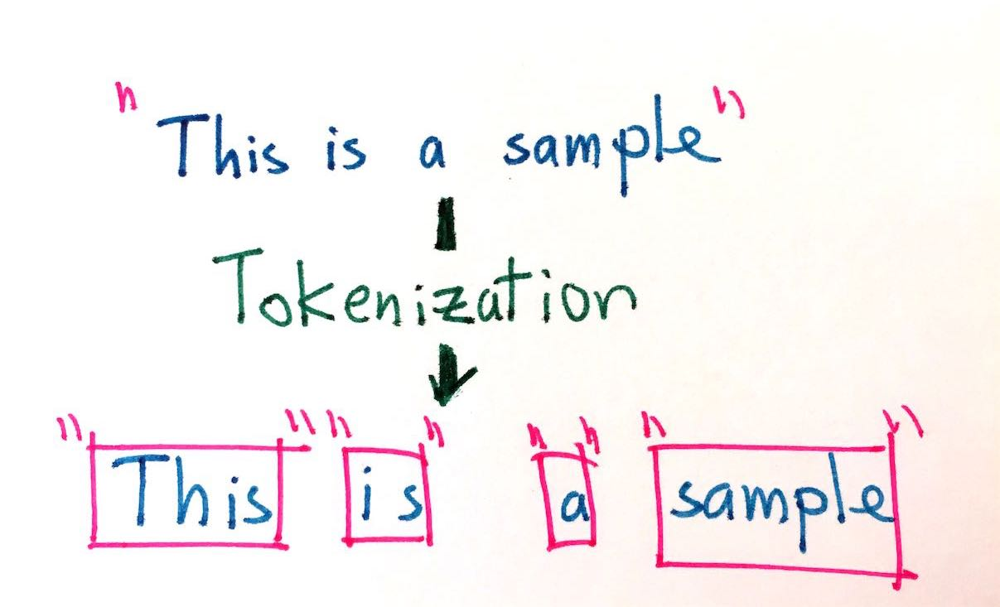

# Tokenization {#tokenization}

In this chapter we will focus on the concepts of *tokens*, *n-grams*, *tokenization*, and how to perform tokenization in R.

## What is a token?

In R, text is typically represented with the **character** data type, similar to strings in other languages. If we look at the first paragraph of "The Fir Tree", we find the text of the story is in a character vector, a series of letters, spaces, and punctuation organized as a vector.

```{r}
library(tokenizers)
library(tidyverse)
library(tidytext)
library(hcandersenr)

the_fir_tree <- hcandersen_en %>%
  filter(book == "The fir tree") %>%
  pull(text)

head(the_fir_tree, 9)
```

This character vector has nine atomic elements, each of which is made of a series of character symbols. These elements don't contain any metadata or information to tell us which characters are words and which aren't. This is where the process of tokenization comes in.

In tokenization, we take an input (a string) and a token type (a meaningful unit of text, such as a word) and split the input in to pieces (tokens) that correspond to the type. [@Manning:2008:IIR:1394399]

 TODO

Most commonly, the meaningful unit or type of token that we want to split text into units of is a **word**. However, it is  difficult to clearly define what a word is, for many or even most languages. Many languages, such as Chinese, do not use white space between words at all. Even languages that do use white space, including English, often have particular examples that are ambiguous [@Bender13]. Romance languages like Italian and French use pronouns and negation words that may better be considered prefixes with a space, and English contractions like "didn't" may more accurately be considered two words with no space.

To understand the process of tokenization, let's start by defining a word as any selection of alphanumeric (letters and numbers) symbols. Let's use some regex (Appendix \@ref(regex)) with `strsplit()` to split the first two lines of "The Fir Tree" by any characters that are not alphanumeric.

```{r}
strsplit(the_fir_tree[1:2], "[^a-zA-Z0-9]+")
```

At first sight, this result looks pretty decent. However, we have lost all punctuation, which may or may not be favorable, and the hero of this story ("fir-tree") was split in half. Already it is clear that tokenization is going to be quite complicated. Luckily a lot of work has been invested in this process, and we will use these tools. For example, the **tokenizers** package [@Mullen18] contains a wealth of fast, consistent tokenizers we can use.

```{r}
library(tokenizers)
tokenize_words(the_fir_tree[1:2])
```

We see sensible single-word results here; the `tokenize_words()` function uses the **stringi** package [@Gagolewski19] under the hood, making it very fast. Word-level tokenization is done by finding word boundaries according to the specification from the International Components for Unicode (ICU). How does the word boundary algorithm [@ICUWordBoundary] work?

- Break at the start and end of text, unless the text is empty.
- Do not break within CRLF (new line characters).
- Otherwise, break before and after new lines (including CR and LF).
- Do not break within emoji zwj sequences.
- Keep horizontal whitespace together.
- Ignore Format and Extend characters, except after sot, CR, LF, and new line.
- Do not break between most letters.
- Do not break letters across certain punctuation.
- Do not break within sequences of digits, or digits adjacent to letters ("3a", or "A3").
- Do not break within sequences, such as "3.2" or "3,456.789".
- Do not break between Katakana.
- Do not break from extenders.
- Do not break within emoji flag sequences. 
- Otherwise, break everywhere (including around ideographs).

While we might not understand what each and every step in this algorithm is doing, we can appreciate that it is many times more sophisticated than our initial approach of splitting on non-alphanumeric characters. In the rest of this book, we will use the **tokenizers** package as a baseline tokenizer for reference. Your choice of tokenizer will have an influence on your results, so don't be afraid to experiment with different tokenizers or to write your own to fit your problem.

## Types of tokens

Thinking of a token as a word is a useful idea to think about tokenization, even if it is hard to implement concretely in software. We can generalize the notion of a token beyond only a single word to other units of text. We can tokenize text at a variety of units including:

- characters,
- words,
- sentences,
- lines,
- paragraphs, and
- n-grams.

In the following sections, we will explore how to tokenize text using the **tokenizers** package. These functions take a character vector as the input and return lists of character vectors as output. This same tokenization can also be done using the **tidytext** [@Silge16] package, for workflows using tidy data principles. 

```{r}
sample_vector <- c("This is the first of two strings",
                   "And here is the second string.")
sample_tibble <- tibble(text = sample_vector)
```

The tokenization achieved by using `tokenize_words()` on `sample_vector`:

```{r}
tokenize_words(sample_vector)
```

will yield the same results as using `unnest_tokens()` on `sample_tibble`; the only difference is the data structure, and thus how you might use the result moving forward in your analysis.

```{r}
sample_tibble %>%
  unnest_tokens(word, text, token = "words")
```

Arguments used in `tokenize_words()` can be passed through `unnest_tokens()` using the ["the dots"](https://adv-r.hadley.nz/functions.html#fun-dot-dot-dot), `...`.

```{r}
sample_tibble %>%
  unnest_tokens(word, text, token = "words", strip_punct = FALSE)
```


### Character tokens

Perhaps the simplest tokenization is character tokenization, which splits texts into characters. Let's use `tokenize_characters()` with its default parameters; this function has arguments to convert to lowercase and to strip all non-alphanumeric characters. These defaults will reduce the number of different tokens that are returned. The `tokenize_*()` functions by default return a list of character vectors, one character vector for each string in the input.

```{r}
tft_token_characters <- tokenize_characters(x = the_fir_tree,
                                            lowercase = TRUE,
                                            strip_non_alphanum = TRUE,
                                            simplify = FALSE)
```

What do we see if we take a look?

```{r}
head(tft_token_characters) %>%
  glimpse()
```

We don't have to stick with the defaults. We can keep the punctuation and spaces by setting `strip_non_alphanum = FALSE` and now we see that spaces and punctuation are included in the results too.

```{r}
tokenize_characters(x = the_fir_tree,
                    strip_non_alphanum = FALSE) %>%
  head() %>%
  glimpse()
```

TODO Find examples of when a character is hard to define. Look at Arabic, German (double s) and danish (double a).

### Word tokens

Tokenizing at the word level is perhaps the most common and widely used tokenization. As we described earlier, this is the procedure of splitting text into words. To do this, let's use the `tokenize_words()` function.

```{r}
tft_token_words <- tokenize_words(x = the_fir_tree,
                                  lowercase = TRUE, 
                                  stopwords = NULL, 
                                  strip_punct = TRUE,
                                  strip_numeric = FALSE)
```

The results show us the input text split into individual words.

```{r}
head(tft_token_words) %>%
  glimpse()
```

We have already seen `lowercase = TRUE`, and `strip_punct = TRUE` and `strip_numeric = FALSE` control whether we remove punctuation and numeric characters respectively. We also have `stopwords = NULL`, which we will talk about in more depth in Chapter \@ref(stopwords).

Let's create a tibble with two fairy tales, "The Fir Tree" and "The Little Mermaid". Then we can use use `unnest_tokens()` together with some **dplyr** verbs to find the must commonly used words in each.

```{r}
hcandersen_en %>%
  filter(book %in% c("The fir tree", "The little mermaid")) %>%
  unnest_tokens(word, text) %>%
  count(book, word) %>%
  group_by(book) %>%
  arrange(desc(n)) %>%
  slice(1:5)
```

The five most common words in each fairy tale are fairly uninformative, with the exception being "tree" in the "The Fir Tree". 

```{block, type='rmdtip'}
These uninformative words are called **stop words** and will be explored in depth in Chapter \@ref(stopwords).
```


### Lines, sentence, and paragraph tokens

Tokenizers to split text into larger units of text like lines, sentences, and paragraphs are rarely used directly for modeling purposes, as the tokens produced tend to be fairly unique. It is very uncommon for multiple sentences in a text to be identical! However, these tokenizers are useful for preprocessing and labeling.

For example, Jane Austen's novel *Emma* (as available in the **janeaustenr** package) is already preprocessed with each line being at most 80 characters long. However, it might be useful to split the data into chapters and paragraphs instead.

Let's create a function that takes a dataframe containing a variable called `text` and turns it into a dataframe where the the text is transformed to paragraphs. First, we can collapse the text into one long string using `collapse = "\n"` to denote line breaks, and then next we can use `tokenize_paragraphs()` to identify the paragraphs and put them back into a dataframe. We can add a paragraph count with `row_number()`.

```{r}
add_paragraphs <- function(data) {
  pull(data, text) %>% 
    paste(collapse = "\n") %>%
    tokenize_paragraphs() %>%
    unlist() %>%
    tibble(text = .) %>%
    mutate(paragraph = row_number())
}
```

Now we take the raw text data and add the chapter count by detecting when the characters `"CHAPTER"` appear at the beginning of a line. Then we `nest()` the text column, apply our `add_paragraphs()` function, and then `unnest()` again.

```{r}
library(janeaustenr)

emma_paragraphed <- tibble(text = emma) %>%
  mutate(chapter = cumsum(str_detect(text, "^CHAPTER "))) %>%
  filter(chapter > 0, !str_detect(text, "^CHAPTER ")) %>%
  nest(data = text) %>%
  mutate(data = map(data, add_paragraphs)) %>% 
  unnest(cols = c(data))

glimpse(emma_paragraphed)
```

Now we have `r nrow(emma_paragraphed)` separate paragraphs we can analyse. Similarly, we could go a step further to split these chapters into sentences, lines, or words.

### Tokenizing by n-grams

An n-gram (sometimes written "ngram") is a term in linguistics for a contiguous sequence of $n$ items from a given sequence of text or speech. The item can be phonemes, syllables, letters, or words depending on the application. When most people talk about n-grams, they mean a group of $n$ words. In this book, we will use n-gram to denote word n-grams unless otherwise stated. We use Latin prefixes, such that a 1-gram is called a unigram, 2-gram is called a bigram, 3-gram called a trigram and so on. 

```{block, type = "rmdnote"}
We use Latin prefixes, so that a 1-gram is called a unigram, a 2-gram is called a bigram, a 3-gram called a trigram, and so on. 
```

Some example n-grams are:

- **unigram:** "Hello", "day", "my", "little"
- **bigram:** "White House", "happy dog", "to be", "Robin Hood"
- **trigram:** "You and I", "please let go", "no time like", "great strong soldier"

The benefit of using n-grams compared to words is that we can capture word order which would otherwise be lost. Similarly, when we use character n-grams, we can model the beginning and end of words because a space will be located at the end of a n-gram for the end of a word and at the beginning of the n-gram of the beginning of a word.

To split text into word n-grams, we can use the the function `tokenize_ngrams()`. It has a few more arguments, so let's go over them one by one.

```{r}
tft_token_ngram <- tokenize_ngrams(x = the_fir_tree,
                                   lowercase = TRUE,
                                   n = 3L,
                                   n_min = 3L,
                                   stopwords = character(),
                                   ngram_delim = " ",
                                   simplify = FALSE)
```

We have seen the arguments `lowercase`, `stopwords`, and `simplify` before; they work the same as before. We also have `n`, the argument to determine which degree of n-gram to return. Using `n = 1` returns unigrams, `n = 2` bigrams, `n = 3` gives trigrams, and so on. Related to `n` is the `n_min` argument, which specifies the minimum number of n-grams to include. By default both `n` and `n_min` are set to 3 making `tokenize_ngrams()` return only trigrams, but by setting `n = 3` and `n_min = 1` will we get all unigrams, bigrams and trigrams of a text. Lastly we have the `ngram_delim`, argument which specifies the separator between words in the n-grams. 

Let's look at the result of n-gram tokenization for the first line of "The Fir Tree".

```{r}
tft_token_ngram[[1]]
```

Notice how the words in the trigrams overlap such that the word "down" appears in the middle of the first trigram and beginning of the second trigram. 

It is important to choose the right value for `n` when using n-grams for the question you want to answer. Using unigrams is faster and more efficient, but we don't capture information about word order. Using a higher value for `n` keeps more information, but the vector space of tokens increases dramatically, corresponding to a reduction in token counts. A sensible starting point in most cases is three. However, if you don't have a large vocabulary in your dataset, consider starting at two instead three and going from there. Figure \@ref(fig:ngramtokens) showcases token frequency starts to decrease dramatically for trigrams and higher order n-grams. 

```{r ngramtokens, fig.width=10, fig.height=8, fig.cap="Using longer n-grams results in a higher number of unique tokens with fewer counts"}
lenght_and_max <- function(x) {
  tab <- table(x)
  
  paste(length(tab), max(tab), sep = "-")
}

if (packageDescription("tidyr")$Version >= "0.8.3.9000") {
  plotting_data <- hcandersen_en %>%
    nest(data = c(text)) %>%
    mutate(data = map_chr(data, ~ paste(.x$text, collapse = " "))) %>%
    mutate(unigram = tokenize_ngrams(data, n = 1, n_min = 1) %>% map_chr(lenght_and_max),
           bigram = tokenize_ngrams(data, n = 2, n_min = 2) %>% map_chr(lenght_and_max),
           trigram = tokenize_ngrams(data, n = 3, n_min = 3) %>% map_chr(lenght_and_max),
           quadrugram = tokenize_ngrams(data, n = 4, n_min = 4) %>% map_chr(lenght_and_max)) %>%
    select(unigram, bigram, trigram, quadrugram) %>%
    pivot_longer(cols = unigram:quadrugram, names_to = "ngrams") %>%
    separate(value, c("length", "max"), convert = TRUE) %>%
    mutate(ngrams = factor(ngrams, levels = c("quadrugram", "trigram", "bigram", "unigram"))) 
  
  plotting_data  %>%
    ggplot(aes(length, ngrams, color = max)) +
    geom_jitter(width = 0, alpha = 0.8, height = 0.35) +
    scale_color_viridis_c(trans = "log", labels=scales::comma) +
    labs(x = "Number of unique n-grams", 
         y = NULL,
         color = "Count of\nmost frequent\nngram",
         title = "Unique n-grams by n-gram order",
         subtitle = "Each point represents a H.C. Andersen Fairy tale")
}
```

## Where does tokenization break down?

Tokenization will generally be one of first thing you do with the data, so it is very important to consider carefully what happens in this first step of data preprocessing. As with most software there is a trade-off between speed and customizability, as demonstrated in section \@ref(tokenization-benchmark). The fastest tokenization methods will give you little control over how it is done.

GOT HERE

While the defaults works well it a lot of cases you will encounter situations where you might want to impose stricter rules to get better tokenized result. Consider the following sentence.

> "Don't forget you owe the bank $1 million for the house." 

This sentence has several interesting parts which we need to decide whether to keep or to ignore. The first issue is the contraction in "Don't" where we have a couple of different options. The fastest choice is to keep this as one word, but it could also be split up into "do" and "n't". By performing such a split, we could gain insight into both the amount of contractions such as "n't" will be different then "not", but we will also have a broader reduction as the words "wouldn't" and "shouldn't" will be split according to the same pattern. 

The next issue at hand is how to deal with "\$1", the dollar sign is highly important part of this sentence as it denotes a mode of currency. Again we have the choice between removing and keeping, furthermore within the choice of keeping we can make the decision between keeping it as one or two tokens "\$1" or "\$" and "1". If we look at the default for `tokenize_words()` we notice that it defaults to removing punctuation including \$.

```{r}
tokenize_words("$1")
```

However we we can keep the dollar sign if we don't strip punctuation.

```{r}
tokenize_words("$1", strip_punct = FALSE)
```

Lastly there is the question to keep the period as a sentence ender or not. By removing it we will not be able to locate the last word in a sentence using n-grams.

More things you might lose when you tokenize are things more frequent in online and more casual text. Multiple spaces, extreme usage usage of exclamation characters and deliberately use of capitalization can be completely lost depending on your choice of tokenizer and parameters. But that isn't to say that it is always worth keeping that extra bit of information. If you are studying the trend of epidemics diseases by studying tweets, the style it is written in is not nearly as important as what words are used. However if you are trying to model the social groups it becomes much more important what style of language the different individuals use towards each other.

TODO Do comparing of compression of data with different types of tokenizations

```{r}
if (packageDescription("tidyr")$Version >= "0.8.3.9000") {
  hcandersen_en %>%
    nest(text) %>%
    mutate(data = map_chr(data, ~ paste(.x$text, collapse = " "))) %>%
    mutate(chars = tokenize_characters(data) %>% map_int(~table(.x) %>% length()),
           chars_non_alphanum = tokenize_characters(data, strip_non_alphanum = FALSE) %>% map_int(~table(.x) %>% length()),
           words = tokenize_words(data) %>% map_int(~table(.x) %>% length()),
           words_no_lowercase = tokenize_words(data, lowercase = FALSE) %>% map_int(~table(.x) %>% length()),
           words_stems = tokenize_word_stems(data) %>% map_int(~table(.x) %>% length())) %>%
    select(-data) %>%
    pivot_longer(-book) %>%
    ggplot(aes(name, value)) +
    geom_boxplot() +
    geom_jitter(alpha = 0.1) +
    scale_y_log10() +
    theme_minimal() +
    coord_flip() +
    labs(title = "Number of distinct tokens varies greatly with choice of tokenizer")
}
```


## Building your own tokenizer

Sometimes the out-of-the-box tokenizers wont be able to do what you want need them to do. In this case you will have to wield **stringi**/**stringr** and [regular expression](https://en.wikipedia.org/wiki/Regular_expression) (regex for short). There are two main paths to tokenization

1. *Split* the string up according to some rule
2. *Extract* tokens based on some rule

the number and complexity of your rules is determined by your desired outcome. You can reach complex outcomes by chaining together many smaller rules. In this section we will implement a couple of specialty tokenizers to showcase the techniques.  

### Tokenize to characters, only keeping letters

Here we want to make a modification to `tokenize_characters()` such that we only keep keep letters. At first thought there are 2 main options. Use `tokenize_characters()` and remove any non letters, or extract extract the letters one by one. This is a fairly simple goal so we will go with the latter option. This is an *extract* task and we will be using `str_extract_att()` as each string has the possibility of including more then 1 token. Since we want to extract letters we can use the letters character class `[:alpha:]` to match for letters and the quantifier `{1}` to only extract the first one. (In this example leaving out the quantifier yields the same result, however more specific regular expressions runs faster).

```{r}
letter_tokens <- str_extract_all("This sentence include 2 numbers and 1 period.", 
                                 "[:alpha:]{1}")
letter_tokens
```

You could be tempted to use specify the character class yourself to be something like `[a-zA-Z]{1}`, it would run faster but you would lose non-English characters. This is a design choice you would have to make depending on the goals of your specific problem. 

```{r}
danish_sentence <- "Så mødte han en gammel heks på landevejen; hun var så ækel, hendes underlæbe hang hende lige ned på brystet."

str_extract_all(danish_sentence, "[:alpha:]")  
str_extract_all(danish_sentence, "[a-zA-Z]")
```

### Allow for hyphenated words

So far we have had problems with "fir-tree" being split up, we are going to fix this problem in two different ways. First we will be splitting on white spaces this is a decent way of finding words, similarly this doesn't split up hyphenated words as the hyphen isn't considered a white-space. Next we will find a regex to match words with hyphen and extract those.

splitting by white-space is easy since we can use character classes \@ref(tab:characterclasses). We will use the white space character class `[:space:]` to split the sentence over

```{r}
str_split("This isn't a sentence with hyphenated-words.", "[:space:]")
```

And we nothing that is is doing pretty well. This version doesn't drop punctuation, but this can be achieved by removing punctuation characters in the beginning and ends of words.

```{r}
str_split("This isn't a sentence with hyphenated-words.", "[:space:]") %>%
  map(~ str_remove_all(.x, "^[:punct:]+|[:punct:]+$"))
```

This regex is a little complicated so lets split it up a little. `^[:punct:]*` will look at the beginning of the string (`^`) to look for punctuation character (`[:punct:]`) where it will select 1 or more (`+`). `[:punct:]+$` will look for punctuation character (`[:punct:]`) that appears 1 or more (`+`) and be in the end of the string (`$`). Lastly this will alternate (`|`) such that we get matches from both sides of the words. The reason we are using the quantifier `+` is because there are cases where a word is followed by multiple characters we don't want, such as `okay...` and `Really?!!!`. We are using `map()` since `str_split()` returns a list, and we want `str_remove_all()` to be applied to each element in the list, this example only have one element. 

```{block, type = "rmdnote"}
If you are in a situation where you want to avoid the dependencies that come with `purrr` you are able to use `lapply()` just as well. 
`lapply(str_remove_all, pattern = "^[:punct:]+|[:punct:]+$")`
```

Now we will see if we can get the same result by extraction. We will start of by constructing a regular expression that will capture the idea of a hyphenated word. Our definition is a word with 1 hyphen located inside. Since we want the hyphen to be inside the word will be need a non-zero number of character on either side of the hyphen. 

```{r}
str_extract_all("This isn't a sentence with hyphenated-words.", "[:alpha:]+-[:alpha:]+")
```

but wait, this only matched the hyphenated word. This is happening because we are only matching words with hyphens, if we add the quantifier `?` then we can match 0 or 1 occurrences.

```{r}
str_extract_all("This isn't a sentence with hyphenated-words.", "[:alpha:]+-?[:alpha:]+")
```

Now we are getting more words, however the ending of `"ins't"` isn't there anymore and we lost the word `"a"`. We can get matches for the whole contraction by expanding the character class `[:alpha:]` to include the character `'`. This is done with `[[:alpha:]']`.

```{r}
str_extract_all("This isn't a sentence with hyphenated-words.", "[[:alpha:]']+-?[[:alpha:]']+")
```

Next we need to find out why `"a"` wasn't matched. If we look at the regular expression, we remember that we imposed the restriction that a non-zero number of characters needed to surround the hyphen place to avoid matching words start or ending with a hyphen, this means that the smallest possible pattern matched is 2 characters long. This can be fixed by using an alternation with `|`, we will keep our previous match on the left-hand side, and include `[:alpha:]{1}` on the right-hand side to match the single length words that won't be picked up by the left-hand side. Notice how we aren't using `[[:alpha:]']` since we are not interested in matching single `'`'s.

```{r}
str_extract_all("This isn't a sentence with hyphenated-words.", "[[:alpha:]']+-?[[:alpha:]']+|[:alpha:]{1}")
```

And we are getting the same answer as before. 

### Character n-grams
TODO change to toktok tokenizer
Next we want to look at all character n-grams, for the purpose of this example a character n-gram is defined as a consecutive group of n characters. This will not jump over spaces, but will include overlapping matches. So the 3-grams of `"nice dog"` would be `"nic", "ice", "dog"`. since the regex engine in R normally doesn't support overlapping matches we have to get creative. First We will use a "lookahead" to find the location of all the matches, then we will use those locations to match the n-grams.

```{r}
sentence <- c("This isn't a sentence with hyphenated-words.",
              "Same with this one")

ngram_loc <- str_locate_all(sentence, "(?=(\\w{3}))")

map2(ngram_loc, sentence, ~str_sub(.y, .x[, 1], .x[, 1]+2))
```

### Wrapping it into a function

We have shown how one can take some regular expressions to extract the tokens we want. however the code have so far been rather unstructured. We would ideally wrap these tasks into functions that can be used the same way `tokenize_words()` is used.

Lets start with the example with hyphenated words. To give it a little more spice lets add an option to turn all the words to lowercase.

```{r}
tokenize_hyphonated_words <- function(x, lowercase = TRUE) {
  if (lowercase)
    x <- tolower(x)
  
  str_split(x, "[:space:]") %>%
    map(~ str_remove_all(.x, "^[:punct:]+|[:punct:]+$"))
}


tokenize_hyphonated_words(the_fir_tree[1:3])
```

We just need to make sure that the output is a list. Notice how we turned to lowercase before we did everything else as the remaining on the operations are case insensitive.

Next lets turn character n-gram into a tokenizer. And we would like to have a variable `n` argument.

```{r}
tokenize_character_ngram <- function(x, n) {
  ngram_loc <- str_locate_all(x, paste0("(?=(\\w{", n, "}))"))

  map2(ngram_loc, x, ~str_sub(.y, .x[, 1], .x[, 1] + n - 1))
}
tokenize_character_ngram(the_fir_tree[1:3], n  =3)
```

Notice how we can use `paste0()` to construct a regex. 

## Tokenization benchmark

TODO showcase other libraries for tokenization

```{r}
the_fir_tree1 <- c("1", the_fir_tree)

bench::mark(
  `[:alpha:]` = str_extract_all(the_fir_tree1, "[:alpha:]"),
  `[a-zA-Z]` = str_extract_all(the_fir_tree1, "[a-zA-Z]"),
  `[a-zA-Z]{1}` = str_extract_all(the_fir_tree1, "[a-zA-Z]{1}"),
  `[:Letter:]` = str_extract_all(the_fir_tree1, "[:Letter:]")
)
```
